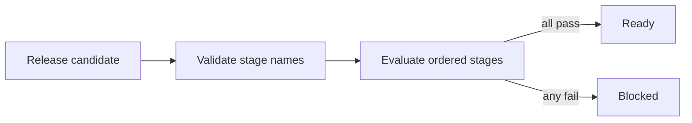

# Release Guard

Release Guard is a tiny TypeScript library that evaluates whether a deployment
candidate can advance through a three-stage release pipeline. It is intentionally
small, but has enough behavior and documentation to exercise Jina's Context wiki
generation, citations, search, and Mermaid rendering.

## Quick start

```ts
import { evaluateRelease, releaseDecisionSummary } from "release-guard";

const decision = evaluateRelease({
  version: "2026.08.08",
  stages: [
    { name: "build", passed: true },
    { name: "test", passed: true },
    { name: "deploy", passed: false }
  ]
});

console.log(releaseDecisionSummary(decision));
```

The result is `blocked` until every stage passes. Duplicate stage names and an
empty pipeline are rejected so a malformed candidate cannot appear releasable.

## Architecture



The package has no runtime dependencies and does no network or file-system I/O.
Run `npm test` for behavior tests and `npm run typecheck` for the public API.
