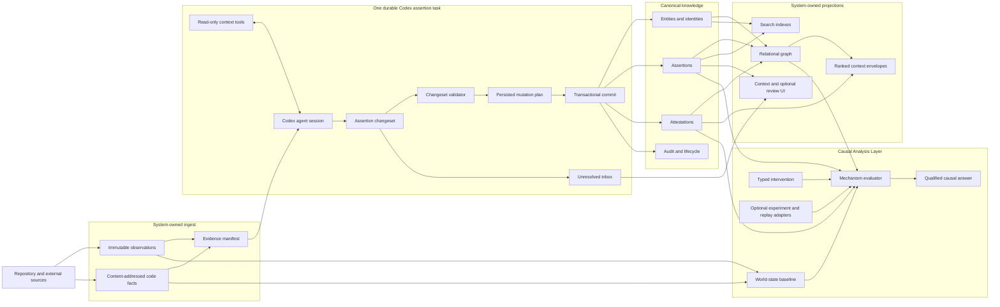
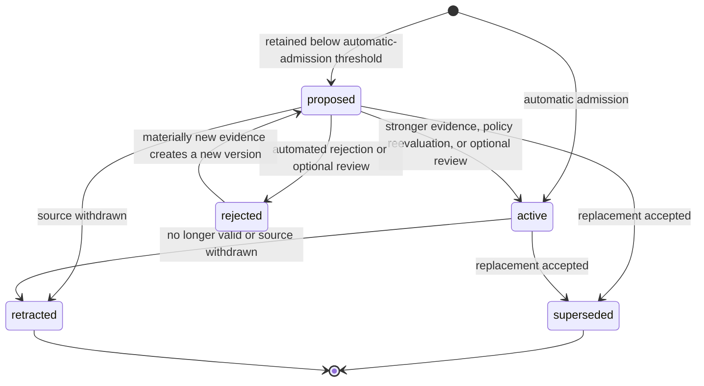

# Agent-First Repository Context Framework

## Status

This document is the target design for the next ContextGraph framework. It is a design proposal, not a
description of the currently deployed implementation.

- [CONTEXT_GRAPH.md](CONTEXT_GRAPH.md) remains authoritative for current behavior.
- [DATA_MODELS.md](DATA_MODELS.md) remains authoritative for the deployed schema.
- [AGENT_FIRST_CONTEXT_IMPLEMENTATION_PLAN.md](AGENT_FIRST_CONTEXT_IMPLEMENTATION_PLAN.md) translates this
  framework into PR-sized implementation slices, rollout gates, and rollback boundaries.
- Executable contracts in `packages/context-graph` and `packages/db` remain authoritative until this design is
  implemented.

The framework keeps the existing `ingest`, `assert`, and `project` boundaries while making assertion generation
agent-first. Codex receives a pinned checkout, bounded GitHub and operational context, existing assertions, and a
small set of assertion-management tools. It investigates the repository and produces a semantic assertion
changeset. Jina validates and commits that changeset to the canonical assertion ledger. A separate projector builds
one or more disposable graph and search read models. A Causal Analysis Layer evaluates interventions over explicit
causal mechanisms, world-state baselines, and optional experimental evidence without turning hypothetical results
into canonical facts.

## Decision summary

1. Keep `context_graph_ingest`, `context_graph_assert`, and `context_graph_project`.
2. Keep `context_graph_assert` as one durable, dispatchable Codex task.
3. Let Codex plan and perform its own investigation inside a system-defined evidence and cost envelope.
4. Do not let agents decide how much history may be loaded or bypass evidence, ontology, admission, ACL, or
   concurrency rules.
5. Make the agent output an `AssertionChangeSet`, not a graph.
6. Store assertions, attestations, plans, audit history, and unresolved findings canonically in PostgreSQL.
7. Keep graph, search, manifest, and context envelopes disposable and rebuildable.
8. Keep planning, investigation, comparison, and reduction inside the Codex session rather than coding each as a
   taskboard subtask.
9. Expose narrow semantic tools; never expose raw SQL, Cypher, node upserts, or edge upserts to an agent.
10. Build the current repository truth first. Backfill history according to an explicit scope policy, not at the
    agent's discretion.
11. Do not put human review on the critical path. Human review is an optional correction and audit capability.
12. Put counterfactual reasoning in a named Causal Analysis Layer that distinguishes known-path analysis, static
    prediction, historical observation, sandbox experiment, runtime replay, and production observation.

## Why this framework

The current implementation already has strong system boundaries:

- deterministic, content-addressed repository intake;
- exact commit and blob provenance;
- a typed predicate registry;
- citation validation inside a pinned checkout;
- proposed, active, rejected, superseded, and retracted assertion states;
- transactional storage and write fences;
- disposable graph projections.

The main limitation is not that assertion generation uses one Codex task. One durable agent task is the desired
baseline. The limitation is its contract: today Codex returns a `GeneratedContextGraph`, and the host converts its
nodes and edges into proposed assertions. That makes the model reason about the shape of an output graph even though
the graph is not canonical, and it does not give the agent a semantic tool surface for reading and managing previous
assertions.

The new framework keeps semantic planning and investigation inside one Codex session while replacing the
graph-shaped boundary with semantic tools and an assertion changeset:

```text
current:
  ingest -> one Codex call -> generated graph -> normalize assertions -> project graph

target:
  ingest -> one Codex agent session with tools -> assertion changeset
         -> validate -> persist plan -> commit ledger -> project read models
         -> Causal Analysis Layer -> qualified counterfactual answer
```

This is deliberately not "give Codex unrestricted access to the database." The simplification comes from giving
the agent ownership of its internal investigation loop, while keeping scope, tools, validation, admission, and
persistence centralized in code.

## Goals

- Let an agent inspect a cloned repository, GitHub context, operational sources, and previous assertions without a
  hard-coded sequence of model prompts.
- Produce evidence-backed, typed, inspectable knowledge changes that may be reviewed when useful.
- Preserve exact source provenance across commits and repositories.
- Support fast single-PR analysis, current-state repository initialization, incremental updates, and explicit deep
  history backfills.
- Retain independent attestations when multiple sources support the same assertion.
- Make retries, concurrent runs, stale plans, and projection rebuilds converge safely.
- Keep the graph replaceable without changing the assertion contract.
- Make incomplete knowledge and uncertainty visible instead of forcing speculative assertions.
- Avoid durable subtasks until production scale or reliability evidence shows that they are necessary.
- Answer counterfactual questions about commits, PRs, dependencies, configuration, deployments, data, tests, and
  failures with explicit assumptions, assurance, falsifiers, and coverage gaps.
- Identify alternative mechanisms, necessary conditions within the known model, and minimal preventative sets
  without claiming that an incomplete model proves real-world impossibility.

## Non-goals

- Letting the model execute repository code, install repository dependencies, or run untrusted build scripts.
- Letting the model write raw graph nodes, graph edges, SQL, or Cypher.
- Reconstructing all repository history before current context becomes available.
- Treating confidence as truth or as a substitute for evidence.
- Requiring a human to approve every model-generated claim before the repository becomes useful.
- Using the taskboard dependency graph as repository knowledge.
- Making a graph database the canonical record of knowledge.
- Replacing deterministic parsers and normalizers with an LLM.
- Treating graph path deletion as proof of real-world necessity or sufficiency.
- Allowing Codex to execute arbitrary repository or production interventions directly.
- Persisting a hypothetical counterfactual result as an observed fact.

## Design principles

### Agents propose; services admit

Agents decide which semantic changes are worth proposing. Jina decides whether a proposal is structurally valid,
evidence-backed, authorized, current, non-conflicting, and eligible for activation.

### Assertions do not depend on graph storage

The assertion subsystem knows about typed entities, predicates, qualifiers, evidence, validity, and assertion
lifecycle. It does not know about graph nodes, graph edges, traversal indexes, layouts, or graph database syntax.

The same assertion ledger can project into:

- the existing relational graph;
- a future graph database;
- lexical and vector search documents;
- a review queue;
- a ranked evidence envelope for another agent;
- a repository-context UI.

Changing a projection must not change the assertion-writing contract.

### Deterministic facts and semantic claims are different

Parsing a manifest dependency, commit parent, PR membership, or exact import is a deterministic operation. Inferring
that a change introduced an issue or that a service likely affects a feature is a semantic claim.

Deterministic intake creates active source facts under registry policy. Agent-generated semantic claims are
automatically admitted as `active` when their evidence, confidence, ontology, cardinality, and source-authority
requirements pass the predicate's admission policy. Claims that are valid enough to retain but do not meet automatic
admission remain `proposed`; invalid or unsupported claims are rejected or deferred. No outcome waits for a human.

### Current truth before historical explanation

A repository should become useful after its current tree and high-value current sources are ingested. Historical
backfill improves explanation and causal coverage later. It must not block the initial structural and current-state
projection.

### One Codex session, one semantic output

One Codex session owns the semantic analysis for an assertion scope and emits one final changeset. It may keep an
internal plan or todo list, search multiple sources, revisit earlier conclusions, and use read-only tools as often as
the budget allows. These are agent behaviors, not taskboard tasks.

Only the assertion service commits the persisted plan. Codex cannot directly mutate assertions, lifecycle
decisions, entities, or projections.

### Uncertainty is data

An agent may defer a finding when identity, evidence, cardinality, or scope is unresolved. Deferred findings go to
an inbox with the missing information and suggested next action; they do not become low-quality graph edges.

### Causal mechanisms, not paths alone

A path can show that two entities are connected, but it cannot represent that two conditions must interact or that
several independent mechanisms can produce the same outcome. The Causal Analysis Layer represents each mechanism as
an explicit entity with an AND-set of required conditions. Multiple mechanisms for the same outcome form an OR-set.

Necessity and sufficiency are always scoped to a declared baseline, mechanism set, and coverage boundary.

### Counterfactuals are qualified analyses

A counterfactual answer is derived output. It reports the intervention, baseline world state, removed and remaining
mechanisms, assumptions, assurance level, falsifying evidence, and coverage gaps. It does not silently become a
canonical assertion. New facts discovered by an experiment or runtime replay must enter through the normal ingest
and assertion contracts.

## Conceptual architecture



The left side converts mutable external sources into immutable, bounded evidence. The middle performs semantic
reasoning and admission. The right side builds replaceable read models. The Causal Analysis Layer consumes those
records and projections but remains a read/analysis boundary rather than another canonical writer.

## Taskboard topology

The top-level workflow stays simple:

```text
context_graph_build                         aggregate
├── context_graph_ingest                    dispatchable, required
├── context_graph_assert                    dispatchable, optional for initial publication
└── context_graph_project                   dispatchable, required
```

The normal dependencies are:

```text
              ┌──────> assert
ingest ───────┤
              └──────> project
```

`context_graph_assert` runs one Codex session. Its planning, evidence search, comparison with previous assertions,
conflict analysis, and changeset construction happen through the agent loop:

```text
start pinned Codex session
    -> read scope, evidence manifest, and previous assertions
    -> make an internal plan
    -> inspect code and typed provider context with read tools
    -> revise or extend the internal plan as evidence changes
    -> submit one AssertionChangeSet
    -> host validates and persists an exact mutation plan
    -> host commits allowed operations transactionally
    -> host verifies committed rows and emits projection events
    -> complete context_graph_assert
```

The task remains durable even though its internal reasoning steps are not board tasks. The worker lease, exact input
fingerprint, model run, tool audit, raw changeset, persisted mutation plan, commit result, and failure category are
recorded. A worker crash retries the assertion task; it does not attempt to resume an opaque model thought process.
Idempotent changeset and plan identities prevent duplicate writes.

`context_graph_project` continues to depend only on ingest. This lets Jina publish a structural/current-source
projection without waiting for model work. A later assertion commit emits a canonical outbox event and causes the
projector to publish a new graph generation.

The assertion task is optional for initial aggregate completion for the same reason. Its own success or failure
remains visible even if the required ingest and initial project stages have already completed.

### Codex session protocol

The host starts Codex with:

- the immutable analysis scope and evidence fingerprint;
- a sandboxed checkout at the exact commit;
- applicable previous assertions and unresolved findings;
- the current registry and policy summary;
- bounded read tools for code and typed external context;
- one changeset submission tool or equivalent strict output schema.

The baseline instruction is intentionally behavioral rather than procedural:

```text
You manage semantic assertions for this repository revision.

Inspect the repository and available source context.
Read applicable existing assertions before proposing changes.
Plan and revise your own investigation within the supplied scope and budget.
Confirm, propose, supersede, retract, or relate assertions when the evidence supports it.
Represent interacting causes as explicit causal mechanisms rather than independent causal edges.
Do not label a condition necessary or sufficient without a declared baseline and complete supported mechanism set.
Do not create or modify graph nodes or edges.
Every operation must cite exact evidence and explain why it supports the claim.
Put uncertain findings in unresolved instead of guessing.
Submit one AssertionChangeSet when the investigation is complete.
```

Codex may use an internal todo list, but Jina does not parse or persist that list as workflow state. The durable
semantic output is the changeset.

### Host-side completion

The worker treats changeset processing as coded substeps inside the same leased assertion task:

1. validate the submitted contract;
2. resolve and verify every cited source;
3. normalize identities, predicates, qualifiers, and natural assertion keys;
4. persist an immutable mutation plan and semantic diff;
5. apply operations eligible for commit in one transaction;
6. activate claims that pass automatic admission and retain lower-assurance valid claims as `proposed`;
7. record audit and attestation rows;
8. read back the result and emit projection events;
9. complete the task with the changeset, plan, and knowledge checkpoints.

One bounded repair turn may return validation errors to the same Codex session. A second invalid submission fails
closed.

### Prompt-owned versus code-owned behavior

| Codex and prompt own                                           | Jina code owns                                                          |
| -------------------------------------------------------------- | ----------------------------------------------------------------------- |
| Forming an internal investigation plan                         | Creating and leasing the one assertion task                             |
| Choosing which in-scope paths and sources to inspect           | Exact checkout, source scope, and immutable input fingerprint           |
| Deciding which existing assertions need confirmation or change | Tool schemas, ACLs, credentials, and read/write capabilities            |
| Comparing evidence and explaining semantic relationships       | History, token, source-byte, and wall-clock limits                      |
| Producing operations and unresolved findings                   | Changeset schema and contract versioning                                |
| Revising the approach after tool results                       | Evidence, registry, identity, cardinality, and concurrency validation   |
| Submitting one final `AssertionChangeSet`                      | Automatic admission, transactional commit, audit, and projection events |

This boundary is the main simplification. Planning, investigation, criticism, and reduction are prompt-driven agent
behavior. Durable workflow, policy, and data integrity are code.

### When explicit subtasks become justified

Planner, investigator, reducer, commit, and verify task types are not part of the baseline framework. They may be
introduced later only when measurements show that one assertion task cannot meet requirements, for example:

- assertion runs routinely exceed the session context or wall-clock budget;
- retrying the whole session is materially too expensive;
- independent source investigation is a demonstrated latency bottleneck;
- operators require partial investigation progress or per-lane inspection;
- deep history needs resumable semantic chunks beyond one assertion scope.

Even then, the external contract remains one `AssertionChangeSet`, and only one service-controlled commit applies it.
The explicit-subtask implementation is a scaling optimization, not a prerequisite for agent-first assertions.

## Scope and initialization policy

The system decides the maximum scope. The agent decides how to spend that scope.

```ts
interface ContextAnalysisScope {
  mode: "pull_request" | "bootstrap" | "incremental" | "deep_backfill";
  repository: string;
  ref: string;
  headCommitSha: string;
  baseCommitSha?: string;
  since?: string;
  maxCommits: number;
  maxPullRequests: number;
  maxIssues: number;
  maxFocusPaths: number;
  maxSourceBytes: number;
  maxModelTokens: number;
  maxWallClockSeconds: number;
  requiredSources: readonly string[];
}
```

Codex may prioritize paths, commits, PRs, and questions inside this envelope. It may request a scope expansion, but
that request becomes an explicit policy or operator request; the agent cannot silently turn a PR analysis into a
full-history scan.

### Pull-request mode

Use for a single PR or review epoch.

- Ingest the exact base and head trees.
- Ingest PR commits, changed files, comments, reviews, linked issues, and applicable deployments.
- Load previous assertions touching the changed paths, symbols, services, and features.
- Instruct the Codex session to focus on the semantic delta and contradictions introduced by the PR.
- Project a ref- or PR-scoped preview if requested.

The agent does not need the repository's entire history to explain the PR. It may follow a bounded number of direct
historical references when the PR evidence requires them.

### Bootstrap mode

Use for a repository with no current checkpoint.

1. Ingest the current default-branch tree and deterministic current sources.
2. Publish the initial structural/current-state projection.
3. Run a bounded assertion pass over high-value documentation, tests, manifests, services, and recently changed
   paths.
4. Backfill a recent PR/issue window for intent and prior problems.
5. Schedule deeper history only when explicitly requested or required by product policy.

Bootstrap must not require replaying every commit before the repository is queryable.

### Incremental mode

Use after a known checkpoint.

- Walk new reachable commits until a known parent boundary.
- Reuse content-addressed blob analyses.
- Scope semantic work to changed paths plus still-applicable documentation and prior assertions.
- Reconfirm, supersede, or challenge assertions affected by the delta.
- Leave unrelated assertions untouched.

### Deep-backfill mode

Use for explicit historical reconstruction.

- Divide history into deterministic chronological or ancestry-aware chunks.
- Record immutable code and source observations before semantic work.
- Run one bounded Codex assertion session per system-created chunk.
- Commit each chunk against a shared repository assertion checkpoint; serialize conflicting chunks or partition them
  by non-overlapping assertion scope.
- Reconcile identities and temporal validity after chunks converge.
- Never expose a partial history as complete; report coverage boundaries.

The existing history safety fence remains useful, but deep backfill should be a product mode rather than the
default initialization path.

### Long history versus one PR

| Concern         | One PR                                | Long-history build                                 |
| --------------- | ------------------------------------- | -------------------------------------------------- |
| Primary input   | Exact base/head delta                 | Many immutable commit and source observations      |
| Main question   | What changed and what does it affect? | How did current knowledge evolve?                  |
| Scheduling      | One bounded Codex assertion task      | One Codex task per system-created chunk            |
| Identity        | Mostly reuse current entities         | Movement, renames, merges, and aliases across time |
| Validity        | Usually one current interval          | Bitemporal intervals and supersession chains       |
| Contradictions  | Compare against current assertions    | Compare across both source time and record time    |
| Completion      | Exact PR scope processed              | Explicit coverage boundary reached                 |
| Agent authority | Prioritize within PR budget           | Prioritize within each system-created chunk        |

Codex does not choose between these modes on its own. The intake event, API request, or policy selects the mode.

## Ingest contract

Ingest remains deterministic and model-free. It creates the evidence substrate that makes agent autonomy safe.

### Inputs

- tenant, repository, and ref;
- resolved immutable commit SHA;
- tree or first-parent delta;
- task and write-fence identity;
- source permissions and budgets;
- initialization mode and history boundary.

### Substeps

1. Resolve the ref to an immutable commit.
2. Discover unseen commits within the declared mode and limit.
3. Record exact commit trees and first-parent changes.
4. Reuse or create versioned blob analyses.
5. Normalize explicit repository and provider facts.
6. Record immutable source observations.
7. Normalize available dependency, environment, flag, IAM, deployment, artifact, schema, data-shape, runtime, and CI
   observations without requiring unavailable optional sources.
8. Select bounded semantic focus candidates.
9. Produce a canonical evidence manifest and fingerprint.

### Example ingest output

```ts
interface ContextIngestCheckpoint {
  tenantId: string;
  repository: string;
  ref: string;
  headCommitSha: string;
  treeSha: string;
  mode: ContextAnalysisScope["mode"];
  codeCheckpoint: string;
  sourceObservationIds: readonly string[];
  changedPaths: readonly string[];
  semanticFocusPaths: readonly string[];
  knownHistoryBoundary?: string;
  coverage: {
    commitsObserved: number;
    historyCompleteWithinScope: boolean;
    pullRequestsObserved: number;
    issuesObserved: number;
    optionalSourcesUnavailable: readonly string[];
  };
  worldStateCoverage: {
    dependencies: "complete" | "partial" | "unavailable";
    configuration: "complete" | "partial" | "unavailable";
    deployment: "complete" | "partial" | "unavailable";
    data: "complete" | "partial" | "unavailable";
    runtime: "complete" | "partial" | "unavailable";
    ci: "complete" | "partial" | "unavailable";
  };
  evidenceFingerprint: string;
}
```

The fingerprint covers every input whose change could alter semantic output: code checkpoint, source observations,
world-state observations, scope, focus selection, registry version, and relevant prior-assertion checkpoint.

### Ingest invariants

- Every source fact is reproducible from an immutable observation or content-addressed blob.
- An unavailable optional provider does not invent negative evidence.
- Exceeding a declared history limit fails or reports partial coverage according to the selected mode; it never
  presents partial history as complete.
- Ingest may create deterministic facts but never model inferences.
- Ingest never depends on graph projection state.
- Ingest never claims that a world-state dimension is complete when the corresponding source is unavailable,
  truncated, or observed at an incompatible time.

## Agent context and tools

Codex receives the checkout and semantic tools it needs, not an enormous preassembled prompt.

### Workspace

- A sandboxed clone checked out at the exact requested commit.
- No repository dependency installation or untrusted code execution.
- Bounded local file reads and search.
- Optional read-only Git metadata for the declared commit range.

### Read tools

```text
get_assertion_scope
get_ingest_manifest
search_code
read_source_at_commit
get_commit_change
search_source_observations
get_pull_request
get_issue
get_deployment
get_incident
list_assertions
get_assertion
list_unresolved_findings
resolve_entity_identity
get_predicate_definition
```

All reads are tenant- and repository-scoped. Source content is treated as untrusted data and never as system
instructions.

### Semantic submission boundary

The initial Codex assertion session receives read-only tools and emits its one final changeset through the strict
`codex exec --output-schema` boundary. The host validates the candidate, persists an inspectable plan, and commits
that exact plan automatically inside the assertion task when it is valid and current. Codex does not receive an
unrestricted commit tool. Tool arguments and model output never contain SQL, Cypher, arbitrary node properties, or
projection operations.

A future resumable or third-party agent API may expose `propose_assertion_changeset`, `inspect_assertion_plan`, and
`verify_assertion_plan` to an authorized caller. Those are service operations, not required tools for the initial
Daytona session. Commit, optional human corrections, and destructive lifecycle operations require stronger
capabilities and remain disabled by default for third-party callers.

## Agent run record

The internal plan and todo list are not canonical data. Jina records the bounded execution envelope and auditable
outputs needed to reproduce and diagnose the assertion run:

```ts
interface AssertionAgentRun {
  runId: string;
  scopeId: string;
  taskId: string;
  model: string;
  agentContractVersion: string;
  promptVersion: string;
  toolContractVersion: string;
  inputFingerprint: string;
  toolAuditIds: readonly string[];
  submittedChangesetId?: string;
  status: "running" | "submitted" | "committed" | "failed";
  startedAt: string;
  completedAt?: string;
}
```

Raw model output and tool audit are retained under lifecycle policy. Private chain-of-thought is neither requested
nor stored.

## Assertion changeset contract

The assertion changeset is the sole semantic output of the Codex session.

```ts
interface AssertionChangeSet {
  contractVersion: "assertion-changeset/v1";
  changesetId: string;
  scope: {
    tenantId: string;
    repository: string;
    ref: string;
    commitSha: string;
    mode: "pull_request" | "incremental" | "initialize" | "backfill";
  };
  base: {
    registryVersion: string;
    assertionSetVersion: string;
    evidenceFingerprint: string;
  };
  summary: string;
  operations: readonly AssertionChangeOperation[];
  unresolved: readonly UnresolvedFinding[];
}
```

The model-provided changeset and operation IDs are correlation labels. The service derives agent-run identity and
the idempotency key from the leased task, pinned scope, evidence, and versioned contracts. Model output cannot
declare its own authorization or persistence identity.

### Operations

```ts
type AssertionChangeOperation =
  | {
      type: "propose";
      operationId: string;
      assertion: AssertionCandidate;
    }
  | {
      type: "confirm";
      operationId: string;
      assertionId: string;
      attestations: readonly EvidenceLocator[];
      reason: string;
    }
  | {
      type: "supersede";
      operationId: string;
      assertionId: string;
      replacement: AssertionCandidate;
      reason: string;
    }
  | {
      type: "retract";
      operationId: string;
      assertionId: string;
      evidence: readonly EvidenceLocator[];
      reason: string;
    }
  | {
      type: "relate";
      operationId: string;
      relation: "supports" | "contradicts";
      sourceAssertionId: string;
      targetAssertionId: string;
      evidence: readonly EvidenceLocator[];
      reason: string;
    };
```

These operations express semantic intent. They do not directly choose SQL statements or graph mutations.
Registry policy determines whether an operation becomes active automatically, remains proposed for optional later
inspection, is rejected, or is deferred. Human review is never required for the assertion task to complete.

### Assertion candidate

```ts
interface AssertionCandidate {
  subject: EntityRef;
  predicate: string;
  object: EntityRef;
  qualifiers: Readonly<Record<string, string | number | boolean>>;
  truthClass:
    | "authoritative_fact"
    | "source_observation"
    | "agent_claim"
    | "human_decision"
    | "preference"
    | "timeline_event"
    | "quality_finding";
  confidence: number;
  explanation: string;
  evidence: readonly EvidenceLocator[];
  validFrom: string | null;
  validUntil: string | null;
}

interface EntityRef {
  kind: string;
  naturalKey: string;
  label: string;
}
```

The v1 contract deliberately supports entity-to-entity assertions. Typed literal objects require a later contract
version so their normalization and registry rules cannot change underneath stored v1 output.

Truth class, status, confidence, and evidence authority are independent:

- `truthClass` describes the epistemic origin of the statement.
- `status` records admission and lifecycle state.
- `confidence` records calibrated uncertainty.
- evidence authority records why a source is allowed to support that class of statement.

An `agent_claim` with confidence `0.99` is still an agent claim. Confidence never promotes it to an authoritative
fact.

### Structured evidence locators

```ts
type EvidenceLocator =
  | {
      type: "repository_range";
      repository: string;
      commitSha: string;
      path: string;
      startLine: number;
      endLine: number;
      contentDigest: string | null;
    }
  | {
      type: "source_observation";
      observationId: string;
      observationType: string;
    }
  | {
      type: "assertion_attestation";
      assertionId: string;
      attestationId: string;
    };
```

Code evidence must resolve to the exact pinned commit, path, and range. Provider evidence must resolve to an
immutable stored observation. Attestation references must resolve to the same authorized repository. The evidence
resolver derives content hashes, timestamps, source kind, and evidence authority from canonical records; Codex
cannot promote its evidence by declaring its own authority. Arbitrary external URLs are not evidence locators in
v1.

After resolution, Jina stores an enriched evidence record:

```ts
interface AssertionEvidence {
  evidenceId: string;
  locator: EvidenceLocator;
  kind:
    | "code_span"
    | "commit_change"
    | "source_observation"
    | "dependency_snapshot"
    | "configuration_snapshot"
    | "runtime_trace"
    | "ci_run"
    | "experiment"
    | "human_statement";
  authority:
    | "authoritative_code"
    | "repository_metadata"
    | "provider_record"
    | "runtime_record"
    | "incident_record"
    | "configuration_record"
    | "deployment_record"
    | "database_record"
    | "ci_record"
    | "experiment_observation"
    | "human_statement"
    | "agent_observation";
  contentDigest?: string;
  observedAt: string;
}
```

This enriched record belongs to validation and persistence. It is not a field the model may synthesize.

### Example Codex output

```json
{
  "contractVersion": "assertion-changeset/v1",
  "changesetId": "chg_01",
  "idempotencyKey": "omlabs/jina:main:8e9...:assertion-changeset/v1",
  "scope": {
    "tenantId": "omlabs",
    "repository": "omlabs/jina",
    "ref": "refs/heads/main",
    "commitSha": "8e9..."
  },
  "base": {
    "registryVersion": "repository-context-vNext",
    "assertionSetVersion": "asv_1042",
    "evidenceFingerprint": "evf_72..."
  },
  "createdBy": {
    "kind": "agent",
    "model": "codex",
    "runId": "run_123"
  },
  "agentRunId": "run_123",
  "summary": "Retry orchestration is implemented by the worker and affects failed task recovery.",
  "operations": [
    {
      "op": "propose",
      "operationId": "op_1",
      "assertion": {
        "subject": {
          "kind": "Symbol",
          "naturalKey": "src/worker/retry.ts#scheduleRetry",
          "label": "scheduleRetry"
        },
        "predicate": "IMPLEMENTS",
        "object": {
          "kind": "Feature",
          "naturalKey": "repo:omlabs/jina:feature:automatic-retry",
          "label": "Automatic retry"
        },
        "qualifiers": {},
        "truthClass": "agent_claim",
        "confidence": 0.92,
        "explanation": "The function schedules another attempt after retryable worker failures.",
        "evidence": [
          {
            "evidenceId": "ev_1",
            "kind": "code_span",
            "authority": "authoritative_code",
            "repository": "omlabs/jina",
            "commitSha": "8e9...",
            "blobSha": "4ad...",
            "path": "src/worker/retry.ts",
            "startLine": 18,
            "endLine": 47,
            "contentHash": "sha256:...",
            "observedAt": "2026-07-24T18:00:00Z"
          }
        ]
      }
    }
  ],
  "unresolved": [
    {
      "findingId": "unresolved_1",
      "question": "Does retry apply to publication failures?",
      "reason": "The current scope did not include the publication adapter.",
      "requiredEvidence": ["src/publication/**"],
      "suggestedAction": "request_scope_expansion"
    }
  ]
}
```

## Validation, lowering, and admission

The assertion service processes a changeset in two phases.

### Propose

`propose_assertion_changeset`:

1. authenticates the caller and checks repository scope;
2. validates the contract version and operation schema;
3. verifies the evidence fingerprint and base assertion-set version;
4. resolves entity identities and redirects;
5. normalizes predicates and qualifiers through the registry;
6. verifies endpoint types, cardinality, truth class, and evidence authority;
7. resolves every evidence reference against canonical observations or the pinned checkout;
8. validates causal mechanism condition sets, outcome identity, baseline scope, validity, and evidence strength;
9. prevents `necessary` or `sufficient` semantics from being inferred from one ordinary path;
10. computes natural assertion keys and detects duplicates;
11. compares operations against current live assertions;
12. computes automatic admission outcomes, risk, and optional review recommendations;
13. creates an exact semantic diff;
14. persists an immutable `AssertionMutationPlan`.

No canonical assertion changes during proposal.

### Persisted plan

```ts
interface AssertionMutationPlan {
  planId: string;
  changesetId: string;
  status: "validated" | "invalid" | "conflict" | "committed" | "expired";
  baseAssertionSetVersion: string;
  registryVersion: string;
  evidenceFingerprint: string;
  normalizedOperations: readonly NormalizedAssertionOperation[];
  admissionDecisions: readonly {
    operationId: string;
    outcome: "active" | "proposed" | "rejected" | "deferred";
    reason: string;
  }[];
  semanticDiff: readonly AssertionDiffItem[];
  warnings: readonly string[];
  optionalReviewRecommended: boolean;
  risk: "low" | "medium" | "high";
  createdAt: string;
  expiresAt: string;
}
```

### Commit

`commit_assertion_plan`:

1. loads the persisted plan by ID;
2. verifies its status, expiration, actor, and repository scope;
3. rechecks the assertion-set version, registry version, evidence fingerprint, and task write fence;
4. acquires natural-key locks for affected assertions;
5. applies exactly the persisted normalized operations and admission decisions in one transaction;
6. appends attestations and audit rows;
7. increments the assertion-set version;
8. emits canonical projection events;
9. marks the plan committed.

A stale plan fails with a conflict and performs no partial writes. The agent must inspect the new state and propose a
new plan. Concurrency must be based on affected assertion keys and a durable assertion-set version, not a coarse
graph edge count.

### Verify

Verification reads:

- the resulting assertion versions and statuses;
- every new attestation;
- supersession or retraction links;
- audit rows;
- the emitted projection event;
- eventually, the graph generation containing the committed result.

Verification is read-only and idempotent.

## Assertion identity, lifecycle, and attestations

### Natural identity

The semantic natural key is independent of model run and projection:

```text
hash(
  tenant,
  repository,
  normalized subject identity,
  predicate,
  normalized object or literal,
  canonical qualifiers
)
```

Commit SHA, evidence fingerprint, model, and generator version belong to attestations or assertion versions. They
must not make the same semantic statement look like an unrelated assertion.

### Lifecycle



Model-generated semantic relationships may become `active` immediately when they pass automatic admission policy.
Otherwise they may remain `proposed`, be rejected, or be deferred without blocking the task. A confirmation adds an
attestation and updates confirmation metadata; it does not overwrite the original explanation, provenance, or
admission decision.

Human review is optional. An authorized person may later accept, reject, retract, or supersede a claim, but no task
waits for that action and the absence of a review does not prevent automatically admitted assertions from being
projected.

### Attestations

The current implementation reconfirms a repeated natural assertion by advancing confirmation time. The new
framework must also retain each independent source:

```ts
interface AssertionAttestation {
  attestationId: string;
  assertionId: string;
  assertionVersion: number;
  sourceObservationId?: string;
  evidence: readonly AssertionEvidence[];
  explanation: string;
  confidence: number;
  assertedBy: AgentIdentity | HumanIdentity | SystemIdentity;
  commitSha?: string;
  evidenceFingerprint: string;
  recordedAt: string;
}
```

One canonical assertion may therefore have code, PR, incident, runtime, and human attestations without duplicating
the semantic edge.

### Temporal semantics

Assertions distinguish:

- valid time: when the statement is believed to be true in the repository or operating world;
- record time: when Jina learned, changed, or invalidated it.

History backfill may add an older valid interval at a later record time. The ledger must retain both dimensions and
must not rewrite earlier audit state.

## Unresolved findings inbox

```ts
interface UnresolvedFinding {
  findingId: string;
  scopeId?: string;
  question: string;
  reason:
    | "missing_evidence"
    | "ambiguous_identity"
    | "conflicting_sources"
    | "scope_exceeded"
    | "unsupported_predicate"
    | "policy_hold";
  candidate?: Partial<AssertionCandidate>;
  evidence: readonly AssertionEvidence[];
  requiredEvidence: readonly string[];
  suggestedAction:
    "request_scope_expansion" | "optional_human_review" | "wait_for_source" | "extend_ontology" | "ignore";
  status: "open" | "resolved" | "dismissed";
}
```

The inbox supports future investigation without polluting canonical knowledge. Resolving a finding links it to the
changeset, assertion, ontology change, or human decision that closed it.

## Project contract

Projection remains a system-owned task. It reads canonical data and writes only rebuildable read models.

### Inputs

- exact commit and ref manifest;
- content-addressed blob analyses;
- deterministic current source facts;
- applicable active assertions;
- optionally proposed assertions for review-only views;
- entity redirects and tombstones;
- projection version and write fence.

### Outputs

```ts
interface ContextProjectionCheckpoint {
  tenantId: string;
  repository: string;
  ref: string;
  commitSha: string;
  assertionSetVersion: string;
  projectionVersion: string;
  graphGenerationId: string;
  searchCheckpoint: string;
  manifestCheckpoint: string;
  contentHash: string;
  projectedAt: string;
}
```

### Projection rules

- Normal repository answers use deterministic facts and active assertions.
- Review views may include proposed assertions, clearly labeled with status and provenance.
- Retracted, superseded, rejected, stale-evidence, or unauthorized assertions are excluded from normal reasoning.
- Every projected semantic edge retains assertion and attestation IDs.
- Causal mechanism nodes retain their grouped condition set, baseline scope, and outcome; the projector never
  flattens an AND-set into independently sufficient binary causes.
- Every structural edge retains code evidence.
- Projection is content-addressed and idempotent.
- Projection never repairs or creates canonical knowledge.
- Projection can be deleted and rebuilt without information loss.

### Example projected edge

```json
{
  "from": "symbol:src/worker/retry.ts#scheduleRetry",
  "predicate": "IMPLEMENTS",
  "to": "feature:automatic-retry",
  "properties": {
    "assertionId": "assertion_123",
    "assertionStatus": "active",
    "confidence": 0.92,
    "attestationIds": ["attestation_1", "attestation_2"]
  }
}
```

This is projection output, not Codex output.

## Causal Analysis Layer

The Causal Analysis Layer answers natural-language questions about what would happen under a change to code,
history, dependency versions, configuration, deployment, data, ordering, or execution conditions.

It is not another ingest, assert, or project task. It is a bounded analysis service used at query time:

```text
natural-language question
    -> Codex resolves baseline, intervention, and outcome
    -> Causal Analysis Layer loads mechanisms and world-state evidence
    -> evaluator removes, changes, or adds intervention conditions
    -> optional virtual revision, sandbox experiment, or runtime replay
    -> structured causal result with assurance and coverage
    -> Codex produces the cited natural-language answer
```

Codex interprets the question and chooses tools. Jina code owns intervention schemas, mechanism evaluation,
minimal-cut-set computation, experimental capabilities, assurance labels, and result validation. The system does not
need a hard-coded prompt or endpoint for every phrasing of a counterfactual question.

### Supported question families

| Question family                                             | Baseline support                                                  | Stronger evidence when needed                      |
| ----------------------------------------------------------- | ----------------------------------------------------------------- | -------------------------------------------------- |
| Remove a PR, commit, dependency, file, or symbol            | Evaluate known causal and structural mechanisms                   | Virtual revision or sandbox experiment             |
| Necessary, sufficient, earliest, or merely correlated cause | Mechanism-set analysis scoped to known evidence                   | Historical or experimental falsification           |
| Alternative causes and independent paths                    | Enumerate remaining mechanisms                                    | Runtime traces and incident evidence               |
| Smallest preventative commit or change set                  | Bounded minimal hitting sets                                      | Virtual revisions to validate candidates           |
| Revert, rollback, cherry-pick, split, or merge order        | Static virtual-world prediction                                   | Build, test, migration, or deployment replay       |
| Alternative fix and regression risk                         | Static implementation and blast-radius analysis                   | Applied patch plus tests or simulation             |
| Dependency and transitive effects                           | Manifest, lockfile, import, and service mechanisms                | Dependency source, contract tests, or replay       |
| Configuration, feature flag, IAM, and environment           | Versioned configuration mechanisms                                | Environment snapshot or sandbox reproduction       |
| Data, schema, migration, and event replay                   | Migration and data-shape mechanisms                               | Isolated database experiment or event replay       |
| Timing, ordering, retry, and concurrency                    | Explicit ordering/state mechanisms                                | Trace replay, model checking, or concurrency tests |
| Tests and CI detection                                      | Test-to-path and CI configuration mechanisms                      | Actual or simulated CI run                         |
| Review and engineering process                              | CODEOWNERS, comments, checks, and invariant evidence              | Always remains a qualified process prediction      |
| Release, artifact, deployment, and canary                   | Artifact/deployment observations and mechanisms                   | Rollout and production observations                |
| Blast radius                                                | Calls, imports, APIs, services, consumers, and assertions         | Runtime dependency and tenant telemetry            |
| Synthetic or virtual issue                                  | Derived issue, cause, resolution, and affected-surface assertions | Revert or historical reproduction                  |
| Future or pre-merge change                                  | Ephemeral PR projection and mechanism delta                       | Virtual revision, tests, or staged experiment      |

The baseline can answer every family, but not every question with the same assurance. When required inputs are
missing, the correct result is `unknown` with a concrete coverage gap, not a confident guess.

### World-state baseline

A causal question is meaningless without a pinned baseline. Code revision alone is insufficient for questions about
deployment, configuration, data, concurrency, or CI.

```ts
interface CausalWorldState {
  worldStateId: string;
  tenantId: string;
  repository: string;
  ref: string;
  commitSha: string;
  observedAt: string;

  dependencySnapshotId?: string;
  environmentSnapshotId?: string;
  featureFlagSnapshotId?: string;
  identityPolicySnapshotId?: string;
  deploymentSnapshotIds: readonly string[];
  artifactDigests: readonly string[];
  schemaSnapshotId?: string;
  dataShapeSnapshotId?: string;
  eventWindowId?: string;
  ciConfigurationSnapshotId?: string;

  coverage: {
    code: "complete" | "partial" | "unavailable";
    history: "complete" | "bounded" | "unavailable";
    dependencies: "complete" | "partial" | "unavailable";
    configuration: "complete" | "partial" | "unavailable";
    deployment: "complete" | "partial" | "unavailable";
    data: "complete" | "partial" | "unavailable";
    runtime: "complete" | "partial" | "unavailable";
    ci: "complete" | "partial" | "unavailable";
  };

  evidenceObservationIds: readonly string[];
  fingerprint: string;
}
```

The layer may construct a baseline from the latest compatible observations, but it must expose mismatched
timestamps and missing dimensions. A current code ref combined with an old production configuration is not silently
treated as one observed world.

### Typed interventions

Codex lowers the user's natural-language hypothetical into one or more typed interventions:

```ts
type CausalIntervention =
  | { type: "remove_pull_request"; pullRequestNumber: number }
  | { type: "remove_commit"; commitSha: string }
  | { type: "revert_change"; changeId: string }
  | { type: "select_commits"; commitShas: readonly string[] }
  | { type: "reorder_changes"; changeIds: readonly string[] }
  | { type: "pin_dependency"; package: string; version: string }
  | { type: "remove_dependency"; package: string }
  | { type: "remove_import"; path: string; specifier: string }
  | { type: "set_configuration"; key: string; value: string }
  | { type: "set_feature_flag"; flag: string; enabled: boolean }
  | { type: "set_identity_policy"; policyRef: string }
  | { type: "rollback_deployment"; deploymentId: string }
  | { type: "select_service_revision"; service: string; commitSha: string }
  | { type: "omit_migration"; migrationId: string }
  | { type: "transform_data_shape"; transformation: string }
  | { type: "reorder_events"; eventIds: readonly string[] }
  | { type: "set_concurrency"; component: string; concurrency: number }
  | { type: "disable_retry"; component: string }
  | { type: "apply_patch"; patchObservationId: string };

interface CausalAnalysisRequest {
  contractVersion: "causal-analysis/v1";
  repository: string;
  baselineWorldStateId: string;
  outcome: EntityRef;
  interventions: readonly CausalIntervention[];
  requestedEvaluators: readonly CausalEvaluatorKind[];
  budget: {
    maxMechanisms: number;
    maxMinimalSets: number;
    maxVirtualRevisions: number;
    maxExperiments: number;
    maxWallClockSeconds: number;
  };
}
```

Interventions are immutable values. They do not modify the checked-out repository, deployment, configuration, or
data source used as baseline. Any virtual world receives its own content-addressed identity.

### Causal mechanism model

A normal binary edge cannot encode interacting causes. The layer introduces a `CausalMechanism` entity:

```text
PR #3 code change ───────┐
                         ├─ REQUIRED_FOR → mechanism:authorization-delete-failure
Production IAM role ─────┘

mechanism:authorization-delete-failure
    ─ PRODUCES → issue:administrators-cannot-delete-resources

dependency v4 behavior
    ─ REQUIRED_FOR → mechanism:dependency-delete-failure

mechanism:dependency-delete-failure
    ─ PRODUCES → issue:administrators-cannot-delete-resources
```

Conditions attached to one mechanism are conjunctive: all required conditions form an AND-set. Multiple mechanisms
that produce the same outcome are alternatives and form an OR-set.

The minimal entity additions are:

| Entity kind       | Purpose                                                                                                            |
| ----------------- | ------------------------------------------------------------------------------------------------------------------ |
| `CausalMechanism` | Groups conditions that jointly produce one outcome                                                                 |
| `CausalCondition` | A typed condition over code, dependency, configuration, identity, deployment, data, ordering, runtime, or CI state |
| `Behavior`        | A named observable outcome when no provider-backed Issue, Incident, Feature, or Service identity is appropriate    |

```ts
interface CausalConditionDefinition {
  conditionId: string;
  dimension:
    "code" | "dependency" | "configuration" | "identity" | "deployment" | "data" | "ordering" | "runtime" | "ci";
  sourceRef: EntityRef | { observationId: string };
  operator: "equals" | "present" | "absent" | "before" | "after" | "reachable" | "unreachable";
  expectedValue?: string | number | boolean;
  scope: {
    environment?: string;
    service?: string;
    validFrom?: string;
    validUntil?: string;
  };
  evidence: readonly AssertionEvidence[];
}
```

`CausalCondition` is a stable, evidence-backed ledger identity, not an arbitrary query expression. A query-time
intervention changes whether the condition is satisfied in a virtual world; it does not rewrite the condition.

The minimal v1 registry additions are:

| Addition                      | Meaning                                                                       |
| ----------------------------- | ----------------------------------------------------------------------------- |
| Entity kind `CausalMechanism` | A named, evidence-backed process that can produce an outcome                  |
| `REQUIRED_FOR`                | The condition must hold for this mechanism under the declared baseline        |
| `CONTRIBUTES_TO`              | The condition changes probability or severity but is not asserted as required |
| `ENABLES`                     | The condition makes the mechanism reachable                                   |
| `INHIBITS`                    | The condition suppresses the mechanism                                        |
| `PRODUCES`                    | The mechanism produces the Issue, Incident, symptom, or behavior              |
| `CORRELATED_WITH`             | Evidence establishes association but not a causal role                        |
| `PREVENTS`                    | The condition or change blocks the mechanism or outcome                       |
| `REQUIRES_ORDER`              | The mechanism depends on an explicit event or deployment ordering             |
| `REQUIRES_STATE`              | The mechanism depends on configuration, schema, data, or runtime state        |

Each causal assertion still uses the normal assertion changeset, structured evidence, automatic admission, validity,
attestations, and lifecycle. `INTRODUCED_BY` remains as a compatibility summary and may compile into a
single-condition mechanism when the evidence supports that interpretation. It must not imply sufficiency by itself.

An agent may assert that evidence supports or contradicts a causal assertion through the existing assertion-relation
contract. Disproved candidates remain auditable rather than disappearing from analysis history.

### Evaluation semantics

For a pinned world state and intervention, the layer:

1. resolves the outcome and intervention identities;
2. loads every applicable active mechanism and condition within the requested coverage;
3. evaluates which mechanisms are satisfied in the baseline;
4. constructs the virtual condition state after the intervention;
5. identifies disabled, unchanged, newly enabled, and unresolved mechanisms;
6. computes remaining independent paths;
7. computes necessary conditions within the loaded mechanism set;
8. identifies the earliest necessary condition when comparable temporal evidence exists;
9. computes bounded minimal preventative sets;
10. ranks alternative causes by evidence authority, mechanism coverage, confidence, and symptom fit;
11. reports contradictions, assumptions, falsifiers, truncation, and missing world-state dimensions.

A condition is **necessary within the model** when every currently satisfied mechanism producing the outcome
requires it. A mechanism is **sufficient within the model** when its complete required-condition set is satisfied.
An individual PR or commit is sufficient only if it alone supplies every non-baseline condition for one supported
mechanism.

These definitions never claim metaphysical or globally complete causality. They are relative to the named baseline,
mechanism set, assertion statuses, and coverage boundary.

Minimal preventative sets are bounded minimal hitting sets over satisfied mechanisms. Exact enumeration is allowed
only below configured mechanism and candidate limits. Larger analyses return ranked partial sets with
`truncated: true`; they never present an approximate result as the unique minimum.

### Evaluators and assurance

```ts
type CausalEvaluatorKind =
  | "mechanism_graph"
  | "static_virtual_revision"
  | "historical_comparison"
  | "sandbox_experiment"
  | "runtime_replay"
  | "production_observation";

type CausalAssurance =
  | "proven_within_model"
  | "experimentally_observed"
  | "historically_supported"
  | "evidence_supported"
  | "hypothesis"
  | "unknown";
```

| Evaluator                 | Evidence produced                                                  | What it may claim                                                  |
| ------------------------- | ------------------------------------------------------------------ | ------------------------------------------------------------------ |
| `mechanism_graph`         | Active causal assertions and mechanism coverage                    | Removed and remaining known mechanisms                             |
| `static_virtual_revision` | Recomputed tree, parser facts, manifests, imports, and projections | Structural consequence in the virtual revision                     |
| `historical_comparison`   | Earlier observed worlds with and without a condition               | Historically supported difference, not controlled proof            |
| `sandbox_experiment`      | Approved test or simulation in an isolated virtual world           | Experimentally observed behavior under recorded conditions         |
| `runtime_replay`          | Replayed events, traces, or database state                         | Reproduced state transition within the replay model                |
| `production_observation`  | Ingested rollout, incident, metric, or canary evidence             | What was observed in production, not arbitrary unobserved variants |

Assurance is computed by policy from evaluator output and source authority. Codex may explain the result but cannot
promote its assurance.

### Virtual revisions and experiments

The baseline Causal Analysis Layer requires only mechanism and static evaluators. Stronger questions may use optional
system-controlled adapters:

- create an ephemeral Git worktree with a PR, commit, or patch removed;
- cherry-pick a subset of commits or apply them in another order;
- pin a dependency or recompute a lockfile through an approved deterministic adapter;
- parse and project the virtual tree without making it canonical;
- apply migrations to an isolated disposable database snapshot;
- replay a bounded event window;
- run an allowlisted test or simulation command in an isolated sandbox;
- compare outputs against the baseline world.

Codex does not receive a shell or production mutation capability through this layer. It requests a typed experiment;
the service decides whether an approved adapter exists, enforces resource and network policy, records the exact
inputs and outputs, and returns evidence. Unsupported experiments produce a coverage gap.

The existing no-untrusted-execution baseline remains valid. Experiment adapters are optional later capabilities and
must be enabled explicitly per repository or tenant.

### Result contract

```ts
interface CausalAnalysisResult {
  contractVersion: "causal-analysis-result/v1";
  analysisId: string;
  repository: string;
  baselineWorldStateId: string;
  outcome: EntityRef;
  interventions: readonly CausalIntervention[];

  conclusion:
    | "prevented_within_model"
    | "still_possible_within_model"
    | "likely_prevented"
    | "likely_unchanged"
    | "new_outcome_enabled"
    | "unknown";

  assurance: CausalAssurance;
  basis: readonly CausalEvaluatorKind[];

  removedMechanismIds: readonly string[];
  remainingMechanismIds: readonly string[];
  newlyEnabledMechanismIds: readonly string[];
  necessaryConditionIds: readonly string[];
  earliestNecessaryConditionId?: string;
  minimalPreventativeSets: readonly {
    interventions: readonly CausalIntervention[];
    assurance: CausalAssurance;
  }[];

  assumptions: readonly string[];
  falsifyingEvidence: readonly {
    statement: string;
    evidence: readonly AssertionEvidence[];
  }[];
  contradictions: readonly string[];
  coverage: CausalWorldState["coverage"];
  coverageGaps: readonly string[];
  citations: readonly AssertionEvidence[];
  truncated: boolean;
}
```

The response renderer must preserve the contract's scoped language:

- `prevented_within_model` means no satisfied known mechanism remains.
- `still_possible_within_model` means at least one supported mechanism remains satisfied.
- `likely_prevented` and `likely_unchanged` are predictions with stated assumptions.
- `unknown` means the evidence or world-state coverage is insufficient.

No renderer may replace `prevented_within_model` with an unqualified “would not happen.”

### Example

Question:

> If PR #3 had not merged, would “Administrators cannot delete resources” still have occurred?

Evidence-backed answer:

```text
Within the production world state observed at deployment d-42, removing PR #3 disables the
authorization-handler mechanism. A second dependency mechanism remains satisfied, so the issue
is still possible.

Assurance: evidence_supported
Basis: mechanism_graph, historical_comparison
Conclusion: still_possible_within_model
Removed mechanisms: authorization-delete-failure
Remaining mechanisms: dependency-delete-failure
Assumptions: the recorded IAM and dependency state remain unchanged
Coverage gap: no isolated reproduction was run
Falsifier: a reproduction without PR #3 that does not exhibit the dependency mechanism
```

If no alternative mechanism remained, the answer would say:

```text
Removing PR #3 eliminates every currently known satisfied mechanism for the issue.
Conclusion: prevented_within_model. This does not rule out an uncaptured mechanism.
```

### Persistence and side effects

Causal analysis is read-only by default:

- requests and results may be retained as query audit records under lifecycle policy;
- virtual revisions and projections are content-addressed temporary artifacts;
- experiments emit immutable observations;
- a newly discovered fact enters canonical knowledge only through ingest and an assertion changeset;
- analysis never changes assertion status, deployment, configuration, data, or production state;
- human review is optional and is not required to execute or return an analysis.

## Query and context delivery

The current fixed retrieval templates remain safe bounded primitives. The target agent-facing read surface should
return a ranked evidence envelope rather than requiring callers to know projection internals. Counterfactual
questions are not implemented as hundreds of fixed templates; Codex lowers them to the typed Causal Analysis Layer.

The agent-facing causal tools are:

```text
resolve_causal_world_state
list_causal_mechanisms
analyze_causal_intervention
inspect_virtual_revision
request_approved_causal_experiment
get_causal_analysis
```

The last two tools are available only when an approved adapter and caller capability exist. All causal tools are
read-only with respect to canonical repository and production state.

```ts
interface RepositoryContextEnvelope {
  repository: string;
  ref: string;
  resolvedCommitSha: string;
  query: string;
  items: readonly {
    kind: string;
    statement: string;
    score: number;
    assertionId?: string;
    status?: string;
    evidence: readonly AssertionEvidence[];
  }[];
  coverage: {
    code: "complete" | "partial" | "unavailable";
    history: "complete" | "bounded" | "unavailable";
    github: "complete" | "partial" | "unavailable";
    operations: "complete" | "partial" | "unavailable";
  };
  unresolved: readonly UnresolvedFinding[];
  causalAnalyses?: readonly CausalAnalysisResult[];
  truncated: boolean;
}
```

An answer-producing agent may reason over this envelope, but the envelope remains inspectable and cited. The read
service still chooses bounded retrieval and causal evaluators; callers do not submit free-form SQL or graph queries.
The final answer must retain causal assurance, assumptions, falsifiers, and coverage gaps from every included
analysis.

## Data model additions

The target schema adds or separates the following canonical records:

| Record                      | Purpose                                                                      |
| --------------------------- | ---------------------------------------------------------------------------- |
| `assertion_scopes`          | Immutable analysis mode, budgets, commit boundary, and evidence fingerprint  |
| `assertion_agent_runs`      | Bounded Codex execution, tool audit, submitted changeset, and outcome        |
| `assertion_changesets`      | Exact Codex semantic output before normalization                             |
| `assertion_mutation_plans`  | Persisted normalized plan, admission outcomes, diff, risk, and base versions |
| `assertion_plan_operations` | Ordered operations committed exactly once                                    |
| `assertion_attestations`    | Independent evidence and provenance supporting one assertion                 |
| `unresolved_findings`       | Missing evidence, conflicts, and deferred semantic questions                 |
| `assertion_set_versions`    | Durable optimistic-concurrency checkpoint by repository or partition         |

Existing `assertions`, `assertion_relations`, `entities`, `identities`, `entity_redirects`, `audit_log`, and outbox
tables remain conceptually valid.

The Causal Analysis Layer adds rebuildable or audit-scoped records:

| Record                     | Purpose                                                                                |
| -------------------------- | -------------------------------------------------------------------------------------- |
| `causal_world_states`      | Content-addressed baseline composed from exact code and compatible source observations |
| `causal_analysis_runs`     | Request, evaluators, assurance, coverage, result hash, and optional query audit        |
| `causal_virtual_revisions` | Temporary content-addressed Git/config/data intervention artifacts                     |
| `causal_experiments`       | Approved adapter, immutable inputs, output observations, isolation policy, and result  |

`CausalMechanism` entities and their condition assertions live in the canonical entity/assertion ledger. Evaluation
results and virtual revisions do not.

Large exact model documents and tool-audit payloads should follow explicit retention policy. Assertion, attestation,
plan, admission, and audit metadata must remain durable for the lifecycle of the repository unless redaction or
erasure policy requires otherwise.

## Registry and policy

The predicate registry remains the semantic authority. Each predicate declares:

- allowed subject and object kinds;
- literal types if applicable;
- qualifier keys;
- cardinality;
- valid-time behavior;
- allowed truth classes;
- accepted evidence authorities;
- automatic-admission policy and minimum assurance requirements;
- optional-review recommendation policy;
- conflict and supersession behavior.

The agent may suggest an ontology extension through the unresolved inbox, but it cannot create a predicate or entity
kind during an assertion run.

The target registry includes `CausalMechanism` and the causal predicates described by the Causal Analysis Layer.
Causal conditions must declare their baseline scope, evidence, mechanism role, and applicable environment or
validity interval. `REQUIRED_FOR` and `PRODUCES` require stronger evidence than `CONTRIBUTES_TO` or
`CORRELATED_WITH`, but may still be admitted automatically when policy thresholds are met. Human review remains
optional.

Cardinality conflicts are detected during proposal and rechecked under lock during commit. A new cardinality-one
claim does not silently invalidate an active claim; the plan must contain a validated supersession or defer the
conflict. Optional human review may resolve a deferred conflict later but is not a pipeline requirement.

## Idempotency, caching, and retry behavior

### Idempotency keys

- Ingest: repository, commit, tree, parser version, and source observation identity.
- Agent run: assertion scope, input fingerprint, agent contract, prompt, and tool versions.
- Changeset: scope, evidence fingerprint, prior assertion-set version, and agent contract version.
- Plan: changeset ID and validator/lowering version.
- Commit: immutable plan ID.
- Projection: repository, ref content, assertion-set version, projection version, canonical content hash.
- Causal world state: ordered constituent observation IDs, temporal compatibility policy, and world-state contract
  version.
- Causal analysis: world-state fingerprint, normalized interventions, outcome, mechanism-set version, evaluator
  versions, and budget.
- Virtual revision or experiment: baseline, normalized intervention, adapter version, isolation policy, and exact
  inputs.

### Retry rules

- A retried ingest converges on the same observations and blob analyses.
- A retried assertion task reuses a committed plan when the exact idempotency key already exists; otherwise it starts
  a new bounded Codex session over the same immutable input.
- An identical valid changeset produces the same changeset and plan identity.
- A commit retry returns the already committed result for the same plan ID.
- A stale plan never rebases itself silently.
- A projection retry reuses the existing content-addressed generation when content is unchanged.
- A retried causal analysis reuses the same derived result only when its world state, mechanism set, evaluators, and
  normalized interventions match exactly.
- A failed optional experiment may be retried independently; it never changes the underlying world state or
  automatically downgrades to an unqualified answer.

### Caching

Model-output caching requires an exact match on:

- commit and evidence fingerprint;
- assertion-set version or scoped prior-assertion fingerprint;
- registry version;
- agent contract, prompt, and tool versions;
- analysis scope and budget.

A matching code commit alone is insufficient when GitHub observations, incidents, deployments, prior assertions, or
registry policy changed.

Causal-analysis caching additionally requires exact world-state, active-mechanism, intervention, evaluator, and
assurance-policy fingerprints. New evidence may change an answer even when code is unchanged.

## Failure behavior

- Ingest failure blocks both assertion and the initial projection.
- Assertion failure does not destroy an already published structural/current-source projection.
- An unavailable optional source records a coverage gap and does not block the Codex session.
- Changeset schema or evidence failure gets one bounded repair turn in the same session and then fails closed.
- Commit is atomic: all operations apply or none do.
- Projection failure leaves canonical assertions committed and the previous graph head readable.
- A newer ref epoch fences stale tasks and plans.
- A lost worker lease prevents stale completion or commit.
- A missing optional source is reported as unavailable, not interpreted as proof that a relationship does not exist.
- A missing world-state dimension yields a causal coverage gap and may force `unknown`.
- An unresolved or ambiguous intervention performs no experiment and returns the candidate identities.
- An unavailable causal evaluator lowers coverage; it never fabricates an equivalent result.
- A virtual revision conflict, migration failure, replay divergence, or experiment timeout remains an explicit
  experimental result and does not mutate canonical knowledge.

## Security and trust boundaries

- Every task, tool, plan, assertion, attestation, and projection is tenant- and repository-scoped.
- Agents receive only repositories authorized for the bound principal.
- Context tools are read-only; the changeset submission tool cannot perform arbitrary ledger writes.
- Semantic commits require a distinct capability from repository reads.
- Optional human corrections require an authenticated human or explicitly delegated service authority.
- Repository text, comments, issues, commit messages, and documentation are untrusted evidence, not instructions.
- Agents cannot read worker credentials, clone tokens, database credentials, or unrestricted filesystem paths.
- Agents cannot execute repository code or install dependencies.
- Agents cannot issue arbitrary external requests; integrations are mediated by typed provider tools.
- Causal interventions are immutable specifications, not direct production actions.
- Optional experiment adapters accept only typed, policy-approved operations and run in isolated disposable
  environments; Codex cannot supply arbitrary shell commands through them.
- Production configuration, deployment, data, IAM, and feature flags are never modified by causal analysis.
- Raw model output is retained for audit under lifecycle policy but never trusted as validated knowledge.
- Evidence validation, registry validation, ACL checks, write fences, and transaction locks run outside the model.

## Observability

### Ingest

- commits discovered, observed, reused, and limited;
- blobs parsed, reused, rejected, and oversized;
- provider observations new, updated, confirmed, unavailable, and incomplete;
- time to initial current-state checkpoint;
- evidence-manifest size and fingerprint cache hit rate.

### Agent workflow

- session startup, time-to-first-tool, submission, and total latency;
- tokens, tool calls, source bytes, and wall time;
- session completion, whole-task retry, and exact-cache rates;
- unresolved findings by reason;
- plan conflicts, duplicate proposals, and repair attempts;
- changeset size and empty-changeset rate.

### Admission

- plans validated, invalid, conflicted, expired, and committed;
- operations admitted as active, retained as proposed, rejected, and deferred;
- evidence-resolution failures by evidence kind;
- stale-base conflicts;
- operations by type and risk;
- assertion proposal, acceptance, rejection, supersession, retraction, and confirmation rates;
- attestations per assertion and independent-source count.

### Projection and query

- outbox depth and age;
- assertion-commit-to-projection latency;
- projection reuse and rebuild rate;
- graph and search generation size;
- query latency, truncation, coverage gaps, and uncited-item rejection;
- stale projection age.

### Causal analysis

- questions by intervention and outcome kind;
- world-state dimensions complete, partial, unavailable, or temporally incompatible;
- mechanisms loaded, disabled, remaining, newly enabled, and truncated;
- necessary-condition and minimal-preventative-set computation latency;
- results by conclusion, evaluator, and assurance;
- `unknown` results and coverage gaps by source;
- virtual revision construction, reuse, conflict, and expiration;
- experiment/replay requests, policy denials, failures, timeouts, and successful observations;
- rate of answers with assumptions, falsifiers, contradictions, and complete citations;
- causal-answer changes after new evidence or mechanism versions.

Traces should connect the top-level build, assertion scope, board tasks, agent runs, changeset, plan, committed
assertions, causal mechanisms, world state, analysis, optional experiment, outbox events, and graph generation
without exposing source content or credentials in public telemetry.

## Verification strategy

### Contract tests

- changeset schema and versioning;
- predicate endpoint, qualifier, truth-class, authority, and cardinality validation;
- structured evidence resolution against exact commits and observations;
- deterministic natural assertion keys;
- plan diff and risk classification;
- lifecycle transition rules;
- attestation deduplication and multi-source retention.
- causal world-state, intervention, mechanism, evaluator, assurance, and result schemas;
- causal mechanism endpoint, condition-set, baseline-scope, and evidence validation.

### Taskboard tests

- assertion remains one dispatchable task with no required internal board subtasks;
- assertion and project independently unblock after ingest;
- the assertion task records one bounded Codex run and one final changeset;
- optional assertion work does not block initial projection;
- superseded epochs fence stale tasks and plans;
- failed dependencies propagate correctly.

### Database integration tests

- propose performs no canonical assertion writes;
- commit applies exactly the persisted plan atomically;
- stale assertion-set versions fail without partial effects;
- natural-key locks serialize conflicting claims;
- repeated commit returns the original result;
- independent attestations survive reconfirmation;
- outbox events are transactionally coupled to ledger changes;
- projections rebuild from canonical state only.
- world states are content-addressed from compatible canonical observations;
- causal analysis and virtual revisions cannot mutate assertions, projections, or production state.

### Agent acceptance tests

- current repository bootstrap without history;
- one-PR semantic delta;
- recent-history bounded initialization;
- deep-backfill chunk reconciliation;
- conflicting code and documentation;
- ambiguous entity identity;
- insufficient causal evidence;
- prompt injection in repository content;
- source disappearance and retraction proposal;
- unchanged rerun producing an empty or confirmation-only changeset.
- multi-condition causal mechanism generation;
- alternative mechanisms for one symptom;
- correlation retained separately from causal evidence.

### Causal analysis tests

- removing an intervention disables only mechanisms that require it;
- an alternative satisfied mechanism returns `still_possible_within_model`;
- no remaining mechanism returns `prevented_within_model`, never an unqualified impossibility claim;
- a condition present in every satisfied mechanism is necessary within the model;
- an individual change is not sufficient when another non-baseline condition is required;
- exact minimal preventative sets are returned below the configured bound;
- bounded or approximate set search reports truncation and never claims uniqueness;
- ordering and state conditions are evaluated separately from ordinary dependencies;
- ambiguous intervention IDs return candidates without running an experiment;
- missing configuration, deployment, data, runtime, or CI coverage can force `unknown`;
- historical comparison cannot be labeled experimentally observed;
- virtual PR removal, commit removal, cherry-pick, reorder, and dependency pinning produce isolated content-addressed
  revisions;
- failed virtual revisions and experiments leave canonical state unchanged;
- sandbox experiment, runtime replay, and production observation retain distinct assurance and basis labels;
- result rendering preserves assumptions, falsifiers, contradictions, citations, and coverage gaps;
- new mechanism or world-state evidence invalidates an otherwise identical cached answer.

### Projection parity tests

For a fixed canonical ledger, rebuilding a projection must produce the same content hash. A graph schema migration
must demonstrate equivalent cited retrieval for the supported templates before replacing the previous projection.

## Implementation map

| Current area                                      | Target change                                                                                                               |
| ------------------------------------------------- | --------------------------------------------------------------------------------------------------------------------------- |
| `packages/context-graph/src/task-definition.ts`   | Keep the existing build, ingest, assert, and project topology; do not add assertion subtasks                                |
| `packages/context-graph/src/pipeline.ts`          | Add scope, agent-run, structured evidence, changeset, plan, attestation, world-state, and checkpoint contracts              |
| `packages/context-graph/src/model.ts`             | Stop using `GeneratedContextGraph` as the primary Codex output; add mechanism, condition, behavior, and world-state kinds   |
| `packages/context-graph/src/registry.ts`          | Add truth classes, evidence authorities, causal predicates, automatic-admission rules, and optional-review recommendations  |
| `packages/context-graph/src/operations.ts`        | Add semantic propose, inspect, verify, inbox, and optional human-correction operations                                      |
| `packages/context-graph/src/causal.ts`            | Evolve path deletion into the Causal Analysis Layer with typed interventions, mechanism evaluation, and bounded cut sets    |
| `packages/daytona/src/context-graph-executor.ts`  | Run one tool-using Codex session and require one changeset submission                                                       |
| `packages/daytona` or a dedicated adapter package | Add optional policy-controlled virtual revision, experiment, database, and replay adapters                                  |
| `apps/worker/src/server.ts`                       | Keep one assertion handler; provide tools, validate the changeset, commit the exact plan, and verify before task completion |
| `packages/db/src/context-graph-schema.ts`         | Add agent-run, changeset, plan, attestation, world-state, causal-analysis audit, inbox, and assertion-set version tables    |
| `packages/db/src/postgres-context-graph-store.ts` | Implement automatic admission, exact-plan commit, mechanisms, world states, attestations, concurrency, and verification     |
| `packages/context-graph/src/store.ts`             | Project the assertion ledger, mechanisms, and attestations without accepting agent graph writes                             |
| `apps/api/src/mcp.ts`                             | Add authorized evidence, changeset, world-state, and causal-analysis tools while retaining a narrow typed surface           |
| `packages/context-graph/src/retrieval.ts`         | Return ranked evidence, causal analyses, and explicit coverage suitable for agent synthesis                                 |

## Migration plan

### Phase 1: contracts and attestations

- Introduce structured evidence, truth class, assertion attestations, assertion-set versions, automatic-admission
  outcomes, and unresolved findings.
- Preserve the current generator and projection behavior.
- Migrate existing evidence strings into structured records where exact information is available.
- Keep legacy evidence text for audit when it cannot be losslessly upgraded.

### Phase 2: one-session changeset shadow mode

- Give the existing assertion task one Codex session with the bounded read-tool surface.
- Add `AssertionChangeSet` output to the Daytona executor.
- Continue generating the current graph-shaped output in production.
- Compare normalized assertions from both paths without committing changeset output.
- Measure parity, additional findings, unsupported operations, evidence failures, and cost.

### Phase 3: automatic proposal and exact-plan commit

- Add persisted mutation plans and semantic diffs.
- Route the single Codex changeset through coded validation, admission, commit, and verification inside the existing
  assertion task.
- Activate claims that pass registry admission policy.
- Retain lower-assurance valid claims as proposed and defer unsupported or conflicting claims.
- Keep human review available as an optional correction surface with no waitpoint.

### Phase 4: Causal Analysis Layer v1

- Add bounded assertion and evidence read tools.
- Expose changeset proposal to trusted internal agents.
- Keep host commit capability separate from model tools.
- Add `CausalMechanism`, causal predicates, and assertion admission rules.
- Compose content-addressed world-state baselines from available observations.
- Implement typed interventions, mechanism evaluation, remaining-path analysis, bounded minimal preventative sets,
  assurance, assumptions, falsifiers, and coverage gaps.
- Expose causal-analysis tools to the query agent and return ranked evidence envelopes with structured causal results.

### Phase 5: optional virtual revisions and experiments

- Add content-addressed virtual PR, commit, revert, cherry-pick, reorder, and dependency worlds.
- Reparse and reproject virtual revisions without making them canonical.
- Add separately gated sandbox test, isolated database, and runtime replay adapters.
- Preserve evaluator-specific assurance and ingest experiment results only as immutable observations.

### Phase 6: remove graph-shaped assertion output

- Stop asking Codex for `GeneratedContextGraph`.
- Keep a compatibility adapter only for retained historical model observations.
- Remove it after replay and audit requirements are satisfied.

### Phase 7: initialization and world-state policy rollout

- Make current-tree bootstrap the default for new repositories.
- Add bounded recent PR/issue backfill.
- Keep incremental unseen-commit traversal for normal updates.
- Require an explicit request or policy for deep historical reconstruction.
- Add optional configuration, flag, IAM, deployment, artifact, schema, data-shape, runtime, and CI observation sources
  without blocking code-only repositories.

Every phase is independently deployable and reversible until canonical writes switch to the new plan contract.
Explicit taskboard decomposition is intentionally absent. It remains a future optimization gated by the measurable
criteria in [When explicit subtasks become justified](#when-explicit-subtasks-become-justified).

## Relationship to Potpie

Potpie's current context engine provides useful confirmation of the agent-first control-plane direction:

- the harness inspects sources and proposes semantic mutations;
- mutations pass through proposal, validation, lowering, commit, and verification;
- truth class and source authority are explicit;
- uncertain work can be held outside canonical claims;
- discovery agents may be read-only while one agent owns writes.

Relevant pinned implementation references:

- [source-ingestion skill](https://github.com/potpie-ai/potpie/blob/d5b742dbaafff1963b75becf5201184ed347b1d3/potpie/cli/templates/claude_plugin/skills/potpie-source-ingestion/SKILL.md)
- [semantic mutation contract](https://github.com/potpie-ai/potpie/blob/d5b742dbaafff1963b75becf5201184ed347b1d3/potpie/context-engine/domain/semantic_mutations.py)
- [graph workbench](https://github.com/potpie-ai/potpie/blob/d5b742dbaafff1963b75becf5201184ed347b1d3/potpie/context-engine/application/services/graph_workbench.py)
- [semantic validation](https://github.com/potpie-ai/potpie/blob/d5b742dbaafff1963b75becf5201184ed347b1d3/potpie/context-engine/application/services/semantic_mutation_validator.py)

This framework intentionally differs in the data plane:

| Decision        | Potpie direction                    | Jina target                                              |
| --------------- | ----------------------------------- | -------------------------------------------------------- |
| Agent output    | Semantic graph mutation             | Semantic assertion changeset                             |
| Canonical claim | Graph relationship                  | Assertion ledger record                                  |
| Corroboration   | Multiple source-keyed graph claims  | One assertion with multiple attestations                 |
| Projection      | Canonical graph is queried directly | Graph and search are disposable read models              |
| Code evidence   | Source reference and authority      | Exact commit, blob, range, content hash, and observation |
| Model admission | Risk-based semantic mutation        | Automatic policy outcome; human review remains optional  |
| Concurrency     | Mutation-plan graph version checks  | Assertion-set version plus affected natural-key locks    |

The framework borrows agent ergonomics, not graph-as-source-of-truth.

## Rejected alternatives

### Let Codex directly manage the graph

Rejected because it couples reasoning to one projection, bypasses canonical lifecycle and provenance, makes retries
and schema migrations risky, and requires the model to understand storage mechanics unrelated to the claim.

### Remove ingest and let Codex inspect the clone only

Rejected because a clone alone does not provide durable observations, reusable parsing, exact provider state,
incremental checkpoints, source completeness, or a trustworthy basis for later citation verification.

### Remove project and query assertions directly

Rejected as the only read path because code structure, path manifests, full-text search, vectors, graph traversal,
and UI layouts are workload-specific read models. They should remain rebuildable and independently optimized.

### Replay all history during initialization

Rejected as the default because time-to-first-context grows with repository age rather than current complexity.
Deep history remains available as an explicit, chunked mode.

### Encode every Codex reasoning step as a taskboard subtask

Rejected for the baseline because it duplicates the agent's own planning machinery, adds task types and persistence
before they are needed, and makes simple assertion runs operationally expensive. Explicit subtasks remain available
as a future scaling technique when measured context, retry, latency, or observability requirements justify them.

### Store only the latest evidence on an assertion

Rejected because it loses independent corroboration, hides changes in source authority, and prevents auditing how a
claim survived across commits.

### Treat ordinary graph reachability as causal proof

Rejected because binary paths cannot express interacting conditions, alternative mechanisms, baseline state, or
evidence strength. Removing every known path proves only that the current projection contains no remaining path. The
Causal Analysis Layer must preserve the `within_model` boundary unless stronger historical or experimental evidence
exists.

### Require experiments for every counterfactual

Rejected because many structural and known-mechanism questions can be answered cheaply and honestly without
execution. Experiments are optional assurance upgrades. When an approved adapter is unavailable, the layer returns a
lower-assurance result or `unknown` instead of blocking all causal analysis.

## Open design decisions

The following choices should be resolved before implementation reaches canonical writes:

1. Whether assertion-set versions are repository-wide initially or partitioned by stable semantic scope.
2. Initial automatic-admission thresholds by predicate, truth class, evidence authority, and confidence.
3. Retention duration for exact model output and detailed tool-audit payloads.
4. The measured threshold at which one assertion task should be decomposed into durable subtasks.
5. Whether query answer synthesis remains server-side, moves to the calling agent, or supports both surfaces.
6. The initial bootstrap defaults for recent PR count, issue count, and time window.
7. Initial mechanism, condition, and minimal-set bounds for exact causal evaluation.
8. Which world-state sources are required for production, migration, concurrency, CI, and rollback claims.
9. Which virtual revision and experiment adapters are enabled by default, if any.
10. Causal query-audit and temporary-artifact retention periods.

These do not change the central boundary: agents produce semantic assertion changesets, the ledger is canonical, and
projections and causal analyses remain disposable.

## Final framework invariant

At every point, Jina must be able to answer five questions independently:

1. What source material was observed?
2. What did an agent or deterministic normalizer claim that material means?
3. Why was that claim admitted, rejected, superseded, or deferred?
4. Which disposable projection currently exposes the admitted knowledge?
5. For a causal answer, what baseline, intervention, mechanism set, evaluator, assurance, assumption, and coverage
   boundary produced it?

If a design collapses those answers into one graph edge or presents `prevented_within_model` as real-world
impossibility, it violates the framework.
