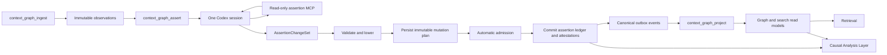

# Agent-First Repository Context Implementation Plan

## Status

This document is the execution plan for
[AGENT_FIRST_CONTEXT_FRAMEWORK.md](AGENT_FIRST_CONTEXT_FRAMEWORK.md). It translates the target design into
small, reversible pull requests against the current implementation.

- Planning date: 2026-07-24.
- [CONTEXT_GRAPH.md](CONTEXT_GRAPH.md) remains authoritative for behavior that is deployed today.
- This plan does not authorize a flag cutover by itself.
- Every migration is expand-first and compatible with the current assertion and projection paths.
- Human review remains available, but no task, assertion run, admission decision, projection, or causal answer waits
  for it.

## Outcome

The implementation is complete when one existing `context_graph_assert` task can run one Codex session that:

1. checks out the task's pinned commit;
2. reads bounded source, GitHub observations, registry definitions, and applicable prior assertions;
3. plans and investigates inside the session using read-only semantic tools;
4. returns one schema-constrained `AssertionChangeSet`;
5. has that changeset validated, admitted, and committed by Jina services;
6. records independent evidence attestations without rewriting an assertion's semantic identity;
7. causes the existing `context_graph_project` task to rebuild graph and search read models; and
8. supports qualified counterfactual answers through the Causal Analysis Layer.

There is no taskboard card for the agent's private plan, search loop, comparison pass, or reduction pass. Those are
prompt-driven behaviors inside one Codex run. Code is required only where the system must enforce a durable
contract: scope, budget, tools, evidence, ontology, admission, idempotency, concurrency, persistence, projection,
and causal semantics.

## Non-negotiable implementation decisions

### Keep the current board topology

The existing topology already has the intended boundaries:

```text
context_graph_build
├── context_graph_ingest      dispatchable and required
├── context_graph_assert      dispatchable; not required for initial aggregate publication
└── context_graph_project     dispatchable and required
```

`packages/context-graph/src/task-definition.ts` must not gain planner, investigator, reducer, reviewer, or causal
analysis subtasks in the first implementation. A regression test should make this an explicit invariant.

### Make the output semantic, not graphical

The new agent boundary is an `AssertionChangeSet`. Codex does not emit graph nodes and edges, SQL, Cypher, or a
sequence of database mutations.

The existing `GeneratedContextGraph` contract remains available behind a legacy mode until model-native
changesets have passed shadow evaluation and canary writes. The graph remains a rebuildable projection.

### Let Codex reason; make services enforce

The prompt tells Codex what result to produce and which constraints apply. It does not prescribe a fixed
planner/search/reducer program. Codex may decide which files and previous assertions to inspect inside the
system-provided scope and budget.

The host remains responsible for:

- pinning the checkout and repository identity;
- selecting initialization, incremental, PR, or backfill scope;
- enforcing read and tool budgets;
- supplying only tenant- and repository-authorized data;
- validating every evidence locator against immutable observations or the pinned checkout;
- validating predicates, entity kinds, qualifiers, source authority, and cardinality;
- computing semantic identities;
- making versioned automatic-admission decisions;
- rejecting stale or conflicting plans;
- committing atomically and idempotently; and
- projecting canonical events into read models.

### No required human gate

Automated admission returns one of:

- `active`: safe to use in normal retrieval;
- `proposed`: valid enough to retain, but below the policy's activation bar;
- `rejected`: structurally invalid, unsupported, or disallowed;
- `deferred`: missing identity, source authority, or required context.

All four outcomes complete the assertion task. Optional human commands can later accept, reject, retract, or amend
knowledge, but a lack of human action cannot block the pipeline.

### Start current-first

Initialization builds useful current truth from the current tree and bounded high-value history. Full history is a
separate, explicitly scheduled scope. Codex does not decide to walk an unbounded repository history.

## Current code seams

The migration should extend these seams rather than build a second pipeline.

| Concern                  | Current seam                                           | Planned change                                                                           |
| ------------------------ | ------------------------------------------------------ | ---------------------------------------------------------------------------------------- |
| Task topology            | `packages/context-graph/src/task-definition.ts`        | Preserve topology; add invariant coverage only                                           |
| Agent request/result     | `packages/context-graph/src/model.ts`                  | Add changeset request/result types beside the legacy graph result                        |
| Agent schema and prompt  | `packages/context-graph/src/schema.ts`                 | Add strict changeset schema and agent-first prompt                                       |
| Daytona Codex execution  | `packages/daytona/src/context-graph-executor.ts`       | Select legacy or changeset contract; configure a required read-only MCP server           |
| Worker orchestration     | `apps/worker/src/server.ts`                            | Select mode, load prior state, run agent, propose plan, and commit admitted operations   |
| Legacy normalization     | `packages/context-graph/src/pipeline.ts`               | Keep compatibility; move new contracts to focused modules                                |
| Ontology and policy      | `packages/context-graph/src/registry.ts`               | Add admission and source-authority policy without removing review metadata               |
| In-memory behavior       | `packages/context-graph/src/store.ts`                  | Implement the same propose/verify/commit semantics as PostgreSQL                         |
| PostgreSQL schema        | `packages/db/src/context-graph-schema.ts`              | Add runs, changesets, plans, operations, versions, attestations, and unresolved findings |
| PostgreSQL behavior      | `packages/db/src/postgres-context-graph-store.ts`      | Add transactional propose and commit methods while retaining existing write fences       |
| Database roles           | `packages/db/src/context-graph-roles.ts`               | Grant least-privilege access for each new table and operation                            |
| API/MCP                  | `apps/api/src/mcp.ts`                                  | Keep `query_graph`; later add one qualified `analyze_causality` tool                     |
| Current causal evaluator | `packages/context-graph/src/causal.ts`                 | Keep compatibility while a mechanism-based evaluator is introduced beside it             |
| Public exports           | `packages/context-graph/src/index.ts`, package indexes | Export versioned contracts without breaking current imports                              |

## Target runtime



The changeset is untrusted model output. The mutation plan is the normalized, validated, version-pinned artifact
that the database may apply. Revalidating the original model JSON during commit is not sufficient because
concurrent assertion changes may have made the plan stale.

## Delivery strategy

The work is divided into independently deployable slices. A slice may contain more than one commit, but should be
small enough for one pull request unless noted otherwise.

The critical path is:

```text
baseline flags
  -> changeset contract
  -> additive schema
  -> pure planner/admission
  -> transactional store
  -> attestations and semantic identity
  -> host shadow
  -> model-native shadow
  -> canary writes
  -> changeset default
```

The mechanism-based Causal Analysis Layer can begin after the changeset contract exists, but must not become the
default until the assertion ledger can preserve causal condition grouping.

## Slice 0 — Baseline modes and topology invariants

### Purpose

Create rollout controls and observability without changing runtime behavior.

### Changes

Add one validated mode parser rather than reading unrelated environment variables throughout the worker:

```ts
type AssertionExecutionMode = "legacy" | "host_shadow" | "model_shadow" | "changeset";

type AdmissionExecutionMode = "legacy_proposed" | "shadow" | "enforce";

type CausalExecutionMode = "legacy" | "mechanism_shadow" | "mechanism";

interface ContextFrameworkModes {
  assertion: AssertionExecutionMode;
  admission: AdmissionExecutionMode;
  causal: CausalExecutionMode;
  modelShadowSampleBps: number;
}
```

Recommended environment variables:

| Variable                                    | Initial default   | Meaning                                          |
| ------------------------------------------- | ----------------- | ------------------------------------------------ |
| `CONTEXT_GRAPH_ASSERTION_MODE`              | `legacy`          | Selects the assertion path                       |
| `CONTEXT_GRAPH_ADMISSION_MODE`              | `legacy_proposed` | Preserves current proposal behavior              |
| `CONTEXT_GRAPH_CAUSAL_MODE`                 | `legacy`          | Preserves current path-removal evaluator         |
| `CONTEXT_GRAPH_CHANGESET_SHADOW_SAMPLE_BPS` | `0`               | Samples model-native shadow runs in basis points |

Record the selected modes in worker start diagnostics and assertion-run metrics. Reject unknown values at startup.

Add a task-definition test that proves:

- the three existing child task types remain present;
- `context_graph_assert` still depends on ingest;
- project still depends on ingest;
- assertion is still optional for aggregate completion; and
- no private Codex reasoning phase becomes a board task.

### Acceptance

- Default configuration produces byte-for-byte equivalent task planning.
- Existing worker and board tests pass.
- Invalid configuration fails before a task is leased.
- No database schema or API behavior changes.

### Rollback

Remove the new parser and metrics. There is no persisted state to migrate.

## Slice 0A — Assertion execution profile

### Purpose

Give the one assertion session the same managed, Codex-account, and BYOK choices as the v1 review flow without
turning agent internals into separately configured planner, investigation, or review tasks. This slice is compatible
with every semantic rollout mode and may ship before model-native changesets.

### Contract

Persist one optimistic, tenant-scoped execution profile:

```ts
interface ContextGraphExecutionSettingsRecord {
  tenantId: string;
  provider: "managed" | "codex" | "byok";
  assertionModel: string;
  openrouterApiKey?: EncryptedEnvelope;
  openaiApiKey?: EncryptedEnvelope;
  codexHarnessAuth?: EncryptedEnvelope;
  revision: number;
  updatedAt: string;
}
```

The public settings API returns only provider, model, revision, model catalog, and connection booleans. The save API
requires a bound tenant administrator and an expected revision. Builds snapshot `executionProvider`,
`assertionModel`, and `executionSettingsRevision`; they never snapshot a credential.

After the exact assertion lease is verified, an internal route decrypts and resolves one whole-run route:

```text
managed -> managed OpenRouter
Codex connected + trusted private repository -> native Codex account
Codex unavailable/ineligible -> BYOK OpenRouter -> BYOK OpenAI -> managed
BYOK -> OpenRouter -> OpenAI for openai/* -> managed
```

Public repositories must not receive account auth. OpenAI API-key automation uses `CODEX_API_KEY` on only the Codex
process. Codex shell subprocesses inherit a filtered core environment and explicitly exclude credential variables.
Codex `auth.json` is owner-readable only, outside the checkout, redacted both as a whole blob and by nested token
value, and downloaded after the run so refreshed state can be re-encrypted before sandbox deletion. A settings
revision mismatch discards a stale refresh rather than undoing an administrator's disconnect or update.

The generation records both selected model and actual provider/credential class after fallback. Provider/model are
part of the assertion-generation cache scope. Credential ciphertext and automatic token-refresh revisions are not,
so a model/provider change reruns an unchanged semantic scope while token rotation does not.

### Files

- `packages/context-graph/src/execution-settings.ts`
- `packages/context-graph/src/store.ts`
- `packages/db/src/context-graph-schema.ts`
- `packages/db/src/postgres-context-graph-store.ts`
- `apps/api/src/secret-envelope.ts`
- `apps/api/src/server.ts`
- `apps/dashboard/src/app/models/page.tsx`
- `apps/worker/src/server.ts`
- `packages/daytona/src/context-graph-executor.ts`

### Acceptance

- Model selection persists across reload and changes the cache scope.
- Managed, OpenRouter BYOK, OpenAI BYOK, and Codex route tests pass.
- Public repository plus selected Codex uses the fallback chain.
- Public responses, task metadata, logs, assertion output, and graph output contain no secret.
- Database reader/query/projection roles cannot select `execution_settings`.
- Concurrent settings writes use compare-and-swap revisions.
- Refreshed Codex auth is persisted only while the originating settings revision is current.
- Ingest and project receive no model credential or model choice.

### Rollback

Select `managed` for every tenant and hide `/models`. Retain encrypted rows during rollback so reconnect is not
required. Do not drop `execution_settings` until all old API revisions and in-flight assertion leases have drained.

## Slice 1 — Versioned changeset and evidence contracts

### Purpose

Define the semantic boundary independently of Codex, PostgreSQL, and graph projection.

### Files

Add:

- `packages/context-graph/src/evidence.ts`
- `packages/context-graph/src/assertion-changeset.ts`
- `packages/context-graph/src/assertion-changeset.test.ts`

Extend:

- `packages/context-graph/src/model.ts`
- `packages/context-graph/src/schema.ts`
- `packages/context-graph/src/index.ts`

### Contract

Start with contract version `assertion-changeset/v1`.

```ts
type AssertionOperation =
  | ProposeAssertionOperation
  | ConfirmAssertionOperation
  | SupersedeAssertionOperation
  | RetractAssertionOperation
  | RelateAssertionsOperation;

interface AssertionChangeSetV1 {
  contractVersion: "assertion-changeset/v1";
  changeSetId: string;
  scope: {
    tenantId: string;
    repository: string;
    ref: string;
    commitSha: string;
    mode: "pull_request" | "incremental" | "initialize" | "backfill";
  };
  base: {
    assertionSetVersion: string;
    registryVersion: string;
    evidenceFingerprint: string;
  };
  summary: string;
  operations: AssertionOperation[];
  unresolved: UnresolvedFinding[];
}
```

The model may provide `changeSetId` and per-operation IDs for trace correlation, but the service computes the
idempotency key from trusted run inputs. Model-provided IDs never authorize a write.

An assertion proposal has semantic fields, not graph fields:

```ts
interface ProposeAssertionOperation {
  operationId: string;
  type: "propose";
  assertion: AssertionCandidate;
}
```

`AssertionCandidate` contains the subject, predicate, object, canonicalizable primitive qualifiers, truth class,
confidence, explanation, evidence, and optional validity interval. V1 objects are typed entity references; typed
literals require a later contract version.

Evidence must be typed:

```ts
type EvidenceLocator =
  | {
      type: "repository_range";
      repository: string;
      commitSha: string;
      path: string;
      startLine: number;
      endLine: number;
      contentDigest: string | null;
    }
  | {
      type: "source_observation";
      observationId: string;
      observationType: string;
    }
  | {
      type: "assertion_attestation";
      assertionId: string;
      attestationId: string;
    };
```

Do not add arbitrary URLs in v1. GitHub PRs, issues, commits, deployments, and workflow runs must first exist as
authorized source observations, so evidence remains tenant-scoped and reproducible.

`confirm`, `supersede`, and `retract` operations must reference an assertion ID returned by the prior-assertion
tool. The service verifies repository membership and current lifecycle state. `relate` records support or
contradiction between existing or same-changeset assertions; it does not create graph edges.

### Legacy adapter

Implement:

```ts
function assertionBatchToChangeSet(
  batch: ContextGraphAssertionBatch,
  options: {
    assertionSetVersion: string;
    mode?: "pull_request" | "incremental" | "initialize" | "backfill";
  }
): AssertionChangeSetV1;
```

This adapter is intentionally host-side. It provides a no-extra-model-cost way to exercise changeset validation,
planning, and persistence before changing the prompt.

Do not implement the reverse adapter as a long-term dependency. Projection consumes assertions, not agent output.

### Validation layers

Keep validation explicitly layered:

1. JSON Schema shape validation.
2. Contract version validation.
3. Trusted scope equality.
4. Entity and predicate registry validation.
5. Qualifier and cardinality validation.
6. Evidence resolution and exact range validation.
7. Lifecycle precondition validation.
8. Cross-operation consistency.
9. Cost and cardinality limits.

Recommended limits should be configuration with conservative hard ceilings:

- operations per changeset;
- evidence locators per operation;
- unresolved findings per changeset;
- explanation length;
- qualifier JSON size; and
- maximum referenced prior assertions.

### Tests

- every operation parses and serializes;
- unknown fields are rejected by the JSON Schema;
- model-supplied tenant, repository, ref, or commit mismatches are rejected;
- repository ranges cannot escape the checkout or cite another commit;
- source observation and attestation references are tenant/repository scoped;
- duplicate operation IDs are rejected;
- contradictory lifecycle operations in one changeset are rejected;
- the legacy adapter produces stable results;
- graph vocabulary is absent from the new output schema.

### Acceptance

- The package can parse and validate a changeset without a database.
- No worker uses the new contract yet.
- Existing `GeneratedContextGraph` tests remain unchanged.

## Slice 2 — Additive persistence schema

### Purpose

Create durable audit records for agent runs and validated plans before any new path writes assertions.

### Tables

Add the following tables to `packages/db/src/context-graph-schema.ts`.

#### `assertion_agent_runs`

| Column                                                  | Purpose                                            |
| ------------------------------------------------------- | -------------------------------------------------- |
| `id`                                                    | Service-generated run ID                           |
| `tenant_id`, `repository`, `ref`, `commit_sha`          | Trusted execution scope                            |
| `task_id`                                               | Durable task association                           |
| `input_fingerprint`                                     | Idempotency input                                  |
| `contract_version`, `prompt_version`, `toolset_version` | Reproducibility                                    |
| `model_provider`, `model`                               | Generator provenance                               |
| `status`                                                | `running`, `submitted`, `committed`, or `failed`   |
| `usage`                                                 | Structured token, tool-call, and duration counters |
| `failure_category`, `failure_detail`                    | Bounded diagnostics                                |
| `started_at`, `finished_at`                             | Audit times                                        |

Use a unique key over trusted task/run identity so a worker retry resumes or observes the same logical run rather
than creating duplicate canonical work.

#### `assertion_changesets`

| Column                        | Purpose                        |
| ----------------------------- | ------------------------------ |
| `id`                          | Service changeset ID           |
| `agent_run_id`                | Generator run                  |
| trusted scope columns         | Repository and commit boundary |
| `contract_version`            | Parser selection               |
| `idempotency_key`             | Retry convergence              |
| base version and fingerprints | Staleness and reproducibility  |
| `summary`                     | Human-readable run summary     |
| `raw_payload`                 | Immutable submitted JSON       |
| `created_at`                  | Audit time                     |

The raw payload is retained for audit but is never replayed directly as SQL.

#### `assertion_mutation_plans`

| Column                                          | Purpose                                                       |
| ----------------------------------------------- | ------------------------------------------------------------- |
| `id`                                            | Immutable plan ID                                             |
| `changeset_id`                                  | Source changeset                                              |
| `validator_version`, `admission_policy_version` | Reproducible service decisions                                |
| `base_assertion_set_version`                    | Optimistic concurrency boundary                               |
| `status`                                        | `validated`, `invalid`, `conflict`, `committed`, or `expired` |
| `risk_summary`, `warnings`, `diff_summary`      | Explainability                                                |
| `created_at`, `expires_at`, `committed_at`      | Lifecycle                                                     |

#### `assertion_plan_operations`

Store operations in deterministic ordinal order with:

- plan and operation IDs;
- normalized operation type and payload;
- computed semantic key;
- selected admission outcome;
- admission reason codes;
- affected assertion ID when known; and
- commit result when applied.

The database applies this normalized payload, not the model's raw payload.

#### `assertion_set_versions`

One row per tenant and repository:

```text
(tenant_id, repository) -> monotonic version, content fingerprint, updated_at
```

The version advances in the same transaction as a committed mutation plan. Reads used to create a plan return this
version. A stale plan is not silently rebased.

#### `unresolved_findings`

Persist deferred questions with:

- trusted scope;
- source changeset and operation;
- reason code;
- candidate entity or assertion data;
- evidence already found;
- missing information;
- suggested next action;
- status and timestamps.

This is an inbox, not a review gate. The assertion task completes after writing it.

### Database safety

- Add tables and indexes only; do not drop or rename current columns.
- Add tenant/repository prefixes to every uniqueness and lookup index.
- Add foreign keys where they do not create cross-tenant ambiguity.
- Apply the same schema idempotently in integration tests.
- Update `context-graph-roles.ts`; the worker may propose and commit, while read principals cannot mutate.
- Keep agent execution credentials completely separate from database credentials.

### Tests

- schema is idempotent;
- unique idempotency keys converge;
- cross-tenant references fail;
- repository tombstones prevent new plans and commits;
- least-privilege role tests cover every new table;
- raw changeset JSON cannot be modified after insertion.

### Acceptance

The deployed schema can store a run, changeset, plan, and unresolved finding, but no production worker calls it.

## Slice 3 — Pure mutation planner and automatic admission

### Purpose

Put semantic validation and policy in a deterministic package service that both the in-memory and PostgreSQL stores
can use.

### Files

Add:

- `packages/context-graph/src/assertion-planner.ts`
- `packages/context-graph/src/admission.ts`
- focused unit tests

Extend `registry.ts` with an optional admission policy while preserving the current review policy during migration.

### Interfaces

```ts
interface AssertionPlanningContext {
  trustedScope: AssertionScope;
  baseAssertionSetVersion: string;
  registry: PredicateRegistry;
  existingAssertions: ReadonlyMap<string, StoredAssertion>;
  resolvableEvidence: ReadonlyMap<string, ResolvedEvidence>;
  policyVersion: string;
  now: string;
}

interface PlannedAssertionOperation {
  operationId: string;
  operation: NormalizedAssertionOperation;
  semanticKey?: string;
  outcome: "active" | "proposed" | "rejected" | "deferred";
  reasonCodes: string[];
}

interface AssertionMutationPlan {
  planId: string;
  baseAssertionSetVersion: string;
  operations: PlannedAssertionOperation[];
  unresolved: NormalizedUnresolvedFinding[];
  diff: AssertionSetDiff;
  warnings: PlanWarning[];
}
```

The planner must be pure: the same trusted context and changeset produce the same plan. Time, registry, and policy
versions are explicit inputs.

### Registry evolution

Add policy fields such as:

```ts
interface AdmissionPolicy {
  truthClass: "deterministic_fact" | "semantic_claim" | "causal_claim";
  allowedEvidenceTypes: EvidenceLocator["type"][];
  minimumIndependentSources?: number;
  autoActivateConfidence?: number;
  requiredQualifiers?: string[];
  sourceAuthorities?: string[];
  onInsufficientEvidence: "proposed" | "deferred" | "rejected";
}
```

Confidence alone must never activate an assertion. Activation requires every structural, evidence, authority,
cardinality, and freshness rule plus any confidence threshold.

Initial policy:

- deterministic facts continue through deterministic ingest, not the assertion agent;
- existing semantic predicates remain `proposed` under `legacy_proposed`;
- shadow mode computes and records what admission would do without changing status;
- enforce mode may auto-activate only predicate policies explicitly calibrated and enabled;
- uncalibrated valid claims remain `proposed`, which is a terminal non-blocking result;
- invalid citations or unauthorized sources are rejected;
- missing resolvable identity or required evidence is deferred.

Human review metadata can remain in the registry for UI and audit purposes. It is no longer interpreted as a
pipeline prerequisite.

### Semantic identity

Compute a natural semantic key from:

```text
tenant
repository
subject identity
predicate
object identity
canonical qualifiers
```

Do not include commit SHA, model version, evidence fingerprint, confidence, or explanation. Those describe an
attestation or assertion version, not the semantic proposition.

### Tests

- deterministic replay produces an identical plan;
- operation order cannot change semantic results;
- natural keys are stable across commits and model versions;
- canonical qualifier ordering is stable;
- registry violations produce explicit reason codes;
- stale lifecycle references are rejected;
- `confirm` adds evidence but does not create a duplicate proposition;
- auto-admission never relies on confidence alone;
- no outcome has `waiting_for_human` semantics.

### Acceptance

The service can lower a valid changeset into an immutable plan without calling PostgreSQL or a model.

## Slice 4 — Transactional propose, verify, and commit APIs

### Purpose

Apply only a previously validated mutation plan with existing isolation and write-fence guarantees.

### Store interface

Extend `ContextGraphPipelineStore` or introduce a focused `AssertionLedgerStore`:

```ts
interface AssertionLedgerStore {
  loadAssertionAgentContext(input: AgentContextRequest): Promise<AssertionAgentContext>;
  proposeAssertionChangeSet(input: ProposeChangeSetRequest): Promise<StoredMutationPlan>;
  verifyAssertionMutationPlan(input: VerifyPlanRequest): Promise<PlanVerification>;
  commitAssertionMutationPlan(input: CommitPlanRequest): Promise<CommitPlanResult>;
}
```

`proposeAssertionChangeSet`:

1. authenticates trusted scope;
2. inserts or finds the idempotent agent run and changeset;
3. resolves evidence and applicable assertions;
4. invokes the pure planner;
5. persists the exact normalized plan and admission decisions; and
6. returns a plan digest and diff.

`verifyAssertionMutationPlan`:

1. checks plan status and expiration;
2. checks repository tombstone and current ref write fence;
3. compares the assertion-set version;
4. verifies registry and admission policy versions; and
5. returns `committable`, `stale`, `conflict`, or `invalid`.

`commitAssertionMutationPlan` performs one transaction:

1. take the existing repository and semantic-key advisory locks in a stable order;
2. repeat verification under lock;
3. apply the persisted operation rows exactly once;
4. write assertion audit and attestation rows;
5. persist unresolved findings;
6. increment the assertion-set version;
7. emit canonical outbox events; and
8. mark the plan and run committed.

If the base version is stale, mark the plan `conflict`. Do not ask Codex to guess a merge in the commit
transaction. The worker may run a new assertion session with the new base when policy permits.

### Idempotency

The trusted idempotency key should include:

```text
tenant
repository
task
pinned commit
assertion scope
evidence fingerprint
contract version
prompt version
toolset version
registry version
```

A retry of the same logical work returns the same changeset/plan/commit result. A different prompt, toolset,
registry, or evidence fingerprint is a new run even at the same commit.

### In-memory parity

Implement the same state machine in `packages/context-graph/src/store.ts`. Unit and acceptance tests depend on the
in-memory store, so letting its semantics drift from PostgreSQL would hide production defects.

### Tests

- retry before and after commit is idempotent;
- concurrent plans for unrelated semantic keys both commit;
- concurrent plans for the same semantic key serialize;
- a stale base version conflicts;
- a moved ref or tombstoned repository fails the write fence;
- partial operation application is impossible;
- outbox and version increment are atomic with assertion writes;
- invalid and rejected operations remain auditable but do not create live assertions;
- unresolved findings do not block commit.

### Acceptance

The new store APIs are production-capable but remain unused by the default worker path.

## Slice 5 — Independent attestations and stable assertion identity

### Purpose

Separate “the proposition exists” from “this run/source supports the proposition.”

### Schema

Add:

- `semantic_key` and `semantic_key_hash` to assertions;
- `assertion_attestations`;
- optional `assertion_attestation_evidence` if evidence items need indexed relational lookup.

An attestation records:

```ts
interface AssertionAttestation {
  id: string;
  assertionId: string;
  tenantId: string;
  repository: string;
  commitSha: string;
  sourceObservationId?: string;
  evidenceFingerprint: string;
  evidence: EvidenceLocator[];
  confidence: number;
  explanation: string;
  assertedBy: string;
  generatorVersion: string;
  createdAt: string;
}
```

### Migration

1. Add nullable semantic-key columns.
2. Backfill them from current subject, predicate, object, and canonical qualifiers.
3. Detect collisions and emit a migration report before adding a unique live-key constraint.
4. Create one legacy attestation from each current assertion's evidence and provenance.
5. Make new writes require semantic keys.
6. Preserve existing assertion primary keys; do not rewrite every historical reference.

For legacy rows whose current IDs include commit or evidence data, keep the ID stable and use the new semantic key
for reconciliation. A later compaction may rewrite identifiers only if every foreign key and audit consumer is
migrated.

### Behavior

- confirming the same semantic proposition appends or reuses an attestation;
- independent sources remain independently inspectable;
- a changed explanation does not silently overwrite prior provenance;
- assertion lifecycle remains on the proposition;
- attestation validity and source retraction can affect support without erasing audit history.

### Tests

- repeated support from the same evidence is idempotent;
- different source observations produce different attestations;
- retracted source evidence is retained for audit but excluded from current support;
- legacy assertion IDs still resolve;
- projection produces one semantic edge for multiple attestations;
- current retrieval can cite every applicable independent attestation.

### Acceptance

The legacy `saveAssertionBatch` path records attestations too. This exercises the new representation before
model-native changesets write canonically.

## Slice 6 — Host-generated changeset shadow

### Purpose

Exercise the whole new validation and plan path with no extra model call and no canonical assertion mutation.

### Worker flow

In `host_shadow`:

```text
current Codex graph output
  -> current assertionsFromGeneratedContextGraph
  -> current saveAssertionBatch
  -> host assertionBatchToChangeSet adapter
  -> propose new mutation plan
  -> compare plan with legacy result
  -> do not commit the plan
```

Persist the shadow plan and comparison record. Mark it `expired` after the comparison window.

### Comparison metrics

Measure by predicate and repository:

- semantic assertions present on both sides;
- only in legacy;
- only in changeset plan;
- evidence normalization differences;
- lifecycle differences;
- automatic-admission outcome distribution;
- validation/rejection/defer reason codes;
- planning and database latency.

Because both paths derive from the same model output, this slice isolates host-contract and persistence differences
from prompt/model differences.

### Acceptance gate

Before model-native shadow:

- no unexplained semantic-key divergence on the fixed corpus;
- no cross-tenant or write-fence regression;
- host-shadow p95 planning overhead is within the agreed service budget;
- every divergence has a stable reason code;
- default remains `legacy`.

### Rollback

Set assertion mode to `legacy`. Shadow tables may remain for audit and expire normally.

## Slice 7 — Read-only assertion MCP and model-native changesets

### Purpose

Give one Codex session the minimum semantic tools it needs and replace graph-shaped output in sampled shadow runs.

### Supported Codex integration

Use `codex exec` with:

- a pinned working directory;
- a strict `--output-schema`;
- a dedicated run configuration;
- an MCP server marked `required = true`;
- a read-only sandbox for repository investigation;
- bounded tool timeouts and enabled-tool allowlists; and
- JSONL execution telemetry plus the final output file.

Codex supports project/profile configuration for MCP servers, strict structured output, and failing a noninteractive
run when a required MCP server cannot initialize. Use those primitives instead of inventing an undocumented
side-channel protocol.

Generate a task-local Codex configuration outside the cloned repository so repository-controlled config cannot add
tools or change policy. Do not inherit an operator's personal MCP servers. The worker owns the allowlist.

### Internal MCP tools

Expose only:

```text
list_assertions
get_assertion
search_source_observations
get_source_observation
get_predicate_definition
get_assertion_scope
```

Properties:

- every call is bound to one tenant, repository, pinned commit, and agent run;
- identifiers outside that scope return not found;
- list/search calls have cursor and result limits;
- returned evidence is immutable or content-addressed;
- tools are read-only;
- no raw SQL, Cypher, graph mutation, board mutation, shell proxy, or arbitrary HTTP tool exists;
- tool usage is logged against the agent run.

Codex already has read-only access to the pinned clone for file search and reading. Do not wrap ordinary local file
reads in another service unless Daytona isolation requires it.

The final changeset is submitted through `--output-schema`, not a mutating MCP call. This keeps “one final semantic
output” easy to validate and retry. A future `submit_assertion_changeset` tool is unnecessary unless session
streaming or resumability demonstrates a concrete need.

### Prompt

The system prompt should communicate:

- the trusted scope and goal;
- deterministic facts that must not be reinvented;
- the available entity and predicate registry;
- how to use prior assertions;
- evidence and citation requirements;
- changeset operation meanings;
- that unchanged assertions need no operation unless fresh attestation matters;
- that uncertainty belongs in `unresolved`;
- causal mechanism grouping rules;
- hard operation and tool budgets; and
- the requirement to emit exactly one final changeset.

It should not script a fixed list of planner/investigator/reducer steps. A short behavioral instruction is enough:
inspect the change and current implementation, retrieve applicable assertions, investigate conflicting or missing
evidence, then return the smallest complete changeset.

### Model-shadow flow

Sample by a deterministic hash of tenant, repository, and task so retries stay in the same cohort:

```text
legacy run and write
  + sampled changeset Codex run
  -> propose shadow plan
  -> compare semantic outputs
  -> no changeset commit
```

This mode intentionally costs a second model run only for the sampled cohort. Do not double model cost globally.

### Failure behavior

- MCP initialization failure: fail the shadow run closed and record a tool-infrastructure reason.
- Schema failure: allow the current bounded repair attempt, then fail the shadow run.
- Evidence failure: reject or defer affected operations; do not relax validation.
- Budget exhaustion: Codex returns the best bounded changeset plus unresolved findings when possible.
- Legacy production behavior continues in shadow mode.

### Tests

- generated config exposes only the six allowed tools;
- an unavailable required MCP server makes the Codex run fail;
- the output schema rejects nodes and edges;
- cross-repository assertion IDs cannot be read;
- pagination and budgets are enforced;
- prompt and toolset versions enter the idempotency key;
- a model repair cannot alter trusted scope;
- telemetry captures tool calls without leaking secrets or unrestricted source contents.

### Acceptance gate

Use a frozen evaluation corpus containing:

- one-PR changes;
- current-state initialization;
- repeated assertions at a later commit;
- deletion and rename cases;
- conflicting evidence;
- service/dependency/deployment facts;
- derived issue and causal claims; and
- repositories with long history where only a bounded slice is supplied.

Required gate:

- citation validity is not worse than legacy;
- unsupported-assertion rate is at or below the agreed threshold;
- lifecycle operation precision is manually sampled but not human-gated;
- unresolved findings increase when context is genuinely missing rather than speculative claims increasing;
- token, tool-call, and wall-clock budgets are respected;
- no tool escapes the task scope.

## Slice 8 — Changeset commit canary

### Purpose

Make model-native changesets canonical for selected repositories while retaining a flag rollback.

### Worker flow

In `changeset` mode:

```text
load trusted agent context and assertion-set version
  -> run one changeset Codex session
  -> propose immutable mutation plan
  -> verify
  -> commit
  -> complete context_graph_assert
```

Do not run legacy generation by default in the canary cohort. Sampled dual generation may continue only for
evaluation because it doubles cost.

### Admission rollout

Roll admission separately from changeset generation:

1. `legacy_proposed`: commit valid agent assertions as proposed.
2. `shadow`: commit with legacy statuses but record automatic-admission decisions.
3. `enforce`: use versioned predicate admission decisions.

This separation makes it possible to validate the semantic contract before allowing newly generated assertions to
become active automatically.

### Canary controls

- explicit tenant/repository allowlist or stable percentage cohort;
- maximum concurrent changeset runs;
- per-run token/tool/duration budgets;
- automatic circuit breaker on validation, tool, or commit error rates;
- dashboard of assertions, operations, admission outcomes, conflicts, and projection lag.

### Rollback

Set assertion mode to `legacy`. New assertions and attestations remain valid canonical records; do not delete them.
Projection rebuilds from the ledger. If a policy version is defective, disable that admission policy and issue
ordinary retraction or supersession plans with audit history.

### Acceptance gate

- no duplicate semantic propositions under retries;
- conflict rate is understood and bounded;
- all commits have a run, raw changeset, immutable plan, policy version, and outbox event;
- projection catches up within the existing service objective;
- optional human corrections do not reveal a systematic precision regression;
- the aggregate task never waits for human action.

## Slice 9 — Default cutover and legacy containment

### Purpose

Make changesets the normal assertion boundary while retaining enough legacy code for rollback and historical
decoding.

### Changes

- Set new deployments to `changeset` only after canary gates hold.
- Keep parsing of historical `GeneratedContextGraph` observations.
- Stop writing new graph-shaped raw outputs in the changeset path.
- Keep the legacy adapter and mode for at least one full retention/rollback window.
- Mark legacy generator metrics distinctly.
- Update current-behavior documentation only when the default actually changes.

### Removal criteria

Do not remove legacy execution until:

- no production repository has used it during the rollback window;
- all stored legacy output remains readable;
- all projection rebuilds operate from the assertion ledger;
- support tooling can explain a changeset and mutation plan; and
- rollback has been tested from a production-like snapshot.

Legacy decoding may remain indefinitely even after legacy generation is removed.

## Slice 10 — Causal Analysis Layer contracts and evaluator

### Purpose

Replace path deletion as the semantic basis of counterfactual answers with explicit mechanisms, conditions, and
typed interventions.

### Files

Add:

- `packages/context-graph/src/causal-analysis.ts`
- `packages/context-graph/src/causal-analysis.test.ts`

Keep `causal.ts` as the compatibility evaluator until cutover.

### Core types

```ts
interface CausalWorldState {
  repository: string;
  commitSha: string;
  ref?: string;
  assertionSetVersion: string;
  dimensions: {
    code: CoverageState;
    history: CoverageState;
    dependencies: CoverageState;
    configuration: CoverageState;
    data: CoverageState;
    deployment: CoverageState;
    runtime: CoverageState;
    ci: CoverageState;
  };
}

type CausalIntervention =
  | { type: "remove_change"; pullRequest?: number; commitSha?: string }
  | { type: "revert_commit"; commitSha: string }
  | { type: "replace_implementation"; target: EntityReference; virtualRevisionId?: string }
  | { type: "pin_dependency"; package: EntityReference; version: string }
  | { type: "change_configuration"; key: EntityReference; value: unknown }
  | { type: "remove_deployment"; deployment: EntityReference };

interface CausalMechanism {
  id: string;
  outcome: EntityReference;
  conditionIds: string[]; // conjunction within one mechanism
  evidence: EvidenceLocator[];
  assurance: CausalAssurance;
}
```

Multiple mechanisms for the same outcome are alternatives:

```text
outcome occurs if mechanism A OR mechanism B OR mechanism C
mechanism A is enabled if condition A1 AND condition A2
```

### Result vocabulary

The evaluator returns:

- `prevented_within_model`;
- `still_possible_within_model`;
- `likely_prevented`;
- `likely_still_possible`; or
- `unknown`.

Every answer includes:

- baseline world state;
- intervention;
- mechanisms disabled and remaining;
- evidence and assertion IDs;
- assurance level;
- assumptions;
- uncovered world-state dimensions;
- falsifiers or missing evidence; and
- whether a virtual revision or experiment was used.

Never return an unqualified real-world “would” from graph reachability alone.

### Algorithms

Implement pure, bounded algorithms for:

- intervention resolution;
- condition satisfaction;
- mechanism disabling;
- known-model necessary-condition analysis;
- minimal preventative sets using bounded minimal hitting sets;
- alternative mechanism enumeration; and
- explanation construction.

Set explicit maximums for mechanisms, conditions, paths, hitting-set size, and search time. If bounds are reached,
return a partial result with coverage warnings.

### Compatibility adapter

Translate each current causal path into a temporary single-condition or sequential compatibility mechanism so the
new answer envelope can run in shadow before native mechanisms exist. Label its assurance `graph_derived`; do not
pretend the adapter recovered AND/OR causality.

### Tests

- removing one condition from an AND mechanism disables that mechanism;
- disabling one of several OR mechanisms does not prevent the outcome;
- minimal hitting sets cover every known alternative mechanism;
- an uncovered world-state dimension lowers or bounds the conclusion;
- cycles and duplicate conditions terminate;
- path compatibility output preserves current evidence;
- answers always include the `within_model` boundary unless backed by an explicit experiment or observation.

## Slice 11 — Causal ontology and projection

### Purpose

Let the assertion agent represent causal logic without coupling it to graph shape.

### Ontology

Add entity kinds:

- `CausalMechanism`;
- `CausalCondition`;
- `Behavior`.

Add versioned predicates for:

- mechanism produces outcome;
- mechanism requires condition;
- condition is satisfied by entity/state;
- implementation exhibits behavior;
- intervention disables or changes a condition; and
- observation supports or contradicts a mechanism.

Exact predicate names should follow existing registry naming conventions and be chosen once in the registry PR.
The important contract is grouping:

- condition membership in one mechanism is conjunctive;
- different mechanisms producing an outcome are alternative;
- support/contradiction is provenance, not causal adjacency.

### Agent behavior

Extend the changeset prompt and examples so Codex:

- proposes a mechanism when several interacting facts jointly explain an outcome;
- reuses applicable prior mechanisms;
- supersedes a mechanism when its condition set changes materially;
- defers when an outcome or condition cannot be identified;
- cites the implementation and historical evidence for each condition; and
- does not flatten an AND condition set into unrelated graph paths.

### Projection

Project mechanism and condition assertions into the current graph without losing group identity. Search documents
should include a mechanism summary and its condition set. The ledger remains canonical.

### Tests

- projection round-trips grouping;
- multiple attestations do not duplicate a mechanism node;
- retraction or supersession changes only current projection;
- old projections rebuild deterministically under the new projection version;
- retrieval returns mechanisms and conditions with citations.

## Slice 12 — Code-first world states and causal query API

### Purpose

Answer useful counterfactuals with explicit coverage before adding expensive experiments.

### V1 world-state coverage

Build from sources already present:

| Dimension     | Initial source                                                  |
| ------------- | --------------------------------------------------------------- |
| Code          | Exact tree, blobs, symbols, imports, calls, and source ranges   |
| History       | Commits, first-parent change observations, PR membership, moves |
| Dependencies  | Parsed direct dependency manifests and lockfile confirmation    |
| Deployment    | Existing deployment and workflow observations when authorized   |
| Configuration | `unavailable` unless an existing parser produced an observation |
| Data          | `unavailable`                                                   |
| Runtime       | `unavailable`                                                   |
| CI            | `unavailable` except explicit existing workflow observations    |

An unavailable dimension is data, not an error. The answer must state how that gap limits the conclusion.

### API and MCP

Add one public read-only tool:

```text
analyze_causality(repository, question, ref?, intervention?)
```

The service:

1. resolves authorized repository and ref;
2. loads a baseline world state;
3. lowers the question to a typed intervention;
4. loads applicable mechanisms and attestations;
5. evaluates the intervention;
6. returns the qualified answer envelope.

Keep the internal assertion-agent MCP separate. Public clients should not need its low-level assertion-management
tools.

Natural-language lowering may use Codex, but the evaluator consumes only a validated typed intervention. If
lowering is ambiguous, return candidate interpretations or `unknown`; do not silently select a materially different
intervention.

### Shadow and cutover

In `mechanism_shadow`, run both current counterfactual evaluation and the new evaluator, return the legacy result,
and record:

- intervention resolution agreement;
- removed/remaining mechanism agreement;
- conclusion disagreement;
- coverage warnings;
- latency.

Switch to `mechanism` only after native mechanisms exist for the evaluation corpus and disagreements are explained.

## Slice 13 — Optional virtual revisions

### Purpose

Evaluate the code structure of a hypothetical repository state without mutating the canonical repository or
assertion ledger.

Support bounded transformations:

- omit a PR or commit when a safe parent relationship is known;
- revert a commit;
- cherry-pick a candidate fix;
- replace a file or implementation with a supplied patch;
- pin a dependency version.

Materialize the revision in an isolated sandbox, run deterministic parsers, and build an ephemeral projection. Mark
all resulting evidence and assertions `hypothetical`. They may support a causal result but cannot become canonical
observed facts without a separate observed ingest.

This slice is not required for the initial agent-first assertion cutover.

## Slice 14 — Optional experiment adapters

### Purpose

Raise assurance for questions that static evidence cannot answer.

Adapters may include:

- targeted test execution in a hardened sandbox;
- database snapshot replay;
- CI workflow replay;
- runtime trace replay; and
- controlled shadow deployment.

Each adapter requires its own authorization, resource budget, secret policy, isolation, cleanup, and evidence
contract. The Causal Analysis Layer requests an experiment plan; it does not grant itself execution authority.

Experiment results are observations with provenance. Production intervention remains outside the assertion agent's
authority.

This slice is intentionally outside the critical path.

## Initialization and history implementation

### Scope is selected before Codex starts

Add a host-owned scope classifier:

```ts
type AssertionScopeMode = "pull_request" | "incremental" | "initialize" | "backfill";

interface AssertionScopePolicy {
  mode: AssertionScopeMode;
  pinnedCommit: string;
  changedPaths: string[];
  sourceObservationIds: string[];
  priorAssertionSelector: PriorAssertionSelector;
  history: {
    strategy: "none" | "bounded_first_parent" | "explicit_range";
    maximumCommits: number;
    since?: string;
    fromCommit?: string;
  };
}
```

### Pull request

Supply:

- base and head identity;
- changed files and relevant neighboring code;
- PR/issue observations;
- assertions touching changed entities and their immediate semantic neighborhood;
- bounded history that explains the change.

Codex focuses on semantic deltas and fresh attestations.

### Incremental push

Supply:

- previous processed head and new pinned head;
- deterministic tree delta;
- changed source observations;
- assertions affected by changed/tombstoned evidence;
- bounded first-parent history between known heads.

If the prior head is not an ancestor, classify explicitly as reinitialization or explicit backfill. Do not pretend a
partial range is complete.

### Initialization

Make current context available in layers:

1. ingest and project deterministic current-tree facts;
2. run one repository-scope assertion session over bounded focus bundles;
3. mark the repository's current assertion baseline complete;
4. schedule optional historical enrichment separately.

Initialization must not walk all reachable history merely because it exists.

### Backfill

Backfill is explicit operator or policy work with:

- a commit/date range;
- checkpointed chunks;
- stable evidence fingerprints;
- cost and concurrency quotas; and
- an idempotent resume cursor.

A backfill may use multiple durable `context_graph_assert` tasks because each chunk is independently retryable
repository work. This is different from splitting one assertion task into private reasoning subtasks.

## Agent context envelope

The host should begin every Codex run with a compact manifest, not a dump of all prior knowledge:

```ts
interface AssertionAgentContext {
  scope: AssertionScopePolicy;
  repositoryManifest: {
    languages: string[];
    packages: EntityReference[];
    services: EntityReference[];
    changedPaths: string[];
    focusPaths: string[];
  };
  sourceObservationSummary: ObservationSummary[];
  priorAssertionSummary: AssertionSummary[];
  registryVersion: string;
  assertionSetVersion: string;
  evidenceFingerprint: string;
  budgets: {
    maximumToolCalls: number;
    maximumReturnedItems: number;
    maximumOutputOperations: number;
    deadlineMs: number;
  };
}
```

Codex uses tools for detail on demand. This keeps long-history repositories tractable and avoids spending the
context window on unrelated assertions.

## Observability

Add metrics with bounded labels; never label by raw repository or assertion text:

- agent runs by mode and outcome;
- schema repair attempts;
- tool initialization and call failures;
- tool calls and returned items per run;
- input/output tokens and wall time;
- changeset operations by type;
- validation rejection/defer reason;
- admission outcome by predicate class and policy version;
- plan conflicts and retry outcomes;
- attestations appended and reused;
- shadow semantic precision/recall proxies;
- projection lag from plan commit;
- causal conclusions and assurance level;
- causal coverage gaps by dimension;
- causal search truncation.

Trace one assertion task across:

```text
task -> agent run -> tool calls -> changeset -> plan -> commit -> outbox -> projection
```

Store raw prompts only under an explicit data-retention policy. Logs should contain fingerprints, versions, counts,
and reason codes rather than source bodies or secrets.

## Security model

### Agent boundary

- Daytona remains the isolation boundary for repository inspection.
- The checkout is pinned and read-only for assertion generation.
- Repository dependency installation and untrusted build execution remain disabled.
- The agent has no database credentials.
- The internal MCP server enforces one run-scoped capability.
- Required MCP startup fails closed.
- The enabled-tool allowlist is generated by the worker.
- Network access is disabled unless a separately reviewed source adapter requires it.

### Service boundary

- API service credentials remain tenant and repository scoped.
- Trusted scope fields are taken from the leased task, not model JSON.
- All evidence locators resolve through authorized stores or the pinned checkout.
- Mutation plans are immutable and versioned.
- Commits repeat authorization, tombstone, ref, and concurrency checks.
- Public MCP remains read-only.

### Prompt injection

Treat repository files, issues, PR bodies, documents, and prior assertion explanations as untrusted evidence.
Instructions found inside them do not change the system prompt, tool policy, output schema, or scope. The prompt
must state this, but enforcement comes from the tool and service boundary.

## Evaluation corpus

Build a checked-in, redacted fixture corpus plus a production-shadow report. The fixture corpus should include:

- current structural repository truth;
- a one-PR feature implementation;
- an issue introduced by a code change;
- an issue with two alternative causal mechanisms;
- a fix requiring two jointly necessary conditions;
- renamed and deleted files;
- repeated evidence at a later commit;
- conflicting assertions;
- dependency and service changes;
- deployment observations;
- long-history initialization;
- missing GitHub permissions;
- stale plan concurrency;
- repository tombstone and moved-ref cases;
- counterfactual “PR not merged” questions; and
- questions whose correct answer is `unknown`.

Score:

- entity and predicate validity;
- citation validity;
- semantic proposition precision and recall;
- lifecycle operation correctness;
- attestation preservation;
- automatic-admission calibration;
- unresolved-finding usefulness;
- latency and cost;
- idempotency and conflict behavior;
- causal mechanism coverage;
- counterfactual conclusion correctness within the fixture model; and
- rate of overclaiming beyond available coverage.

Evaluation may contain optional human labels. Production execution does not wait for a human label.

## Required failure semantics

| Failure                               | Required behavior                                                                     |
| ------------------------------------- | ------------------------------------------------------------------------------------- |
| Checkout does not match pinned commit | Fail assertion run; write nothing canonical                                           |
| Required MCP server unavailable       | Fail agent run closed                                                                 |
| Tool budget exhausted                 | Return bounded result/unresolved if possible, otherwise fail run                      |
| Output schema invalid after repair    | Fail run; preserve diagnostics                                                        |
| Evidence range invalid                | Reject/defer affected operation                                                       |
| Unknown predicate/entity kind         | Reject affected operation                                                             |
| Assertion base version stale          | Mark plan conflict; rerun from fresh base                                             |
| Ref moved before commit               | Fail write fence; do not commit                                                       |
| Repository tombstoned                 | Refuse proposal and commit                                                            |
| Some operations rejected              | Commit valid operations and audit rejected ones when cross-operation invariants allow |
| Dependent operation rejected          | Reject/defer the dependent closure                                                    |
| Projection fails                      | Keep canonical commit; retry projection                                               |
| Optional human does nothing           | Pipeline remains complete                                                             |
| Causal evidence incomplete            | Return qualified `unknown` or bounded conclusion with gaps                            |

## Pull request dependency map

| PR    | Slice                                           | Depends on   | Runtime change                  |
| ----- | ----------------------------------------------- | ------------ | ------------------------------- |
| PR-01 | Baseline modes and topology invariant           | none         | none by default                 |
| PR-02 | Changeset/evidence contracts and legacy adapter | PR-01        | none                            |
| PR-03 | Additive run/changeset/plan schema              | PR-02        | schema only                     |
| PR-04 | Pure planner and admission policy               | PR-02        | none                            |
| PR-05 | Transactional plan store                        | PR-03, PR-04 | unused API                      |
| PR-06 | Attestations and semantic key                   | PR-03, PR-04 | legacy writes also attest       |
| PR-07 | Host changeset shadow                           | PR-05, PR-06 | opt-in shadow                   |
| PR-08 | Read-only MCP and model changeset shadow        | PR-07        | sampled opt-in shadow           |
| PR-09 | Changeset canonical canary                      | PR-08        | allowlisted writes              |
| PR-10 | Changeset default and legacy containment        | PR-09        | default cutover                 |
| PR-11 | Causal contracts and pure evaluator             | PR-02        | unused/shadow evaluator         |
| PR-12 | Causal ontology and projection                  | PR-06, PR-11 | versioned projection            |
| PR-13 | Code-first world state and causal API           | PR-12        | opt-in public query             |
| PR-14 | Mechanism evaluator cutover                     | PR-13        | causal default cutover          |
| PR-15 | Virtual revisions                               | PR-14        | optional                        |
| PR-16 | Experiment adapters                             | PR-14        | optional, separately authorized |

PR-11 may proceed alongside PR-03 through PR-08. PR-12 must wait for stable assertion identity and attestations.

## First implementation PR

Start with PR-01 and PR-02 together only if the diff stays focused. Otherwise keep them separate.

The first code-bearing PR should deliver:

1. validated mode configuration with legacy defaults;
2. task-topology invariant tests;
3. `EvidenceLocator`;
4. `AssertionChangeSetV1` and operation types;
5. a strict JSON Schema;
6. pure parsing and structural validation;
7. the legacy batch-to-changeset adapter; and
8. unit tests.

It must not:

- change the worker's default assertion behavior;
- add database tables;
- add an MCP server;
- modify current assertion IDs;
- activate model assertions automatically;
- change projection output; or
- change counterfactual answers.

This gives every later PR an executable contract while keeping the first review and rollback surface small.

## Definition of done

### Agent-first assertion path

- One `context_graph_assert` task launches one Codex session.
- Codex receives a pinned checkout and bounded semantic read tools.
- Codex emits one strict `AssertionChangeSet`.
- No private reasoning phase is a taskboard task.
- The service validates and lowers the output to an immutable plan.
- Automatic admission is versioned and has no human wait state.
- Commit is atomic, idempotent, tenant-scoped, ref-safe, and conflict-aware.
- Independent attestations are retained.
- The graph and search indexes rebuild from the ledger.

### Initialization and history

- Current-state initialization completes without full history.
- Incremental runs use known-head deltas.
- PR runs receive focused change context.
- Deep history is explicit, bounded, checkpointed, and resumable.
- Codex cannot expand history scope beyond the host policy.

### Causal Analysis Layer

- Mechanisms preserve AND conditions and OR alternatives.
- Interventions are typed.
- Answers identify remaining mechanisms and coverage gaps.
- Minimal preventative sets are bounded and reproducible.
- Static results say `within_model`.
- Hypothetical and experimental evidence cannot masquerade as observed facts.
- Causal analysis is a read path, not a board subtask.

### Operations

- Legacy rollback remains available through the agreed window.
- Shadow and canary metrics are available.
- Projection failure cannot corrupt canonical assertions.
- Optional human review and correction remain available.
- No pipeline waits for human review.

## Decisions to record before canonical changeset writes

The following decisions do not block contract and shadow work, but must be recorded before PR-09:

1. Initial per-predicate automatic-admission policies and calibration thresholds.
2. Run, raw prompt, changeset, plan, and attestation retention periods.
3. Canary tenant/repository selection and circuit-breaker thresholds.
4. Maximum operation, tool-call, token, and duration budgets by scope mode.
5. Plan expiration and automatic rerun policy after a version conflict.
6. Whether attestation evidence remains JSONB-only or also gets a relational locator table.
7. Which current GitHub observations are authoritative for each semantic predicate.
8. The exact causal predicate names and registry version.
9. Causal mechanism and hitting-set search bounds.
10. Authorization policy for future virtual revisions and experiments.

Recommended defaults are conservative: preserve current statuses, shadow admission, sample model-native comparison,
and make no destructive schema migration until the new path has been the stable default for a full rollback window.
