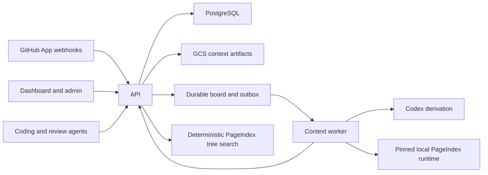

# Architecture

Jina combines a tenant-scoped task board with an evidence-grounded repository context
service. GitHub events create durable workflows. Workers capture an exact repository
snapshot, use Codex to derive cited context documents, validate those documents on the
host, and publish immutable releases for API and MCP clients.

The public retrieval corpus contains only derived context. Raw repository files, commits,
pull requests, and issues are evidence used to validate citations; they are never search
results.

## Topology



Production separates API, context worker, task worker, dashboard, admin, migration, and
acceptance identities. Runtime database roles are `NOINHERIT`; each adapter transaction
activates one focused capability with `SET LOCAL ROLE`.

## Board and execution

The task board is the sole production orchestrator. A context build is an aggregate root
with a thin input-snapshot child. The API expands a validated research plan into bounded
research tasks; the publication planner adds one aggregate per page; page aggregates add writer, independent
citation-audit, and bounded repair/audit tasks; final source challenge and context-only
maintenance-task evaluation gate certification, publication, and PageIndex construction.
Every required dynamic child blocks the root automatically.

Board rows contain only bounded orchestration metadata and immutable GCS references.
Evidence bundles, prompts, reports, drafts, transcripts, audit payloads, and
certifications remain content-addressed artifacts. This keeps scheduling transactions
small and makes every completed unit reusable after process or sandbox loss.

Each dispatchable task is claimed through the durable outbox with an attempt-bound
renewable lease and write-fence token. A worker that loses its lease cannot commit late
results. Audit findings create repair tasks rather than erasing sibling progress; only
execution failures consume retry attempts.

A monotonically allocated ref sequence is bound to the build root and publication fence
for each tenant/repository/ref. Admission order, rather than completion time, determines
which release may become current. A delayed old build cannot publish over a newer event.

## Trigger and ref policy

Context builds are scheduled only for:

- a branch push with a new head commit;
- a pull request `opened` or `synchronize` event with a new head; and
- an issue `opened` event.

Issue comments, pull-request reviews, edits, labels, close events, and other provider
updates do not schedule builds.

Branch pushes build their branch ref. The repository default branch is the canonical
release. Pull requests publish isolated preview context under `pull/<number>/head`.
Newly opened issues build against the repository default branch.

## Evidence plane

Ingestion is intentionally thin. It records:

- an exact tenant, repository, ref, sequence, and full commit SHA;
- a content-addressed manifest of repository paths and Git blob SHAs;
- available file bodies used for exact line citations;
- Git commit metadata, parents, and changed paths;
- bounded GitHub repository, pull-request, and issue observations;
- provider and Git history frontiers;
- source completeness and ACL fingerprints.

Ingestion does not build a source-code search corpus, symbol graph, import graph, or
embeddings. Structural parsing remains outside the active pipeline. Evidence is immutable
and may be read only by derivation, validation, erasure, and audit paths.

## Agentic derivation

The worker checks out the exact checkpoint commit and prepares:

- `evidence.json`;
- `repository-manifest.json`;
- prior eligible context revisions; and
- valid pages checkpointed by an earlier attempt of the same build.

The local executor runs the current Codex CLI session with `gpt-5.6-terra`, low
reasoning, no network, no plugins, and read-only access to the repository. Daytona
provides the equivalent isolated production boundary. In production, every
dispatchable Board task gets a fresh sandbox/Codex invocation with bounded inputs and
declared output files. The local Board runner disables nested orchestration because
parallel fan-out, joins, retries, and checkpoints belong to the Board.

The first agent task proposes a durable research plan. The Board validates it and creates
parallel subject-research tasks. A later publication-planning task converts those
artifacts into stable page IDs and maintenance questions, then creates one aggregate per
page. Independent agent tasks write, audit, challenge, evaluate, and repair the proposed
context. Subjects cover relevant features, flows, components, interfaces, state,
security, operations, decisions, history, and patterns without prescribing a fixed
document taxonomy. Discovery deliberately moves between source/tests/configuration and
Git/provider history.

Codex writes a repository-specific Markdown document tree. A file path is the logical
document identity. Agents choose useful subjects and folders based on repository
terminology, code, Git metadata, pull requests, and issues. Prior published context and
same-build valid checkpoints are bounded inputs to successor work. Public artifacts
contain only context Markdown; research plans, prompts, evidence, audits, and worker
state remain private immutable artifacts.

Repository evidence uses ordinary Markdown links such as:

```markdown
[Expired entries are removed](src/cache.ts#L11-L14)
```

Labels remain natural reader-facing prose. The host validates the checkpoint path, blob
and content digest, and line range, then a read-only derivation-stage citation auditor
checks each supplied consequential claim against the exact excerpt. The lead and every
substantive section need a core evidence anchor. The normal evidence budget is one
decisive link in the lead and one per substantive section. Use two or at most three
only for distinct high-impact claims that genuinely need different sources. Connective prose,
section introductions, navigation, restatements, and descriptive table labels do not
require decorative links. Complementary links in one compound assertion are audited as
one claim group: their excerpts must collectively entail the assertion, and each link
must contribute concrete support.
Provider evidence uses natural GitHub URLs and must resolve to exactly one captured
record identity before the same semantic audit. Citation-audit inputs and results are
private digest-bound checkpoints; the public Markdown exposes none of that control
state. A repository-wide gap repair gets at most two targeted citation edits and three
audits. Its first audit reuses exact supported bindings from unchanged page
checkpoints, and later passes send only unsupported or changed groups back to the
model.

Context-only evaluation does not convert unavailable external state into an
unanswerable publication requirement. If a provider or control-plane fact is outside
the captured evidence boundary, a page can pass by labeling it unverified, naming the
authority and concrete checks, and explaining the safe decision for each outcome.
Asserting that state without evidence or omitting the verification path remains
blocking.

The evaluator measures documentation sufficiency rather than repository completion.
When a maintenance task intentionally asks for a missing test, implementation, or
configuration, that absence is not itself a Context gap. The task passes when the
candidate identifies enough current behavior, change points, invariants, failure
consequences, and verification guidance to perform the work safely.

The independent source-challenge and context-only evaluation gates may schedule
at most three automatic repository-wide repair rounds. If those rounds exhaust,
the Board retains the candidate draft and completed checkpoints, cancels
certification, and exposes a single-target administrative continuation. Each
explicit request adds exactly one fresh repair/challenge/evaluation round and
keeps certification blocked on both successor gates; repository research and
completed page branches do not restart.

Every newly admitted build also carries two independent hard limits. Its absolute
deadline is derived from the durable root task's `createdAt` plus
`derivationBudgetSeconds`; claims, renewals, artifact-authority calls, and worker
stage timers all honor that same boundary. Its `derivationTokenBudget` counts
input plus output tokens from immutable completion receipts. Before a model lease
is issued, the API reserves capacity for every active model task; exact completed
usage replaces that reservation. Reaching either limit fails the root, retires all
pending or leased descendant work, preserves completed private checkpoints, and
never partially publishes a release.

GitHub provider responses are allowlisted before they become observations. Repository,
issue, pull-request, and comment evidence retains the fields needed for engineering
research while operational response fields, clone URLs, nested credentials, and
short-lived installation tokens are excluded before snapshot persistence or agent
materialization.

## Validation, checkpoints, and publication

Every page is an independent validation unit. Before a page can be checkpointed or
published, the host verifies:

- its logical identity and checkpoint scope;
- every repository path against the exact manifest;
- every source ID and content digest;
- line ranges and provider JSON pointers;
- that each linked core claim is supported by the selected evidence;
- a grounded lead and at least one core evidence binding in every substantive section; and
- that the page contains at least one valid evidence citation.

A page with any invalid evidence link or ungrounded substantive section is withheld. Valid pages are stored with content
digests, validation status, diagnostics, and a monotonic checkpoint sequence. Plan state
is checkpointed independently with its own digest and sequence, including before the
first page. Verified checkpoints are visible as build progress but are not queryable
context. A retry seeds both the latest plan and valid pages over the prior release and
resumes instead of starting over.

The host verifies the lead's completion claim: required plan items must resolve to files
or explicit unsupported reasons, deterministic areas must be accounted for, workers must
be terminal, declared available evidence categories must actually be cited, and no
blocking gap may be open. Otherwise the build remains incomplete and its checkpoints
stay resumable; no new release is published. Older completed releases remain addressable
for reproducibility and `diff_context`.

Artifact payloads are written under tenant/repository/build-scoped object keys. Production
uses GCS with create-only generation preconditions and stored SHA-256 metadata. Local
development uses the same key scheme in a filesystem directory.

## Derived-only projection

Indexing reads citation-valid revisions for one checkpoint and materializes:

- current logical context revisions;
- derived context documents;
- exact identifier/title entries;
- lexical fragments of derived Markdown; and
- a heading/document hierarchy.

Raw blobs and provider observations are not projected into any public retriever.
Structural relations and dense retrieval are disabled.

The worker hierarchy adapter sends only authorized derived documents to its local Python bridge
over the open-source PageIndex Markdown implementation pinned to commit
`982514ab40fe42a169ea087c13819cf87c87724f`. PageIndex does not receive repository
credentials, raw evidence, tenant policy, or release authority. After building the
hierarchy, the worker uploads the immutable tree and calls the API's fenced internal
attachment operation; the API does not run PageIndex.

## Retrieval

`search_context` performs deterministic retrieval over the published PageIndex tree:

1. resolve one authorized immutable release;
2. score exact terms from the query against node titles, summaries, document titles, and
   contextual text;
3. select a bounded set of existing node IDs;
4. hydrate the selected derived documents and lexical excerpts; and
5. return excerpts plus original evidence citations.

No public retrieval route invokes a model or receives model credentials.
`list_context`, `read_context`, and `diff_context` are deterministic release operations as
well.

The calling coding or review agent performs final reasoning over the returned context
pack.

## Public surfaces

HTTP:

```text
POST /context/search
GET  /context/releases
GET  /context/list
GET  /context/read
GET  /context/diff
GET  /context/builds
GET  /context/builds/:id/progress
GET  /context/builds/:id/page
POST /mcp
```

Administrative build, rebuild, invalidation, erasure, token, metrics, and worker routes
remain separate from retrieval.

An internal administrator can cancel one exact build with
`POST /internal/context/builds/:id/cancel`. Cancellation is idempotent, fences every
descendant lease through the generic Board aggregate reconciliation, and releases
the build's outstanding quota reservations.

MCP exposes exactly:

```text
search_context
list_context
read_context
diff_context
```

All four tools are read-only. None returns a synthesized answer.

## Authentication and tenancy

Static production context credentials are bound server-side to
`JINA_CONTEXT_TENANT_ID` and `JINA_CONTEXT_PRINCIPAL_ID`. Caller identity headers may
confirm but cannot change that binding.

Per-principal API tokens use the `jina_atk_…` format. Only a SHA-256 token hash is stored.
Each token row binds:

- tenant;
- principal;
- scopes (`context:read`, `context:query`, `context:build`, `context:admin`);
- creator;
- expiry; and
- optional revocation.

Token verification resolves the tenant from the token row, then every route rechecks
repository access. ACL filtering happens before candidate creation and again during
hydration. Tenant administrators may inspect tenant-wide context but cannot use an
ordinary reader token to mutate build or governance state.

## Persistence and reset policy

Canonical registrations, repository mappings, ACL observations and their source
observations, token hashes, erasure filters, audits, and GitHub delivery identity are
preserved. Board build state, evidence snapshots, derivation runs, progress, revisions,
releases, projections, outbox work, retrieval telemetry, and quota ledgers are rebuildable.

`pnpm --filter @jina/db reset-context` reports exact deletable row counts when database
configuration is present and otherwise lists the static targets. Execution requires both
`--execute` and the exact confirmation
`JINA_CONFIRM_CONTEXT_RESET=delete-rebuildable-context`.

## Code boundaries

```text
apps/api/                  HTTP, MCP, auth, workflow coordination
apps/worker/               Git checkout, ingestion, local/Daytona derivation
apps/dashboard/            repository context explorer and checkpoints
apps/admin/                tenant-wide release and citation health
packages/context-engine/   evidence, derivation, validation, release, retrieval
packages/daytona/          isolated Codex executors
packages/db/               PostgreSQL stores, roles, GCS artifacts, reset
packages/github/           signed webhook parsing and trigger policy
services/pageindex-worker/ pinned self-hosted PageIndex Markdown bridge
```
