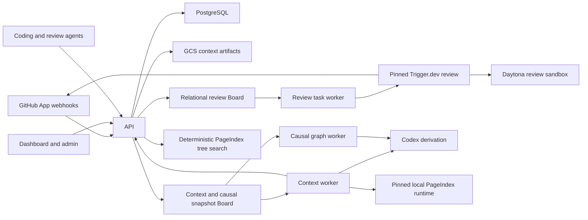

# Architecture

Jina combines a relational review Board, a tenant-scoped snapshot Board, and an
evidence-grounded repository Context service. GitHub events create durable workflows.
The review path delegates one idempotent external run to Trigger.dev; Context workers
capture an exact repository snapshot, derive cited documents, validate them on the host,
and publish immutable releases for API and MCP clients.

The public retrieval corpus contains only derived context. Raw repository files, commits,
pull requests, and issues are evidence used to validate citations; they are never search
results.

## Topology



Production separates API, context worker, task worker, dashboard, admin, migration, and
acceptance identities. Runtime database roles are `NOINHERIT`; each adapter transaction
activates one focused capability with `SET LOCAL ROLE`.

## Review execution

The deployed review pipeline is `pr_review.board.v2`. After webhook verification and
durable inbox admission, the API creates one relational `board_workflows` row, exactly
one `run-review` task, and a product `review_runs` row bound to that workflow. The task
is deliberately the operational envelope around the review, not a decomposition of the
review's internal model calls.

The task worker claims `run-review`, starts an idempotent `trigger.review.dispatch`
effect receipt, dispatches the pinned Trigger.dev root task `review`, and stores the
provider run ID. While Trigger is nonterminal, the Board task becomes
`waiting_external`; it has no worker lease to renew. A later claim polls the same
provider ID. The effect receipt prevents an ambiguous retry from creating a second
review run.

Trigger owns its summary and runtime children, the isolated Daytona investigation,
progress and findings publication, and product completion calls. The Board worker
reconciles the terminal provider state before completing the effect receipt, task, and
workflow. `review_runs.board_workflow_id`, `review_runs.trigger_run_id`, and the effect
receipt provide the cross-store audit chain.

The former six-stage review graph and its compatibility gates have been removed. The
review worker is deployed with `WORKER_TOPICS=run-review`; all environments admit the
same current relational workflow.

## Context Board and execution

The generic snapshot Board is the Context and causal-graph orchestrator. The active
page-oriented Context workflow has an aggregate root, a graph-materialization latch, one
input snapshot task, one planner task, one dispatchable task per affected page, and one
publication task. Every required dynamic child blocks the root automatically.

The planner durably checkpoints its research plan, bounded subject research, and
publication plan inside one Board lease. Each page task similarly checkpoints
writing, independent citation audit, and at most one repair/audit cycle. The
publication task resolves every page disposition, retains validated prior bytes
when a revision cannot be supported, builds PageIndex, and publishes the release.
This keeps failure and retry boundaries durable without exposing each internal
model phase as another queue topic.

Board rows contain only bounded orchestration metadata and immutable GCS references.
Evidence bundles, prompts, reports, drafts, transcripts, audit payloads, and
publication receipts remain content-addressed artifacts. This keeps scheduling transactions
small and makes every completed unit reusable after process or sandbox loss.

The mutable snapshot is hot orchestration state, not the historical system of record.
It retains all active Context graphs and 20 terminal execution graphs per tenant; older
execution children are pruned with their dependencies, outbox rows, and events. Their
small terminal roots remain as request-idempotency and monotonic-ref-sequence tombstones.
Published releases, documents, indexes, immutable artifacts, phase checkpoints, and
quota ledgers remain in their dedicated stores. Snapshot lock acquisition is bounded to
ten seconds, producing a retryable `board_busy` response instead of allowing contention
to outlive a worker lease.

Each dispatchable task is claimed through the durable outbox with an attempt-bound
renewable lease and write-fence token. A worker that loses its lease cannot commit late
results. Audit findings trigger the bounded repair phase inside that page task rather
than erasing sibling progress; only execution failures consume retry attempts.

A monotonically allocated ref sequence is bound to the build root and publication fence
for each tenant/repository/ref. Admission order, rather than completion time, determines
which release may become current. A delayed old build cannot publish over a newer event.

## Causal graph

The causal graph uses the same generic Board commands, durable outbox, leases, retries,
and aggregate reconciliation, but it is a separate workflow rather than a Context build
stage. Its topology is deliberately fixed at four tasks:

1. `build-causal-graph` — aggregate root;
2. `snapshot-causal-graph-history` — deterministic bounded commit-history capture;
3. `derive-causal-graph` — one read-only Codex run that derives issues and explicit
   issue/commit causalities; and
4. `publish-causal-graph` — immutable artifact publication behind a ref-sequence fence.

The three dispatch topics are accepted only from `jina-causal-graph-worker`. Context
topics are accepted only from `jina-context-worker`; a mixed or cross-service claim is
rejected before the Board transaction. The causal worker owns separate Cloud Run
capacity, Google identity, generation credential, release-control row, and deployment
lane. Deploying or scaling it cannot pause, invalidate, or consume instances from a
Context worker generation.

Commit messages and parent SHAs are the derivation boundary; repository file bodies are
not inputs. Every issue and causality must bind to an exact observed commit-message
excerpt. The graph is one bounded immutable artifact. PostgreSQL stores only one row per
release and derives current from the highest sequence, so graph cardinality does not
create high-volume relational writes or degrade query indexes during publication.

## Trigger and ref policy

Context builds are scheduled only for:

- a branch push with a new head commit;
- a pull request `opened` or `synchronize` event with a new head; and
- an issue `opened` event.

Issue comments, pull-request reviews, edits, labels, close events, and other provider
updates do not schedule builds.

Branch pushes build their branch ref. The repository default branch is the canonical
release. Pull requests publish isolated preview context under `pull/<number>/head`.
Newly opened issues build against the repository default branch.

## Evidence plane

Ingestion is intentionally thin. It records:

- an exact tenant, repository, ref, sequence, and full commit SHA;
- a content-addressed manifest of repository paths and Git blob SHAs;
- available file bodies used for exact line citations;
- Git commit metadata, parents, and changed paths;
- bounded GitHub repository, pull-request, and issue observations;
- provider and Git history frontiers;
- source completeness and ACL fingerprints.

Ingestion does not build a source-code search corpus, symbol graph, import graph, or
embeddings. Structural parsing remains outside the active pipeline. Evidence is immutable
and may be read only by derivation, validation, and audit paths.

## Agentic derivation

The worker checks out the exact checkpoint commit and prepares:

- `evidence.json`;
- `repository-manifest.json`;
- prior eligible context revisions; and
- valid pages checkpointed by an earlier attempt of the same build.

The local executor runs the current Codex CLI session with `gpt-5.6-terra`, low
reasoning, no network, no plugins, and read-only access to the repository. Daytona
provides the equivalent isolated production boundary. In production, every
dispatchable Board task gets a fresh sandbox/Codex invocation with bounded inputs and
declared output files. The local Board runner disables nested orchestration because
parallel fan-out, joins, retries, and checkpoints belong to the Board.

The planner task proposes and validates a durable research plan, executes bounded
subject research, and converts those artifacts into stable page IDs and
maintenance questions. The API then creates independent page tasks, allowing page
construction to fan out while keeping planner-internal phases checkpointed under
one lease. Each page task writes, audits, and, when required, repairs its proposed
document. Subjects cover relevant features, flows, components, interfaces, state,
security, operations, decisions, history, and patterns without prescribing a
fixed document taxonomy. Discovery deliberately moves between
source/tests/configuration and Git/provider history.

Codex writes a repository-specific Markdown document tree. A file path is the logical
document identity. Agents choose useful subjects and folders based on repository
terminology, code, Git metadata, pull requests, and issues. Prior published context and
same-build valid checkpoints are bounded inputs to successor work. Public artifacts
contain only context Markdown; research plans, prompts, evidence, audits, and worker
state remain private immutable artifacts.

Repository evidence uses ordinary Markdown links such as:

```markdown
[Expired entries are removed](src/cache.ts#L11-L14)
```

Labels remain natural reader-facing prose. The host validates the checkpoint path, blob
and content digest, and line range, then a read-only derivation-stage citation auditor
checks each supplied consequential claim against the exact excerpt. The lead and every
substantive section need a core evidence anchor. The normal evidence budget is one
decisive link in the lead and one per substantive section. Use two or at most three
only for distinct high-impact claims that genuinely need different sources. Connective prose,
section introductions, navigation, restatements, and descriptive table labels do not
require decorative links. Complementary links in one compound assertion are audited as
one claim group: their excerpts must collectively entail the assertion, and each link
must contribute concrete support.
Provider evidence uses natural GitHub URLs and must resolve to exactly one captured
record identity before the same semantic audit. Citation-audit inputs and results are
private digest-bound checkpoints; the public Markdown exposes none of that control
state. A page receives one audit and, when needed, one repair plus replacement audit.
Supported bindings from the first pass are reused when their exact assertion and evidence
remain unchanged. If the replacement audit still rejects core claims, a new page is
omitted and an unsupported revision falls back to the prior validated page.

Context-only evaluation does not convert unavailable external state into an
unanswerable publication requirement. If a provider or control-plane fact is outside
the captured evidence boundary, a page can pass by labeling it unverified, naming the
authority and concrete checks, and explaining the safe decision for each outcome.
Asserting that state without evidence or omitting the verification path remains
blocking.

The evaluator measures documentation sufficiency rather than repository completion.
When a maintenance task intentionally asks for a missing test, implementation, or
configuration, that absence is not itself a Context gap. The task passes when the
candidate identifies enough current behavior, change points, invariants, failure
consequences, and verification guidance to perform the work safely.

Every newly admitted build also carries two independent hard limits. Its absolute
deadline is derived from the durable root task's `createdAt` plus
`derivationBudgetSeconds`; claims, renewals, artifact-authority calls, and worker
stage timers all honor that same boundary. Its `derivationTokenBudget` counts
input plus output tokens from immutable completion receipts. Before a model lease
is issued, the API reserves capacity for every active model task; exact completed
usage replaces that reservation. Reaching either limit fails the root, retires all
pending or leased descendant work, preserves completed private checkpoints, and
never partially publishes a release.

GitHub provider responses are allowlisted before they become observations. Repository,
issue, pull-request, and comment evidence retains the fields needed for engineering
research while operational response fields, clone URLs, nested credentials, and
short-lived installation tokens are excluded before snapshot persistence or agent
materialization.

## Validation, checkpoints, and publication

Every page is an independent validation unit. Before a page can be checkpointed or
published, the host verifies:

- its logical identity and checkpoint scope;
- every repository path against the exact manifest;
- every source ID and content digest;
- line ranges and provider JSON pointers;
- that each linked core claim is supported by the selected evidence;
- a grounded lead and at least one core evidence binding in every substantive section; and
- that the page contains at least one valid evidence citation.

A page with any invalid evidence link or ungrounded substantive section is withheld. Valid pages are stored with content
digests, validation status, diagnostics, and a monotonic checkpoint sequence. Plan state
is checkpointed independently with its own digest and sequence, including before the
first page. Verified checkpoints are visible as build progress but are not queryable
context. A retry seeds both the latest plan and valid pages over the prior release and
resumes instead of starting over.

Task-level progress is finer than the published page boundary. Every expensive model
call writes a first-writer-wins GCS phase artifact whose key binds the task, exact input
artifact digests, public snapshot or citation set, prompt-contract version, and bounded
attempt/repair diagnostic. Recording is fenced by the current Board lease, while later
valid attempts may read the winning artifact. Consequently a per-task timeout repeats
only an unfinished call; it does not repeat completed research, generation, audit, or
repair calls. Public progress exposes only phase names and timestamps, never private
artifact locations or model transcripts.

Before publication, the host requires every planned page to have an explicit
disposition. Accepted pages must carry validated immutable artifacts. An
unsupported new page is omitted with a reason; an unsupported revision retains
the last validated page rather than silently deleting established Context. The
publication task assembles those exact bytes, builds the PageIndex tree, and
commits both behind the ref-sequence fence. Older completed releases remain
addressable for reproducibility and `diff_context`.

Artifact payloads are written under tenant/repository/build-scoped object keys. Production
uses GCS with create-only generation preconditions and stored SHA-256 metadata. Local
development uses the same key scheme in a filesystem directory.

## Derived-only projection

Indexing reads citation-valid revisions for one checkpoint and materializes:

- current logical context revisions;
- derived context documents;
- exact identifier/title entries;
- lexical fragments of derived Markdown; and
- a heading/document hierarchy.

Raw blobs and provider observations are not projected into any public retriever.
Structural relations are disabled.

The worker hierarchy adapter sends only authorized derived documents to its local Python bridge
over the open-source PageIndex Markdown implementation pinned to commit
`982514ab40fe42a169ea087c13819cf87c87724f`. PageIndex does not receive repository
credentials, raw evidence, tenant policy, or release authority. After building the
hierarchy, the worker uploads the immutable tree and calls the API's fenced internal
attachment operation; the API does not run PageIndex.

## Retrieval

`search_context` performs deterministic retrieval over the published PageIndex tree:

1. resolve one authorized immutable release;
2. score exact terms from the query against node titles, summaries, document titles, and
   contextual text;
3. select a bounded set of existing node IDs;
4. hydrate the selected derived documents and lexical excerpts; and
5. return excerpts plus original evidence citations.

No public retrieval route invokes a model or receives model credentials.
`list_context`, `read_context`, and `diff_context` are deterministic release operations as
well.

The calling coding or review agent performs final reasoning over the returned context
pack.

## Public surfaces

HTTP:

```text
POST /wiki/search
GET  /wiki/releases
GET  /wiki/list
GET  /wiki/read
GET  /wiki/diff
GET  /wiki/builds
GET  /wiki/builds/:id/progress
GET  /wiki/builds/:id/page
POST /mcp
```

Administrative build, rebuild, token, metrics, and worker routes remain separate
from retrieval.

An internal administrator can cancel one exact build with
`POST /internal/context/builds/:id/cancel`. Cancellation is idempotent, fences every
descendant lease through the generic Board aggregate reconciliation, and releases
the build's outstanding quota reservations.

MCP exposes exactly:

```text
search_context
list_context
read_context
diff_context
```

All four tools are read-only. None returns a synthesized answer.

## Authentication and tenancy

Static production context credentials are bound server-side to
`JINA_CONTEXT_TENANT_ID` and `JINA_CONTEXT_PRINCIPAL_ID`. Caller identity headers may
confirm but cannot change that binding.

Per-principal API tokens use the `jina_atk_…` format. Only a SHA-256 token hash is stored.
Each token row binds:

- tenant;
- principal;
- scopes (`context:read`, `context:query`, `context:build`, `context:admin`);
- creator;
- expiry; and
- optional revocation.

Token verification resolves the tenant from the token row, then every route rechecks
repository access. ACL filtering happens before candidate creation and again during
hydration. Tenant administrators may inspect tenant-wide context but cannot use an
ordinary reader token to mutate build or governance state.

## Persistence and migration policy

The Board validates Context artifacts before persistence. PostgreSQL stores one catalog
document per Context release, its PageIndex attachment, immutable causal releases,
direct repository access, checkpoints, quotas, and token hashes. Current releases are
derived by sequence; no mutable pointer or projector pipeline remains.

Migration `0037_collapse_context_schema.sql` removes the pre-Board Context schema and
unused roles. It is applied through the same ordered migration path in staging and main.
There is no reset CLI, cutover database, or mixed-schema compatibility mode.

## Code boundaries

```text
apps/api/                  HTTP, MCP, auth, workflow coordination
apps/worker/               Git checkout, ingestion, local/Daytona derivation
apps/dashboard/            only customer dashboard application
apps/admin/                tenant-wide release and citation health
apps/docs/                 customer documentation application
packages/context-engine/   validation, release catalogs, and Context contracts
packages/daytona/          isolated Codex executors
packages/db/               PostgreSQL stores, roles, and GCS artifacts
packages/github/           signed webhook parsing and trigger policy
services/pageindex-worker/ pinned self-hosted PageIndex Markdown bridge
packages/review-agent/    portable Daytona review runtime used by Board workers
```

`apps/api` owns the only HTTP listener. Product/review, Board, Context, causal graph,
MCP, webhook, and internal worker routes ship in the same backend image.
`apps/dashboard` owns the only customer dashboard; its `/api` proxy forwards to that
listener. Staging uses the equivalent `*.staging.usejina.com` domains and isolated
cloud resources, secrets, GitHub App, Clerk instance, and database credentials.
