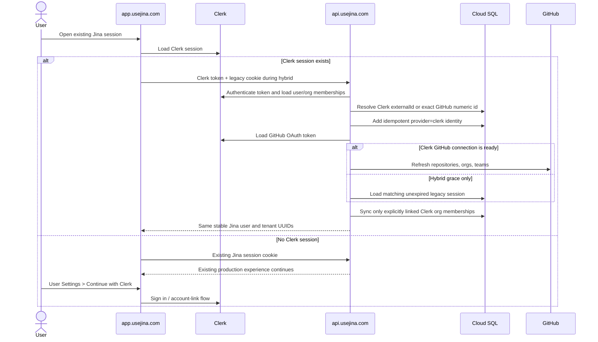

# Clerk identity cutover

Status: implementation in progress; no production auth or identity mutation has been authorized by this document alone.

Last evidence refresh: 2026-08-07 (America/Chicago).

This runbook moves `app.usejina.com` from Jina's GitHub OAuth session to the existing
production Clerk instance without changing the identity of any Jina user or workspace.
It is deliberately separate from the source/review migration in
[`STAGING_TO_PRODUCTION_CUTOVER.md`](./STAGING_TO_PRODUCTION_CUTOVER.md).

## Desired outcome

Clerk becomes the browser authentication and organization-directory provider. Jina's
stable UUIDs remain authoritative for every data-bearing relationship:

- `users.id` remains the user key for integrations and future user-scoped data;
- `tenants.id` remains the workspace key for reviews, Context, causal graphs,
  installations, repositories, models, Autumn customers, Stripe subscriptions, and
  usage;
- `user_identities` gains an additive `provider='clerk'` row next to the existing
  GitHub identity;
- `tenants.clerk_organization_id` points an existing Jina team at one existing Clerk
  organization;
- Clerk membership is kept in `clerk_tenant_memberships`; the existing
  `tenant_members` rows are not overwritten or deleted;
- GitHub stays connected as a Clerk external account because Jina still needs the
  user's GitHub numeric identity and an OAuth token for repository/team discovery;
- no review, Context release, causal graph, installation, repository, integration,
  billing, usage, or session history is copied to a new tenant.

The cutover is successful only when a user sees the same Jina tenant UUIDs and the
same data before and after signing in through Clerk.

## Non-negotiable invariants

1. Never create a Jina tenant merely because a Clerk organization exists.
2. Never merge users by display name, username, or an unverified email address.
3. Never replace an existing `users.id` or `tenants.id` during this migration.
4. Never overwrite `tenant_members.source`; it is rollback evidence for GitHub OAuth
   and installer-derived access.
5. Never enable Clerk-only authorization before all active Jina teams are explicitly
   mapped and all active members can authenticate.
6. Never mutate production identity state without a new physical Cloud SQL backup,
   a consistent logical dump, a Clerk directory export, and verified restore/readback.
7. Do not delete old users, Clerk organizations, memberships, sessions, backups,
   Cloud Run revisions, Vercel deployments, or provider data as part of the cutover.
8. A rollback changes environment flags and serving revisions. It must not require a
   reverse data migration.

## Observed live state

These facts are evidence for planning, not a substitute for the pre-change refresh.

### Current Jina production

- Public dashboard: `https://app.usejina.com`.
- Public API: `https://api.usejina.com`.
- Dashboard auth mode: GitHub (`NEXT_PUBLIC_JINA_DASHBOARD_AUTH_MODE=github`).
- API auth mode: GitHub (`DASHBOARD_AUTH_MODE=github`).
- Primary Cloud SQL: project `jina-463721`, instance `jina-db`, database `jina`.
- The retained `omxyz` team tenant is
  `eff0efc9-b103-494a-b7a3-1ae7f95c2d26`.
- That tenant currently has `clerk_organization_id = null`; it must be linked in
  place, not recreated.
- The same tenant carries the live GitHub installation, repository selection,
  reviews, Context, causal graph, model choice, and billing identity.
- The most recent system cutover backup in the larger runbook predates this identity
  change. A fresh identity-cutover backup is still mandatory.

### Existing live Clerk instance

The legacy Vercel project `omlabs/jina` contains a real production Clerk key pair
(`pk_live_` / `sk_live_`). Secret values must never be written to this document,
terminal transcripts, reconciliation output, or Git.

Read-only Backend API inventory observed on 2026-08-07:

| Resource                                         | Count |
| ------------------------------------------------ | ----: |
| Clerk users                                      |    52 |
| Clerk organizations                              |    40 |
| Organization memberships                         |    62 |
| Users already carrying a GitHub external account |     4 |
| Users carrying a Google external account         |    36 |

The existing Clerk organization intended for the current Jina `omxyz` workspace is:

- Clerk organization: `org_2ysvOwT5G5pAUzKwwpvfw02TQwX` (`Om Labs`);
- current membership: Keon only, `org:admin`;
- Jina tenant to retain: `eff0efc9-b103-494a-b7a3-1ae7f95c2d26` (`omxyz`);
- GitHub organization members observed: Keon (`10793962`) and Krish
  (`16009358`);
- Krish already has a Clerk user backed by Google, but no GitHub external account.

The 40 Clerk organizations must not be bulk-imported into Jina. Only organizations
listed in an operator-reviewed reconciliation manifest may receive a Jina tenant link.

The old `omlabs/jina` Vercel deployment's Neon database contains legacy flow/run data,
not the current Jina user/workspace directory. It is not an identity source and must
not be joined to the live Cloud SQL database.

### Current access constraint

The local `gcloud` credential was expired at the last attempt. Fresh Cloud SQL
inventory, backup, restore verification, migration, and Cloud Run deployment are
blocked until `keon@omlabs.xyz` completes `gcloud auth login`. This does not block
code review, local tests, manifest design, or Clerk/Vercel read-only inventory. It does
block every production database mutation.

## Identity matching rules

User matching is fail-closed, in this order:

1. Existing `user_identities(provider='clerk', provider_user_id=<Clerk user id>)`.
2. Clerk `externalId` equal to an existing stable Jina `users.id` UUID.
3. Clerk `oauth_github.externalId` equal to an existing
   `user_identities(provider='github').provider_user_id` numeric GitHub id.
4. An explicit manifest mapping reviewed by an operator. A Clerk user with no GitHub
   external account must set `allowMissingClerkGithubAccount: true`; this is an
   acknowledgement, not an automatic email match.
5. Just-in-time linking after the user completes GitHub OAuth inside Clerk.

Any disagreement between those signals is a blocker. The runtime returns 403 and the
reconciliation command exits without database writes.

Email is useful only for a human reconciliation report and Clerk's own verified OAuth
account-linking behavior. Jina does not use it as the database join key. In particular,
Krish's Google-backed Clerk record may be explicitly mapped and added to the existing
Clerk organization, but GitHub must still be connected before Clerk-only mode.

Organization matching is always an explicit one-to-one manifest entry:

```text
Jina tenants.id UUID <-> Clerk organization id
```

Both directions are unique. Clerk organization name, Jina tenant name, GitHub
organization login, and custom domain are assertions for operator review, not keys.

## Runtime design

### Data model

Migration `0032_clerk_identity_bridge.sql` adds only
`clerk_tenant_memberships`:

```text
tenant_id             existing Jina tenant UUID
user_id               existing Jina user UUID
clerk_user_id         Clerk principal
github_user_id        immutable GitHub numeric id
github_login          display/audit value
role                  admin | member
synced_at             last Clerk reconciliation
```

The prior additive structures remain:

- `user_identities` from migration `0025` stores both GitHub and Clerk identities;
- `tenants.clerk_organization_id` from migration `0029` stores the org link.

No foreign key points from reviews, Context, installations, billing, or integrations
to a Clerk id.

### Authorization modes

| API mode   | Browser login                               | Team membership authority         | Intended use                                |
| ---------- | ------------------------------------------- | --------------------------------- | ------------------------------------------- |
| `github`   | existing Jina GitHub OAuth                  | `tenant_members`                  | current production and immediate rollback   |
| `hybrid`   | Clerk first; existing Jina session accepted | union of legacy and Clerk ledgers | migration grace period                      |
| `clerk`    | Clerk only                                  | `clerk_tenant_memberships` only   | final state                                 |
| `disabled` | none                                        | service/private behavior          | local or coordinated internal surfaces only |

Personal workspaces remain authorized by `tenants.personal_owner_user_id` in every
mode.

In `hybrid` mode:

- a signed-in Clerk user with GitHub connected resolves by numeric GitHub id and gains
  an additive Clerk identity row;
- a prelinked Google-only Clerk user may temporarily reuse a matching unexpired Jina
  GitHub session. Both stable Jina user id and numeric GitHub id must match;
- a browser with no Clerk session keeps its existing Jina session until it expires;
- the dashboard exposes User Settings so the user can sign in to Clerk and connect or
  reauthorize GitHub with `read:user`, `read:org`, and `repo` scopes;
- unknown Clerk organizations are logged and ignored; they never create tenants;
- legacy memberships remain intact for rollback.

Moving from `hybrid` to `clerk` invalidates the hybrid Clerk session cache by changing
its membership-authority marker. The next request must succeed using Clerk's GitHub
connection and Clerk membership ledger; it cannot continue on the old cookie.

### Request sequence



## Reconciliation manifest

Production links are applied only through
`pnpm --filter @jina/api identity:clerk-reconcile`. The command is dry-run by default
only when `--dry-run` is explicitly supplied; `--apply` is a separate mutually
exclusive flag. It never prints Clerk keys or OAuth tokens.

Example shape:

```json
{
  "version": 1,
  "users": [
    {
      "clerkUserId": "user_example",
      "githubUserId": 10793962,
      "githubLogin": "keon"
    },
    {
      "clerkUserId": "user_google_only_example",
      "githubUserId": 16009358,
      "githubLogin": "thecskc",
      "allowMissingClerkGithubAccount": true
    }
  ],
  "organizations": [
    {
      "clerkOrganizationId": "org_2ysvOwT5G5pAUzKwwpvfw02TQwX",
      "jinaTenantId": "eff0efc9-b103-494a-b7a3-1ae7f95c2d26",
      "expectedJinaName": "omxyz",
      "expectedClerkName": "Om Labs"
    }
  ],
  "memberships": [
    {
      "clerkOrganizationId": "org_2ysvOwT5G5pAUzKwwpvfw02TQwX",
      "clerkUserId": "user_example",
      "role": "org:admin"
    }
  ]
}
```

The real manifest must live in the protected release evidence directory, not in Git.
It contains durable provider identifiers and an explicit approval of every mapping.

Dry-run:

```bash
pnpm --filter @jina/api build
pnpm --filter @jina/api identity:clerk-reconcile -- \
  --dry-run \
  --manifest=/absolute/protected/path/clerk-mapping.json
```

The dry-run checks:

- the GitHub numeric id already resolves to exactly one stable Jina user;
- optional expected GitHub login matches;
- neither side already points at a different identity;
- the Clerk GitHub id matches, or the manifest explicitly acknowledges its absence;
- Clerk `externalId` is absent or equals the stable Jina UUID;
- the Jina tenant exists, is active, and is a team;
- optional expected names match on both sides;
- neither organization side is linked elsewhere;
- Clerk private metadata is absent or points at the same Jina tenant;
- every requested membership references a mapped user and org;
- requested roles are exactly `org:admin` or `org:member`.

Apply uses idempotent provider writes first, then one database transaction. If the
database transaction fails after a provider write, the runtime still ignores unlinked
resources and the same manifest can be rerun. A disagreement that appears between
preflight and commit aborts the database transaction.

## Execution plan and gates

### Phase 0: prepare and refresh evidence

1. Reauthenticate `gcloud` as the authorized production operator.
2. Record current Git SHA, Cloud Run revisions/images/traffic, Vercel deployments,
   Trigger.dev project/environment/version, Daytona organization/configuration,
   Clerk instance id/key class, GitHub App id/webhook URL, Autumn environment, Stripe
   account/mode, Cloud SQL flags, and all secret _version numbers_.
3. Pull production and staging environment variable **names and hashes/classes**, not
   plaintext, and compare them to the accepted release manifest.
4. Refresh Cloud SQL counts for users, identities by provider, tenants by kind,
   memberships by source, installations, repositories, reviews, Context releases,
   causal graph records, Autumn mappings, and Stripe customer ids.
5. Export Clerk users, external-account metadata, orgs, memberships, invitations, and
   metadata to the protected release evidence directory. Do not export OAuth tokens or
   secret keys.
6. Produce the real reconciliation manifest and require a second human review for every
   `allowMissingClerkGithubAccount` entry.

Exit gate: no unknown environment drift, no conflicting mapping, no credential in the
report, and every active Jina team is classified as map-now, deliberately defer, or
inactive/rollback-only.

### Phase 1: fresh backups before any production mutation

1. Create a new on-demand backup of `jina-463721/jina-db` with the release id.
2. Wait for `SUCCESSFUL`; record backup id and timestamps.
3. Take a consistent logical PostgreSQL dump with schema, migration ledger, and data.
4. Restore the physical backup to a retained isolated recovery instance.
5. Restore the logical dump to a different retained recovery instance/database.
6. Run identity and tenant counts plus sampled review/Context/billing joins on both
   restores.
7. Hash and read back the Clerk directory export and environment/provider manifests.
8. Preserve prior backups and restore instances. Do not delete or reuse them.

Exit gate: both restore paths reproduce the recorded identity, tenant, membership,
installation, review, Context, and billing invariants. Backup age must be within the
larger production runbook's bound at first schema/provider mutation.

### Phase 2: deploy dark, still using GitHub auth

1. Apply migration `0032` additively.
2. Deploy API and dashboard candidates containing the bridge, but keep both auth modes
   `github`.
3. Verify old revisions can still read/write against the migrated schema.
4. Verify reviews, Context, causal graphs, Trigger.dev, Daytona, Autumn, Stripe, and
   dashboard data are unchanged.
5. Run the reconciliation command with `--dry-run` against production.

Exit gate: schema exists, legacy experience passes, dry-run is converged, and no Clerk
identity/org/member row has been written by the new runtime.

### Phase 3: apply explicit links while traffic stays on GitHub auth

1. Apply the approved manifest once.
2. Rerun it in dry-run mode; every action must report already linked/already set/none.
3. Verify `user_identities` has one GitHub and one Clerk row for each mapped user.
4. Verify the existing `omxyz` tenant now points at the intended Clerk org and retains
   exactly the same installation, repositories, reviews, Context, graph, integration,
   model, Autumn, and Stripe joins.
5. Verify legacy `tenant_members` rows and sources are byte-for-byte unchanged.
6. Verify no unexpected Jina tenant was created.

Exit gate: all mappings are idempotent, no duplicate tenant/user exists, and current
GitHub-auth production is still healthy.

### Phase 4: staging rehearsal

Use the staging Clerk instance and isolated staging database. Do not use a Clerk
development instance as if it could be promoted to production; production uses the
existing live instance and a separately reviewed manifest.

The staging Cloud Build contract keeps `clerk` as its inert default. For the grace-period
rehearsal, submit the exact candidate SHA with
`_JINA_DASHBOARD_AUTH_MODE=hybrid` and the non-secret
`_JINA_GITHUB_OAUTH_CLIENT_ID`. `scripts/deploy-staging.sh` then requires and binds the
existing `jina-staging-github-oauth-client-secret`; it refuses hybrid mode when the client
ID is absent. Do not substitute the production OAuth client or secret. Build the Vercel
staging dashboard from the same SHA with
`NEXT_PUBLIC_JINA_DASHBOARD_AUTH_MODE=hybrid`.

Test at least:

1. legacy browser session, no Clerk session;
2. exact GitHub-linked Clerk user;
3. prelinked Google-only Clerk user plus matching legacy session;
4. same user after connecting GitHub in User Settings;
5. mapped Clerk org and member/admin role changes;
6. unknown Clerk org is ignored and creates no tenant;
7. conflicting Clerk external id fails closed;
8. user removed from Clerk org disappears in Clerk-only mode;
9. rollback from hybrid to GitHub restores legacy membership behavior;
10. one sample repository PR creates the relational `run-review`, Trigger.dev run,
    review result, Context build, causal graph, and dashboard entry under the same
    tenant UUID.

Exit gate: automated tests pass, full browser acceptance passes, and the staging
reconciliation rerun is idempotent.

### Phase 5: production hybrid canary

1. Set API `DASHBOARD_AUTH_MODE=hybrid` on a no-traffic candidate.
2. Set dashboard `NEXT_PUBLIC_JINA_DASHBOARD_AUTH_MODE=hybrid` with the live Clerk
   publishable key and server secret where required.
3. Confirm the GitHub OAuth values remain present for immediate revision/config
   rollback; hybrid config validates that both provider pairs exist.
4. Canary Keon. Verify exact stable user id and tenant id before/after.
5. Canary Krish. Confirm the explicit mapping, legacy-session grace behavior, GitHub
   connection flow, and `omxyz` role.
6. Test a new browser with Clerk only and an old browser with only its Jina cookie.
7. Run the full sample-PR acceptance and verify the new dashboard.
8. Monitor auth 401/403/5xx, conflict logs, ignored-org logs, membership counts,
   provider rate limits, and normal review/Context/billing telemetry.
9. Expand only after the canary observation window passes.

Exit gate: all active users are mapped or have completed JIT linking; every active team
is linked; every active user has GitHub connected in Clerk; no request depends on the
legacy-session fallback for the agreed observation window.

### Phase 6: Clerk-only production

1. Take a second pre-flag backup/evidence snapshot if the hybrid period materially
   changed identity or membership state.
2. Set API `DASHBOARD_AUTH_MODE=clerk` and dashboard
   `NEXT_PUBLIC_JINA_DASHBOARD_AUTH_MODE=clerk` on candidates.
3. Verify the candidate invalidates hybrid caches and authorizes teams solely through
   `clerk_tenant_memberships`.
4. Promote dashboard and API with independent rollback revisions retained.
5. Repeat user/org/data continuity and sample-PR acceptance.
6. Keep GitHub auth secrets and legacy session data for the rollback retention window;
   do not disconnect or delete them.

Exit gate: Clerk-only sessions pass, removed Clerk memberships fail closed, production
review/Context/graph/dashboard flow passes, and rollback remains tested.

## Rollback

Rollback is safe because the migration is additive.

### During manifest application

- Stop further apply commands.
- Keep provider and database links that already succeeded; they are inert while runtime
  mode remains `github`.
- Fix the manifest or provider state and rerun idempotently.
- Do not delete a user/org/membership to make the report green.

### From hybrid

1. Route the retained GitHub-auth dashboard deployment.
2. Route the retained GitHub-auth API revision or set `DASHBOARD_AUTH_MODE=github` on a
   verified candidate.
3. Verify an existing Jina session and a fresh GitHub OAuth login.
4. Verify legacy `tenant_members` authorization and the sample-PR workflow.
5. Leave Clerk identity/org/membership rows in place for diagnosis and a later retry.

### From Clerk-only

Perform the same serving/config rollback. Because `tenant_members` was never
overwritten, the old revision immediately sees its original authorization ledger.
Restore Cloud SQL only for proven database corruption, never merely for an auth flag or
provider outage. A restore is a separate incident procedure and must preserve the
current database for forensics.

## Automated verification

Required before staging deployment:

```bash
pnpm --filter @jina/api typecheck
pnpm --filter @jina/api lint
pnpm --filter @jina/api test
pnpm --filter @jina/dashboard typecheck
pnpm --filter @jina/dashboard lint
pnpm --filter @jina/dashboard test
```

The PostgreSQL test for the bridge proves:

- exact Clerk identity links are idempotent;
- both one-Clerk-to-many-Jina and one-Jina-to-many-Clerk conflicts fail;
- an unknown Clerk org does not create a tenant;
- Clerk membership does not overwrite installer provenance;
- removing a Clerk membership deletes only the additive Clerk ledger row.

Production acceptance must additionally compare exact UUIDs and counts before/after;
HTTP 200 alone is insufficient.

## Provider impact

| System               | Identity-cutover change                                                                |
| -------------------- | -------------------------------------------------------------------------------------- |
| Clerk                | Browser session, user external id, explicit org metadata/membership, GitHub connection |
| Cloud SQL            | Additive table, identity rows, explicit tenant org id                                  |
| Vercel               | Dashboard auth mode and live Clerk keys; retained GitHub deployment                    |
| Cloud Run            | API auth mode and live Clerk keys; retained GitHub revision                            |
| GitHub               | OAuth is moved under Clerk; GitHub App installation/webhook remain unchanged           |
| Trigger.dev          | No identity change; acceptance verifies the same `run-review` path                     |
| Daytona              | No identity change; acceptance verifies sandbox execution                              |
| Autumn               | No customer remap; customer continues to use existing Jina tenant UUID                 |
| Stripe               | No customer/subscription remap; Autumn/tenant relationship is verified only            |
| Context/causal graph | No namespace change; both continue using the same tenant/repository identity           |

## Final completion checklist

- [ ] Fresh `gcloud` login completed.
- [ ] Live environment/provider evidence refreshed without secret plaintext.
- [ ] Fresh physical backup successful and restore-verified.
- [ ] Fresh logical dump successful and restore-verified separately.
- [ ] Clerk directory export hashed and read back.
- [ ] Mapping manifest independently reviewed.
- [ ] `0032` applied with GitHub-auth compatibility verified.
- [ ] Production dry-run converged before apply.
- [ ] Apply rerun is idempotent.
- [ ] No new/duplicate tenant created.
- [ ] Legacy membership provenance unchanged.
- [ ] Full staging matrix passed.
- [ ] Keon and Krish production canaries passed.
- [ ] Every active user has a Clerk GitHub connection with required scopes.
- [ ] Hybrid fallback usage reached zero for the observation window.
- [ ] Clerk-only authorization passed.
- [ ] Full sample-PR review, Context, causal graph, and dashboard acceptance passed.
- [ ] GitHub-auth rollback was exercised after the additive schema/link changes.
- [ ] Old revisions, deployments, secrets, backups, and data retained for rollback.

Only after every checkbox is evidence-backed is the Clerk identity cutover complete.
