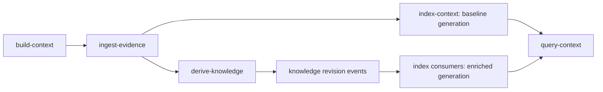

# Repository Context Engine — Implementation Plan

## Status

- **State:** source implementation complete; production acceptance remains a per-release gate
- **Date:** 2026-07-26
- **Architecture decision:** [CONTEXT_ENGINE_DECISION.md](CONTEXT_ENGINE_DECISION.md)
- **Current runtime:** [ARCHITECTURE.md](ARCHITECTURE.md)
- **Evaluation:** [CONTEXT_ENGINE_EVALUATION.md](CONTEXT_ENGINE_EVALUATION.md)
- **Compatibility policy:** clean replacement; no API aliases, dual writes, legacy task
  names, legacy queue topics, or graph-data migration

The implementation phases in this document are complete in source. The old package,
schema adapters, public/internal routes, topics, MCP server/tool, executor output shape,
and dashboard graph canvas have been removed. The current system implements immutable
evidence, immutable cited knowledge-document revisions, generation-scoped projections,
routed query, HTTP/MCP surfaces, erasure, metrics, deployment migration, and production
acceptance.

Optional capability decisions remain deliberately closed:

- dense retrieval is disabled until an approved embedding backend passes an incremental
  ablation and the ACL/latency/cost gates;
- the deterministic hierarchy is active, while PageIndex remains an optional adapter
  until it beats the fallback on an expanded long-document evaluation.

`pnpm evaluate:context` currently reports exact completeness `1.0`, citation integrity
`1.0`, evidence recall@20 `1.0`, zero ACL leaks, zero labeled-conflict failures, and zero
required-source-kind failures on the checked-in v1 fixture. Its PostgreSQL mode also
requires access revocation to take effect immediately. The hard exactness, citation, ACL,
conflict, and source-kind gates pass, and recall exceeds the initial `0.90` target.
Production completion additionally requires the snapshot, exact-commit reingestion, ACL
audit, drained required outboxes, and real HTTP/MCP acceptance described below.

The final implementation hardening also completed:

- exact citation excerpt resolution with mutually exclusive line-range/JSON-pointer
  selectors and normalized verbatim claim support;
- repository ACL fingerprints and SQL prefiltering before candidate creation;
- consumer-specific outbox leases and scope-bound acknowledgements, plus real drain and
  rebuild replay;
- truthful complete/partial checkpoints with a non-shallow blob-filtered clone, bounded
  persisted Git history, paginated GitHub observations, and omission frontiers;
- separate migration-owner/runtime credentials, `NOINHERIT` runtime membership, and
  explicit `SET LOCAL ROLE` capability activation;
- monotonic build-time `refSequence` allocation so delayed lower-sequence work cannot
  become current;
- immutable projection-input frontiers sampled before/after materialization and locked,
  revalidated publication that races safely with erasure and knowledge state changes;
- a dedicated `jina-migration` Google service account with owner-secret access isolated
  from every `jina-runtime` service;
- one coordinated Cloud Run release for API, workers, dashboard, and admin;
- tenant-admin-only knowledge review.

## Outcome

Replace the graph-first ContextGraph runtime with a hybrid repository context engine:

```text
ingest-evidence
  -> immutable provider and repository evidence
  -> deterministic code structure

derive-knowledge
  -> immutable, versioned, cited knowledge-document revisions

index-context
  -> exact and lexical indexes
  -> current knowledge catalog
  -> optional dense index
  -> PageIndex-style hierarchy
  -> deterministic structural relations

query-context
  -> route by information need
  -> retrieve, fuse, rerank, and resolve conflicts
  -> read original evidence
  -> return a cited answer and coverage information
```

The implementation is complete when general answers no longer depend on model-generated
nodes and edges, every derived statement resolves to immutable evidence, exact and
structural queries remain complete, and the old graph package, schema, routes, topics,
tools, UI, and tests have been deleted.

## Clean-cutover policy

This plan intentionally does not preserve the current public or internal contract.

| Current name or artifact                     | Replacement                                |
| -------------------------------------------- | ------------------------------------------ |
| `@jina/context-graph`                        | `@jina/context-engine`                     |
| `jina_context_graph` PostgreSQL schema       | `jina_context`                             |
| `context_graph_build`                        | `build-context`                            |
| `context_graph_ingest` / legacy aliases      | `ingest-evidence`                          |
| `context_graph_assert` / legacy aliases      | `derive-knowledge`                         |
| `context_graph_project` / legacy aliases     | `index-context`                            |
| `run-context-graph-ingest`                   | `run-ingest-evidence`                      |
| `run-context-graph-assert`                   | `run-derive-knowledge`                     |
| `run-context-graph-project`                  | `run-index-context`                        |
| `/context-graph/*`                           | `/context/*`                               |
| `/internal/context-graph/*`                  | `/internal/context/*`                      |
| MCP server `jina-graph`                      | MCP server `jina-context`                  |
| MCP tool `query_graph`                       | MCP tool `query_context`                   |
| graph generations, nodes, and semantic edges | context index generations and documents    |
| assertion proposals and assertion relations  | knowledge-document revisions and citations |
| graph explorer and assertion review          | context explorer and knowledge review      |
| `CONTEXT_GRAPH_*` configuration              | `CONTEXT_*` configuration                  |
| graph-specific database roles                | least-privilege context-engine roles       |
| `basis: graph-derived`                       | retrieval trace plus evidence coverage     |

There will be no compatibility router, topic translation, package re-export, schema view,
or data copier. Development may build the new package beside the old one on a feature
branch, but no deployed release will read or write both representations.

The production release archives the old schema after its recovery window, removes old
context-specific board work, creates the new schema, and fully reingests repositories.
Prior generated semantic rows and search projections are disposable and are not migrated.

## Architectural invariants

The following are non-negotiable implementation constraints:

1. **Evidence is canonical.** Model output cannot alter provider facts, Git objects,
   parser output, identities, permissions, or human audit events.
2. **Derived content is immutable.** A correction creates a new knowledge revision or an
   append-only review event; it never edits the prior body or evidence set.
3. **Citations terminate at original evidence.** A knowledge-document citation in an
   answer must be expandable to the source observations, commit, blob, path, and exact
   line-range/JSON-pointer excerpt that supports it. The normalized citation claim must
   occur verbatim in that selected excerpt.
4. **Indexes are disposable.** Every search document, embedding, hierarchy node, current
   selection, and relation projection can be rebuilt from canonical evidence and immutable
   knowledge revisions.
5. **Model failure does not hide deterministic context.** Exact code, provider state, and
   structural retrieval remain available if knowledge derivation, dense indexing,
   PageIndex, reranking, or synthesis is unavailable.
6. **Permissions are applied before retrieval.** Unauthorized candidates must not enter
   ranking, prompt construction, traces visible to the caller, or caches shared across
   principals.
7. **The requested ref is part of identity.** A result for one commit or ref cannot be
   silently reused for another.
8. **Conflicts remain visible.** Source authority and recency affect ranking, but material
   disagreement is returned rather than silently reconciled.
9. **Exact answers stay exact.** Identifier, list, count, status, and relationship
   queries are not converted into probabilistic semantic search.
10. **Every background write is fenced and idempotent.** A lost worker lease cannot commit
    data, and retries over the same immutable inputs produce the same identity.

## Workflow semantics

The three task names are durable product stages, but the runtime is a resilient DAG rather
than a fragile serial pipeline:



- `ingest-evidence` is required.
- `index-context` is required and can publish a deterministic, raw-evidence generation
  after ingestion without waiting for a model.
- `derive-knowledge` is a soft dependency of the aggregate build. Its completion emits
  events that incrementally publish an enriched generation.
- A failed derivation is visible on the build, but it does not invalidate the baseline
  index or block exact and structural queries.
- A query response reports the selected generation and whether derived knowledge, dense
  retrieval, and hierarchy retrieval were available.
- Every accepted build receives a monotonic tenant/repository/ref `refSequence`. That
  admission-time sequence, not worker finish time, chooses the current checkpoint; a
  lower-sequence push that completes late is retained but cannot publish.

The aggregate task is successful when required ingestion and baseline indexing complete.
It is `degraded` when optional knowledge derivation or an optional projector fails, and
`failed` when canonical ingestion, ACL projection, manifest projection, or required exact
indexing fails.

## Target domain model

### Evidence plane

Retain the useful semantics of the current canonical code plane, under the new package and
schema:

- immutable provider observations;
- Git commits, parents, refs, exact trees, and first-parent changes;
- content-addressed blobs;
- versioned parser analyses;
- symbols, imports, definitions, references, calls, and inheritance produced
  deterministically;
- explicit PR, issue, commit, changed-file, ownership, deployment, and membership facts;
- provider identities and redirects;
- repository ACL observations;
- erasure, tombstone, review, and audit events.

Define an `EvidenceAnchor` shared value object:

```ts
interface EvidenceAnchor {
  tenantId: string;
  repository: string;
  sourceType: "observation" | "blob" | "commit" | "pull_request" | "issue" | "document";
  sourceId: string;
  contentDigest: string;
  commitSha?: string;
  pathOrUrl?: string;
  startLine?: number;
  endLine?: number;
  jsonPointer?: string;
  observedAt?: string;
}
```

Anchor validation is source-specific. Code ranges are checked against the exact blob at the
pinned commit; provider fields are checked against the immutable raw observation using the
JSON pointer; URLs alone are never sufficient evidence.

### Knowledge plane

Use a stable logical identity plus immutable revisions:

```ts
type KnowledgeDocumentKind =
  | "architecture"
  | "component"
  | "feature"
  | "decision"
  | "change_summary"
  | "incident"
  | "issue_explanation"
  | "ownership"
  | "runbook"
  | "glossary";

interface KnowledgeDocumentRevision {
  id: string;
  logicalId: string;
  tenantId: string;
  repository: string;
  kind: KnowledgeDocumentKind;
  title: string;
  bodyMarkdown: string;
  summary: string;
  structuredSummary: Record<string, unknown>;
  scope: {
    ref: string;
    commitSha: string;
    paths: string[];
    symbols: string[];
    pullRequests: string[];
    issues: string[];
  };
  evidenceFingerprint: string;
  generatorName: string;
  generatorVersion: string;
  model: string;
  promptVersion: string;
  confidence: number;
  createdAt: string;
}
```

The evidence set is normalized into separate immutable citation rows. Review, supersession,
invalidation, redaction, and retention are append-only events so a revision's body,
metadata, and citations never change.

Logical IDs must describe a stable subject and kind, not the generated title. Examples:

```text
repository:<repo>:architecture
component:<repo>:<component-id>
feature:<repo>:<feature-id>
decision:<repo>:<decision-source-id>
change:<repo>:<commit-sha>
incident:<provider>:<incident-id>
issue:<provider>:<repository>#<number>
```

Model-generated subjects that cannot be resolved to a stable scope remain revision-local
metadata. They do not create canonical entities.

### Projection plane

Define these rebuildable records:

- `RefManifestEntry`: the exact path-to-blob selection for a ref and commit;
- `CurrentKnowledgeRevision`: the selected valid/review-eligible revision per logical ID;
- `ContextDocument`: a normalized searchable document for code, provider evidence, or
  derived knowledge;
- `ContextFragment`: an anchor-preserving retrieval unit;
- `EmbeddingRecord`: optional vector plus embedding model and input fingerprint;
- `HierarchyNode`: a PageIndex or fallback heading-tree node with a parent, summary, source
  span, and projector version;
- `StructuralRelation`: a typed deterministic relation with derivation version and source
  anchors;
- `IndexGeneration`: an atomic published view of required projector checkpoints;
- `ProjectionCheckpoint`: consumer-owned progress over the canonical outbox.

`ContextDocument` is a retrieval envelope, not a source of truth. It carries:

```text
id
tenant_id
repository
ref_name
commit_sha
source_kind
source_id
source_revision_id
title
body
metadata
authority_class
effective_acl_fingerprint
source_fingerprint
projector_name
projector_version
projected_at
```

Fragments retain exact character and source ranges. Contextual text added for retrieval is
stored separately from source text so it cannot be cited as if it came from the source.

### Query plane

Use a storage-neutral public contract:

```ts
interface QueryContextRequest {
  tenantId: string;
  principalId: string;
  repository: string;
  ref?: string;
  question: string;
  taskKind?: "lookup" | "structure" | "change" | "intent" | "overview" | "status";
  targets?: {
    paths?: string[];
    symbols?: string[];
    pullRequests?: string[];
    issues?: string[];
  };
  timeWindow?: { from?: string; to?: string };
}

interface QueryContextResponse {
  answer: string;
  generation: {
    id: string;
    ref: string;
    commitSha: string;
    derivedKnowledge: "available" | "partial" | "unavailable";
  };
  citations: QueryCitation[];
  conflicts: SourceConflict[];
  ambiguities: string[];
  coverage: {
    status: "complete" | "partial" | "insufficient";
    missing: string[];
    retrieversUsed: string[];
  };
  traceId: string;
}
```

The response never claims that graph traversal is the universal basis. Specialized
structural results may include deterministic relation paths, each with source anchors.

## PostgreSQL design

Create a new `jina_context` schema from scratch. Do not alter or copy the
`jina_context_graph` schema.

### Canonical and append-only tables

| Table                          | Purpose                                                       |
| ------------------------------ | ------------------------------------------------------------- |
| `observations`                 | immutable raw provider payloads and content digests           |
| `repositories`                 | tenant-scoped repository identity and provider metadata       |
| `refs`                         | observed ref movements; history is append-only                |
| `commits` / `commit_parents`   | immutable Git commit DAG                                      |
| `trees` / `tree_entries`       | exact commit tree snapshots                                   |
| `blobs`                        | content-addressed source metadata and optional stored content |
| `commit_changes`               | first-parent path changes                                     |
| `blob_analyses`                | parser-versioned analysis headers                             |
| `symbols` / `imports`          | deterministic parser output                                   |
| `structural_facts`             | deterministic, source-anchored code/provider relations        |
| `entities` / `identities`      | explicit provider and deterministic identities only           |
| `knowledge_documents`          | stable logical document identities                            |
| `knowledge_document_revisions` | immutable generated or human-authored revision bodies         |
| `knowledge_revision_evidence`  | immutable, ordered evidence anchors and claim roles           |
| `knowledge_revision_events`    | review, supersession, invalidation, redaction, retention      |
| `derivation_runs`              | request fingerprint, raw model output, validation result      |
| `audit_events`                 | append-only administrative and human actions                  |
| `erasure_filters`              | durable filters preventing erased evidence from reappearing   |
| `repository_acl_observations`  | source ACL state and provenance                               |
| `projection_input_events`      | immutable repository-wide projection-input sequence/frontier  |
| `outbox`                       | one delivery row per event and projection consumer            |

Required constraints:

- tenant and repository scope on every repository-owned key;
- full Git SHA checks where a commit is required;
- unique content digest for immutable blobs and observations within source scope;
- unique derivation cache key over commit, focus fingerprint, generator, model, prompt,
  schema, and evidence fingerprint;
- unique revision content identity over logical ID, evidence fingerprint, generator
  version, and body digest;
- line ranges require a path, positive values, and `end_line >= start_line`;
- a revision cannot cite another revision as its terminal evidence;
- all referenced evidence must share the revision tenant and allowed repository scope;
- no `UPDATE` or `DELETE` grant on immutable evidence, revision, or citation tables for
  runtime roles;
- append-only event sequence uniqueness per aggregate;
- unique positive `ref_sequence` per tenant/repository/ref for builds and checkpoints;
- unique immutable projection-input sequence/event ID per tenant/repository.

### Projection tables

| Table                         | Purpose                                                       |
| ----------------------------- | ------------------------------------------------------------- |
| `ref_manifest`                | current selected tree for a ref                               |
| `current_knowledge_revisions` | disposable selection per logical ID and generation            |
| `context_documents`           | unified exact and lexical corpus                              |
| `context_fragments`           | anchor-preserving retrieval units                             |
| `context_embeddings`          | optional `pgvector` records and embedding fingerprints        |
| `hierarchy_nodes`             | PageIndex/fallback tree nodes                                 |
| `structural_relations`        | query-optimized deterministic adjacency                       |
| `identity_projection`         | folded provider identity redirects                            |
| `index_generations`           | required/optional projector versions and publication state    |
| `projection_checkpoints`      | per-consumer outbox checkpoint and lease state                |
| `query_runs`                  | bounded operational trace header                              |
| `retrieval_candidates`        | sampled/rate-limited candidate contribution telemetry         |
| `answer_citations`            | returned citation integrity and support checks                |
| `retrieval_metrics`           | latency, recall proxy, cost, coverage, and failure dimensions |

Use PostgreSQL generated `tsvector` columns and GIN indexes for the lexical baseline.
Preserve source tokens in a `simple` configuration for identifiers and paths; maintain a
separate natural-language vector for prose. Do not stem code identifiers with only the
English configuration.

Dense retrieval is an optional projector:

- use `pgvector` only when the extension and approved embedding model are configured;
- store the embedding model, dimensions, normalized input digest, and projector version;
- rebuild rather than transform embeddings when the model or contextualization changes;
- keep the query interface independent of PostgreSQL so an external vector store can be
  evaluated without changing domain contracts.

### Indexes and partitioning

At minimum, add:

- composite B-tree indexes beginning with `tenant_id, repository` for every scoped lookup;
- `tenant_id, repository, ref_name, path` uniqueness for manifests;
- `tenant_id, repository, logical_id, generation_id` uniqueness for current revisions;
- GIN indexes for exact-token and natural-language search vectors;
- B-tree indexes on source kind/ID, commit SHA, document kind, and projected generation;
- adjacency indexes on both ends of structural relations plus relation kind;
- outbox claim indexes on consumer, availability, and unprocessed rows;
- hierarchy indexes on generation, document, parent, and preorder interval;
- vector ANN indexes only after corpus-size and recall measurements justify their tuning.

Do not partition initially. Add repository/hash or time partitioning only after measured
table size, vacuum behavior, or retention cost crosses an operational threshold.

### Roles

Replace graph roles with least-privilege roles:

```text
jina_context_ingest
jina_context_derive
jina_context_coordinator
jina_context_manifest
jina_context_knowledge_current
jina_context_lexical
jina_context_dense
jina_context_hierarchy
jina_context_structural
jina_context_identity
jina_context_acl
jina_context_retention
jina_context_query
jina_context_admin
```

The query role receives read access only to projection tables and approved canonical
structured-query views. The derive role can read evidence and insert derivation runs,
revisions, citations, and events. Projector roles own only their projection tables and
their outbox delivery rows. The schema-owning migration login installs these NOLOGIN
roles, marks the separate runtime login `NOINHERIT`, and grants membership. Membership is
not ambient access: every runtime transaction explicitly uses `SET LOCAL ROLE` for the
required capability.

## Stage 1: `ingest-evidence`

### Input

```text
tenant
repository/provider identity
requested ref
admission-time per-ref sequence
resolved full commit SHA
trigger observation
optional GitHub App installation ID
lease/write fence
parser version
bounded history policy
```

### Responsibilities

1. Resolve the ref and record the immutable provider observation.
2. Use a full blob-filtered clone, then walk and persist the commit DAG up to the
   configured history boundary.
3. Store commits, parents, trees, blobs, and first-parent changes idempotently.
4. Reuse blob analysis by content digest and parser version.
5. Parse source into deterministic symbols, imports, definitions, references, calls, and
   inheritance facts.
6. Paginate bounded PR/issue membership and record whether every provider source reached
   its final page, including an omission reason when it did not.
7. Record identity and ACL observations.
8. Apply erasure filters before canonical insert and derived event emission.
9. Emit consumer-owned outbox deliveries in the same transaction as each canonical write.
10. Produce an `EvidenceCheckpoint` containing the ref sequence, exact commit, parser version,
    `complete`/`partial` source completeness, machine-readable Git/GitHub/body-omission
    frontier, and evidence fingerprint.
11. Append an immutable projection-input event in the same locked transaction as the
    checkpoint.

### Idempotency

- Git objects: repository plus object SHA.
- Blob analysis: blob SHA plus parser version.
- Provider observation: provider event/request identity plus content digest.
- Explicit fact: normalized source identity plus source observation.
- Checkpoint: tenant, repository, ref sequence, commit, parser version, and completeness
  frontier.

### Failure behavior

- Fail closed on partial trees and unverified ref/commit identity.
- When a configured Git/GitHub bound is reached, an optional provider source is
  unavailable, or a body is intentionally omitted, persist a truthful `partial`
  checkpoint and surface that state in query coverage; never label it complete.
- Commit only complete transactional units; retries resume from known immutable objects.
- Never mark the stage complete if the ACL or manifest consumers lack their outbox
  deliveries.

### Acceptance gate

- repeated ingestion is a no-op except for observations that are genuinely new;
- a changed head ingests only the previously unseen DAG;
- exact tree reconstruction matches `git ls-tree -r` for fixtures;
- parser output is source-anchored and versioned;
- complete PR membership and changed-file fixtures remain complete under pagination;
- lease-loss tests prove stale workers cannot commit;
- erasure replay does not recreate filtered rows;
- no table named `graph`, `node`, `edge`, or `assertion` is written.

## Stage 2: `derive-knowledge`

### Input selection

Derivation runs against an immutable `EvidenceCheckpoint`. A deterministic selector builds
a bounded focus bundle from:

1. changed files at the selected head;
2. relevant documentation, ADRs, tests, manifests, and runbooks still present in the tree;
3. recent complete PR/issue observations associated with the selected history;
4. explicit incident/root-cause sources;
5. deterministic symbols and structural facts needed to resolve citations.

The selector, ordering, truncation decisions, and omitted counts are recorded. The model
cannot widen repository, ref, tenant, or provider scope.

### Model output

Replace the graph-shaped output schema with:

```json
{
  "documents": [
    {
      "logicalId": "component:owner/repo:billing",
      "kind": "component",
      "title": "Billing component",
      "summary": "Short retrieval summary",
      "bodyMarkdown": "Cited explanation with uncertainty where needed.",
      "structuredSummary": {},
      "scope": {
        "paths": ["src/billing"],
        "symbols": [],
        "pullRequests": [],
        "issues": []
      },
      "confidence": 0.91,
      "citations": [
        {
          "claim": "The claim this evidence supports",
          "sourceType": "blob",
          "sourceId": "<sha>",
          "pathOrUrl": "src/billing/service.ts",
          "startLine": 20,
          "endLine": 37
        }
      ]
    }
  ]
}
```

Do not accept output fields for nodes, edges, predicates, inferred entities, or graph
operations.

### Host validation

Before storing a revision:

1. validate the JSON schema and bounded kind vocabulary;
2. resolve the logical ID to an allowed stable subject or reject it;
3. check every cited source against the checkpoint;
4. verify code path, blob, digest, and exact inclusive line range;
5. verify provider source ID, raw observation digest, and exact JSON pointer;
6. require every material paragraph or structured claim to have supporting evidence;
7. reject mixed line/JSON selectors, out-of-bounds selectors, and citations whose
   normalized claim does not occur verbatim in the exact selected excerpt;
8. reject cross-tenant, unauthorized, stale-ref, missing, or truncated evidence;
9. compute the ordered evidence fingerprint and body digest on the host;
10. persist raw output, validation diagnostics, revisions, citations, and outbox events
    atomically.

One repair attempt may use only the original bundle plus explicit validation errors. A
second invalid result records a failed derivation run and writes no revision.

### Review and supersession

- `reviewed`, `rejected`, `invalidated`, `superseded`, and `redacted` are append-only
  `knowledge_revision_events`.
- A reviewed revision remains byte-for-byte stable.
- A new revision can declare the prior revision it supersedes through an event.
- Current selection is a projector decision based on scope, evidence validity, review
  policy, recency, and supersession—not a mutable `current` flag.
- High-risk `incident`, `ownership`, and causal content can require review before query
  eligibility. Other kinds may be eligible as clearly labeled generated knowledge.
- Answers cite original evidence and disclose unreviewed generated interpretation when it
  materially affects the conclusion.
- Only a tenant administrator may append review state through the public API; repository
  read access alone is insufficient.

### Idempotency

Cache only over immutable input:

```text
commit SHA
+ focus selector version
+ focus fingerprint
+ evidence fingerprint
+ generator/model
+ prompt version
+ output schema version
```

An identical successful run returns existing revision identities. An identical failed run
may be retried only under an explicit retry policy or a changed generator component.

### Acceptance gate

- all initial document kinds have positive and negative fixtures;
- citation mutation tests reject changed paths, ranges, blobs, JSON pointers, and digests;
- unsupported logical IDs and source identities fail closed;
- identical inputs generate no duplicate revisions or events;
- review and supersession never update immutable content;
- model failure leaves the baseline exact/structural index queryable;
- no semantic relation is materialized solely because the model proposed it.

## Stage 3: `index-context`

Implement each projection as an independent, versioned outbox consumer.

| Consumer            | Input events                                 | Output                                 | Required |
| ------------------- | -------------------------------------------- | -------------------------------------- | -------- |
| `manifest`          | ref, tree, blob, erasure changes             | exact ref manifest                     | yes      |
| `knowledge-current` | revision and revision-event changes          | current revision selection             | no       |
| `lexical`           | manifest, observation, knowledge changes     | context documents/fragments/TS vectors | yes      |
| `dense`             | context fragment changes                     | embeddings and ANN index               | no       |
| `hierarchy`         | long document and knowledge changes          | PageIndex/fallback hierarchy           | no       |
| `structural`        | parser, manifest, provider fact changes      | deterministic adjacency                | yes      |
| `identity`          | identity and redirect changes                | folded identity projection             | yes      |
| `retention`         | tombstone, erasure, retention-policy changes | removal/rebuild commands               | yes      |

### Generation publication

1. Create a target `IndexGeneration` for tenant, repository, ref, commit, and projector
   version set. Sample the immutable repository projection-input frontier before reading
   canonical inputs and include its fingerprint in generation identity.
2. Required consumers process to the generation barrier using fenced leases.
   Each consumer activates its own capability role and commits its projection and lease
   completion independently.
3. Optional consumers report `ready`, `disabled`, `skipped`, or `failed`.
4. Publish the generation atomically only when manifest, lexical, structural, identity,
   ACL, and retention state are coherent.
   The repository access snapshot fingerprint is part of the generation identity and
   output fingerprint. ACL projection and publication each acquire the same repository
   access lock used by ACL mutation and compare the current fingerprint; a mismatch fails
   the attempt for retry.
5. Re-sample the projection-input frontier after materialization. Generation creation and
   publication acquire the shared projection-input lock and revalidate that fingerprint
   plus the latest per-ref checkpoint sequence. Any mismatch fails for retry.
6. Queries select the latest published generation matching the requested ref/commit.
7. Knowledge events may create a successor enriched generation after the baseline build
   has completed.
8. Old generations are retained only for the configured debugging/rollback window and are
   then deleted by the retention consumer.

Do not expose partially published rows through query views.

### Rebuild behavior

- a projector can rebuild into a new generation while the current one serves traffic;
- checkpoints are owned per consumer, never shared through one global processed bit;
- every delivery claim has a consumer-specific lease; acknowledgement must match that
  unexpired lease plus tenant, repository, ref, commit, checkpoint/event, and consumer;
- repository-global ACL/erasure deliveries complete only after every current ref projects
  the newest ACL observation versions or retention event;
- one ref-scoped lock and newest-checkpoint check reject stale publication, while older
  scoped deliveries are explicitly completed as superseded only after the successor is live;
- evidence, knowledge-run, knowledge-event, and erasure writes advance an immutable
  repository projection-input frontier under the same lock used at publication;
- changing one projector version rebuilds only its outputs and any dependent projectors;
- erasure invalidates every repository generation, and terminal knowledge events
  invalidate their ref, in the same transaction that advances the frontier;
- rebuild output is compared by deterministic fingerprints before publication.

### Acceptance gate

- batch, sequential, retried, and reordered events converge to identical fingerprints;
- one slow consumer cannot acknowledge another consumer's delivery;
- concurrent refs cannot cross-acknowledge, and lease loss prevents a stale acknowledgement;
- required-projector failure prevents publication;
- optional-projector failure produces a usable degraded generation;
- concurrent rebuilds cannot publish stale checkpoints over a newer target;
- lower-sequence checkpoints that finish after a newer accepted push cannot become current;
- an erasure or knowledge transition between the indexer's initial/final frontier samples
  prevents publication and leaves no stale query-visible generation;
- a revoke committed after ACL projection but before publication prevents that generation
  from publishing, and current-ACL query authorization rejects the revoked principal;
- no query can observe a mixed ref or mixed ACL generation;
- full rebuild from canonical rows reproduces the active generation.

## PageIndex integration

PageIndex is an adapter for the hierarchy consumer and hierarchy retriever. It is not a
domain dependency.

Define ports similar to:

```ts
interface HierarchyIndexer {
  build(input: HierarchyBuildInput): Promise<HierarchyBuildResult>;
}

interface HierarchyRetriever {
  search(input: HierarchySearchInput): Promise<HierarchyCandidate[]>;
}
```

`HierarchyBuildInput` contains normalized documents, immutable source anchors, tenant and
repository scope, ref/commit, ACL fingerprints, and a requested adapter version.
`HierarchyBuildResult` must return stable parent/child nodes whose leaf spans resolve to
the supplied anchors.

Implement:

1. a deterministic heading/section-tree adapter used in tests and as the production
   fallback;
2. a PageIndex adapter behind the same port;
3. an adapter capability probe and health metric;
4. serialization into Jina-owned `hierarchy_nodes`;
5. post-build validation that every leaf maps to an allowed source span;
6. cancellation, timeout, document-size, node-count, and cost limits;
7. data-egress and licensing review before sending private documents to any hosted
   service.

Enable PageIndex only for supported long-form inputs such as RFCs, ADRs, runbooks, incident
reports, manuals, API documentation, and large overview documents. Do not run it over each
source file by default.

The PageIndex go/no-go gate is an evaluation win over the fallback hierarchy and lexical
retrieval on Jina's long-document tasks after latency, indexing cost, permission behavior,
and citation integrity are included. Failure to meet the gate leaves the adapter disabled
without affecting the public query contract.

## Query engine

### 1. Resolve scope

- authenticate the principal;
- resolve tenant, repository, ref, and exact commit;
- select one published index generation;
- compute permitted repositories and source scopes before dispatch;
- reject ambiguous or unauthorized scope without retrieving candidates.

### 2. Build a query plan

Use deterministic signals first, with a model classifier only for ambiguous questions.
The planner can select multiple routes:

| Signal or task                                      | Route                                              |
| --------------------------------------------------- | -------------------------------------------------- |
| path, symbol, SHA, error, exact phrase, issue ID    | exact token and lexical                            |
| count, list, state, owner, date filter              | canonical structured query                         |
| caller, import, dependency, definition, inheritance | deterministic structural                           |
| paraphrase or conceptual similarity                 | lexical plus optional dense                        |
| repository/document overview                        | hierarchy plus knowledge documents                 |
| why, rationale, prior attempt                       | knowledge plus temporal source retrieval           |
| what changed                                        | commit/PR structured path plus knowledge documents |
| bounded, strongly interdependent source set         | routed long-context reading                        |

The plan records why each route was selected, its limit, filters, and timeout.

### 3. Retrieve in parallel

All retrievers return a common `RetrievalCandidate`:

```text
candidate_id
retriever
source identity/revision
source anchors
raw score and score semantics
exact-match features
authority class
ref/time validity
ACL fingerprint
content fingerprint
retrieval explanation
```

Structured and exact results are protected from being displaced by lower-confidence
semantic candidates. Dense and hierarchy results augment rather than replace them.

### 4. Fuse and rerank

- deduplicate by immutable source span and content fingerprint;
- use reciprocal-rank fusion for heterogeneous ranked lists;
- apply explicit boosts for exact identifiers, requested targets, source authority, and
  ref validity;
- apply penalties for stale, unreviewed, weakly anchored, or duplicate material;
- rerank only the bounded fused set;
- preserve retriever contribution and score diagnostics in the trace.

The first implementation should use transparent deterministic fusion. Add an LLM or
cross-encoder reranker only when the evaluation set shows a measurable gain.

### 5. Detect conflicts and coverage gaps

Before synthesis:

- group candidates that make competing claims about the same target;
- compare source authority appropriate to the question;
- retain both sides of material conflicts;
- test whether required targets and query subparts have evidence;
- reformulate once when coverage is insufficient and the budget allows;
- otherwise return a partial answer with explicit missing coverage.

### 6. Assemble evidence

Pack the smallest set that covers the query:

- original source text is visually and structurally separate from contextual summaries;
- every excerpt carries an immutable citation ID;
- source boundaries, untrusted content, and truncation are explicit;
- conflicting sources are not merged into one excerpt;
- token allocation is based on coverage and authority, not similarity score alone.

### 7. Synthesize and verify

The synthesizer returns answer claims linked to citation IDs, conflicts, ambiguities, and
missing information. A host-side verifier rejects missing citations, inaccessible sources,
digest mismatches, references outside the evidence pack, and structural paths without
source anchors.

If verification fails, perform at most one constrained repair. If it fails again, return
retrieved evidence and an explicit synthesis failure rather than an unsupported answer.

### Caching

Allowed:

- parsing by blob and parser version;
- provider normalization by observation digest;
- knowledge derivation by complete immutable fingerprint;
- contextual fragments and embeddings by input fingerprint;
- hierarchy output by document and adapter fingerprint;
- deterministic query classification by normalized request and planner version.

Not allowed:

- final answers over movable refs;
- retrieval results without ref, generation, ACL, and principal scope;
- conflict decisions detached from the source set;
- a knowledge selection across a supersession, review, ACL, or erasure event.

## API, MCP, and worker contracts

### Public HTTP API

Implemented endpoints:

```text
POST /context/build
POST /context/query
GET  /context/generations
GET  /context/generations/:id
GET  /context/documents
GET  /context/documents/:revisionId
GET  /context/structure
GET  /context/metrics
POST /context/knowledge/:revisionId/review
POST /context/rebuild
POST /context/erasure
```

Requirements:

- validate the typed clean-cutover request/response contract without compatibility aliases;
- require a bound principal on every public context route in production;
- let trusted builds carry a positive GitHub App installation ID without persisting its
  short-lived access token;
- return ref, commit, generation, degraded capabilities, and trace ID;
- paginate documents and generations with opaque cursors;
- keep administrative rebuild/review operations separate from the query endpoint;
- require tenant-administrator identity for review, rebuild, metrics, and erasure;
- do not expose raw graph generations, nodes, edges, or assertion commands.

### Internal API

The implemented worker/control-plane routes are:

```text
POST /internal/context/access/sync
POST /internal/context/ingest
POST /internal/context/derive/prepare
POST /internal/context/derive/commit
POST /internal/context/index
POST /internal/context/outbox/drain
```

Every mutation accepts the board task ID, lease ID, attempt, and write-fence token. Internal
handlers validate the exact expected topic:

```text
run-ingest-evidence
run-derive-knowledge
run-index-context
```

### MCP

Replace `query_graph` with:

```text
query_context
```

Inputs mirror `QueryContextRequest`; outputs include answer, citations, conflicts,
coverage, ref/commit, generation, and trace ID. Add specialized read-only tools only when
they have a stable use case:

```text
inspect_structure
get_knowledge_document
search_context
```

Do not reproduce internal retriever selection or storage primitives in the MCP contract.

### Workers

`apps/worker/src/server.ts` dispatches three typed handlers, one for each context topic,
and owns configuration, claim/renew/complete behavior, lease-loss cancellation, and
health reporting. The clean cutover reads only `CONTEXT_*` configuration; it does not
read both old and new names. The internal outbox drain is operational rather than
diagnostic: it selects checkpoints with pending consumer deliveries and idempotently
re-runs `index-context`; rebuild uses the same publication path.

## Package and code layout

Create:

```text
packages/context-engine/
  src/
    domain/
      evidence.ts
      knowledge.ts
      projection.ts
      query.ts
    ports/
      evidence-store.ts
      knowledge-store.ts
      projection-store.ts
      hierarchy.ts
      embeddings.ts
      synthesizer.ts
    ingest/
      pipeline.ts
      parser.ts
      provider-normalizers.ts
    derive/
      selector.ts
      schema.ts
      prompt.ts
      validator.ts
      service.ts
    index/
      coordinator.ts
      manifest.ts
      knowledge-current.ts
      lexical.ts
      dense.ts
      hierarchy.ts
      structural.ts
      identity.ts
      retention.ts
    query/
      planner.ts
      retrievers/
      fusion.ts
      conflicts.ts
      evidence-pack.ts
      synthesis.ts
      citation-verifier.ts
    workflow/
      task-definition.ts
      topics.ts
    index.ts
```

Create focused database adapters instead of another single multi-thousand-line store:

```text
packages/db/src/context/
  schema.ts
  roles.ts
  evidence-repository.ts
  knowledge-repository.ts
  outbox-repository.ts
  projection-repository.ts
  query-repository.ts
  pipeline-coordinator.ts
```

Rename the Daytona executor to `knowledge-document-executor.ts`. Its public method returns
validated raw document output, not a `ContextGraph`. Keep checkout, proxy, bounded source
streaming, cancellation, and repair mechanics that are representation-independent.

### Current-to-target replacement map

| Current surface                                  | Action                                                  |
| ------------------------------------------------ | ------------------------------------------------------- |
| `packages/context-graph/src/pipeline.ts`         | port canonical ingestion into `ingest/`                 |
| `parser.ts`, safe deterministic normalizers      | retain behavior; rename types and versions              |
| `model.ts`, `schema.ts`, broad registry          | replace with knowledge document schema                  |
| `knowledge.ts` assertion generation              | replace with derive selector, prompt, and validator     |
| `causal.ts`                                      | remove; reintroduce only after a separate validated ADR |
| `retrieval.ts` fixed graph templates             | replace with routed query modules                       |
| `store.ts`                                       | split into domain-specific ports                        |
| `operations.ts`                                  | replace with review, retention, and rebuild commands    |
| `outbox.ts`                                      | retain pattern; use independent named consumers         |
| `pipeline-coordinator.ts`                        | rename stages/topics and remove migration shims         |
| `packages/db/src/context-graph-schema.ts`        | replace with new schema; do not alter in place          |
| `postgres-context-graph-store.ts`                | split adapters; reuse proven SQL algorithms selectively |
| `postgres-context-graph-pipeline-coordinator.ts` | replace schema/checks; remove topic rewrite SQL         |
| `packages/daytona/src/context-graph-executor.ts` | replace graph output with knowledge documents           |
| graph sections in `apps/api/src/server.ts`       | extract `/context` route modules                        |
| graph sections in `apps/worker/src/server.ts`    | extract three typed handlers                            |
| `apps/api/src/mcp.ts`                            | replace server/tool and response types                  |
| `apps/dashboard/src/components/context-graph/*`  | delete and build context explorer                       |
| graph renderer libraries and CSS                 | delete after replacement UI lands                       |
| graph-specific documentation                     | archive as historical design after cutover              |

## Dashboard replacement

Replace the graph canvas with a context workspace centered on evidence quality:

1. **Query panel:** question, repository/ref, optional targets, returned answer.
2. **Citation panel:** source excerpts, exact path/provider anchor, digest status, and
   open-source link.
3. **Retrieval trace:** selected routes, candidate contributions, reranking, generation,
   latency, and degraded capabilities.
4. **Conflict panel:** competing claims and their authority/recency.
5. **Knowledge catalog:** logical documents and immutable revision history.
6. **Review queue:** revision body, claims, source anchors, validation results, prior
   revision, and append-only review action.
7. **Index health:** per-consumer checkpoint, backlog, generation versions, and rebuild
   controls.
8. **Structure browser:** deterministic file/symbol/dependency hierarchy, optionally
   exposed as a virtual Quarkify-like tree.

The UI must never imply that proximity in a rendered graph is evidence. It should make
source support, freshness, ref, permissions, and generation state more visible than the
internal index type.

## Implementation phases and gates

### Phase 0 — Freeze contracts and establish evaluation

Deliver:

- versioned evaluation fixture format;
- representative repository/provider fixtures;
- current-system baseline report;
- target domain types and JSON schemas;
- final naming registry and prohibited legacy-name test;
- trace and metric vocabulary.

Evaluation cases cover exact identifiers, exhaustive lists, structure, architecture,
derived knowledge, changes, incidents, ownership, conflicting sources, long documents,
time selection, private ACL boundaries, and access revocation. Broader stale/multi-ref,
erasure, and unsupported causal/counterfactual slices remain follow-up fixture expansion.

Gate: baseline results are reproducible, expected evidence is labeled, and each target
contract has schema tests.

### Phase 1 — Build the new package and database foundation

Deliver:

- `@jina/context-engine`;
- `jina_context` bootstrap schema and roles;
- split repositories and transaction helpers;
- new task definitions, queue topics, pipeline coordinator, leases, and write fences;
- append-only outbox with one delivery per consumer;
- empty `/context` API modules behind non-production routing on the development branch.

Gate: schema installs from an empty database, the exact `NOINHERIT` runtime login passes
capability activation/direct-access denial tests, stage claims and retries are fenced, and
the workspace builds without a package alias.

### Phase 2 — Port canonical ingestion

Deliver:

- Git/provider ingestion and reconciliation;
- content-addressed parser reuse;
- deterministic structure and explicit provider facts;
- ACL, erasure, audit, and evidence checkpoints;
- manifest, identity, structural, and retention projectors.

Gate: canonical and structural parity with current supported fixtures, exact ref
reconstruction, idempotency, lease fencing, ACL isolation, and erasure replay all pass.

### Phase 3 — Implement knowledge-document derivation

Deliver:

- bounded focus selector;
- knowledge output JSON schema and prompts;
- renamed Daytona executor;
- host citation and logical-ID validator;
- derivation run, revision, evidence, and event repositories;
- current-revision projector;
- review/supersession operations and UI skeleton.

Gate: citation integrity is 100% on mutation tests, invalid output writes no revision,
retries are idempotent, review is append-only, and the model emits no graph operations.

### Phase 4 — Implement required exact and lexical indexes

Deliver:

- normalized context document/fragment builders;
- code-token and prose lexical vectors;
- exact identifier/path/error/SHA lookup;
- provider structured-query adapters;
- generation barriers and atomic publication;
- baseline index path independent of derivation.

Gate: exact-query completeness is 100% on fixtures, published generations never mix refs
or ACL state, lexical recall meets or exceeds the current system, and a full rebuild
reproduces fingerprints.

### Phase 5 — Implement routed hybrid query

Deliver:

- scope resolver and planner;
- exact, structured, lexical, structural, knowledge, and temporal retrievers;
- common candidate model;
- deterministic fusion and bounded reranking;
- conflict and coverage analysis;
- evidence pack, synthesizer, and citation verifier;
- query traces and operational metrics.

Gate: no ACL leakage, no digest-invalid citation, known conflicts are surfaced, unsupported
claims stay below the agreed evaluation threshold, and deterministic query classes do not
regress.

### Phase 6 — Evaluate optional dense retrieval

Deliver:

- embedding port and PostgreSQL adapter;
- contextual fragment builder;
- embedding lifecycle and backfill controls;
- dense retriever integrated with fusion;
- ablation report against lexical plus structural retrieval.

Gate: enable only if it improves evidence recall or answer quality by a material,
predeclared margin without violating latency, cost, or ACL budgets. Otherwise ship it
disabled.

### Phase 7 — Integrate and evaluate PageIndex

Deliver:

- fallback hierarchy adapter;
- PageIndex adapter and capability checks;
- hierarchy persistence and retrieval;
- source-span validation;
- long-document evaluation and ablation report.

Gate: enable only if it beats the fallback on the long-document slice and maintains 100%
citation integrity and ACL isolation.

### Phase 8 — Replace public surfaces

Deliver:

- `/context` public API and `/internal/context` worker API;
- `jina-context` MCP server and `query_context`;
- dashboard context workspace;
- new deployment configuration, runbooks, alerts, and acceptance checks;
- documentation updated to make the context engine the current runtime.

Gate: API contract, MCP, dashboard, worker, deployment, and end-to-end tests pass against
the new schema with all legacy routing disabled.

### Phase 9 — Destructive cutover and deletion

Deliver:

- production database snapshot and export manifest;
- old writer shutdown;
- deletion of old context-specific pending/leased board work;
- creation of the new schema and roles;
- simultaneous exact-source API, worker, dashboard, admin, and MCP-compatible API Cloud
  Run deployment;
- full repository reingestion;
- deletion of the graph package, schema/role files, routes, topics, executor, renderer,
  tests, environment variables, and migration shims;
- archival banner on `CONTEXT_GRAPH.md`.

Gate: all repositories have a published generation, required outboxes are drained, ACL
audit passes, evaluation smoke tests pass on production-shaped data, and a repository-wide
search finds no runtime use of prohibited legacy names.

## PR-sized execution sequence

The implementation can be reviewed in these dependency-ordered slices on one cutover
branch. Intermediate PRs are development scaffolding, not supported dual-runtime releases.

1. Evaluation fixtures, target contracts, and naming registry.
2. `@jina/context-engine` domain model and ports.
3. New PostgreSQL schema, roles, repositories, and privilege tests.
4. New stage/task/topic coordinator with lease and idempotency tests.
5. Canonical Git ingestion and evidence checkpoints.
6. Provider facts, ACL, identity, erasure, and reconciliation.
7. Deterministic structural facts and manifest/structural projectors.
8. Knowledge selector, output schema, prompt, and Daytona executor.
9. Knowledge validation, persistence, revision events, and review operations.
10. Context documents, fragments, exact search, and lexical projector.
11. Generation barriers, outbox consumers, rebuilds, and retention.
12. Query planner, structured/exact/lexical/structural/knowledge retrievers.
13. Fusion, conflict handling, evidence packing, synthesis, and citation verification.
14. Dense adapter and evaluation.
15. Hierarchy fallback, PageIndex adapter, and evaluation.
16. Public API, internal routes, MCP, and worker handler replacement.
17. Dashboard context workspace and operational tooling.
18. Deployment/acceptance updates, clean cutover, and graph-runtime deletion.

Each slice must include its own unit and integration tests. A slice that changes persisted
identity or event semantics must also include retry, reordering, and rebuild tests.

## Test and evaluation strategy

### Unit and property tests

- stable IDs and fingerprints;
- source anchor validation;
- logical ID normalization;
- immutable revision enforcement;
- document fragmentation with range preservation;
- planner classification and route selection;
- fusion invariance under retriever ordering;
- conflict grouping;
- evidence-pack budgets and source boundaries;
- citation verifier rejection cases;
- PageIndex adapter source-span validation;
- outbox consumer and generation state machines.
- monotonic per-ref build/checkpoint sequencing under reordered completion;
- projection-input frontier mutation during materialization and final publication;

### PostgreSQL integration tests

Run against a real PostgreSQL service in CI; do not treat an unset
`TEST_DATABASE_URL` skip as sufficient for merge.

Test:

- clean schema and role installation;
- role-denied writes;
- transactionally paired canonical writes and outbox deliveries;
- concurrent claims, lease expiry, and stale write fences;
- duplicate/reordered event convergence;
- immutable table update/delete rejection;
- per-consumer acknowledgement;
- per-ref sequence and generation atomicity under delayed older completion;
- immutable projection-input sequence/fingerprint validation;
- ACL filtering before candidate creation;
- erasure and terminal knowledge invalidation across every projection;
- rebuild equivalence;
- retention of audit and review history.

### End-to-end tests

For a fixture repository:

1. trigger `build-context`;
2. claim and complete `ingest-evidence`;
3. publish a baseline generation;
4. query exact and structural context before derivation;
5. complete `derive-knowledge`;
6. publish an enriched generation;
7. query rationale/overview and inspect original citations;
8. introduce a conflicting source and verify disclosure;
9. move the ref and verify temporal isolation;
10. finish a lower-sequence build after a newer build and verify it cannot publish;
11. revoke access and verify the source disappears from retrieval, traces, and synthesis;
12. erase evidence during materialization and verify publication aborts and no rebuild
    resurrects it;
13. append each terminal knowledge event and verify the affected ref remains unavailable
    until a frontier-consistent rebuild.

### Required quality gates

| Gate                     | Initial requirement                                            |
| ------------------------ | -------------------------------------------------------------- |
| ACL leakage              | zero unauthorized candidates, excerpts, trace data, or answers |
| Citation integrity       | 100% source existence, digest, ref, and range validity         |
| Exact-query completeness | 100% on labeled exact/list fixtures                            |
| Deterministic structure  | no regression from current labeled parser/provider fixtures    |
| Conflict disclosure      | 100% of labeled material conflicts surfaced                    |
| Evidence recall          | at least current baseline; target `recall@20 >= 0.90`          |
| Citation precision       | target `>= 0.95` materially supporting citations               |
| Groundedness             | target `>= 0.98` supported material answer claims              |
| Ref/time correctness     | 100% on labeled historical-state fixtures                      |
| Publication freshness    | zero stale ref/frontier generations published or query-visible |
| Rebuild determinism      | identical logical fingerprints for identical inputs            |
| Structured query p95     | target `< 250 ms` excluding network/provider fetches           |
| Hybrid retrieval p95     | target `< 1 s` excluding answer-model generation               |
| End-to-end answer p95    | measured and budgeted by model; no unbounded retry path        |

Targets should be tightened after Phase 0 baselining, but ACL, citation integrity,
exactness, ref correctness, and rebuild determinism are hard correctness gates rather than
relative benchmarks.

### Required ablations

Report the evaluation set with:

- lexical only;
- lexical plus structural;
- lexical plus dense;
- lexical plus hierarchy;
- lexical plus knowledge;
- full routed hybrid;
- full hybrid without reranking;
- routed long-context for eligible cases.

This prevents an optional technology from becoming permanent without demonstrating its
incremental value.

## Observability and operations

Record, by tenant/repository and without leaking source text:

- stage duration, retries, lease loss, and result;
- canonical completeness and ingestion frontier;
- derivation selection size, truncation, model, tokens, cost, validation failures, and
  repair outcome;
- outbox depth/age by consumer and event type;
- generation build time, projector versions, degraded capabilities, and publication lag;
- document/fragment/hierarchy/embedding counts;
- query plan, retriever latency, candidate counts, fusion contribution, reranking, and
  coverage;
- citation verification and conflict counts;
- answer latency, token use, and model cost;
- ACL denials, erasure lag, and retention deletions.

Alerts:

- required outbox age exceeds freshness SLO;
- no published generation for a requested current ref;
- ACL or erasure projector is behind any query-serving generation;
- citation verifier failure rate is nonzero above a small diagnostic allowance;
- derivation failure or repair rate changes materially;
- optional projector latency degrades query service;
- full rebuild fingerprints diverge.

Add correlation IDs across board task, lease, canonical observation, derivation run,
generation, query trace, and answer.

## Security and data governance

- Treat repository files, issues, PRs, documents, and model output as untrusted content.
- Apply prompt-injection boundaries and never let retrieved text alter system policy,
  tool scope, repository scope, or citation rules.
- Resolve ACLs before every retriever and recheck citations before response emission.
- Derive an effective ACL for a knowledge revision from the most restrictive cited
  evidence; do not broaden access through summarization.
- Include tenant, repository, ref, generation, ACL fingerprint, and principal scope in
  caches.
- Encrypt provider credentials and never place them in derivation bundles, traces, raw
  model output, or error messages.
- Establish retention limits for raw model output, query candidates, evidence excerpts,
  embeddings, and old generations.
- Make erasure high priority and verifiable across lexical, dense, hierarchy, knowledge,
  traces, and caches.
- Run schema migration only as the dedicated non-serving `jina-migration` Google service
  account. Grant its owner-secret access directly on that secret; deny `jina-runtime`
  access and never attach the migration identity to a network-facing service.
- Complete a data-processing and licensing review before PageIndex or embedding traffic
  leaves Jina-controlled infrastructure.

## Cutover runbook

This is the only supported migration path:

1. Complete all hard evaluation and operational gates in a production-shaped staging
   environment.
2. Record the repository/ref inventory and expected ACL principals.
3. Take a restorable database snapshot and export old graph metadata for audit only.
4. Stop old context workers and disable context build intake.
5. Wait for in-flight old writes to terminate; do not translate or replay their messages.
6. Archive and delete pending, leased, or blocked graph workflow tasks and outbox messages.
7. Deploy the new database schema and roles.
8. Run migration as the dedicated `jina-migration` Google service account using the
   owner-only secret; install roles and bind the `NOINHERIT` runtime login. Confirm
   `jina-runtime` cannot access that secret.
9. Deploy API, workers, dashboard, admin, MCP-compatible API, and acceptance checks from
   the same exact source/build identity as one coordinated Cloud Run release.
10. Trigger `build-context` for every active repository/ref.
11. Require canonical ingestion and a baseline published generation before enabling
    `query_context`.
12. Audit repository counts, per-ref sequences, selected commits, completeness and
    projection-input frontiers, manifests, ACLs, outbox depth, race-test output, and exact
    query fixtures.
13. Enable derivation, then optional dense and PageIndex consumers only if their earlier
    gates passed.
14. Delete `jina_context_graph` after the snapshot retention window.
15. Remove the old package and every runtime reference in the same release branch.

There is no live compatibility rollback. Emergency rollback means redeploying the complete
old release and restoring its database snapshot, not pointing old code at the new schema.

## Deletion checklist

The cutover is not complete until all of these are removed:

- `packages/context-graph`;
- `packages/db/src/context-graph-schema.ts`;
- `packages/db/src/context-graph-roles.ts`;
- `packages/db/src/postgres-context-graph-store.ts`;
- `packages/db/src/postgres-context-graph-pipeline-coordinator.ts`;
- graph-specific exports and TypeScript project references;
- graph assertion schema, prompt, parser, validator, causal registry, and executor;
- `/context-graph` and `/internal/context-graph` routes;
- `query_graph` and `jina-graph`;
- graph renderer, graph inspector, graph controls, assertion UI, related types/tests/CSS;
- `context_graph_build`, all legacy task types, and legacy task-recognition sets;
- `run-context-graph-*` topics and topic rewrite migrations;
- `CONTEXT_GRAPH_*` environment variables and deployment documentation;
- graph-specific capability roles and grants;
- `graphs`, `graph_heads`, `nodes`, `edges`, `assertions`, and `assertion_relations`;
- tests whose only purpose is compatibility with ontology or graph-era vocabulary;
- general-answer fields or copy that say `graph-derived`.

Add a CI check that fails on these runtime tokens after archival documentation is excluded:

```text
@jina/context-graph
/context-graph
run-context-graph
context_graph_assert
context_graph_project
query_graph
jina_context_graph
```

## Decisions to lock before their phase

These do not block starting Phases 0–4:

| Decision                                | Default                                      | Lock by |
| --------------------------------------- | -------------------------------------------- | ------- |
| embedding backend/model                 | disabled; PostgreSQL port first              | Phase 6 |
| PageIndex deployment mode               | adapter disabled; local fallback active      | Phase 7 |
| answer/rerank model                     | existing approved model behind a port        | Phase 5 |
| knowledge kinds requiring human review  | incident, ownership, reviewed causal content | Phase 3 |
| raw model/query trace retention         | shortest operationally useful duration       | Phase 3 |
| old schema snapshot retention           | normal database recovery window              | Phase 9 |
| virtual Quarkify-like structural export | deferred until core query evaluation passes  | post-8  |

## Definition of done

The successor is done when:

- the three stages run under only `ingest-evidence`, `derive-knowledge`, and
  `index-context`;
- canonical evidence and knowledge revisions are immutable and independently auditable;
- every eligible knowledge revision has validated terminal evidence;
- every knowledge citation selects a valid exact excerpt and contains a verbatim grounded
  claim after normalization;
- required indexes rebuild deterministically and publish atomically;
- exact, structured, structural, lexical, knowledge, and hierarchy routes share one
  storage-neutral query contract;
- answers expose citations, conflicts, ambiguities, coverage, ref, commit, generation, and
  trace identity;
- query service remains useful when optional model, dense, or PageIndex capabilities fail;
- ACL, erasure, citation, exactness, ref, and evaluation gates pass;
- ACL fingerprints filter PostgreSQL rows before retrieval candidates exist;
- dashboard, admin, and MCP expose context rather than graph internals;
- production repositories have been fully reingested;
- all graph-first runtime code, data structures, compatibility paths, and configuration
  have been deleted.
