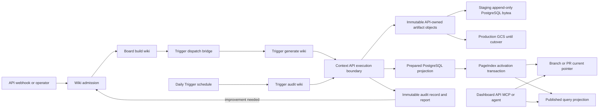
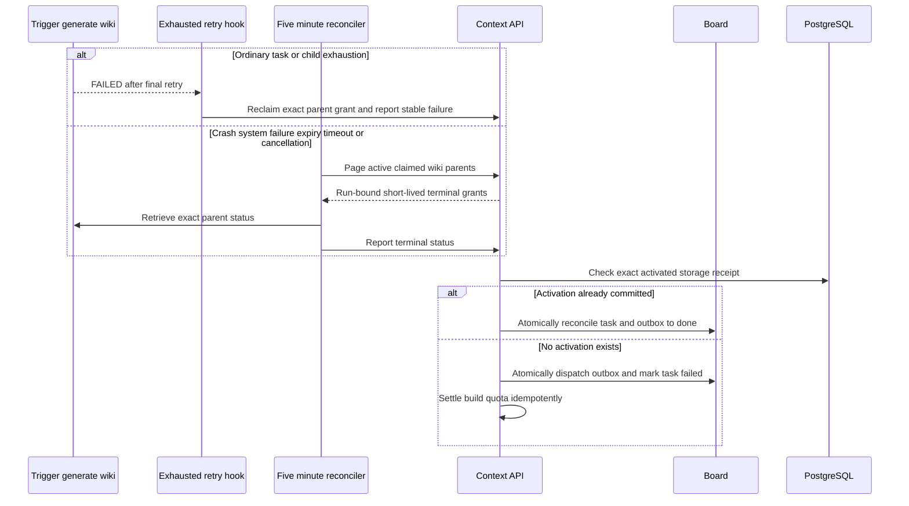
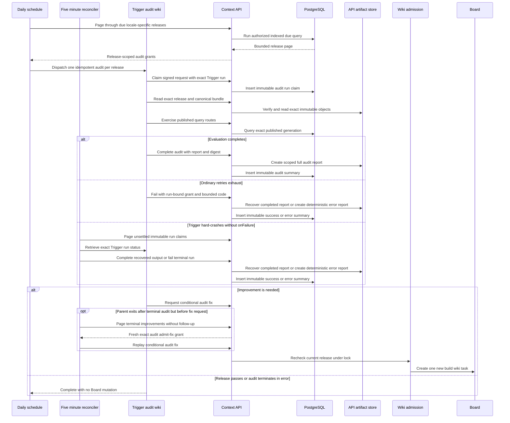
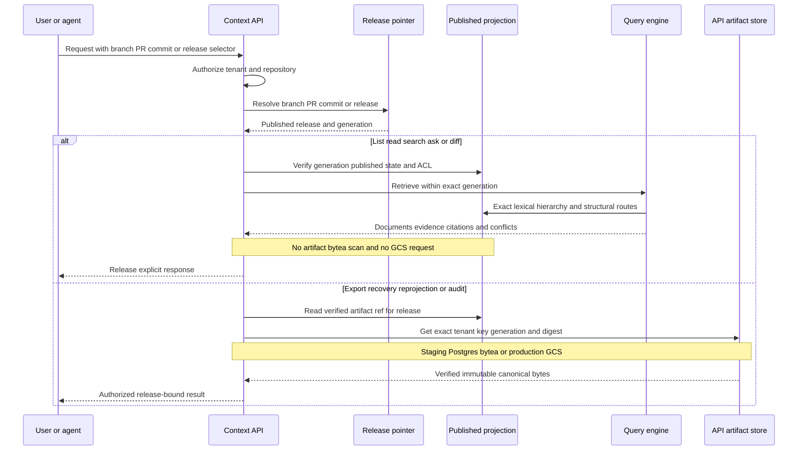
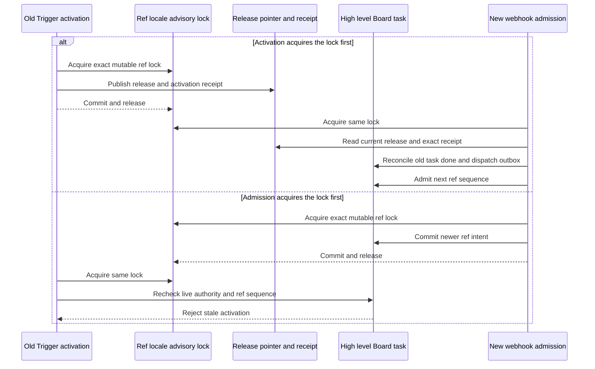

# Context Wiki: Trigger.dev Generation, Versioned Storage, and Independent Audit Plan

Status: implemented on `codex/context-wiki-trigger`; staging deployment and live acceptance pending
Target implementation baseline: `staging@55881471f8c3`
Implementation worktree: `codex/context-wiki-trigger`
Primary precedent: `trigger/`, `packages/review-agent`, and the review Trigger.dev dispatch path
External design reference: [langchain-ai/openwiki](https://github.com/langchain-ai/openwiki)

Implementation checkpoint (2026-08-08): the shared contracts, one-task Board admission, Trigger bridge/service, API-owned generation stages, immutable V2 bundle/release storage, locale-aware release selectors, independent daily audit/follow-up path, query/MCP/export surfaces, strict Mermaid rendering, staging configuration, and CI coverage described below are present in this branch. The legacy Board graph remains available only as the feature-flagged drain path. The final release gate is a deployed staging run against a real sample-repository pull request, followed by merge to `staging`.

## 1. Executive decision

Context wiki becomes two independent asynchronous workflows:

1. `build-wiki` / `generate-wiki` creates and atomically publishes a complete, immediately usable wiki for one immutable repository commit.
2. `audit-wiki` evaluates an already-published release on a separate Trigger.dev invocation, normally from a daily schedule. It records findings but never edits or blocks that release. When improvement is warranted, it admits a new high-level `build-wiki` task.

The Board represents only the user-visible generation workflow. Each admitted generation has exactly one Board task:

```text
type:         build-wiki
topic:        run-wiki-build
pipeline:     context_wiki.trigger.v1
orchestrator: trigger
```

There are no Board children, per-page tasks, gate tasks, repair tasks, or Board dependencies for a Trigger-backed wiki build. Trigger.dev owns the internal generation run, child work, retries, fan-out, joins, and operational progress. The Board owns admission, high-level status, deduplication, ref ordering, cancellation/supersession intent, the authorized Trigger parent identity, and the final release identity.

The published wiki is not stored in Trigger.dev. Product stores remain authoritative:

- The API owns a dual artifact adapter. Staging selects `PostgresWikiArtifactStore` and stores immutable wiki-stage objects, canonical content bundles, and audit reports as tenant-scoped append-only `bytea` rows in `jina_context.context_wiki_artifacts`. Production retains the existing GCS adapter until a separate explicit cutover.
- PostgreSQL stores release identities, mutable branch/PR current pointers, generation-scoped documents and search projections, citations, hierarchy, ACL projections, audit facts, and billing facts in both environments. In staging it also stores the immutable artifact-object bytes; query routes still read the compact projections rather than scanning `bytea`.
- Legacy Context artifacts continue to use the existing GCS bucket. The staging deployment checks that bucket read-only for region, uniform access, lifecycle, and public exposure, but new wiki builds require no API bucket IAM grant.
- Trigger.dev stores only live orchestration state and bounded task outputs/metadata. It receives neither PostgreSQL nor GCS credentials.

Normal list, read, search, ask, diff, and export paths never call Trigger.dev. Trigger.dev produces releases; the Context API serves them.

## 2. Product invariants

The implementation is acceptable only if all of the following remain true:

1. Every new wiki generation creates exactly one Board task named `build-wiki`.
2. The Board stores no internal generation graph or copied Trigger child-run timeline.
3. `generate-wiki` publishes a complete usable wiki without waiting for a semantic quality audit.
4. Deterministic safety/finalization checks may run before publication; model-based citation audits, completeness challenges, diagram-semantic reviews, and repair loops do not.
5. `audit-wiki` is independently triggerable by schedule, operator, policy, or future event.
6. An audit never mutates the audited release and never moves a ref pointer directly.
7. An audit finding can create a new `build-wiki` task whose `generationReason` is `daily_audit_fix`; that build produces a new immutable release.
8. A release is query-visible only after its PostgreSQL projection and PageIndex hierarchy are atomically activated.
9. A stale ref sequence cannot replace the current branch or pull-request release even if its Trigger run finishes later.
10. Exact historical reads use `releaseId`; mutable branch and pull-request selectors resolve through a current pointer.
11. Every query is scoped to exactly one published `generationId`, tenant, repository, and ACL fingerprint.
12. The canonical wiki bundle is a self-contained, digest-addressed artifact that remains portable through export and sufficient to reproject serving data. Its physical object backend is deployment-selected: append-only PostgreSQL in staging and GCS in production until cutover; PostgreSQL projection tables remain the normal low-latency serving path in either case.
13. Source, instruction, model, generator, Mermaid, and audit-policy identities are versioned so a release is reproducible and explainable.
14. A broken nonessential diagram or internal link degrades visibly and diagnostically; it does not make an otherwise useful wiki unavailable.
15. Repository content, pull-request content, prior wiki content, and audit reports are untrusted data, never execution policy.

## 3. Grounding in the current repository

This plan reuses the repository's existing Context domain rather than replacing it.

### 3.1 Orchestration that moves out of the Board

On `staging@597b16c`:

- `packages/context-engine/src/workflow/board.ts` defines the multi-stage Context Board graph and the legacy `run-context-*` topics.
- `apps/api/src/server.ts::applyContextBoardTaskResult` expands that graph after stage completion.
- `apps/worker/src/server.ts` contains the current snapshot, research, publication-planning, page-writing, page-audit, repair, certification, publication, and PageIndex handlers.
- `packages/context-engine/src/ports/context-phase-checkpoint-store.ts` and `packages/db/src/context/context-phase-checkpoint-repository.ts` duplicate stage progress outside the Board.
- `apps/dashboard/src/components/context/build-checkpoints.tsx` renders that internal state.

New Trigger-backed builds stop using those orchestration surfaces. They remain temporarily for already-admitted legacy `build-context` graphs and are deleted only after a drain gate.

### 3.2 Domain behavior that remains authoritative

The following existing behavior is preserved:

- `packages/context-engine/src/workflow/incremental.ts` provides complete-set `add | retain | revise | retire` accounting, stable logical identities, exact retained bytes, and explicit retirement.
- `packages/context-engine/src/publication/board-publication.ts` defines canonical page ordering, `publicSnapshotDigest`, immutable release artifacts, prepared release semantics, and publication digests.
- `packages/db/src/context/board-publication-repository.ts` creates the invisible prepared release and generation-scoped projection.
- `packages/db/src/context/board-pageindex-attachment-repository.ts` attaches hierarchy, marks `index_generations.status = 'published'`, refreshes ACL projection, and advances `current_context_board_releases` atomically.
- `packages/context-engine/src/derive/markdown-verifier.ts` validates source and cross-document links without discarding an otherwise useful catalog for one broken reference.
- `packages/context-engine/src/context/catalog.ts`, `packages/db/src/context/release-catalog.ts`, and `packages/db/src/context/store.ts` resolve releases and serve list/read/search/diff from published generation-scoped data.
- `apps/api/src/mcp.ts` already exposes read-only `search_context`, `list_context`, `read_context`, and `diff_context` tools.

### 3.3 Existing Mermaid support and its gap

The current code already contains a partial diagram contract:

- `packages/daytona/src/local-agent-stages.ts::DocumentationPagePlan` has one scalar `diagram` value: `none | architecture | sequence | state | data_flow`.
- `documentationPlannerPrompt` asks whether a diagram would materially clarify a relationship.
- `documentationWriterPrompt` asks the writer to include the planned diagram.
- `apps/worker/src/board-page-repair.ts::pagePlanStructuralProblems` checks only that a requested page contains a `mermaid` fence.
- `apps/dashboard/src/components/context/context-markdown.tsx` renders Mermaid with `securityLevel: 'strict'`.

What is missing is OpenWiki's complete strategy: actual-dialect planning, a dedicated syntax skill, grounded captions/prose, byte-preserving update semantics, authoritative parse/render validation, safe degradation, and a repair breadcrumb for a later run.

### 3.4 Trigger.dev precedent

The implementation follows the repository's deployed review precedent:

- `trigger/trigger.config.ts` and `trigger/src/trigger/*` show the service/project layout, parent/child tasks, batching, metadata, and tests; `packages/review-agent` owns the portable review runtime.
- `apps/worker/src/trigger-review-bridge.ts` shows durable Board-to-Trigger dispatch and idempotency.
- `.github/workflows/deploy-trigger.yml` provides the isolated deployment and environment-secret pattern.
- `apps/api/src/product/github.ts` shows request idempotency and repository-scoped Trigger dispatch.

Context uses a separate Trigger project and service because wiki workloads are longer, artifact-heavy, scheduled independently, and have different queues and concurrency.

## 4. Target architecture



Ownership is deliberately narrow:

| Concern                                 | Source of truth                                       | Board projection           |
| --------------------------------------- | ----------------------------------------------------- | -------------------------- |
| Admission, request dedupe, ref ordering | Board/API admission                                   | One high-level task        |
| Parent-run authorization                | Board external-effect receipt                         | Authorized Trigger run ID  |
| Generation phases, retries, fan-out     | Trigger.dev                                           | None                       |
| Canonical wiki bytes                    | API artifact port: staging Postgres, production GCS   | Release ID and digest only |
| Queryable documents and indexes         | PostgreSQL generation projection                      | None                       |
| Current branch/PR release               | PostgreSQL current-release pointer                    | Terminal release ID only   |
| Daily audit execution                   | Trigger.dev scheduled/manual run                      | None                       |
| Audit result                            | PostgreSQL summary plus immutable API artifact report | Optional summary only      |
| Usage and billing                       | Existing quota/usage ledger                           | Compact terminal totals    |

### 4.1 Generation sequence

```mermaid
sequenceDiagram
    participant Caller as API or webhook
    participant API as Context API
    participant Board as Board
    participant Bridge as Wiki bridge
    participant Trigger as Trigger generate wiki
    participant Objects as API artifact store
    participant DB as PostgreSQL

    Caller->>API: Request asynchronous wiki build
    Note over Caller,API: Signed webhook supplies immutable head/base SHA; dashboard resolves mutable ref through its repository-scoped GitHub App token
    API->>Board: Admit one build wiki task
    Board-->>Bridge: Lease run wiki build
    Bridge->>Board: Commit pending authority and nonce digest
    Bridge->>Trigger: Dispatch canonical request
    Trigger->>API: Claim parent run and execution grant
    API->>Board: Bind authorized parent run
    Trigger->>API: Submit scoped immutable stage results
    API->>Objects: Validate scope and digest then create object
    Note over API,Objects: Staging writes append-only Postgres bytea; production currently writes GCS
    Trigger->>API: Prepare exact V2 release projection
    API->>DB: Prepare hidden release and generation
    Trigger->>API: Activate exact PageIndex release
    API->>DB: Publish and conditionally advance pointer
    DB-->>API: Release identity and activation receipt
    API-->>Trigger: Scoped immutable receipt
    Trigger->>API: Callback with compact completed result
    API->>DB: Verify exact activated release receipt
    API->>Board: Atomically mark high level task done
```

Terminal failure is also asynchronous and run-bound:



### 4.2 Scheduled audit and improvement sequence



### 4.3 Read, query, and export sequence



### 4.4 Trigger execution boundary

Trigger tasks do not receive a product PostgreSQL URL, database role, GCS service-account key, or bucket-wide credential. The Context API remains the only component allowed to execute product-store transactions and validate storage scope. Trigger uses authenticated, versioned internal routes:

```text
POST /internal/context/wiki/executions/claim
POST /internal/context/wiki/executions/{authorityId}/steps/{stage}
GET  /internal/context/wiki/audits/due
POST /internal/context/wiki/audits/dispatch
GET  /internal/context/wiki/audits/reconciliation/due
GET  /internal/context/wiki/audits/improvements/due
POST /internal/context/wiki/audits/{auditId}/complete
POST /internal/context/wiki/audits/{auditId}/fail
POST /internal/context/wiki/audits/{auditId}/admit-fix
```

The claim exchanges the one-use dispatch nonce and actual Trigger parent-run identity for a short-lived signed execution grant containing exact `tenantId`, repository, Board build or audit ID, request/input digest, allowed operation set, expiry, and nonce ID. Child tasks call the stage route with that operation-scoped grant; they cannot broaden scope. Every stage accepts a deterministic operation ID, re-verifies the grant and immutable request authority, and returns a bounded artifact/release handoff. Audit scheduling uses the service bootstrap credential only for due selection; each selected audit exchanges its signed dispatch nonce for a release-scoped grant before its first external effect.

The scoped stage executor performs source reads, artifact writes, finalization, projection, and activation inside the API trust boundary. Trigger receives only bounded stage outputs containing immutable references and release identities. The API selects one wiki artifact adapter at startup: `PostgresWikiArtifactStore` for staging, or the existing GCS-backed ports for production. Artifact-byte validation, PostgreSQL prepare/activation, audit insertion, due selection, follow-up admission, RLS, and advisory-lock operations remain API-owned.

Stage transport and replay are bounded independently by route class. Lightweight
due-selection, dispatch, and other read/control requests use a 30-second HTTP
deadline. Replay-safe build/audit claims and terminal completion/failure callbacks
use a 120-second deadline because they can wait behind the serialized durable Board
mutation lane. Stage requests use a 29-minute deadline, leaving one minute inside
each 30-minute Trigger child `maxDuration` for response validation and cleanup.
Response bodies remain size-bounded, and transport timeouts expose only the stable
`api_timeout` classification. A claim retry must preserve the exact request digest,
dispatch nonce, attempt, and Trigger parent-run ID so a late commit replays the one
persisted authority rather than creating another writer.

The API records each completed stage result as an immutable operation artifact plus a
durable phase checkpoint bound to the exact authority ID, request digest, Trigger
parent-run ID, stage, operation ID, and canonical input digest. An exact cached receipt
may replay after Board terminal reconciliation because it performs no new side effect;
a receipt miss must revalidate live Board authority before recovery or execution. A
changed input under the same operation ID is rejected. `write-page` first recovers its
deterministic create-only page artifact and reconstructs the bounded stage output;
`audit` similarly recovers its verified create-only report. Therefore a lost API
response or process exit after the immutable artifact write does not invoke the model a
second time. A failure before any artifact/result exists leaves no poison reservation,
so the configured bounded Trigger retry may execute again.

Concurrent receipt misses acquire an exact-input-bound five-minute operation lease in
the Context database through a short advisory-locked transaction. The owner renews it
once per minute while executing; exact waiters re-read the immutable receipt and a
changed input conflicts immediately. Release or bounded expiry permits same-input
recovery without erasing the operation/input binding, and no database transaction or
Board task state is held across the model or network stage.

This follows the review Trigger precedent's authenticated API boundary while adding finer release/artifact grants for long-running Context work. Contract tests prove a Trigger run cannot name another tenant, repository, build, release, artifact key, locale, or operation and that the service deploys without broad product-store credentials.

## 5. Board contract

### 5.1 One task

Add one new Context task definition:

```ts
export const contextWikiBoardTaskType = "build-wiki" as const;
export const contextWikiBoardTopic = "run-wiki-build" as const;
```

The task is dispatchable. It has no parent, children, or Board dependencies. Its title is the user-facing workflow, for example `Build wiki for omlabs/jina@main`.

Legacy Context task types are moved behind an explicitly named compatibility catalog and remain claimable only for pre-cutover builds.

### 5.2 Immutable request

Create `packages/shared-kernel/src/wiki-trigger-request.ts` with strict parsing, canonical JSON, and SHA-256 hashing over:

```ts
interface ImmutableArtifactRefV1 {
  uri: string;
  key: string;
  contentType: string;
  bytes: number;
  sha256: string;
  objectGeneration: string;
}

interface WikiTriggerRequestV1 {
  schemaVersion: 1;
  taskIdentifier: "generate-wiki";
  boardBuildId: string;
  tenantId: string;
  repository: string;
  source: {
    commitSha: string;
    ref: string;
    scopeKind: "branch" | "pull_request" | "commit";
    scopeKey: string;
    refSequence?: number;
    baseCommitSha?: string;
    githubInstallationId?: number;
  };
  requestKey: string;
  generationReason: "initial" | "source_update" | "daily_audit_fix" | "manual_refresh" | "translation";
  releaseFamilyId: string;
  parentReleaseId?: string;
  sourceReleaseId?: string;
  sourceLocale?: string;
  improvement?: {
    auditId: string;
    auditedReleaseId: string;
    auditInputDigest: string;
    findingsArtifact: ImmutableArtifactRefV1;
    findingsDigest: string;
  };
  requestedLocale: string;
  pipelineVersion: "context_wiki.trigger.v1";
  generatorPolicyVersion: string;
  options: {
    idempotencyKey: string;
    concurrencyKey: string;
    queue: string;
    tags: string[];
  };
}
```

The source commit is resolved before Board creation. A signed GitHub webhook contributes its immutable head SHA and, for a pull request, its immutable base SHA. A dashboard request that starts from a mutable branch or `refs/pull/{number}/head` first resolves that ref with a repository-scoped, read-only GitHub App installation token, then sends the canonical scope plus immutable commit identity to admission. `ref` identifies a publication scope; mutable branches and pull requests use canonical refs, while a direct commit uses immutable `refs/commits/{sha}`. It is never the mutable source checkout input. `refSequence` is required for branch/PR scope and forbidden for commit scope. Credentials, page bodies, repository archives, prompts, and audit reports never enter Board metadata.

The product webhook endpoint verifies and durably captures the exact raw, signed delivery, then returns `202` without waiting for Context, review billing, model configuration, or workflow dispatch. The authenticated inbox scheduler drains that record asynchronously, relaying it to Context before invoking the independent review workflow. Context verifies the provider signature again. Processing failures therefore remain retryable without exceeding GitHub's acknowledgement deadline, and every retry repeats the same Context delivery ID, which converges through Context admission idempotency.

`improvement` is required exactly when `generationReason = 'daily_audit_fix'` and forbidden otherwise. Its artifact must be the durable, tenant/repository-scoped report produced by `auditId`; its object generation and SHA-256 are part of the canonical request digest. The generator treats the report as untrusted evidence and verifies each finding against the audited release and source snapshot.

`requestedLocale` is a canonicalized BCP-47 tag and is always explicit in the hashed request. `releaseFamilyId` is allocated at admission. A source-language generation gets a new deterministic family ID; a translation copies the source release's family and requires `sourceReleaseId` plus `sourceLocale`. Those translation fields are forbidden for other reasons. Incremental-parent resolution is always within the same locale; a translated release never becomes the content parent of its source-language release.

The dispatch capability is not part of the canonical request. Immediately before dispatch, the bridge derives a one-use nonce from a service-held HMAC secret, `boardBuildId`, request digest, and Board attempt; it atomically stores only the nonce SHA-256 in the pending external-effect authority record. The raw nonce is reconstructable by the authorized bridge for an exact retry, is passed only to Trigger, and is never written to Board metadata, logs, tags, or artifacts.

The Board stores:

- canonical request and digest;
- admitted orchestrator and pipeline version;
- zero or one authorized Trigger parent-run ID;
- cancellation/supersession intent;
- compact terminal result: release ID, snapshot digest, PageIndex attachment ID, usage, and completed time.

### 5.3 Dispatch and reconciliation

The bridge follows the same safety principle as an external payment or deployment effect:

1. Lease `run-wiki-build`.
2. Recompute and verify the immutable request digest.
3. Under the Board advisory lock, create or exact-replay a pending external-effect record containing provider, effect type/version, request digest, attempt, global idempotency key, and one-use dispatch-nonce digest. Do this before the network call.
4. Dispatch `generate-wiki` with the canonical request, global idempotency key, and raw nonce.
5. The Trigger parent's first action calls an authenticated claim endpoint with its actual run ID, raw nonce, Board build ID, and request digest. The endpoint verifies the nonce digest and atomically binds exactly one run ID. An exact replay is idempotent; a different run or nonce is rejected.
6. No Trigger task may snapshot source, start children, consume model quota, write artifacts/usage, prepare a release, or activate PageIndex until the parent claim succeeds. A losing duplicate exits effectless.
7. The bridge also attempts the same run-ID CAS when the dispatch response arrives. Parent-first and bridge-first orderings converge on the same ID. The parent retries the claim only for a short bounded interval to tolerate transaction visibility.
8. If the dispatch response is lost, the bridge first uses the authorized run ID recorded by a started parent; otherwise it retrieves/reissues the exact globally idempotent dispatch after a bounded grace interval. It never changes the nonce, request, or idempotency key within the Board attempt.
9. After the idempotent dispatch receipt, the worker returns `deferred`, stops heartbeating, and releases no completion side effect. It never polls Trigger or occupies a worker for the generation lifetime. `run-wiki-build` uses a dedicated two-minute dispatch lease rather than the long Context model-stage lease. Claim treats any older persisted wiki lease as effectively expired two minutes after its last `leasedAt`, fences its old write token, and reclaims the same outbox message, task, and attempt. This safely repairs oversized leases written by older deployments: a lost dispatch response replays the same nonce and global Trigger idempotency key, while a dispatch younger than two minutes is never stolen.
10. After activation, the Trigger parent calls the scoped `board:complete` endpoint with the compact result. The API verifies the exact activated storage receipt before atomically completing the one Board task and its leased/pending outbox message.
11. Callback replay is idempotent. A Trigger retry after activation reuses its cached child result and repeats only the storage-attested callback, so a crash between activation and Board completion converges to success.
12. After ordinary retry exhaustion, `generate-wiki.onFailure` reclaims the exact nonce/run-bound grant and calls the scoped `board:fail` endpoint with only a stable terminal code. The API atomically dispatches the outbox, records one idempotent failure receipt, transitions the single task to `failed`, and settles build quota.
13. Trigger does not invoke `onFailure` for `CRASHED`, `SYSTEM_FAILURE`, `CANCELED`, `EXPIRED`, or `TIMED_OUT`. A separate five-minute `scheduled-wiki-reconciliation` task pages at most 100 active claimed parents per API page, retrieves exact Trigger run status, and uses a freshly minted run-bound grant to complete or fail them. It never polls in the Board worker.
14. Both terminal callbacks check the exact activated storage receipt before recording failure. An activation-won race therefore converges to Board `done`; a terminal report can never replace an already published release with failure.

In PostgreSQL mode, each Board mutation enters `PostgresJsonStateStore.update`
directly. The database-wide `jina_runtime.api_state` advisory lock reloads and
serializes the authoritative snapshot across processes and Cloud Run instances; a
second unbounded process-local mutation FIFO is forbidden because it can outlive the
two-minute dispatch lease before the bounded database lock is even attempted. Memory
mode retains its process-local serializer. A duplicate durable delivery that is not
committed returns without an unlocked eager reload; the next mutation reloads under
the advisory lock and read paths use their existing bounded refresh.

PageIndex activation takes the Board API-state advisory lock and then reads the
authority snapshot through a narrowly scoped cross-schema `SELECT` grant for the
Context tenant-admin roles. It does not take a row-write lock and those roles receive
no `INSERT` or `UPDATE` capability on `jina_runtime.api_state`; query, token, quota,
and issue-publication roles cannot read the Board snapshot.

Nonce claims are one-use capabilities scoped to the exact Board task, attempt, provider effect, and request digest. Cancellation before claim retires the pending authority and nonce; a later parent claim is rejected. A high-level operator retry creates a new Board task, request digest, attempt, nonce, and Trigger parent rather than reopening a terminal task.

Cancellation and supersession record intent under the same Board advisory lock used by publication fencing. If intent wins, future domain writes reject. If activation wins first, the Board reconciles to `done`.

All mutable-ref admissions—manual, signed GitHub push/PR, and audit-fix—take the same
`(tenant, repository, canonical ref, locale)` advisory lock as activation. While holding
that lock, admission reads the current pointer and reconciles any matching
storage-activated `in_progress` Board build to `done`, dispatches its outbox, and settles
its quota before creating the next sequence. Thus activation-before-admission preserves
the published old release and leaves the new build runnable. Admission-before-activation
commits its newer Board intent first, so activation's API-state authority/ref-sequence
check rejects the old writer; the old activation can never supersede the newer pointer.



### 5.4 Terminal result

`packages/shared-kernel/src/wiki-trigger-result.ts` strictly parses the only successful parent output:

```ts
interface WikiTriggerCompletedOutputV1 {
  schemaVersion: 1;
  status: "completed";
  boardBuildId: string;
  triggerParentRunId: string;
  requestDigest: string;
  tenantId: string;
  repository: string;
  commitSha: string;
  locale: string;
  releaseFamilyId: string;
  releaseId: string;
  generationId: string;
  releaseArtifactSha256: string;
  contentBundleArtifactSha256: string;
  publicSnapshotDigest: string;
  pageindexAttachmentId: string;
  activationOperationDigest: string;
  usage: { inputTokens: number; outputTokens: number; costMicros: number };
  completedAt: string;
}
```

Unknown keys, malformed digests/timestamps, mismatched identities, `generationId !== releaseId` during compatibility, and oversized output fail closed. If Trigger is terminal without this output but the exact activation transaction committed, the bridge constructs one equally strict `WikiCommittedSuccessAttestationV1` from the immutable request authority and publication/PageIndex rows. A merely prepared release never counts as success.

## 6. Generate-wiki Trigger workflow

### 6.1 Product flow

`generate-wiki` is intentionally smaller than the legacy Context graph:

```text
authorize parent
  -> materialize exact commit snapshot
  -> load trusted wiki instructions and exclusion policy
  -> load prior release for this ref when available
  -> map repository and create complete wiki skeleton
  -> generate or retain every planned page
  -> deterministically finalize the complete wiki
  -> write immutable canonical bundle
  -> prepare generation-scoped PostgreSQL projection
  -> build PageIndex
  -> atomically activate release and ref pointer
  -> return compact terminal result
```

It does not contain:

- model-based page audits;
- source challenges;
- context-only critic gates;
- repair loops;
- whole-wiki quality gates;
- waits for a daily audit.

Leaf infrastructure/model calls may use bounded retries for transient failures. A run that cannot produce the minimum usable bundle fails rather than publishing a structurally incomplete wiki. The caller or operator can admit a new high-level build.

### 6.2 Internal Trigger tasks

The first implementation may keep a single parent plus cohesive child tasks:

| Trigger task      | Responsibility                                                  | Durable output                     |
| ----------------- | --------------------------------------------------------------- | ---------------------------------- |
| `generate-wiki`   | Parent orchestration and activation                             | Compact release result             |
| `wiki-snapshot`   | Exact commit checkout and manifest                              | Immutable artifact refs            |
| `wiki-plan`       | Repository map, impact plan, page and diagram skeleton          | Immutable plan ref                 |
| `wiki-write-page` | Generate one add/revise page                                    | Immutable page ref                 |
| `wiki-finalize`   | Retain pages, indexes, OKF, links, Mermaid, changelog, manifest | Content-bundle ref and diagnostics |
| `wiki-project`    | Prepared documents/fragments/citations/relations                | Prepared generation ID             |
| `wiki-pageindex`  | Hierarchy artifact and atomic activation                        | Release and attachment IDs         |

These are Trigger implementation details. They never become Board task types or a PostgreSQL workflow-state table. “Artifact ref” and “prepared generation” in the table mean outputs obtained through the scoped Context API routes in Section 4.4; tasks do not open GCS or PostgreSQL directly. Storing artifact bytes in Postgres does not turn those rows into workflow state: they remain immutable inputs, outputs, and replay receipts, while Trigger owns live phase state.

### 6.3 Minimum usable wiki contract

Every first release must contain:

- `quickstart.md` as the human and agent entrypoint;
- deterministic root `index.md`;
- at least one repository architecture/orientation page;
- navigation to every generated substantive page;
- enough source-grounded content to identify major active components, entrypoints, flows, state, and focused verification surfaces;
- a release manifest;
- valid document paths and stable logical IDs.

The skeleton is repository-shaped, not a copy of the directory tree. Typical sections such as `architecture/`, `workflows/`, `data-models/`, `operations/`, `integrations/`, and `testing/` are options, not mandatory empty templates.

### 6.4 V2 release and deterministic finalization contract

The current `CertifiedContextReleaseArtifactV1` cannot be reused unchanged: it requires semantic `certificationArtifact` and `publicationPlanArtifact` inputs produced by the audit/gate graph that `generate-wiki` deliberately removes. Preserve that V1 contract for legacy Board builds and introduce a discriminated V2 contract for Trigger generation.

```ts
interface WikiFinalizationAttestationV1 {
  version: 1;
  sourceSnapshotDigest: string;
  publicSnapshotDigest: string;
  contentBundleArtifactSha256: string;
  manifestDigest: string;
  projectionInputDigest: string;
  checks: {
    minimumUsableBundle: "passed";
    pathSafety: "passed";
    logicalIdentity: "passed";
    incrementalAccounting: "passed";
    linkDiagnostics: number;
    validDiagramCount: number;
    degradedDiagramCount: number;
  };
  generatorPolicyVersion: string;
  finalizerVersion: string;
  okfPolicyVersion: string;
  mermaidVersion: string;
  mermaidConfigDigest: string;
  diagramPolicyVersion: string;
}

interface WikiReleaseArtifactV2 {
  version: 2;
  kind: "generated-wiki";
  release: {
    releaseId: string;
    tenantId: string;
    repository: string;
    ref: string;
    refSequence?: number;
    scopeKind: "branch" | "pull_request" | "commit";
    scopeKey: string;
    commitSha: string;
    baseCommitSha?: string;
    checkpointId: string;
    generationId: string;
    buildId: string;
    triggerParentRunId: string;
    requestDigest: string;
    releaseFamilyId: string;
    parentReleaseId?: string;
    sourceReleaseId?: string;
    sourceLocale?: string;
    generationReason: "initial" | "source_update" | "daily_audit_fix" | "manual_refresh" | "translation";
    locale: string;
    preparedAt: string;
  };
  generationPlanArtifact: ContextArtifactRef;
  finalizationArtifact: ContextArtifactRef;
  releaseManifestArtifact: ContextArtifactRef;
  contentBundleArtifact: WikiContentArtifactRef;
  publicSnapshotDigest: string;
  publicationInputDigest: string;
  pages: readonly WikiReleasePageProjectionV1[];
}

interface WikiReleasePageProjectionV1 {
  documentPath: string;
  title: string;
  bodySha256: string;
  revisionId: string;
  citations: readonly KnowledgeEvidenceCitation[];
  metadataDigest: string;
}
```

`WikiFinalizationAttestationV1` is deterministic structural evidence, not a semantic quality certification. It proves that the exact content bundle and projection input passed the minimum usable, identity, path, incremental, link, and diagram finalizers under named policy versions. It contains no wall-clock timestamp; its digest must be identical for identical inputs and policy versions. Artifact-store creation time is operational metadata outside that digest. Semantic quality remains the responsibility of the later audit workflow.

V2 does not duplicate `bodyMarkdown` in the build-scoped envelope. `WikiReleasePageProjectionV1` is the only V2 page-binding shape and deliberately has no body field. The content bundle owns exact public Markdown; the envelope owns release/source identity, page revision/citation bindings, and metadata digests. Publication and PageIndex load the referenced bundle, join pages by exact path and body SHA-256, and reject missing, extra, reordered-identity, or mismatched content before creating a normalized view.

Add `parseContextReleaseArtifact()` as a strict discriminated union parser for legacy V1 and Trigger V2. PageIndex and export consumers use the shared normalized release/page view after parsing and, for V2, verified bundle hydration; they never infer a version. Keep V1 publication validation unchanged.

Define `wikiPublicationInputDigestV2()` over the exact source scope, request/run authority, release family/locale, generation plan artifact, finalization artifact, release-manifest artifact, content bundle identity, public snapshot digest, ordered pages/revisions/citations, and policy versions. Define the V2 `releaseId` deterministically from that digest. During compatibility, set `generationId === releaseId`, matching the current attachment repository's identity assumption. Any later separation requires its own migration and is not part of this cutover. The envelope's time is `preparedAt`; the authoritative `publishedAt` is the PostgreSQL `transaction_timestamp()` written once by successful PageIndex activation and returned unchanged by idempotent activation receipts. It is never copied from the Trigger grant's authorization time.

The V2 prepared-publication transaction accepts `WikiTriggerPublicationCommitV2` rather than pretending to satisfy `BoardContextPublicationCommit`. It requires the finalization attestation and content bundle, not the legacy semantic certification artifacts.

## 7. OpenWiki-derived content features

### 7.1 Repository-owned brief

Add the trusted, user-authored file:

```text
.jina/wiki/instruction.md
```

It defines scope, audience, priorities, exclusions, terminology, and desired depth. It is read from the trusted default/base branch under the same policy as existing `.jina/**/instruction.md` review configuration; a pull request cannot change the policy governing its own generated wiki.

Generation records:

- instruction source commit;
- normalized instruction SHA-256;
- generator policy version.

The instruction file is never rewritten by generation.

### 7.2 Enforced wiki exclusions

Extend `.jina/config.json` with:

```json
{
  "wiki": {
    "exclude": ["generated/**", "vendor/**", "fixtures/**", "**/*.snap"]
  }
}
```

Exclusions are enforced while creating the snapshot and evidence manifest, not merely included as model guidance. Excluded files cannot enter prompts, citations, artifacts, diagrams, or search indexes. Record an `exclusionPolicyDigest` on the release.

### 7.3 Deterministic indexes

The model never authors `index.md`. After pages are finalized, code derives root and nested indexes from the stable logical catalog and PageIndex-compatible hierarchy.

This keeps:

- the standalone exported bundle navigable;
- indexes byte-stable when the tree is unchanged;
- navigation synchronized with the serving hierarchy;
- model calls focused on substantive pages.

### 7.4 OKF-compatible metadata

Every non-reserved substantive Markdown page begins with a supported Open Knowledge Format subset:

```yaml
---
type: Architecture
title: Authentication architecture
description: How requests are authenticated and authorized across the API and workers.
tags: [authentication, api, security]
jina:
  roles: [architecture, workflow]
  source_paths: [apps/api/src/auth.ts]
  test_paths: [apps/api/src/auth.test.ts]
---
```

The initial supported fields are `type`, `title`, `description`, `tags`, and a namespaced `jina` extension. Unknown safe extension fields survive incremental updates. Parsed values enter document metadata and lexical retrieval. Existing path-derived `kind` remains a compatibility fallback during rollout.

Invalid or missing frontmatter is deterministically repaired from page identity/body where safe and recorded as a finalizer diagnostic; it does not invoke an audit or model repair.

### 7.5 Internal links as semantic relations

Ordinary relative Markdown links express navigation and semantic relationships. Finalization validates paths and heading anchors and projects valid links into generation-scoped structural relations.

Broken nonessential links remain readable but receive page diagnostics. Missing root navigation, path traversal, duplicate logical IDs, or a link escaping the wiki root is a hard finalization error.

### 7.6 Incremental updates

For a ref with a prior release:

1. Trigger materializes the prior canonical bundle.
2. Git history/diff identifies changed source paths.
3. Existing citations, `jina.source_paths`, symbols, structural relations, and repository ownership identify affected pages.
4. The plan declares every prior page exactly once as `retain`, `revise`, or `retire`, and every new page as `add`.
5. Retained pages remain byte-identical.
6. Finalization emits a complete new wiki snapshot.

Incremental generation is an optimization and churn-control mechanism. Readers always receive a complete release.

### 7.7 No-op and content reuse

The finalizer calculates per-page `bodySha256`, stable `revisionId`, whole-wiki `publicSnapshotDigest`, and artifact digest after every deterministic rewrite.

If content matches a previous release:

- keep a distinct release identity when source commit/provenance differs;
- reuse the repository-scoped content-only `WikiContentBundleV1` object keyed by exact serialized `bundleSha256` while verifying the same `publicSnapshotDigest`;
- write a new build-scoped `WikiReleaseArtifactV2` envelope containing the new release/source/orchestration identity and a reference to that shared bundle;
- reuse unchanged document revisions and fragments;
- reuse PageIndex output only when its complete input digest matches;
- still record the release-to-commit relationship.

Do not point a new release at another build's existing `context-release` artifact. That would violate the current build-scoped artifact-key and publication-scope validation. Shared content uses a new repository-scoped, digest-addressed port with stricter immutable-content rules; release envelopes remain build-scoped.

### 7.8 Generated changelog

Generate reserved `log.md` deterministically from the release diff:

- source commit range;
- added, revised, retained, and retired pages;
- degraded diagram/link counts;
- generation reason and parent release.

It contains release facts, not audit opinions.

### 7.9 Agent discoverability

The hosted product does not mutate repositories by default. It provides:

- `agent-index.md` or `llms.txt` in the downloadable bundle;
- richer MCP instructions and resources;
- an optional onboarding pull request with a managed `AGENTS.md` block that tells coding agents to use Context MCP tools.

Managed blocks preserve surrounding user content and are always opt-in.

### 7.10 Templates, localization, export, and connectors

These features are included in the roadmap but do not block the first Trigger cutover:

- Template profiles: `library`, `service`, `application`, `monorepo`, plus repository-authored overrides. Templates seed a skeleton but never force empty sections.
- Localization: locale-specific immutable projections keyed by release family and locale; code identifiers, paths, commands, URLs, citations, and stable tags remain unchanged.
- Export: download the canonical OKF-compatible directory or optionally open a repository documentation PR.
- External knowledge connectors: future versioned sources such as runbooks or design docs may supplement code, but every claim retains provider/version identity and ACL scope.

## 8. Mermaid diagram strategy

### 8.1 Diagram planning

Replace the scalar page `diagram` enum with actual Mermaid dialect plans:

```ts
interface WikiDiagramPlanV1 {
  id: string;
  kind: "flowchart" | "sequence" | "state" | "er";
  purpose: string;
  evidenceTopics: string[];
}

interface WikiPagePlanV2 {
  // existing page identity, coverage, dependency, and incremental fields
  diagrams: WikiDiagramPlanV1[];
}
```

Selection rules:

- `sequence` for runtime/request/call flows across components;
- `state` for lifecycles and state machines;
- `er` for persisted entities and relationships;
- `flowchart` for system architecture, data flow, and branching control flow;
- none for navigation, simple reference, and pure configuration pages.

A diagram must answer a named engineering question. Normally a page has zero or one diagram; a second requires a distinct purpose.

### 8.2 Bundled generation skill

Create a versioned `mermaid-diagrams` instruction resource in `packages/context-runtime` and mount it into the Trigger generation sandbox. It contains syntax-safety rules adapted from OpenWiki:

- quote flowchart labels containing punctuation;
- use aliases for sequence participants with spaces or punctuation;
- reject reserved words as IDs or aliases;
- reject semicolons, pipes, and unescaped angle brackets in labels;
- use identifier-like ER entity/attribute names;
- keep labels short and explanations in prose/captions;
- do not emit interactive `click` directives or external diagram links.

The planner receives selection rules. Page writers receive the relevant plans plus the syntax skill. This keeps the main prompt concise while making diagram grammar deterministic and versioned.

### 8.3 Source grounding

Every diagram must have:

- a stable diagram ID;
- a cited paragraph immediately before it that establishes the important participants, states, entities, or relationships;
- a one-line caption immediately after it;
- evidence citation IDs associated in page metadata.

Do not place citations inside Mermaid labels. The rendered diagram is an explanatory view of nearby cited prose, not an independent uncited source of truth.

### 8.4 Validation and safe degradation

Create browser-safe `packages/shared-kernel/src/mermaid-config.ts` exporting one serializable strict configuration, the exact supported Mermaid version, forbidden-directive policy, and `mermaidConfigDigest`. Both the finalizer and dashboard import this module. Pin exact `mermaid` package bytes in the root/service lockfiles; a compatible semver range is insufficient.

The hosted finalizer always uses the real Mermaid parser and a browser-equivalent renderer; it does not rely on heuristic validation. Because Trigger has no database or GCS authority, the finalization child invokes the scoped API-owned stage executor, and the API runtime image provisions pinned Playwright plus system Chromium. CI and the staging deployment smoke test validate that provisioning. No task downloads a browser at runtime.

The API-owned finalizer opens one headless browser/context for the whole wiki, loads the same bundled Mermaid script/configuration as the dashboard, batch-renders every parsed diagram, and tears the browser down in `finally`. Bounds for V1 are: at most two diagrams per page, at most 192 per release, at most 32 KiB of Mermaid source per diagram, five seconds per render, and 120 seconds for the complete render batch. Exceeding a content bound degrades that diagram; browser launch/process failure is a typed transient infrastructure error eligible for the bounded finalizer child retry. After retry exhaustion, diagrams are degraded to text so the non-diagram wiki remains usable.

For every fence:

1. Extract source and dialect.
2. Reject disallowed interactive directives.
3. Run `mermaid.parse`.
4. Run a server-side render smoke test with the dashboard configuration.
5. If valid, preserve the page bytes.
6. If invalid, sanitize/redact and length-cap the diagnostic, convert the fence to `text`, and add a repair marker.

Example marker:

```html
<!-- jina: mermaid parse failed; converted to text; diagnostic: ... -->
```

The wiki still publishes. The final `publicSnapshotDigest` is computed after degradation.

Use distinct bounded diagnostic codes for `parse_failed`, `render_failed`, `forbidden_directive`, `source_too_large`, `render_timeout`, and `renderer_unavailable`. Redact and cap human diagnostics separately. The release records exact Mermaid package version, configuration digest, renderer bundle digest, and diagram policy version. CI proves the Trigger bundle and dashboard resolve the same Mermaid version and configuration digest.

### 8.5 Diagram metadata and incremental behavior

Canonical Mermaid source remains in the Markdown content artifact. Store only lightweight generation-scoped metadata in `context_documents.metadata`:

```ts
interface WikiDiagramRecordV1 {
  id: string;
  kind: "flowchart" | "sequence" | "state" | "er";
  bodySha256: string;
  caption: string;
  evidenceCitationIds: string[];
  mermaidVersion: string;
  diagramPolicyVersion: string;
  status: "valid" | "degraded";
  diagnostic?: string;
}
```

Retain a diagram byte-for-byte when its page and relevant evidence remain accurate. Treat a changed source path, changed adjacent cited prose, changed evidence binding, parser-version change, or audit finding as a reason to revise—not to silently rewrite every diagram.

Search indexes captions and adjacent prose, not raw Mermaid DSL. Read/export returns the Markdown fence. The dashboard retains its readable source fallback if client rendering unexpectedly fails.

## 9. Canonical storage and versioning

### 9.1 Canonical content artifact

Separate content identity from release identity.

`WikiContentBundleV1` is a deterministic content-only representation of a complete directory similar to:

```text
wiki/
├── index.md
├── quickstart.md
├── log.md
├── architecture/
│   ├── index.md
│   └── overview.md
├── workflows/
├── data-models/
├── operations/
└── integrations/
```

```ts
interface WikiContentBundleV1 {
  version: 1;
  publicSnapshotDigest: string;
  pages: readonly {
    documentPath: string;
    bodyMarkdown: string;
    bodySha256: string;
  }[];
}
```

Its deterministic JSON serializer sorts pages by `documentPath`, normalizes line endings, uses canonical JSON, and terminates the object with one newline. It contains no timestamp, policy, provenance, citation, tenant, repository, commit, build, run, release, audit, locale, or mutable-ref identity. Compute `publicSnapshotDigest` from the canonical public Markdown representation, serialize the complete bundle, then compute `bundleSha256` from the exact serialized bytes. The storage key uses `bundleSha256`; `publicSnapshotDigest` remains the wiki-content identity returned to clients. Source/citation bindings and the release manifest remain in the build-scoped envelope/finalization artifact and PostgreSQL projection. Export combines the shared content bundle with that release metadata to emit `.jina-wiki-manifest.json` without changing public page bytes.

Generation plans, finalization attestations, release manifests, and release envelopes remain under the existing build-scoped artifact policy:

```text
context/tenants/{tenant}/repositories/{owner}/{repo}/builds/{buildId}/context-release/{name}
```

The content bundle is keyed independently of a build:

```text
context/tenants/{tenant}/repositories/{owner}/{repo}/wiki-content/{bundleSha256}.json
```

```ts
interface WikiContentArtifactRef {
  version: 1;
  tenantId: string;
  repository: string;
  publicSnapshotDigest: string;
  bundleSha256: string;
  uri: string;
  key: string;
  contentType: "application/json";
  bytes: number;
  sha256: string; // must equal bundleSha256
  objectGeneration: string;
}
```

The build-specific V2 release envelope remains under the existing policy:

```text
context/tenants/{tenant}/repositories/{owner}/{repo}/builds/{buildId}/context-release/release-v2.json
```

The Context API exposes three logical ports over one selected wiki artifact backend:

- `ContextArtifactStore` for build-scoped stage inputs/outputs and durable operation receipts;
- `WikiContentStorePort` for repository-scoped content-addressed bundles;
- `WikiAuditArtifactStorePort` for release/audit-scoped immutable reports.

`JINA_WIKI_ARTIFACT_STORE=postgres` selects `PostgresWikiArtifactStore` for all three ports. Staging sets it explicitly. The adapter preserves the canonical keys above and returns an opaque positive decimal `objectGeneration`, so release and audit references retain the same backend-neutral shape as GCS references. Its URI is deterministic—`postgres://jina_context/context_wiki_artifacts/{key}?generation={objectGeneration}`—and is revalidated with the key and generation on every read. The table is append-only and tenant-scoped:

```text
jina_context.context_wiki_artifacts
  tenant_id, repository, object_key, object_generation,
  artifact_class, content_type, content_sha256, content_length,
  content_metadata, content_bytes bytea, created_at
```

The primary identity is `(tenant_id, object_key)`, `object_generation` is globally unique, and `(tenant_id, repository)` references the repository catalog. Inserts validate the tenant/repository/key relationship, content type, byte length, SHA-256, metadata bounds, and class-specific key policy. A retry of the same key succeeds only when the stored bytes and metadata match; a first-writer collision with different content is terminal. Update/delete triggers enforce immutability. Context RLS and the tenant-admin API transaction prevent cross-tenant access, and the public/query database role has no permission to read raw artifact bytes. The adapter enforces explicit per-object caps: 32 MiB for generic wiki-stage artifacts/receipts, 512 MiB for the complete content bundle, and 2 MiB for an audit report. The table check accepts at most 512 MiB, so every class-specific adapter bound is also database-enforced.

The default `gcs` selection retains the existing `GcsContextArtifactStore` and `GcsWikiArtifactStore` behavior for production. Those adapters use create-only object generations and digest verification. The application-level key, scope, digest, immutability, and port contracts are identical, so changing the physical backend does not change release identity, selectors, audit semantics, or Trigger payloads. It is a deployment cutover, not a data-format fork.

`wiki-content` and `wiki-audit-report` are durable artifact classes. `context-release` remains durable; intermediate plans/pages are retained according to backend-aware reference/erasure policy. Concurrent puts of identical serialized bundles converge on the existing verified object. A stored object's bytes not matching its digest path are a terminal integrity error, not an overwrite. Identical Markdown generated under different policy/model versions reuses the same content object, while each build still writes its own policy-bearing V2 envelope and manifest.

`publicSnapshotDigest` continues using `contextPublicSnapshotDigest()` over the canonical sorted-page Markdown representation. The serialized `WikiContentBundleV1` has its own exact-byte `bundleSha256` because the JSON envelope, paths, and per-page hash fields are not identical to the public-page concatenation. Both digests are verified when the V2 loader hydrates a normalized release; neither is silently substituted for the other.

The build-scoped V2 release manifest contains content facts and policy/provenance needed to interpret them:

- canonical sorted page list;
- page hashes and revision IDs;
- logical IDs and OKF metadata;
- valid internal relationships;
- diagram metadata;
- bundle/public snapshot digest;
- finalizer, Mermaid, OKF, and generator policy versions.

`WikiReleaseArtifactV2` contains the release-specific tenant/repository/ref/commit/build/run/request lineage and references the verified content bundle plus finalization and generation-plan artifacts. This split makes content reuse real while retaining the current build-scoped publication envelope and audit trail.

### 9.2 PostgreSQL release identity and serving projection

Reuse and extend:

- `index_generations` for immutable generation metadata and status;
- `context_board_publications` for release/publication identity during compatibility;
- `current_context_board_releases` for mutable per-ref pointers;
- generation-scoped document, fragment, exact, hierarchy, structural, and citation tables;
- published views that expose only `index_generations.status = 'published'`.

Add release fields through a migration. Artifact fields store verified backend-neutral
references—not duplicated object bytes:

```text
orchestrator
pipeline_version
trigger_parent_run_id
request_digest
scope_kind
scope_key
base_commit_sha
parent_release_id
release_family_id
source_release_id
source_locale
generation_reason
instruction_digest
exclusion_policy_digest
generator_policy_version
finalizer_version
mermaid_version
diagram_policy_version
locale
generation_plan_artifact jsonb
finalization_artifact jsonb
release_manifest_artifact jsonb
content_bundle_artifact jsonb
```

Place orchestration, provenance, scope, lineage, locale, and artifact-reference fields on `context_board_publications`, because that row is the immutable publication/release identity during compatibility. `generation_plan_artifact` is an explicit new column rather than an implicit field hidden in a release JSON blob. Make legacy `certification_artifact` and `publication_plan_artifact` conditionally nullable and enforce a check constraint:

- legacy/Board V1 rows require certification and publication-plan artifacts and forbid V2 finalization/content fields;
- Trigger V2 rows require generation-plan, finalization, and content-bundle artifacts and forbid pretending to have V1 certification.

Keep search capability flags, projector versions, projection fingerprints, generation status, and ACL capability state on `index_generations`. Keep `current_context_board_releases` limited to mutable pointer state: tenant, repository, canonical ref, locale, sequence, release/generation ID, commit, snapshot digest, and advancement time.

Migrate existing publication and pointer rows with `locale = 'en'`. Replace the pointer primary key with `(tenant_id, repository, ref_name, locale)`. Make publication `ref_sequence` nullable only where required for Trigger V2 commit scope, and enforce conditional checks: legacy V1 and Trigger V2 branch/PR rows require a sequence; Trigger V2 commit rows forbid one. Replace the mutable-scope sequence uniqueness rule with a partial unique index on `(tenant_id, repository, ref_name, locale, ref_sequence)` for rows that carry a mutable branch/PR sequence. Preserve the applicable legacy uniqueness constraint until the legacy drain migration can remove it.

Record nonsecret model provenance on `context_board_publications`: provider family, exact model ID, prompt digest, inference-configuration digest, and generator policy version. Never store model credentials or private prompt/source text in release metadata.

Add `UNIQUE (tenant_id, repository, release_id)` to publications for composite audit references. Update the append-only immutability trigger to cover every new immutable release/provenance/artifact column while permitting the existing PageIndex activation fields to transition exactly once.

Do not rename the existing publication tables during the Trigger cutover. A later compatibility cleanup may generalize names after all legacy code is removed.

### 9.3 Identity rules

| Identity               | Meaning                                                  |
| ---------------------- | -------------------------------------------------------- |
| `commitSha`            | Immutable repository source state                        |
| `releaseId`            | One immutable generated wiki publication                 |
| `releaseFamilyId`      | A source-language release and its immutable translations |
| `publicSnapshotDigest` | Hash of canonical public wiki bytes                      |
| `revisionId`           | One immutable page revision                              |
| `ref`                  | Mutable branch or PR selector                            |
| `generationId`         | One PostgreSQL search/index projection                   |
| `auditId`              | One immutable evaluation of one release under one policy |

One commit may have several releases because of manual regeneration, a generator upgrade, localization, or an audit-driven improvement. Exact history therefore uses `releaseId`, not `commitSha` alone.

### 9.4 Branch, PR, and commit scopes

Create `packages/shared-kernel/src/wiki-ref.ts` and make admission, publication, catalog resolution, API/MCP selector parsing, audit selection, and dashboard links use it. Normalize mutable refs:

```text
branch:       refs/heads/main
branch:       refs/heads/feature/oauth
pull request: refs/pull/123/head
```

`current_context_board_releases` maps each locale independently:

```text
tenant + repository + ref_name + locale -> releaseId + refSequence + commitSha
```

Existing immutable releases and current-pointer rows may use the legacy bare ref `main`. Do not rewrite their identities during cutover. During the drain period, a branch selector resolves the canonical `refs/heads/{name}` pointer first and then the legacy bare-ref alias only when no canonical pointer exists. New admissions and pointer updates always write the canonical form. Remove fallback only after historical-read retention no longer needs it.

Direct commit releases store `scopeKind = 'commit'`, `scopeKey = <sha>`, synthetic immutable `ref = refs/commits/{sha}`, and no `refSequence`; they do not update `current_context_board_releases`. A commit selector resolves the most recently activated matching release in the requested locale using `pageindex_attached_at DESC, release_id DESC`. Clients that require stable historical bytes pass `releaseId`. `GET /wiki/releases?commitSha=...&locale=...` exposes all matching releases so ambiguity is visible.

Locale is orthogonal to the release selector and defaults to the configured product locale, initially `en`. A branch or PR release can advance only its own locale pointer. Incremental-parent lookup uses the same canonical ref and locale. A translation copies `releaseFamilyId` from its source release; a new source-language generation allocates a new family so stale translations cannot be presented as translations of revised source content.

For pull requests record both head and base commit. Stale ref-sequence fencing prevents an older head build from replacing a newer PR preview.

## 10. Publication transaction

Preserve the existing two-phase visibility contract:

1. `prepare release` writes the complete immutable release, evidence, documents, fragments, citations, relations, and a generation in `building` state. It is not query-visible, even by explicit release ID.
2. `attach PageIndex` validates the artifact and execution fence, inserts hierarchy, marks the generation `published`, refreshes ACL projection, and updates the publication row in one transaction. Branch/PR activation also advances the locale-specific current pointer; direct-commit activation deliberately does not.

Replace the leased Board-child fence for Trigger builds with:

```ts
interface WikiTriggerExecutionFenceV1 {
  boardBuildId: string;
  triggerParentRunId: string;
  requestDigest: string;
  tenantId: string;
  repository: string;
  commitSha: string;
  scopeKind: "branch" | "pull_request" | "commit";
  ref: string;
  refSequence?: number;
  locale: string;
  operationId: string;
}
```

Every mutation verifies the authorized nonterminal parent, exact request identity, active Board intent, tenant/repository artifact scope, digest, and idempotent operation ID. Activation rechecks cancellation/supersession and ref order under the shared advisory lock immediately before commit.

V2 activation has two explicit code paths after shared hierarchy/publication validation:

- Branch/PR: require `refSequence`, lock `(tenant, repository, canonical ref, locale)`, reject stale sequence, publish the generation, refresh ACL, set authoritative `publishedAt`, and advance that locale's current pointer atomically.
- Direct commit: require `refSequence` to be absent and `ref = refs/commits/{sha}`, publish the generation, refresh ACL, and set authoritative `publishedAt` atomically, but skip mutable-ref fencing and pointer writes. Cancellation/run authority is still rechecked under the release advisory lock.

This requires a V2-aware branch in `packages/db/src/context/board-pageindex-attachment-repository.ts`; “preserve atomic activation” means preserving visibility and ACL atomicity, not unconditionally preserving the legacy pointer update. Prepared envelopes contain only `preparedAt`; consumers use the database activation timestamp as `publishedAt`.

Publication dispatches explicitly by parsed artifact version and orchestrator:

- `CertifiedContextReleaseArtifactV1` plus `BoardContextPublicationCommit` remains the unchanged legacy path and still requires semantic certification artifacts.
- `WikiReleaseArtifactV2` plus `WikiTriggerPublicationCommitV2` is the Trigger path and requires the exact `WikiFinalizationAttestationV1`, repository-scoped content bundle, generation plan, request/run fence, and V2 publication digest.

The repository must never fill legacy certification columns with a deterministic finalization artifact merely to satisfy old non-null constraints. Parser, API, and database checks reject mixed V1/V2 envelopes. The PageIndex attachment repository normalizes either version to shared release/page identity, checks `generationId === releaseId` during compatibility, and then performs the existing activation transaction.

## 11. Independent audit workflow

### 11.1 Trigger entrypoints

Create two audit entrypoints in the Context Trigger project:

- `audit-wiki`: manual/policy invocation for one explicit `releaseId`.
- `scheduled-wiki-audit`: daily schedule that selects due releases and dispatches `audit-wiki` children.

Manual and policy callers first use the authenticated `POST /internal/context/wiki/audits/dispatch` route. The API re-reads the named published historical release under the caller's exact tenant/repository/locale scope and returns the same canonical HMAC-signed payload used by daily selection. Callers never invent an `auditId`, input digest, public snapshot, or dispatch nonce.

The scheduler normally audits current branch/PR releases per locale rather than every historical release. It obtains bounded due pages through the read-only Context API route; it never queries PostgreSQL directly. Policy may exclude closed PRs, recently audited identical snapshots, unsupported locales, or inactive repositories.

### 11.2 Audit idempotency

An audit input digest includes:

```ts
{
  (releaseId, locale, publicSnapshotDigest, auditPolicyVersion, auditorConfigDigest, auditWindow);
}
```

Use it as a unique key and Trigger idempotency key. Re-running an exact audit returns the existing record/report.

The first Trigger claim also inserts one immutable `context_release_audit_runs` row binding that request identity to the actual Trigger parent-run ID and claim time. Normal completion, failure completion, and reconciliation must match that claim. The five-minute reconciliation schedule keyset-pages at most 100 claimed audits per API page whose terminal audit row is absent, retrieves each exact Trigger run, and either replays its completed output or maps `FAILED`, `CRASHED`, `SYSTEM_FAILURE`, `EXPIRED`, `TIMED_OUT`, and `CANCELED` to a bounded terminal error completion. It separately pages terminal `needs_improvement` audits whose immutable follow-up is absent and calls the existing conditional `audit:admit-fix` operation with a freshly minted exact run-bound grant. This closes a process-exit gap after terminal audit insertion without making audit gate publication. A failure before claim has no product-data authority or external effect and remains safely redispatchable under the canonical Trigger idempotency key.

### 11.3 Audit inputs and checks

The audit reads:

- the exact canonical content artifact through the API-selected backend for source-of-truth bytes;
- the published PostgreSQL projection to test real list/read/search/PageIndex behavior;
- the release manifest, citations, diagrams, generator versions, and source commit;
- optionally the current repository commit/diff when checking staleness.

The implemented deterministic V1 audit re-reads and parses the immutable V2 release envelope and release manifest, verifies their exact tenant/repository/release/ref/commit/locale/content identities, and revalidates every page citation against the exact persisted evidence checkpoint, anchor, revision, ordinal, and repository ACL fingerprint. It independently recomputes bundle/page bindings, validates generated frontmatter repository/commit/locale/title consistency, checks relative links, probes the exact published list/search/PageIndex projection, and runs the pinned Mermaid parser/renderer under an abort-all network policy with release/source/time bounds. Its bounded claim pass reports explicit foreign full-commit claims and conservative opposing boolean assertions such as `enabled`/`disabled`; these are deterministic diagnostics, not open-ended fact checking.

Semantic source-citation entailment, completeness challenges for missing components/workflows, Mermaid meaning versus adjacent prose, recommendations that a page should contain a diagram, natural-language localization completeness, and repository-head staleness beyond the release's explicit commit bindings are intentionally deferred to a later versioned model-backed audit policy. That future policy may read an authorized current commit/diff, but it must preserve the same immutable input identity and non-gating behavior. V1 never claims those model-semantic checks have run.

### 11.4 Audit storage

Add:

```sql
create table jina_context.context_release_audit_runs (
  audit_id text primary key,
  tenant_id text not null,
  repository text not null,
  release_id text not null,
  locale text not null check (locale ~ '^[a-z]{2,8}(-[a-z0-9]{1,8})*$'),
  public_snapshot_digest text not null check (public_snapshot_digest ~ '^[0-9a-f]{64}$'),
  audit_policy_version text not null,
  auditor_config_digest text not null check (auditor_config_digest ~ '^[0-9a-f]{64}$'),
  audit_window text not null,
  audit_input_digest text not null unique check (audit_input_digest ~ '^[0-9a-f]{64}$'),
  trigger_run_id text not null unique,
  claimed_at timestamptz not null,
  foreign key (tenant_id, repository)
    references jina_context.repositories (tenant_id, repository),
  foreign key (tenant_id, repository, release_id)
    references jina_context.context_board_publications (tenant_id, repository, release_id),
  unique (tenant_id, repository, audit_id)
);

create table jina_context.context_release_audits (
  audit_id text primary key,
  tenant_id text not null,
  repository text not null,
  release_id text not null,
  locale text not null,
  public_snapshot_digest text not null check (public_snapshot_digest ~ '^[0-9a-f]{64}$'),
  audit_policy_version text not null,
  auditor_config_digest text not null check (auditor_config_digest ~ '^[0-9a-f]{64}$'),
  audit_window text not null,
  audit_input_digest text not null unique check (audit_input_digest ~ '^[0-9a-f]{64}$'),
  trigger_run_id text not null,
  outcome text not null check (outcome in ('passed','needs_improvement','error')),
  summary jsonb not null check (jsonb_typeof(summary) = 'object' and octet_length(summary::text) <= 65536),
  report_artifact jsonb not null,
  completed_at timestamptz not null,
  foreign key (tenant_id, repository, release_id)
    references jina_context.context_board_publications (tenant_id, repository, release_id)
);

create table jina_context.context_release_audit_followups (
  audit_id text primary key references jina_context.context_release_audits (audit_id),
  request_key text not null unique,
  board_build_id text,
  current_release_id_at_decision text,
  admitted_at timestamptz,
  admission_outcome text not null check (
    admission_outcome in ('admitted','already_admitted','superseded','policy_denied')
  )
);
```

Insert an audit row once, only when the audit is terminal. There is no partial row to update: Trigger owns live execution, and a terminal `error` is itself an immutable audit outcome. Install the same append-only update/delete rejection used for immutable Context facts. Follow-up admission state lives in the separate idempotent receipt table so it cannot mutate the audit result.

The full report is a durable `wiki-audit-report` artifact object under an audit-scoped key, not a fictitious Board build:

```text
context/tenants/{tenant}/repositories/{owner}/{repo}/audits/{auditId}/wiki-audit-report/report.json
```

The strict audit-artifact port/validator parallels the repository-scoped content port. The audit summary row stores bounded queryable facts and its verified artifact reference; staging stores the referenced report bytes in `context_wiki_artifacts`, while the production adapter currently stores them in GCS. Before insert, validate tenant/repository/audit scope, report SHA-256, declared audit/release/input-digest identity, and the backend-issued positive decimal object generation. Audit status is not copied into or allowed to mutate the immutable release row.

`audit-wiki.onFailure` reclaims the exact run-bound grant and calls the scoped failure route with only a stable terminal code. Before creating an error report, the API looks up the create-only report key: if evaluation already wrote a verified report before the parent or completion call crashed, that report wins and is committed as the terminal result. Otherwise the API writes a generic bounded error report whose immutable timestamp comes from the original run claim, so `onFailure` and reconciler retries produce identical bytes. A terminal success/error row is insert-once; failure can never overwrite an existing successful audit.

Add indexes for `(tenant_id, repository, release_id, locale, completed_at desc)`, `(audit_policy_version, completed_at desc)`, and the scheduler's locale-aware current-release anti-join. Apply Context RLS, runtime-role grants, erasure behavior, and tenant/repository access policies consistently with publications and evidence. Audit/report deletion follows the repository erasure workflow rather than ad hoc row deletion.

The daily scheduler keyset-paginates current releases in bounded pages of 100 and dispatches at most 10 audit children concurrently per scheduler run. Overlapping schedules are safe: the unique `audit_input_digest` and global Trigger idempotency key converge on one audit. A scheduler cursor is operational Trigger state, not a durable product checkpoint; each run can restart the indexed anti-join safely.

The five-minute reconciler also keyset-paginates the indexed anti-join of terminal `needs_improvement` audits against `context_release_audit_followups`. Each candidate carries the immutable audit request and a newly scoped `audit:admit-fix` grant. The existing admission path rechecks the current release under the mutable-ref lock and uses `wiki-audit-fix:{auditId}` as its Board request key. If the first process created the Board build and died before writing the follow-up, the retry discovers that same build, records `already_admitted`, and writes exactly one immutable follow-up; an already-recorded follow-up is no longer selected.

### 11.5 Improvement admission

For `needs_improvement`, policy decides whether to admit a new build automatically or require operator approval. The request key is deterministic:

```text
wiki-audit-fix:{auditId}
```

The Context API makes the admission decision under the same `(tenant, repository, canonical ref, locale)` advisory lock used by pointer activation. It re-reads the pointer and admits a build only if `releaseId`, `commitSha`, `publicSnapshotDigest`, and locale still equal the audited release. If any value differs, it writes one `superseded` follow-up receipt and creates no Board task. If they still match, it resolves the immutable source from that current pointer and atomically allocates the next locale-specific ref sequence before creating the task. An audit never supplies a new sequence or mutable ref value itself.

The new Board task records:

```ts
{
  generationReason: "daily_audit_fix",
  parentReleaseId: auditedReleaseId,
  improvement: {
    auditId,
    auditedReleaseId,
    auditInputDigest,
    findingsArtifact,
    findingsDigest
  },
  requestedLocale: auditedLocale,
  releaseFamilyId: newlyAllocatedFamilyId
}
```

The generator treats the report as untrusted evidence and verifies findings against the exact source/bundle. R1 remains available while R2 builds. Only R2 activation advances the pointer. If R1 was audited, R2 became current, and the R1 audit later requested a fix, the admission is `superseded`; an older commit can never be republished as a newer sequence through an audit race.

## 12. Query and product use

### 12.1 Release resolution

Every request first authorizes tenant/principal/repository, canonicalizes a locale, then resolves one release:

```ts
type WikiSelector = { releaseId: string } | { branch: string } | { pullRequest: number } | { commitSha: string };
```

Resolution:

1. `releaseId` selects the exact published immutable release; an explicitly supplied locale must match it.
2. `branch` normalizes to `refs/heads/{name}` and follows the `(ref, locale)` current pointer.
3. `pullRequest` normalizes to `refs/pull/{number}/head` and follows the `(ref, locale)` current pointer.
4. `commitSha` selects the newest published matching release in that locale and returns that explicit identity; clients can list all matches.

Every downstream repository query includes `generation_id = :resolvedGenerationId` and published/ACL checks.

Locale is a separate optional field, not another `WikiSelector` union member. For branch, PR, commit, or default-branch resolution, omission means `JINA_WIKI_DEFAULT_LOCALE`; it never means “any locale.” An exact `releaseId` derives its locale from the immutable release when locale is omitted and rejects an explicit mismatch. Every route accepts exactly one selector. Reject a request containing zero selectors when the route has no documented default, or more than one of `releaseId`, `branch`, `pullRequest`, `commitSha`, and legacy `ref`. For compatibility, list/read/search may default to the configured default branch only when no selector is supplied; the response still returns the resolved canonical ref, locale, release family, and release ID.

### 12.2 Existing APIs

Retain and extend:

```http
GET  /wiki/releases?repository=o/r&ref=refs/heads/main&locale=en
GET  /wiki/releases?repository=o/r&commitSha=<sha>&locale=en
GET  /wiki/list?repository=o/r&releaseId=<release>&locale=en
GET  /wiki/read?repository=o/r&releaseId=<release>&locale=en&document=<id>
POST /wiki/search
GET  /wiki/diff?repository=o/r&fromReleaseId=<a>&toReleaseId=<b>
POST /wiki/ask
GET  /wiki/export?repository=o/r&releaseId=<release>&locale=en
```

List/read/search/diff query the published PostgreSQL projection. They never scan
`context_wiki_artifacts.content_bytes` and never call GCS.
`/wiki/export` resolves and authorizes the same strict selector, then hydrates
the verified repository-scoped content bundle through the API artifact port and returns it with the
immutable release identity and current-policy audit summary. The dashboard
proxy and MCP `ask_context` surface preserve the same selector, locale, release,
citation, and non-gating audit semantics rather than inventing separate heads.
Audit, recovery, export, and reprojection are the only ordinary wiki paths that
hydrate raw artifact bytes. In staging those bytes come from an exact tenant/key/
generation Postgres row; in production they currently come from the corresponding
GCS object. Both paths verify scope, length, digest, content type, and generation
before parsing.

`POST /wiki/build` returns `202 Accepted` for a newly admitted or already-active asynchronous build, with `{ boardBuildId, status, statusUrl, duplicate }`. It never waits for Trigger dispatch or publication. A completed exact duplicate may return `200` with its existing release identity.

`POST /wiki/search` uses an explicit selector object:

```ts
interface WikiAuditSummary {
  quality: "not_audited" | "passed" | "needs_improvement" | "error";
  auditId?: string;
  auditPolicyVersion?: string;
  auditedAt?: string;
}

interface ContextSearchRequestV2 {
  repository: string;
  selector?: WikiSelector; // omitted means configured default branch
  locale?: string; // omitted means JINA_WIKI_DEFAULT_LOCALE
  query: string;
  limit?: number;
}

interface ContextSearchResponseV2 {
  release: {
    releaseId: string;
    releaseFamilyId: string;
    generationId: string;
    ref?: string;
    commitSha: string;
    locale: string;
  };
  results: Array<{
    documentId: string;
    documentPath: string;
    title: string;
    excerpt: string;
    score: number;
    citations: KnowledgeEvidenceCitation[];
  }>;
  conflicts: unknown[];
  coverage: unknown;
  audit: WikiAuditSummary;
}
```

### 12.3 Ask the wiki

Add a read-only `ask_context` API/MCP tool outside Trigger.dev:

```text
resolve one release
  -> deterministic multi-route retrieval
  -> hydrate evidence and citations
  -> synthesize answer
  -> verify citations
  -> return answer plus release identity
```

The response always includes `releaseId`, `commitSha`, `ref`, citations, conflicts, and coverage. Query-time synthesis is separately metered and does not create a wiki release.

```ts
interface AskContextRequestV1 {
  repository: string;
  selector?: WikiSelector;
  locale?: string;
  question: string;
  maxEvidenceItems?: number;
}

interface AskContextResponseV1 {
  release: {
    releaseId: string;
    releaseFamilyId: string;
    generationId: string;
    ref?: string;
    commitSha: string;
    locale: string;
  };
  answer: string;
  citations: KnowledgeEvidenceCitation[];
  conflicts: unknown[];
  coverage: unknown;
  usage: { inputTokens: number; outputTokens: number; costMicros: number };
  audit: WikiAuditSummary;
}
```

### 12.4 Audit visibility

Read responses may include a non-gating summary:

```ts
{
  quality: "not_audited" | "passed" | "needs_improvement" | "error";
  auditPolicyVersion?: string;
  auditedAt?: string;
}
```

This is informational. A published wiki remains readable regardless of audit outcome.

`audit` means the latest completed audit for the currently active `JINA_WIKI_AUDIT_POLICY_VERSION`, ordered by `completed_at DESC, audit_id DESC`. If none exists, return `quality = 'not_audited'`. A separate operator/history endpoint may expose the latest audit under older policies; normal reads do not present an obsolete policy result as current quality.

## 13. Security and tenancy

- Resolve commits and trusted `.jina/wiki/instruction.md` before admission using the GitHub installation identity.
- Mint short-lived GitHub installation tokens at execution time; never store them in Board, Trigger metadata, logs, or an artifact object.
- Use a Context-Trigger-specific bootstrap service identity only to exchange an authorized run/audit identity for short-lived execution grants; every product-data call requires the narrower grant.
- Give Trigger no PostgreSQL connection string, database role, GCS service-account key, or bucket-wide credential. Keep product-store access and tenant/repository validation in the Context API.
- Scope build artifacts to tenant/repository/build and shared content artifacts to tenant/repository/bundle SHA-256; verify bundle SHA-256, declared public snapshot digest, and the backend-issued positive decimal object generation without allowing cross-scope references.
- Keep raw `context_wiki_artifacts` bytes behind the tenant-admin API role and Context RLS. Public/query roles read only published release/catalog/audit-summary projections.
- Treat repository source, prior wiki, PR text, audit reports, connector content, and Mermaid text as untrusted data.
- Enforce wiki exclusions before model access.
- Keep Mermaid `securityLevel: 'strict'`, forbid interactive directives, and sanitize parser errors before storage/rendering.
- Preserve existing repository ACL fingerprints and published views on every query route.
- Keep raw tenant/repository names out of Trigger tags where platform visibility is broader; use bounded hashes.
- Redact provider keys, tokens, prompts containing private content, and source excerpts from normal logs.

## 14. Repository change map

### 14.1 Create

- `packages/shared-kernel/src/wiki-trigger-request.ts` and tests.
- `packages/shared-kernel/src/wiki-trigger-result.ts` and tests.
- `packages/shared-kernel/src/wiki-ref.ts` and compatibility tests.
- `packages/shared-kernel/src/mermaid-config.ts` and browser/Node digest tests.
- `packages/context-runtime/` for Board-neutral snapshot, planning, page generation, deterministic finalization, projection inputs, and Mermaid policy.
- `packages/context-runtime/resources/mermaid-diagrams.md`.
- `packages/context-engine/src/publication/wiki-release-v2.ts` for content bundle, finalization attestation, V2 release/parser/digest, and normalized V1/V2 views.
- `packages/context-engine/src/ports/wiki-content-store.ts` and tests.
- `packages/context-engine/src/ports/wiki-audit-artifact-store.ts` and tests.
- `packages/db/src/context/postgres-wiki-artifact-store.ts` implementing all three wiki artifact ports with create-only collision verification, bounded bytes, tenant-admin transactions, and backend-neutral references.
- `packages/context-trigger-client/` for dispatch, retrieve, cancel, schedule/control status parsing, and dashboard URLs.
- `services/context-trigger/` with `trigger.config.ts`, package config, tests, and tasks.
- `services/context-trigger/src/trigger/generate-wiki.ts`.
- `services/context-trigger/src/trigger/wiki-snapshot.ts`.
- `services/context-trigger/src/trigger/wiki-plan.ts`.
- `services/context-trigger/src/trigger/wiki-write-page.ts`.
- `services/context-trigger/src/trigger/wiki-finalize.ts`.
- `services/context-trigger/src/trigger/wiki-project.ts`.
- `services/context-trigger/src/trigger/wiki-pageindex.ts`.
- `services/context-trigger/src/trigger/audit-wiki.ts`.
- `services/context-trigger/src/trigger/scheduled-wiki-audit.ts`.
- `apps/worker/src/context-trigger-client.ts`, the dispatch-and-detach bridge in `apps/worker/src/server.ts`, and tests.
- DB migration for Trigger publication authority/release metadata.
- DB migration/repository for `context_release_audits`.
- DB migration/repository for `context_release_audit_followups`.
- DB migration for append-only, tenant-scoped `context_wiki_artifacts`, including RLS, immutable triggers, byte/metadata limits, and no raw-byte grant to the query role.
- `.github/workflows/deploy-context-trigger.yml`.

### 14.2 Modify

- `packages/context-engine/src/workflow/board.ts`: add the single-task constructor and isolate legacy constructors.
- `packages/context-engine/src/workflow/board.ts`: immutable request metadata, external-run authority, deferred outbox recovery, root cancel/supersede intent.
- `packages/context-engine/src/workflow/incremental.ts`: retain existing accounting and expose Board-neutral adapters.
- `packages/context-engine/src/derive/markdown-*`: OKF metadata, heading anchors, semantic relationships, diagram records, finalizer diagnostics.
- `packages/context-engine/src/publication/board-publication.ts`: Trigger execution fence and expanded release manifest.
- `packages/context-engine/src/ports/artifact-store.ts`: keep build-scoped validation unchanged and add the separate repository-scoped wiki-content reference/port exports.
- `packages/db/src/context/board-publication-repository.ts`: Trigger authority and release metadata while preserving prepared visibility.
- `packages/db/src/context/board-pageindex-attachment-repository.ts`: Trigger fence, activation attestation, locale-aware branch/PR pointer advancement, and pointer-free direct-commit activation.
- `packages/db/src/context/schema.ts`: wiki artifact-object table, audit table, explicit artifact columns, locale-aware pointer key, conditional ref sequence, partial indexes, RLS/role boundaries, and published-view compatibility.
- `apps/api/src/context-board-admission.ts`: one-task Trigger admission and audit-fix admission.
- `apps/api/src/server.ts`: bridge/control/internal mutation endpoints, audit endpoints, selectors, `ask_context`, export.
- `apps/api/src/mcp.ts`: `ask_context`, release selectors, richer instructions/resources.
- `apps/worker/src/worker-topics.ts`: `run-wiki-build`, legacy drain routing.
- `apps/dashboard/src/components/context/*`: high-level build progress, release selector, audit summary, Mermaid diagnostics, export.
- `apps/dashboard/package.json`: exact shared Mermaid version rather than an unconstrained compatible range.
- `.jina` configuration parser/docs: wiki instruction and exclusions.
- workspace manifests, lockfiles, TypeScript/Turbo config, environment examples, deploy/readiness scripts, observability docs.
- staging deploy/readiness: select `JINA_WIKI_ARTIFACT_STORE=postgres`, verify it on the deployed API revision, and keep only read-only safety checks for the legacy Context bucket.
- API runtime image: provision pinned Playwright integration plus system Chromium and validate exact Mermaid/renderer bundle identity; Trigger retains only scoped orchestration authority.

### 14.3 Remove after drain

- Dynamic Context Board graph construction and expansion.
- Context-specific phase checkpoint writes and table after retention.
- Legacy Context stage topics and handlers.
- Per-stage recovery/remediation API and dashboard UI for nonlegacy builds.
- Board-specific wrappers once all shared execution code lives in `packages/context-runtime`.

### 14.4 Preserve

- Existing evidence, citation, knowledge, query, index, PageIndex, ACL, quota, usage, and artifact-domain behavior.
- Existing prepared-versus-published release boundary.
- Existing ref-sequence fencing.
- Existing causal-graph Board pipeline.
- Read compatibility for historical Context Board builds/releases.

## 15. Configuration

Use one admission mode:

```text
JINA_WIKI_PIPELINE_MODE=legacy-board|trigger-allowlist|trigger
JINA_WIKI_TRIGGER_ALLOWLIST=<tenant/repository pairs>
JINA_WIKI_ARTIFACT_STORE=gcs|postgres
JINA_GRAPH_INTERNAL_TOKEN=<product-to-Context bridge credential>
```

Persist the selected owner and pipeline version at admission so a later flag change cannot transfer an active/deferred request between orchestrators.

Context-specific Trigger configuration must not fall back to the review project:

```text
JINA_CONTEXT_TRIGGER_API_URL
JINA_CONTEXT_TRIGGER_SECRET_KEY
JINA_CONTEXT_TRIGGER_ACCESS_TOKEN
JINA_CONTEXT_TRIGGER_PROJECT_REF
JINA_CONTEXT_TRIGGER_PREVIEW_BRANCH
JINA_CONTEXT_TRIGGER_DASHBOARD_URL
JINA_CONTEXT_INTERNAL_API_URL
JINA_CONTEXT_TRIGGER_SERVICE_TOKEN
JINA_CONTEXT_EXECUTION_GRANT_SECRET
JINA_CONTEXT_TRIGGER_DISPATCH_SECRET
JINA_WIKI_AUDIT_CRON
JINA_WIKI_AUDIT_POLICY_VERSION
JINA_WIKI_GENERATOR_POLICY_VERSION
JINA_WIKI_DIAGRAM_POLICY_VERSION
JINA_WIKI_DEFAULT_LOCALE=en
```

`JINA_CONTEXT_TRIGGER_API_URL`/secret/access token are API-side Trigger control-plane settings used to dispatch and inspect runs. `JINA_CONTEXT_INTERNAL_API_URL` and the bootstrap service token are Trigger-side settings used only for claim/grant exchange and scoped internal calls. The distinct `JINA_GRAPH_INTERNAL_TOKEN` authenticates the co-located product API only on the exact tenant-bound Context routes it consumes (overview, token management, review access, and build cancellation); it is never promoted to the operator or worker credential. `JINA_WIKI_ARTIFACT_STORE` is API-only, accepts exactly `gcs` or `postgres`, and fails closed when the selected backend is unavailable. Staging sets `postgres`; production currently uses the `gcs` default until a separately reviewed migration. Context Trigger deployment intentionally has no `DATABASE_URL`, Cloud SQL credential, GCS service-account key, or bucket-wide storage role.

## 16. Implementation sequence

Each phase lands with tests and can deploy without enabling new traffic.

### Phase 0: baseline and feature flags

1. Create an implementation branch from `staging@597b16c`.
2. Record/pin the review Trigger SDK/runtime and platform limits.
3. Add Context-specific pipeline-mode parsing and allowlist, default `legacy-board`.
4. Add correlated metrics that distinguish legacy and Trigger wiki builds.

Exit: configuration cannot dual-dispatch one request.

### Phase 1: contracts and one Board task

1. Add strict request/result contracts and canonical digests.
2. Add `build-wiki` definition and constructor.
3. Make its request envelope immutable.
4. Add pending external-effect authority, derived one-use nonce claims, run-ID CAS, and delayed outbox reconciliation primitives.
5. Rewrite admission tests for manual, push, PR, audit-fix, duplicate, coalesced, canceled, and superseded requests.

Exit: every Trigger-mode admission creates one task, one outbox message, zero children, and zero dependencies.

### Phase 2: Board-neutral generation and OpenWiki finalizer

1. Extract reusable source snapshot and prior-release loading from worker handlers.
2. Implement trusted wiki instructions and enforced exclusions.
3. Adapt planning to page `diagrams[]` and incremental complete-set accounting.
4. Implement deterministic OKF/frontmatter repair, indexes, links/anchors, changelog, manifest, snapshot hashing, and reuse.
5. Add the Mermaid skill, pinned parser/render validation, strict directive policy, safe degradation, and metadata.
6. Add repository-scoped `WikiContentBundleV1`, build-scoped `WikiReleaseArtifactV2`, deterministic finalization attestation, V1/V2 strict parsers, and V2 publication digest.
7. Keep thin legacy adapters so old builds continue to drain.

Exit: a local fixed-commit run creates a portable complete wiki bundle without Board stage state or semantic audit gates.

### Phase 3: Context Trigger service and bridge

1. Create and deploy the isolated Trigger project.
2. Implement `generate-wiki` and its bounded children.
3. Add authenticated execution grants and idempotent internal mutation APIs.
4. Implement dispatch-and-detach authority, storage-attested completion callback, cancellation, terminal parsing, and committed-success reconciliation.
5. Add Trigger-backed progress without persisting a local stage mirror.

Exit: one staging API request produces one Board task, one authorized Trigger parent, and one published queryable release.

### Phase 4: release selectors and storage completion

1. Land release-authority/metadata migrations, including explicit generation-plan/finalization/manifest/content artifacts, release family/locale, nullable commit-scope sequence, and the locale-aware pointer key.
2. Land conditional V1/V2 artifact constraints, composite release uniqueness, and immutable-column trigger updates.
3. Normalize branch, PR, and commit scopes with canonical-first legacy fallback and conditional pointer activation.
4. Extend releases/list/read/search/diff with mutually exclusive selectors and release identity.
5. Add repository-scoped content reuse and export.
6. Add audit-summary joins without gating reads.

Exit: branch, PR, commit, and exact release queries cannot cross generations and remain reproducible.

### Phase 5: independent audit

1. Land `context_release_audits` and immutable report artifacts.
2. Implement explicit `audit-wiki`.
3. Implement the daily scheduler and due-release selection.
4. Add deterministic audit idempotency.
5. Add policy-controlled `daily_audit_fix` admission.

Exit: generation completes without audit, daily audit can run later, and improvement creates a new one-task generation without mutating the old release.

### Phase 6: product features

1. Add `ask_context` with citation verification and metering.
2. Add `agent-index.md`/`llms.txt`, richer MCP resources, and optional managed agent-instruction PR.
3. Add template profiles.
4. Add locale-specific releases and translation workflow.
5. Add external versioned connectors only after ACL/provenance contracts are approved.

### Phase 7: canary, cutover, and legacy removal

1. Deploy Trigger before enabling admission.
2. Enable an explicit tenant/repository allowlist.
3. Exercise initial build, source update, PR update, duplicate, no-op, cancel, supersede, stale completion, Mermaid degradation, audit, and audit-fix flows.
4. Expand allowlist and switch new traffic to `trigger`.
5. Drain legacy roots and remove old stage orchestration/checkpoints after retention.

## 17. Test strategy

### 17.1 Contracts and Board shape

- Canonical request serialization is stable and rejects unknown fields.
- Any identity/option change changes the digest.
- Commit SHA is full, resolved before creation, and immutable.
- Every admission source creates one task and no dependencies/children.
- Exactly one Trigger run can acquire effect authority.
- Pending authority and nonce digest commit before dispatch; an immediate parent can claim safely.
- Exact nonce replay is idempotent, while wrong nonce, wrong run ID, second run, and canceled-before-claim are rejected before effects.
- Lost dispatch response recovers the parent claim or exact global idempotency handle.
- Dispatch returns deferred without polling, burning attempts, or holding long leases.
- Cancel/supersede races converge with activation correctly.
- Terminal success requires exact activation identity.

### 17.2 Generation

- Cold generation creates the minimum usable bundle.
- Incremental plans account for every prior page.
- Retained bytes and revision IDs stay exact.
- Retired pages are explicit.
- Deterministic indexes match the hierarchy.
- Frontmatter parses and unknown safe extensions survive.
- Internal links and heading anchors resolve or yield bounded diagnostics.
- No-op content reuses the exact-byte `bundleSha256` object without losing commit-level release provenance.
- Identical Markdown under different generator/policy versions reuses one content object, produces distinct build envelopes, and never collides at a digest key or duplicates `bodyMarkdown` in V2.
- Finalization-attestation digests are stable across wall-clock time.
- Concurrent repository-scoped content puts converge; digest-path mismatch and cross-tenant/repository references fail closed.
- Every V2 release writes a new build-scoped envelope even when it reuses content bytes.
- V1 legacy certification and V2 deterministic finalization parse/publish independently; mixed contracts are rejected.
- V2 publication digest and release ID bind content, finalization, projection input, request/run identity, and policy versions.
- Output is deterministic for identical inputs and generator policy.

### 17.3 Mermaid

- Planner schema accepts actual dialects and rejects ambiguous/unknown values.
- Syntax skill covers reserved IDs, aliases, quoting, ER tokens, and forbidden directives.
- Valid diagrams remain byte-identical through finalization.
- Parse-valid but render-invalid diagrams degrade.
- Invalid diagrams become readable text with redacted/capped diagnostics.
- Final digest is computed after degradation.
- Trigger and dashboard use the same exact Mermaid version/configuration.
- The deployed API Chromium runtime starts without runtime download, uses the shared strict config, honors source/count/time bounds, and tears down after the batch.
- Parse and browser-render failures remain distinguishable and safely degraded.
- Search excludes raw DSL but indexes caption/adjacent prose.
- Incremental retain preserves accurate diagrams and revises impacted ones.

### 17.4 Publication and query

- Prepared releases are invisible by ref and release ID.
- Only PageIndex attachment marks a generation published; it advances a pointer only for a non-stale branch/PR scope in the same locale.
- Stale ref sequence cannot activate.
- Every list/read/search/ask route is generation- and ACL-scoped.
- Exact release reads remain stable after a ref advances.
- Commit selectors expose/resolve multiple releases predictably.
- Canonical refs resolve before legacy bare aliases; new writes never recreate bare refs.
- Branch/PR requests require a locale-specific ref sequence; direct-commit requests forbid one, use `refs/commits/{sha}`, do not move a mutable pointer, and order by attachment time plus release ID.
- English and French releases of one ref advance independent locale pointers, resolve within the requested/default locale, and share only their declared release family.
- Incremental parent resolution never crosses locale.
- Requests with conflicting selectors are rejected.
- Diff compares stable logical IDs and revision fingerprints.
- Reprojection from either verified artifact backend recreates the same serving projection.
- Postgres-backed and GCS-backed refs preserve the same tenant/repository/key/digest/generation validation contract.
- Query/list/read/search never fetch `context_wiki_artifacts.content_bytes`; export, audit, recovery, and reprojection fetch only the exact authorized object ref.

### 17.5 Audit

- Audit runs only on published releases.
- Exact input digest is idempotent.
- Audit reads canonical bytes and serving behavior.
- Audit never edits the release or ref pointer.
- `needs_improvement` creates at most one deterministic follow-up build.
- R1 audit starts, R2 becomes current, then the R1 improvement result records a `superseded` follow-up and admits no R1-based build.
- Audit-fix build records parent release and audit identity.
- Audit error remains non-gating and retryable.
- Audit rows are inserted only at terminal completion, reject update/delete, reference an existing tenant/repository release, and validate durable report identity.
- Scheduler pagination, concurrency limits, and overlapping runs converge through audit-input uniqueness.

### 17.6 Security and failure injection

- Wrong tenant/repository/run/digest/artifact prefix is rejected.
- The Postgres adapter rejects cross-tenant/repository keys, traversal/unsafe keys, non-decimal generations, oversized bytes/metadata, digest mismatches, and different-byte first-writer collisions.
- The query database role cannot select raw `context_wiki_artifacts` bytes; API tenant-admin transactions remain RLS-scoped.
- PR-head instructions cannot govern their own build.
- Excluded source is inaccessible to generation.
- Mermaid interactive directives are rejected.
- Secrets are redacted from diagnostics and logs.
- Crash after prepare leaves the prior release current.
- Crash after activation reconciles committed success.
- Trigger timeout/outage does not create a second authorized writer.
- Trigger deploys without a product database or bucket credential; internal routes reject a valid grant reused for another tenant, repository, build, release, locale, artifact key, or operation.
- Expired, broadened, replayed-for-a-different-operation, and child-escalated execution grants fail closed.

## 18. Observability

Correlate logs/spans with hashed tenant/repository, Board build ID, request digest prefix, Trigger run ID, release ID, generation ID, commit SHA prefix, ref sequence, operation ID, artifact digest prefix, and audit ID.

Metrics:

- admissions and duplicates by source/orchestrator;
- Board-to-Trigger dispatch latency and ambiguous dispatches;
- Trigger phase duration, retry, cancellation, and terminal category;
- generation page counts, retained/revised/added/retired counts, no-op reuse;
- finalizer diagnostics, broken links, valid/degraded diagrams by dialect;
- prepare/activation latency, idempotent replays, ref-fence rejections;
- query latency/result counts by selector and route;
- audit due/run/pass/improvement/error counts and age;
- audit-fix admission and publication outcomes;
- cost and tokens per generated release, audit, and ask query.

Alert on:

- accepted Board task with no authorized Trigger run past SLO;
- terminal Trigger run unreconciled to Board;
- Board `done` without exact published activation;
- any conflicting authorized run identity;
- stale activation attempt;
- newly created legacy Context child after full cutover;
- scheduled audit backlog beyond policy age;
- dashboard/server Mermaid version drift.

## 19. Rollout and rollback

Use single-owner routing. Never generate/publish the same admitted request through legacy and Trigger simultaneously.

- Before a Trigger admission, rollback is a mode flag change.
- After Trigger tasks exist, a flag change affects only new admissions.
- Keep the bridge and Trigger deployment running until all Trigger-owned tasks are terminal.
- During an incident, stop new admissions, cancel/fence active runs if required, and reconcile from publication truth.
- Never manually mark a build successful without a matching activation record.
- Keep legacy workers only for already-admitted graphs during the drain period.
- Historical releases, artifacts, Board snapshots, and audit facts are not deleted as part of orchestration cleanup.

## 20. Risks and mitigations

| Risk                                                    | Mitigation                                                                                                                               |
| ------------------------------------------------------- | ---------------------------------------------------------------------------------------------------------------------------------------- |
| Trigger accepts work but dispatch response is lost      | Global idempotency plus one authorized-run CAS and reconciliation                                                                        |
| Trigger parent starts before bridge receives its run ID | Precommitted nonce digest and parent-first claim CAS before any side effect                                                              |
| Internal Trigger state leaks back into Board            | Strict one-task schema and progress reads from Trigger only                                                                              |
| Generation becomes another long gate-heavy workflow     | No semantic audit/repair stages in `generate-wiki`; deterministic finalizer only                                                         |
| First wiki is partial or unusable                       | Minimum usable bundle contract and complete-set page accounting                                                                          |
| Audit blocks availability                               | Audit is independent and non-gating by invariant                                                                                         |
| Audit mutates history                                   | Immutable audit record; improvement is a new release                                                                                     |
| Stale audit republishes older source                    | Audit-fix admission rechecks the locale pointer under the publication lock and records `superseded` without a build                      |
| Branch/PR results overwrite newer source                | Monotonic ref sequence and activation transaction                                                                                        |
| One locale replaces another                             | Locale is part of pointer identity, sequence uniqueness, incremental-parent resolution, and selectors                                    |
| Same commit has ambiguous wiki history                  | Exact `releaseId`; commit release listing and explicit newest resolution                                                                 |
| Artifact-byte storage becomes a slow query path         | Compact PostgreSQL publication/search projections serve normal reads; raw bytes are hydrated only for export/audit/recovery/reprojection |
| Staging Postgres artifact row is lost or corrupted      | Immutable digest/generation checks fail closed; database backup/restore covers bytes and release metadata atomically                     |
| Production GCS artifact is lost or corrupted            | Immutable generation/digest validation fails closed and production backup/retention policy remains in force                              |
| Staging and production artifact backends drift          | Shared three-port conformance tests and backend-neutral refs; backend cutover cannot change release identity                             |
| Cross-build reuse bypasses artifact scope               | Separate repository-scoped content port plus new build-scoped release envelope                                                           |
| Shared content digest collides with policy metadata     | Exact-byte `bundleSha256` keys a content-only serialization; provenance stays build-scoped                                               |
| Trigger gains broad product-store access                | API-owned database/object boundary plus short-lived operation- and repository-scoped grants                                              |
| V2 publication fakes removed certification              | Discriminated V1/V2 contracts and deterministic finalization attestation                                                                 |
| Diagram renders locally but not in product              | Exact shared Mermaid version plus parse and render smoke test                                                                            |
| Diagram syntax failure makes page unusable              | Safe conversion to text and diagnostic breadcrumb                                                                                        |
| Diagram becomes semantically stale                      | Evidence-linked metadata, incremental impact, and scheduled audit                                                                        |
| Repository instructions become prompt injection         | Trusted base/default-branch policy and untrusted-source boundaries                                                                       |
| Feature scope delays orchestration cutover              | Phase OpenWiki-derived product additions while preserving final contracts                                                                |

## 21. Definition of done

The migration and discussed feature set are complete when:

- every new wiki generation appears on the Board as one `build-wiki` task;
- Trigger.dev owns all generation internals and the Board contains no child workflow state;
- a cold build publishes a complete usable wiki before any audit runs;
- the API-selected immutable artifact backend holds a portable canonical bundle and PostgreSQL holds an exact published query projection; staging uses append-only Postgres bytes while production retains GCS until cutover;
- Trigger holds no broad PostgreSQL/GCS credential and all product-store access passes the scoped Context API boundary;
- branch, PR, commit, and release selectors return the correct locale-isolated version, while translations share only an explicit release family;
- deterministic indexes, OKF metadata, instructions, exclusions, incremental updates, no-op reuse, changelog, and export are implemented;
- Mermaid uses evidence-backed actual-dialect planning, a syntax skill, captions, pinned validation/rendering, safe degradation, metadata, and incremental preservation;
- the daily scheduled audit is independent, immutable, non-gating, and able to create a new high-level audit-fix build;
- list, read, search, ask, diff, MCP, and optional agent discovery return release-explicit cited results;
- template, localization, and approved connector extensions follow the same immutable release and ACL model;
- duplicate dispatch, cancellation, supersession, stale publication, crash recovery, and audit idempotency tests pass;
- legacy Context Board orchestration and phase checkpoints are drained and removed without changing the causal-graph pipeline.
