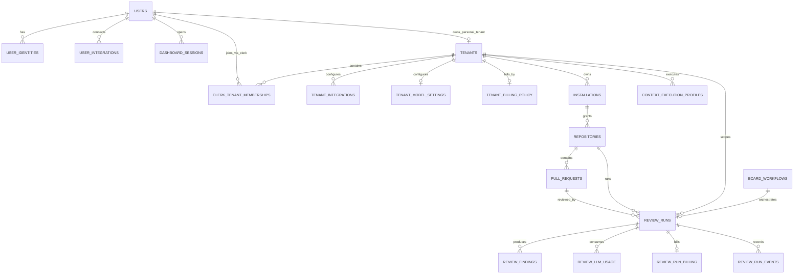
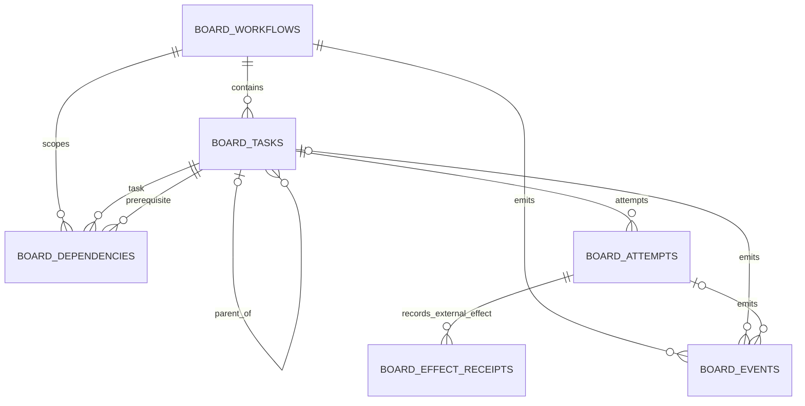
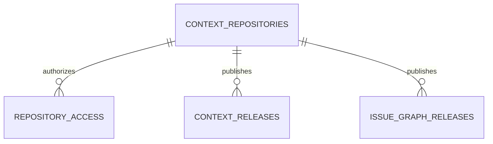

# Current database model

This document describes the effective schema after the ordered migration tail,
not every table that appeared in historical migration files. The authoritative
sources are:

- product migrations in `apps/api/product-migrations`;
- runtime and relational Board DDL in `packages/db/src`;
- Context DDL and roles in `packages/db/src/context`.

Migration `0037_collapse_context_schema.sql` is intentionally destructive. It
removes the pre-Board Context ingestion/projector database and does not preserve
a mixed-schema or pre-migration runtime.

## Inventory

A fresh PostgreSQL 17 migration smoke test produces **39 application tables**:

| Schema         | Count | Purpose                                                                         |
| -------------- | ----: | ------------------------------------------------------------------------------- |
| `public`       |    22 | product identity, GitHub intake, reviews, settings, billing, and API tokens     |
| `jina_runtime` |    11 | relational Board, Context snapshot Board, delivery dedupe, and release controls |
| `jina_context` |     6 | current Context catalogs, causal releases, ACL, checkpoints, and quotas         |

### `public` (22)

`api_tokens`, `clerk_tenant_memberships`, `context_execution_profiles`,
`dashboard_sessions`,
`github_webhook_inbox`, `github_webhook_redelivery_requests`,
`installations`, `pull_requests`,
`repositories`, `review_findings`, `review_llm_usage`, `review_run_billing`,
`review_run_events`, `review_runs`, `schema_migrations`,
`tenant_billing_policy`, `tenant_integrations`,
`tenant_model_settings`, `tenants`, `user_identities`, `user_integrations`, and
`users`.

### `jina_runtime` (11)

`api_state`, `board_attempts`, `board_dependencies`, `board_effect_receipts`,
`board_events`, `board_tasks`, `board_workflows`,
`causal_graph_release_control`, `github_deliveries`, `release_control`, and
`schema_migrations`.

### `jina_context` (6)

| Table                       | Current responsibility                                                                        |
| --------------------------- | --------------------------------------------------------------------------------------------- |
| `repositories`              | Context repository identity and default ref                                                   |
| `repository_access`         | direct principal permission; replaces observation and ACL projection tables                   |
| `context_releases`          | one validated catalog JSON document per Board release, plus its one-time PageIndex attachment |
| `issue_graph_releases`      | immutable causal graph release artifacts                                                      |
| `context_phase_checkpoints` | durable artifacts for phases embedded inside current page-oriented tasks                      |
| `context_quota_ledgers`     | one quota ledger per tenant                                                                   |

Hashed API-token credentials live in `public.api_tokens` (promoted by
migration 0038). The only `jina_context` view is the transitional
`api_tokens` compatibility view over that table. “Current” Context and causal
releases are derived by ordering immutable releases by `ref_sequence`; no
mutable current pointer table exists.

## Entity relationships

### Product identity, GitHub, and review

`repositories` also has a composite `(tenant_id, installation_id)` relationship
to `installations`, preventing a repository from crossing installation tenants.
Inbox and redelivery rows are logically joined by their delivery identifiers;
they deliberately do not own the workflow graph. The inbox is always processed
by the current Board workflow; there is no cutover-mode control table.

### Relational Board

All Board child relationships carry tenant and workflow keys as composite
foreign keys. This makes it impossible to connect tasks, dependencies, attempts,
receipts, or events across tenants or workflows. `api_state` remains the single
transactional JSON Board snapshot used by Context workflows. `release_control`
and `causal_graph_release_control` fence deployments and worker generations;
`github_deliveries` deduplicates non-product webhook intake.

### Context and causal graph

Those three relationships use the composite `(tenant_id, repository)` key.
`context_phase_checkpoints` and `context_quota_ledgers` are tenant-scoped control
records without a repository foreign key because checkpoints can be written
before repository publication and quota rows cover all repositories in a tenant.
`public.api_tokens` (promoted out of `jina_context` in migration 0038 so other
product features can authenticate with the same credentials) are tenant-scoped
and do not depend on a product user; the principal is stored as a normalized
string so service principals remain valid. The Context token capability role
keeps its scoped grants and row policies on the promoted table, and a
transitional `jina_context.api_tokens` view preserves the old name until the
next baseline squash.

## Current happy-path lifecycle

1. Product GitHub intake persists the delivery and admits one relational
   `board_workflow`; the product `review_runs` row references that workflow.
2. The Board owns tasks, attempts, dependency resolution, effect receipts, and
   events. Product result tables own review findings, usage, and billing.
3. The Context JSON Board validates and certifies page-oriented output.
4. Publication inserts one `context_releases` row containing the full query
   catalog. PageIndex attaches once by updating that same row.
5. Query reads select the latest attached release and hydrate its catalog in memory.
6. Causal publication inserts an immutable `issue_graph_releases` row; current
   state is the highest release sequence for the ref.

## Removed storage

Migration `0037_collapse_context_schema.sql` drops:

- the unused product `bots` table (dashboard bot status is derived from review runs)
  and the completed one-time Clerk membership bootstrap ledger;
- the retired scenario lineage, scenario version/step, simulation, and
  simulation-step tables;
- mutable current-release pointer tables and publication staging tables;
- Context ingestion observations, Git object mirrors, structural/identity tables,
  evidence and knowledge normalization tables;
- projector queues, generations, checkpoints, outbox, materialized query tables,
  ACL projections, and compatibility views;
- capability roles used only by that deleted pipeline.

The product migration runs from the exact API image through
`dist/product/migrate-all.js --install-roles`. Staging and main use this same
ordered migration tail before candidate traffic starts. No separate reset,
cutover database, or pre-migration compatibility job remains.
