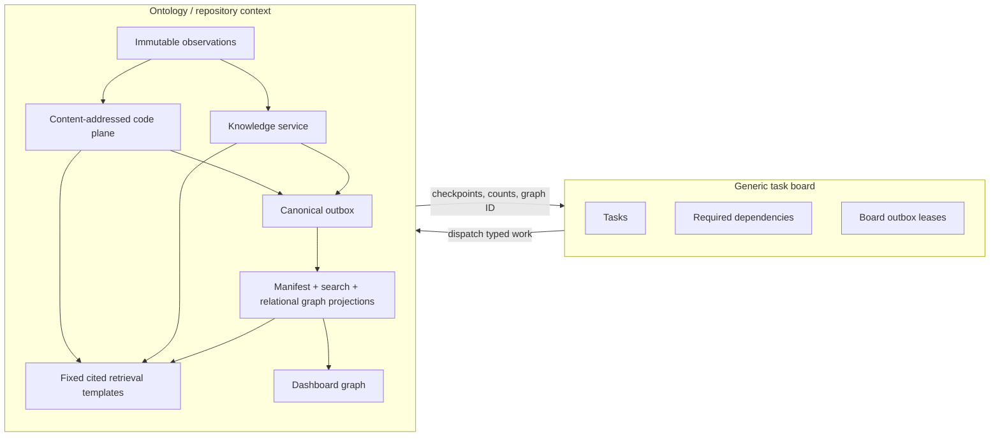

# Ontology — Repository Context Architecture

## Status

This document describes the implementation in this repository as of 2026-07-21. Ontology is one workflow on Jina's generic task board. The board controls work; Ontology owns repository facts and cited retrieval. The graph shown on `/ontology` is a disposable read model, not the canonical store.

The implementation contains the Repository Context Architecture v5.1 causal model (registry contract `repository-context-v5.6-causal`) with three board-visible chunks rather than a card per internal mechanism:

| Task type | Internal responsibilities | Durable completion |
| --- | --- | --- |
| `ontology_ingest` | Immutable GitHub/Git intake, new reachable commits, first-parent deltas, content-addressed parsing, and deterministic PR/issue/CODEOWNERS/package/service/deployment/incident normalization | Observations, code-plane rows, explicit source facts, and code checkpoint are durable |
| `ontology_assert` | Daytona checkout, Codex semantic analysis, citation validation, model observation, and registry validation, including VirtualIssue, Feature, movement, impact, documentation, and causal proposals | Raw model output is recorded and every supported inference is stored as `proposed` |
| `ontology_project` | Ref-scoped canonical outbox claim, redirect reconciliation, ref-manifest/search rebuild, relational graph materialization, retention | Projection checkpoint and immutable graph generation are durable |

`ontology_build` remains an aggregate parent. Internal stages are not board primitives and do not appear as extra cards.

The Task types page renders this declared topology as a workflow dependency tree, with prerequisite completion **unblocking** the waiting task, conditional links labeled inline, and redundant direct aggregate completion gates called out on the terminal node. Creation triggers are rendered separately on every task type: `POST /ontology/build` creates the aggregate and all three stage tasks, queues `ontology_ingest`, and leaves assertion/projection waiting on their declared prerequisites. `ontology_ingest` therefore has an intake trigger but no prerequisite **task**; making it depend on `ontology_build` would deadlock because that aggregate waits for ingestion, assertion, and projection to finish. The full registry shows creation triggers, prerequisite tasks, and downstream dependents separately. This catalog view is workflow metadata and does not read or infer dependencies from live board task instances.

## Separation of concerns



The board stores repository/ref inputs and checkpoint IDs. It does not store observations, symbols, assertions, redirects, search documents, or graph semantics. Ontology never treats task dependencies such as `blocks` or `publishes` as repository predicates.

## Runtime flow

### Intake and incrementality

The ontology worker resolves the requested ref, then walks the commit DAG backward. Before fetching a commit tree it asks the canonical store which SHAs already exist. A repeated build therefore reads only the head tree; a new head ingests only the previously unseen subgraph until it reaches known parents. `ONTOLOGY_HISTORY_LIMIT` is a safety fence (default 10,000 commits); exceeding it fails rather than storing a partial history.

Each commit stores parents, author external ID, commit time, message, and only its first-parent churn. The root is a set of adds; later `commit_changes` rows record add, modify, delete, and exact-content rename. `commit_manifest(tenant, repository, sha)` reconstructs any historical tree by walking first-parent changes, and `ontology_project` materializes that state only for hot refs. A force-push moves a ref; it does not rewrite commit facts.

Blobs are tenant-scoped and keyed by Git SHA. Parsing is keyed by `(tenant, blobSha, parserVersion)`, so unchanged content is parsed once across every commit and ref. TypeScript and JavaScript use tree-sitter through `@ast-grep/napi`; the versioned fallback supports deterministic definitions/imports for other recognized languages. Parse rows contain signature hashes and `calls | imports | references | extends` edges.

GitHub PRs and issues remain raw observations. Pure normalizers derive only explicit facts:

- `AUTHORED_BY` from the GitHub actor;
- `INCLUDES` from PR-to-commit membership;
- `MERGED_AS` from GitHub's merge commit, only after the PR is merged;
- `RESOLVES` from explicit close/fix/resolve syntax;
- `REFERENCES` from explicit issue mentions;
- pattern-qualified `OWNED_BY` from CODEOWNERS.

The same intake task deterministically recognizes direct dependencies in npm, Python, Go, Cargo, Ruby, Maven, and Gradle manifests; named services in Compose, Kubernetes, Cloud Run, service catalogs, nested or suffixed Dockerfiles, and explicit Cloud Run deployment workflow commands; GitHub deployments and completed deploy/release workflow runs; GitHub issues explicitly labeled `incident`; and postmortem documents carrying a stable incident ID. A root `Dockerfile` alone does not mint a service because it has no unambiguous service name. These inputs produce stable `Package`, `Service`, `Deployment`, and `Incident` entities plus source-backed `DEPENDS_ON`, `DEPLOYS`, `TARGETS`, `REFERENCES`, and explicit `INCIDENT_IMPACTS` facts. A lockfile confirms resolution but never invents a direct dependency. Removing a manifest, service definition, postmortem, or CODEOWNERS file emits a current-ref tombstone and retracts that source's former live facts; entities and immutable observations remain available for audit. An unavailable optional GitHub Deployments or Actions permission does not block Git/code intake. Ambiguous service mappings and similarity-only rename candidates are observations for `ontology_assert`, not active facts.

Commit authorship is derived from commits plus accepted identities and is not duplicated as an assertion.
Ingest reports GitHub snapshots as `new`, `updated`, or `confirmed` independently from new commits and parsed/reused blobs. A PR or issue edit at an unchanged Git head therefore makes the ingest effect `changed` instead of being hidden as a ref confirmation. Ingest also emits a canonical evidence fingerprint over the code checkpoint, source observations, bounded focus paths, and PRs whose complete changed-file lists contain problem evidence. Assertion lookup is exact on tenant, repository, commit, generator, registry, and this fingerprint; any mismatch runs assertion generation instead of risking stale semantic output. A changed semantic input creates a new immutable model-output generation. Re-emitting the same semantic assertion only updates `lastConfirmedAt`; it never overwrites its provenance or human review status. Facts that disappear from a later model output are not silently retracted.

### Semantic assertion generation

The assertion worker checks out the immutable commit in Daytona and asks Codex about one bounded focus list. Head changes come first; when several commits are newly ingested, still-present documentation/tests and then recent historical changes are included up to `ONTOLOGY_ASSERTION_FOCUS_LIMIT` (default 200). If a new generator has no cached output for an already-known commit, its one uncached run uses the same bounded selector over the current tree, prioritizing documentation and tests, and rehydrates only recent merged PRs that look like untracked repairs so older VirtualIssue candidates are not lost without scanning every PR. Before the model call, the worker streams bounded prefixes from up to 32 prioritized files concurrently and includes a bounded, line-numbered evidence bundle in the prompt (`ONTOLOGY_FOCUS_BUNDLE_MAX_CHARS`, default 16000; `ONTOLOGY_FOCUS_BUNDLE_FILE_CHARS`, default 3000). Each remote stream is aborted at its byte budget, so transfer and memory use are bounded before prompt construction. This removes sequential model tool turns without creating parallel assertion writers; repository tools remain a fallback for unresolved citations. It also rehydrates the exact immutable GitHub/CODEOWNERS observations named by ingestion and supplies them inline as untrusted evidence data. For every PR in scope, ingest fetches its complete commit membership and changed-file list with bounded concurrency (`ONTOLOGY_GITHUB_PR_CONCURRENCY`, default 4) and fails closed if the bounded pagination cannot prove completeness. A PR is required to produce a virtual Issue only when its own current changed files contain durable problem evidence; another PR in the same backfill cannot trigger it, and a later GitHub edit cannot replace its canonical `INCLUDES` facts with a partial discovery-frontier list. Problem evidence is recognized only by evidence-oriented path components or complete filename tokens, not substrings such as `debugger.ts` or `regression_metrics.ts`. The host lists those anchors and explicit root-cause anchors found in named root-cause/incident records, plus the exact deterministic Package/Service/Deployment/Incident IDs the model is allowed to reference. Any model-created source identity outside that set is rejected. The model remains responsible for the semantic title, explanation, confidence, relationships, and exact citations. Every model-supplied code citation is checked against the checkout before completion. Causal citations must cover the explicit root-cause span naming the Issue, full SHA, and mechanism; semantic agreement between that span and `why` remains part of the required human review rather than a brittle lexical heuristic. The host does not amend model evidence. The exact parsed model document is retained separately from the normalized graph used to create assertion intents. A parse, line-range, source-identity, causal-citation, omitted explicit root-cause assertion, or required-VirtualIssue validation failure receives one repair attempt inside the same assertion task and sandbox; a second failure remains fail-closed.

An Issue is a provider-backed problem entity. A GitHub issue uses a `github:issue:<repository>#<number>` natural key, and its explicit `RESOLVES` relationships come only from deterministic intake. When a merged PR has no linked issue, explicitly repairs a bug/regression, and changes durable problem evidence, the assertion contract requires one `VirtualIssue` candidate and `VirtualIssue RESOLVED_BY PullRequest`. Its natural key is `virtual-issue:<repository>:<content-digest>`, so it identifies the problem statement rather than a task attempt. Refactors, dependency updates, documentation, chores, feature-only work, and text explicitly saying the PR is not a fix do not qualify. The model cannot mint a GitHub issue number, create more than one candidate for a PR, change the PR anchor, or create one when intake found an explicit resolution. A later real Issue can be joined through the existing entity-redirect mechanism without rewriting history.

A Feature is a repository-scoped, model-inferred identity for a named externally observable capability, never a synonym for a file, component, or task. Its host-validated natural key is `repo:<repository>:feature:<stable-slug>`. Explicit repository evidence may propose `File | Symbol IMPLEMENTS Feature`, `Feature DOCUMENTED_BY Document`, `Commit | PullRequest | Issue LIKELY_AFFECTS Feature`, and reviewed Feature/Service ownership. Deterministic old/new blob similarity supplies only `MOVED_FROM` candidates; the model must cite continuity before the assertion can be reviewed. These predicates remain manual-review inferences. Acceptance makes them canonical knowledge; the existing project task renders them in the disposable dashboard graph without adding another board task.

Models never activate knowledge. All model relationships, including `INTRODUCED_BY`, enter as `proposed`. Causality requires an Issue, VirtualIssue, or Incident identity; a full Commit or explicit Deployment identity; a nonempty reason; and checked evidence. Temporal proximity or membership in a resolving PR is insufficient. A human reviewer decides whether the stated reason is semantically supported. An authenticated `review_assertion` command accepts, rejects, or retracts model facts and appends an audit row. `assertion_relations` records evidence-backed `supports` and `contradicts` links between assertion IDs without inventing necessity/sufficiency predicates. `GET /ontology/assertions` exposes repository-scoped summaries, evidence, and related assertions for dashboard review.

### Projection

The project task uses queue-claim semantics (`FOR UPDATE SKIP LOCKED`) for canonical outbox events. It then:

1. reconstructs the current commit from churn and materializes `ref_manifest` for the hot ref;
2. rebuilds repo-scoped lexical and 64-dimensional vector search documents;
3. folds append-only entity redirects and reconciles logical assertion collisions;
4. performs reachability/recent-window code-plane GC and bounded rejected-model payload retention;
5. acknowledges repository-wide outbox events only after every tracked ref has rebuilt successfully;
6. creates or reuses the immutable, content-addressed relational graph generation for the commit, projection version, and resulting canonical content.

`causal_trace` generalizes causal traversal over roots of kind `Issue`, `VirtualIssue`, `Feature`, `Incident`, or `Service`. It reads the latest graph materialized by `ontology_project`, preserves every reviewed causal path, and groups causes, resolutions, implementations, impacts, direct dependencies, deployments, documentation, ownership, movement, and structural CALLS/IMPORTS paths. Every path carries assertion/observation and code citations. `issue_trace` and `feature_trace` remain compatibility templates over the same projected graph; there is no per-root JSON cache. Retrieval is read-only and cannot create knowledge or repair a missing graph; `ontology_project` remains the exclusive graph writer.

The former `issue_traces` JSON table was evaluated rather than retained speculatively. Direct traversal measured 5.9 ms p95 on the real validation repository and 35.7 ms p95 on a synthetic 5,000-issue graph, below the 100 ms database budget. The cache was therefore removed. See [ISSUE_TRACE_BENCHMARK.md](ISSUE_TRACE_BENCHMARK.md).

Every projected graph item carries evidence. Code and accepted model facts keep
their checkout-validated `path:line` citations. Deterministic GitHub facts that
come from PR, issue, or CODEOWNERS normalization carry their immutable
`observation:<id>` provenance into the graph; an active source assertion without
that provenance is excluded instead of relying on an empty-evidence shortcut.

Bulk history ingestion bypasses per-blob outbox fan-out; the final project rebuild is the bulk recovery path. Steady-state canonical changes emit aggregate events transactionally.

The ontology worker drains canonical events before completing a project task and while idle. Ref-specific events may be handled by that ref alone. Repository-wide events receive one durable fanout lease, force every tracked ref to rebuild, and are acknowledged only after all those ref projections and graphs succeed; a failed fanout releases the lease for retry. Tenant-global identity or redirect events fan out across current repositories. Tombstones with no remaining ref are acknowledged after their command transaction has purged the projections. A single-ref rebuild cannot claim a ref-less event or acknowledge another repository's pending event.

Once an exact semantic scope has been generated, an unchanged ref is a no-op through the expensive path: the head is reported as confirmed, every blob analysis is reused, the exact generator checkpoint returns cached proposals without starting Daytona, and manifest/search rebuilding is skipped when no scoped canonical event is pending. A cold history backfill may intentionally run one later bounded current-tree generation when its traversal scope converges; subsequent identical requests are exact-cache hits. Stage results carry `effect: changed | confirmed | noop`. Projection content is addressed independently of its worker task, so an unchanged result returns the existing graph ID and the graph store performs no duplicate write.

## Canonical storage

All tables are in PostgreSQL under `jina_ontology`, and every row is tenant-scoped.

| Plane | Tables |
| --- | --- |
| Intake | `observations` |
| Code | `commits`, `refs`, `commit_changes`, `blobs`, `blob_analyses`, `blob_symbols`, `blob_imports`, `symbol_edges` |
| Knowledge | `entities`, `identities`, `entity_redirects`, `assertions`, `assertion_relations`, `audit_log` |
| Infrastructure | `outbox`, `erasure_filters`, `repository_acl` |
| Rebuildable projections | `ref_manifest`, `search_documents`, `graphs`, `nodes`, `edges` |

`commit_changes` is the canonical historical storage and grows with churn. `commit_manifest(...)` reconstructs a requested commit; `ref_manifest` stores the hot-ref result used by retrieval and projection. An upgraded database may retain the old `commit_files` table, but current writers and readers ignore it. Graph rows are immutable and content-addressed by commit, projection version, and canonical graph content, so an unchanged rebuild reuses the existing generation.

PostgreSQL, rather than application convention, enforces same-tenant references for entities, identities, observations, assertions, audit records, refs, manifests, and blobs. Partial unique indexes enforce one live cardinality-one assertion and one exact live candidate. Schema migrations run separately from the application role: `jina_ontology_writer` can read and mutate canonical rows but cannot alter the schema, and `jina_ontology_reader` is read-only.

Upgrades preserve the former `model_outputs` and `issue_traces` tables instead of destructively deleting deployed data, but current writers and readers ignore those caches. The immutable `model_output` observation is the sole model-generation record. Current projection accepts both deterministic `PullRequest RESOLVES Issue` and reviewed `Issue | VirtualIssue | Incident RESOLVED_BY PullRequest | Deployment` relationships.

### Assertions

The assertion schema and domain support object or typed literal values for registry growth; all currently registered predicates are relationships. Assertions also carry typed qualifiers, confidence for inference predicates, provenance (`sourceObservationId XOR assertedBy`), generator, registry version, validity, and five statuses:

```text
proposed | active | rejected | superseded | retracted
```

Only `status`, `validTo`, `supersededBy`, and `lastConfirmedAt` mutate after insert. Re-observation updates only `lastConfirmedAt`. Natural-key lookup, advisory locks, and uniqueness are scoped by tenant and repository and include a canonical qualifier hash. Cardinality-one supersession is scoped by `(tenant, repository, subject, predicate, qualifiersHash)`. Projection retains qualifiers and gives qualifier-distinct assertions separate materialized edges.

### Registry

The typed registry is [registry.ts](../packages/ontology/src/registry.ts). It declares endpoint kinds, predicate class, cardinality, qualifiers, review policy, bitemporality, and authority. It is versioned in Git and stamped on assertions.

The implemented predicate set is:

```text
AUTHORED_BY  OWNED_BY  MEMBER_OF  INCLUDES  MERGED_AS
RESOLVES  REFERENCES  INTRODUCED_BY
LIKELY_AFFECTS  MOVED_FROM  IMPLEMENTS  DOCUMENTED_BY
RESOLVED_BY  DEPENDS_ON  DEPLOYS  TARGETS  INCIDENT_IMPACTS
```

Structural `CONTAINS`, `DECLARES`, `CALLS`, `IMPORTS`, `REFERENCES`, and `EXTENDS` edges remain in the code plane and are not assertion rows.

## Identity and repair

Repositories and commit SHAs receive accepted deterministic identities. GitHub users receive accepted GitHub identities. Git-email links remain proposed.

Entity merge/unmerge is append-only. Assertions keep the IDs originally asserted. Every read path folds the redirect ledger. A merge command checks cycles and emits `redirect_added`; projection reconciliation then:

- keeps the newest fact for cardinality-one collisions;
- keeps the earliest row for exact duplicates;
- supersedes losers with an audited `svc:reconciliation` action.

Unmerge cancels the matching redirect but does not silently restore facts superseded during reconciliation.

## Retrieval

Models cannot compose database queries. The API exposes eight deterministic templates:

| Template | Answer path |
| --- | --- |
| `issue_trace` | issue title/body phrase, issue number, PR, or commit → projected graph issue → resolving and introducing PRs/commits → canonical reason/evidence and changes |
| `feature_trace` | extracted feature phrase → active reviewed Feature relationships → implementing files/symbols, documentation, and reviewed likely-impact sources |
| `causal_trace` | resolved Issue/VirtualIssue/Feature/Incident/Service root → all reviewed causal, impact, implementation, dependency, deployment, documentation, ownership, and movement paths |
| `counterfactual` | resolved outcome plus PR/commit/package/deployment/implementation intervention → remove matching paths from the causal trace in memory → report removed and remaining paths |
| `structure` | validated name/moniker/path → definitions and typed edges inside the selected ref manifest |
| `change` | PR → included commits → first-parent changes → changed symbols → inbound affected surface |
| `intent` | file history → commits → PRs → resolved/referenced issues → raw observation text |
| `ownership` | active/source ownership by registry authority → recent commit authors via accepted identities |

Every item carries code, commit-change, assertion, entity, or observation citations plus score and explicit truncation. Expansion is limited to 200 items. Issue and Feature retrieval require a materialized graph for the resolved ref and admit model assertions only when every cited blob is unchanged in that ref; stale or missing evidence produces no relationship rather than leaking a claim from another branch. Repository permission is checked before querying and again before results leave the API.

`POST /ontology/ask` chooses only those fixed templates. Its conservative planner extracts issue/root text, features, PRs, commits, packages, deployments, repository paths, and identifier-shaped symbols. Counterfactual phrasing selects the fixed `counterfactual` template, loads a materialized causal trace, removes every path containing the resolved intervention, and recomputes the known paths in memory. The response includes `basis: graph-derived`, intervention, outcome, removed/remaining paths, cited claims, ambiguities, and coverage gaps. It says that all *currently known reviewed* paths disappear; it never claims an outcome was impossible through an unknown path. The endpoint remains synchronous and read-only and creates no board task or stored counterfactual fact.

The dashboard renders the direct answer and cited claims before the underlying retrieval calls. It also renders ambiguities and coverage gaps explicitly. Causation questions lead with the introducing PR and commit plus dedicated **Why** and **Evidence** fields; any later resolving PR is shown afterward as a later fix. An absent reviewed causal assertion is reported as unavailable rather than inferred from the later fix.

The interactive graph prefers the Cosmos WebGL renderer, including for large graphs. GPU capability is checked before startup and asynchronous WebGL initialization failures are caught. Either case switches to a deterministic Canvas 2D renderer instead of leaving an empty panel. To keep that compatibility path responsive, Canvas ranks nodes by connectivity and caps rendering at 1,200 nodes and 3,000 non-dangling edges. Its status reports rendered and source totals for both nodes and edges, while the summary labels the post-filter graph totals as visible nodes and edges; cited data and the table view remain complete. The renderer policy has a synthetic 5,000-node/20,000-edge regression test, and `?renderer=canvas` provides a deterministic browser-diagnostic path.

## Security

- Production data routes require the server-side internal bearer credential and derive `tenantId` from server configuration, never from request payloads.
- Cloud Run IAP authenticates the browser. The dashboard proxy removes caller authorization/tenant/principal headers, forwards the verified IAP email as a `user:` principal, and adds its service credential server-side.
- Graph details, retrieval, and context assembly are tenant- and repository-scoped.
- `JINA_TENANT_ADMIN_PRINCIPALS` supplies the independent Jina tenant-admin relationship. Other users receive only repositories granted through `repository_acl` reader/writer/admin relationships. Board/event reads use the same repository scope; command authorization is rechecked in the canonical writer. Service principals can enumerate the tenant repositories required by workers.
- Blob rows are never shared across tenants.
- Workers have no database connection and mutate canonical state only through leased, authenticated API operations.
- Model output is untrusted input and cannot write active assertions or arbitrary queries.

The current modular-monolith API is the sole database client for intake, code, knowledge, and projection writer modules. Table ownership is enforced at those module boundaries; splitting them into separate database principals does not change storage or APIs.

## Lifecycle

Four operations are distinct and audited:

- **Tombstone repository** retracts live assertions, retires scoped entities, purges code-plane rows, graphs, search, manifests, and ACLs, and persists a durable repository filter.
- **Redact observation** destroys payload content, retains digest/reason/time, masks named commit messages, retracts dependent assertions, and purges search.
- **Erase person** marks identities erased, retires the Engineer, retracts facts about it and every assertion sourced from a destroyed personal observation, removes search documents, masks matching commit authors, and redacts observations containing erased external IDs.
- **Retention/GC** keeps commits reachable from refs, PR-linked commits, and a 90-day recent window; orphan blobs and parse rows are deleted. Rejected model payloads are removed after 30 days.

Ingest and rebuild consult `erasure_filters`, so replay cannot resurrect removed data.

## Operational signals

`GET /ontology/metrics` reports:

- outbox depth by event and oldest age;
- unparsed blob backlog;
- manifest and search staleness;
- proposed assertion count;
- accept/reject rates per generator and predicate.

The service-level targets originally defined in v5.1 remain unchanged in v5.6: ref-to-manifest p95 ≤30s, observation-to-search p95 ≤60s, redirect-to-reconciliation p95 ≤5m, warm template p95 ≤400ms, and personal erasure ≤24h. The metrics expose the required timestamps/counters; production alert thresholds belong in Cloud Monitoring.

## APIs

```text
POST /ontology/build
GET  /ontology
GET  /ontology/graphs/:id
GET  /ontology/metrics
GET  /ontology/assertions?repository=:repository
POST /ontology/retrieve
POST /ontology/ask
POST /ontology/commands
```

Internal worker routes are lease-fenced:

```text
POST /internal/ontology/ingest/known
POST /internal/ontology/ingest/plan
POST /internal/ontology/ingest/blobs
POST /internal/ontology/ingest/github
POST /internal/ontology/assertions/cached
POST /internal/ontology/assertions/evidence
POST /internal/ontology/outbox/drain
```

## Verification contract

The test suite proves:

- tree-sitter parsing, signature hashes, and typed edges;
- first-parent add/modify/delete/rename deltas;
- registry endpoint/qualifier validation;
- provenance XOR, review transitions, cardinality, redirects, reconciliation, and acceptance labels;
- GitHub work-item and CODEOWNERS normalization;
- package/service/deployment/incident normalization, source tombstones, and model source-identity rejection;
- explicit resolution/merge assertions and review-gated issue causality;
- fixed-template orchestration and citations, including reviewed Feature implementation lookup;
- real PostgreSQL intake → knowledge → causal projection → Feature/Issue/Incident retrieval and counterfactual flow;
- repository ACL denial, redaction, and personal erasure;
- board/API/worker lease behavior and dashboard rendering.

Run the database contract with PostgreSQL 17:

```sh
TEST_DATABASE_URL=postgresql://... pnpm --filter @jina/db test
```

CI provides PostgreSQL and runs this integration suite on every pull request.
