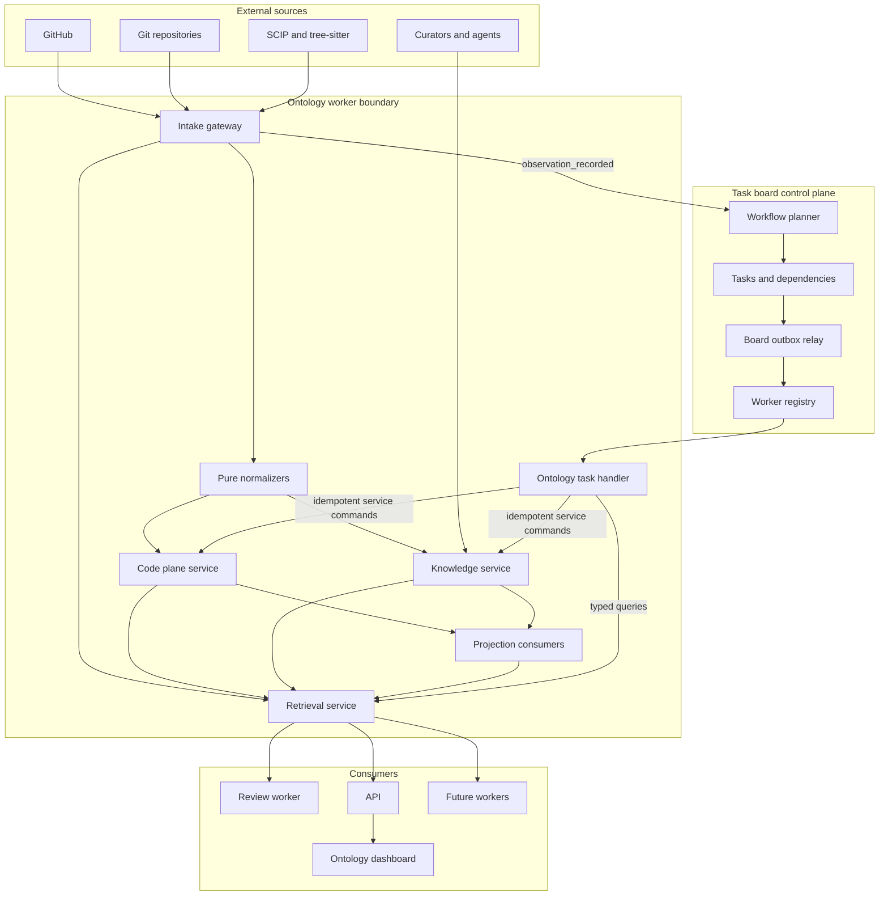
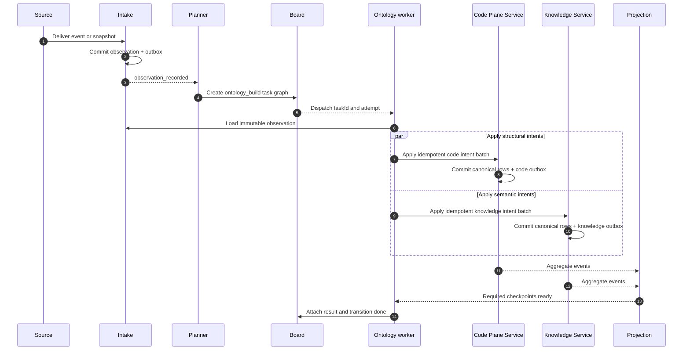

# Ontology Worker Architecture and Implementation Strategy

## Status and scope

This document defines the production architecture for **Ontology**, one worker integration on Jina's general-purpose task board. Immutable intake, content-addressed code facts, provenance-bearing assertions, and graph projection are implemented in the current runtime. Retrieval, identity reconciliation, curation commands, search, SCIP/tree-sitter adapters, and database-role ownership remain target extensions.

The shipped implementation as of 2026-07-19 is:

| Area | Current implementation |
| --- | --- |
| Board integration | Aggregate `ontology_build` with `ontology_ingest`, `ontology_assert`, and `ontology_project` children |
| Immutable intake | Git source snapshots and model output are stored as provenance-bearing observations |
| Code plane | Commits, refs, manifests, tenant-scoped blobs, symbols, and imports; analysis is cached by blob SHA and parser version |
| Knowledge plane | Typed entities and registry-validated assertions with confidence, provenance, status, generator version, and registry version |
| Incrementality | Only unseen blob/parser-version pairs are parsed; Codex focuses on paths changed from the first parent; assertions backed by unchanged evidence blobs carry forward |
| Projection | Dashboard graphs are disposable read models built from the selected manifest and active assertions |
| Validation | Strict model schema plus checkout validation for every cited path and line range |
| Read API | Tenant-scoped summary listing, latest full graph, and tenant-constrained graph detail |
| Dashboard | Interactive `/ontology` graph visualization and metadata |
| Not shipped | Human assertion-review UI, identity redirects/reconciliation, retrieval templates, search index, lifecycle workers, SCIP/tree-sitter adapters, and database-role ownership split |

The task board and Ontology remain separate: board state stores operational references and completion events; observations, code facts, assertions, and projections live in Ontology-owned tables.

Ontology is the user-facing product name. Internally, the subsystem is repository context: engineering memory built from source observations, mechanical code structure, curated knowledge, and cited retrieval.

Ontology is not the task board and the task board is not the ontology graph. The task board controls work; Ontology owns repository facts. Other workers—review, issue triage, publishing, fixing, testing, deployment, documentation, and future workflows—use the same board primitives without depending on Ontology's internal model.

## Decisions

1. **The board remains a generic control plane.** Its primitives stay tasks, dependencies, status, attempts, assignment, comments, events, gates, artifacts, and dispatch.
2. **Ontology is a registered worker, not a new board primitive.** It contributes namespaced task definitions and handlers through the worker registry.
3. **Ontology has one immutable intake and two canonical data planes.** Structural facts live in the code plane; disputable semantic facts live in the knowledge plane.
4. **Ontology's graph is a read model, never canonical storage.** Canonical storage is relational; graph-shaped views are disposable projections.
5. **The ontology registry is typed code.** Entity kinds, predicates, endpoints, qualifiers, cardinality, authority, and review policy are versioned and reviewed in Git.
6. **Every table has one writing component.** Workers call the authenticated API and never write Ontology tables directly. Dedicated database-role enforcement remains an operational hardening item.
7. **Normalizers are pure.** They transform an immutable observation into intents and never write storage.
8. **Board dependencies express execution readiness only.** Ontology predicates and data lineage never become task dependency relationships.
9. **The board stores references, not Ontology records.** Task inputs and results contain opaque IDs and summaries; entities, assertions, observations, and code edges remain in Ontology-owned storage.
10. **The canonical path is indivisible.** There is no production mode in which the board snapshot is the Ontology store, agents write assertions directly, or citations are reconstructed from task comments. Optional retrieval, search, curation, and lifecycle consumers may be added independently.

## System context



The board is adjacent to Ontology, not wrapped around its data model. An intake event may cause the workflow planner to create an Ontology task, and an Ontology task handler may call Ontology services, but neither side writes the other's tables.

## Vocabulary and bounded contexts

### Task board

The board answers operational questions:

- What work exists?
- Which worker owns it?
- What is ready, blocked, running, failed, or complete?
- Which tasks must finish before another task can run?
- Which attempt produced an artifact or external side effect?
- What did a human or worker say in the task thread?

Task completion means the requested operation satisfied its completion contract. It does not mean an assertion is true, a model output is accepted, or a projection is canonical.

### Worker registry

The registry is the extensibility boundary between the generic board and specialized workers. The board must not maintain a closed union or switch statement containing every workflow in the product.

```typescript
type TaskTypeId = string & { readonly __brand: "TaskTypeId" }

type WorkerDefinition<Input, Result> = {
  taskType: TaskTypeId
  workerId: string
  title: string
  description: string
  kind: "aggregate" | "dispatchable" | "manual" | "waitpoint"
  dispatchTopic?: string
  inputSchema: Schema<Input>
  resultSchema: Schema<Result>
  requiredCapabilities: readonly string[]
  run?: (context: WorkerRunContext, input: Input) => Promise<Result>
}
```

The application composes definitions from every installed worker at startup. The command boundary validates the definition and copies its immutable execution fields (`kind`, dispatch topic, worker ID, and definition version) onto the task. The reducer reads those fields instead of switching on domain task types. The board does not import the registry or worker domain packages.

### Ontology intake

Intake records what an external system, human, or model produced without deciding whether it is true. Observations are immutable except for an explicit redaction operation that destroys a payload while retaining its digest and audit reason.

### Code plane

The code plane contains mechanical, content-addressed facts produced by Git and parsers. Its version axis is the commit DAG. These rows do not have confidence, review status, provenance workflows, or wall-clock validity intervals.

### Knowledge plane

The knowledge plane contains semantic facts that may be disputed, reviewed, superseded, or retracted individually. Its assertion rows have provenance, status, validity, registry version, and audit linkage.

### Projections

Projections make canonical data fast to query. They include the default-ref manifest, search documents, and SQL current-graph views. They are disposable and rebuildable. A graph database may be added only as another projection; it never becomes the canonical write path.

### Retrieval

Retrieval provides deterministic, permission-filtered templates that return structured cited results. It is read-only. A thin orchestrator may classify a question and compose template calls, but models never generate arbitrary database queries.

### Workflow artifacts

Context bundles, review reports, logs, source snapshots, and generated files are immutable workflow artifacts. They are outputs of work, not canonical Ontology facts. The board stores artifact references; artifact storage owns content and retention.

## Separation-of-concern rules

| Concern | Canonical owner | Board representation |
|---|---|---|
| Task readiness and blocking | Board | Task and dependency rows |
| Worker input | Calling workflow or artifact store | Typed input reference |
| Source webhook or snapshot | Intake | Observation ID only |
| Commit, blob, symbol, call/import edge | Code plane | Operation/checkpoint summary only |
| Entity, identity, redirect, assertion | Knowledge plane | Entity/assertion ID only when relevant |
| Assertion accept/reject/retract | Knowledge service and audit log | Manual task plus audit-result reference |
| Search or current graph | Projection owner | Projection checkpoint only |
| Cited answer context | Workflow artifact store | Context-bundle artifact reference |
| Execution comments | Board task events | Never an assertion automatically |
| Human knowledge contribution | Intake or Knowledge command API | Task comment may link to resulting observation/audit ID |

The following are prohibited:

- Storing entities or assertions in task metadata.
- Treating `task.done` as `assertion.active`.
- Using task links such as `fixes`, `publishes`, or `context_for` as ontology predicates.
- Reconstructing canonical knowledge from board comments.
- Letting a review, model, parser, projection consumer, or task handler write knowledge tables directly.
- Letting Ontology update task status directly; it returns a result or event to the board command boundary.

## Board-facing Ontology contract

Ontology is one worker integration. Its current build registers only the large operational boundaries; these are worker operations, not new board primitives.

| Task type | Kind | Completion contract |
|---|---|---|
| `ontology_build` | Aggregate | Required ingestion, assertion, and projection children reached durable checkpoints |
| `ontology_ingest` | Dispatchable | Raw repository snapshot, commit/ref manifest, and every cache-missing blob analysis are durable |
| `ontology_assert` | Dispatchable | Cached or newly validated model output reached a knowledge checkpoint |
| `ontology_project` | Dispatchable | An immutable graph projection was rebuilt from canonical code facts and current-evidence active assertions |

Blob parsing remains batched inside `ontology_ingest`; it does not create one board card per file. Future query, assertion-review, rebuild, erasure, search, and reconciliation operations can register additional task types without changing board primitives.

### Future task input extensions

```typescript
type OntologyTaskInput =
  | {
      operation: "sync"
      tenantId: string
      repositoryId: string
      observationIds: readonly string[]
      targetRefs: readonly string[]
      normalizerVersion: string
      registryVersion: string
    }
  | {
      operation: "query"
      requestId: string
    }
  | {
      operation: "review_assertion"
      assertionId: string
      decision: "accept" | "reject" | "retract"
      reason?: string
    }
  | {
      operation: "rebuild"
      tenantId: string
      repositoryId: string
      scope: "code" | "manifest" | "search" | "all"
      parserVersion?: string
    }
  | {
      operation: "erase"
      commandId: string
    }
```

The board may store this validated payload as JSON for dispatch, but it is operational input, not repository truth. Large source payloads and generated bundles are always referenced by ID.

### Typed task result

```typescript
type OntologyTaskResult = {
  operationId: string
  operation: OntologyTaskInput["operation"]
  repositoryId?: string
  observationIds?: readonly string[]
  codeCheckpoint?: string
  knowledgeCheckpoint?: string
  projectionCheckpoint?: string
  registryVersion: string
  artifactIds: readonly string[]
  counts: Record<string, number>
  warnings: readonly string[]
}
```

The task handler attaches the result, appends a typed task event containing only the result reference and summary, and transitions through the existing board command layer.

### Board dependencies and links

Required dependencies mean only that one task cannot become ready until another required task is done. Data flow uses typed input and result references.

The existing board can continue to store a descriptive relationship for display, but dispatch and completion must not interpret domain-like labels. The target shape is:

```text
task_dependencies   required execution edges only
task_links          non-blocking workflow navigation only
task_artifacts      typed input/result references
```

Ontology predicates such as `RESOLVES`, `REFERENCES`, `OWNED_BY`, and `IMPLEMENTS` exist only in the ontology registry and knowledge plane.

## Ontology worker execution

### Target service decomposition

The current `ontology_ingest` → `ontology_assert` → `ontology_project` chain implements the same canonical boundaries in one API and worker deployment. When those stores are separated into independently scaled services, the contract becomes:

1. Load the validated task input and pinned worker, normalizer, parser, and registry versions.
2. Load each immutable observation from Intake.
3. Run the source normalizer as a pure function.
4. Submit code intents to the Code Plane Service using `(tenant, observation, normalizerVersion)` as the command idempotency scope.
5. Submit knowledge intents to the Knowledge Service using the same scope.
6. Allow the two plane transactions to commit independently; there is no cross-plane transaction.
7. Wait for the requested ref manifests and required query projections to reach the operation checkpoint.
8. Write an immutable operation result artifact.
9. Attach the artifact and transition the task through board commands.

If one canonical write commits and the run fails before board completion, the renewable board lease expires and the Cloud Run worker retries the task. Re-running the pure parser/normalizer produces the same facts; natural keys and command idempotency make already-applied work a no-op.



### Retrieval for another worker

A review or other worker that needs repository context creates an `ontology.query` task with a `ContextRequest` ID and blocks on it using an ordinary required task dependency.

```typescript
type ContextRequest = {
  id: string
  tenantId: string
  actorId: string
  repositoryIds: readonly string[]
  target: { repositoryId: string; ref: string; commitSha: string }
  question: string
  templates: readonly ("structure" | "change" | "intent" | "ownership")[]
  limits: { maxItems: number; maxTokens: number; maxFanIn: number }
  permissionSnapshotId: string
  createdAt: string
}

type ContextBundle = {
  id: string
  requestId: string
  targetCheckpoint: string
  items: readonly CitedContextItem[]
  truncation: readonly TruncationNotice[]
  registryVersion: string
  createdAt: string
}
```

The retrieval service returns structured cited items. The workflow artifact writer persists the bundle and the task result references it. The consuming worker loads the bundle from artifact storage; it does not scrape the producer's task comments.

### Assertion review

Generated assertions enter the knowledge plane as `proposed` unless registry policy allows activation. Manual review is represented as an `ontology.review_assertion` board task assigned to a human.

Completing the task does not mutate the assertion directly. The task handler submits an authenticated command to the Knowledge Service. The Knowledge Service validates the registry policy, appends an audit row, transitions the assertion, commits an outbox event, and returns the audit ID. Only then does the board task complete with the audit-result reference.

### Backfill and rebuild

An `ontology.rebuild` task is a board-visible aggregate operation. It scans canonical state directly rather than producing millions of steady-state outbox events. Internal partitions are processed by the Ontology worker queue and exposed as counters, checkpoints, and failed partition IDs on the task.

The rebuild path must apply the same erasure and redaction filters as live ingestion. Rebuilding may never resurrect masked or erased data.

## Intake and normalizers

### Observation model

```text
ontology_intake.observations
- id
- tenant_id
- source
- type                 # source_event | source_snapshot | analysis_result | human_input | model_output | tombstone
- external_id nullable
- repository_id nullable
- occurred_at nullable
- recorded_at
- payload jsonb nullable
- payload_object_uri nullable
- payload_sha
- supersedes_id nullable
- redacted_at nullable
- redaction_reason nullable
```

Constraints:

- Unique `(tenant_id, source, external_id)` when `external_id` is present.
- Exactly one of `payload` and `payload_object_uri` before redaction.
- Payload mutation is forbidden except through the audited redaction command.
- Every model output enters as an observation; models never write assertions.

### Normalizer contract

```typescript
type NormalizationResult = {
  entityIntents: readonly EnsureEntityIntent[]
  identityIntents: readonly ProposeIdentityIntent[]
  assertionIntents: readonly ProposeAssertionIntent[]
  codeIntents: readonly CodeIngestIntent[]
}

type Normalizer = (
  observation: Observation,
  context: { normalizerVersion: string; registryVersion: string }
) => NormalizationResult
```

Normalizers must be deterministic for the same observation and version pair. Unit tests snapshot normalized intent batches. Normalizers do not import database clients, HTTP clients, board commands, or provider SDKs.

## Code plane

### Canonical schema

```text
ontology_code.commits
- tenant_id
- repository_id
- sha
- parents text[]
- author_external_id nullable
- committed_at
- message nullable
primary key (tenant_id, repository_id, sha)

ontology_code.refs
- tenant_id
- repository_id
- ref_name
- commit_sha
- updated_at
primary key (tenant_id, repository_id, ref_name)

ontology_code.commit_changes
- tenant_id
- repository_id
- commit_sha
- path
- old_blob_sha nullable
- new_blob_sha nullable
- change_type
primary key (tenant_id, repository_id, commit_sha, path)

ontology_code.blobs
- tenant_id
- repository_id
- blob_sha
- byte_size
- language nullable
- content_object_uri nullable
- parser_version nullable
- parsed_at nullable
primary key (tenant_id, repository_id, blob_sha)

ontology_parse.blob_symbols
- tenant_id
- repository_id
- blob_sha
- parser_version
- moniker
- kind
- range_start
- range_end
- display_name
primary key (tenant_id, repository_id, blob_sha, parser_version, moniker)

ontology_parse.symbol_edges
- tenant_id
- repository_id
- blob_sha
- parser_version
- source_moniker
- edge_type
- target_moniker
- location jsonb
primary key (tenant_id, repository_id, blob_sha, parser_version, source_moniker, edge_type, target_moniker, location)
```

Parsing is a pure function of tenant-scoped blob content and parser version. A blob is parsed once for a parser version. Parser upgrades create a new keyed result and replace the selected version wholesale; individual structural edges are never reviewed or retracted.

The Code Plane Service owns commits, refs, changes, and blobs. Parse workers own only the symbol and edge tables, using a distinct database role. This resolves “one writer per table” precisely even when both are horizontally scaled.

## Knowledge plane

### Canonical schema

```text
ontology_knowledge.entities
- id
- tenant_id
- kind
- natural_key
- display_name nullable
- created_at
- retired_at nullable
unique (tenant_id, kind, natural_key)

ontology_knowledge.identities
- id
- tenant_id
- source
- external_id
- entity_id
- status              # proposed | accepted | rejected | erased
- confidence nullable
- source_observation_id nullable
- created_at
unique (tenant_id, source, external_id, entity_id)

ontology_knowledge.entity_redirects
- id
- tenant_id
- from_entity_id
- to_entity_id
- kind                # merge | unmerge
- audit_id
- created_at

ontology_knowledge.assertions
- id
- tenant_id
- subject_id
- predicate
- object_id nullable
- literal_type nullable
- literal_value jsonb nullable
- qualifiers jsonb
- qualifiers_hash
- status              # proposed | active | rejected | superseded | retracted
- confidence nullable
- source_observation_id nullable
- asserted_by nullable
- generator nullable
- valid_from nullable
- valid_to nullable
- last_confirmed_at
- recorded_at
- superseded_by nullable
- registry_version

ontology_knowledge.audit_log
- id
- tenant_id
- actor_id
- action
- input jsonb
- result              # accepted | rejected
- reason nullable
- created_at
```

Knowledge Service invariants:

- Exactly one of `object_id` and literal value is present.
- Exactly one provenance route is present: `source_observation_id` or `asserted_by`.
- Predicate, endpoint kinds, literal type, qualifiers, review policy, and authority validate against the pinned registry version.
- Active/proposed assertion natural keys deduplicate on subject, predicate, object or normalized literal, and qualifier context.
- Cardinality-one supersession occurs atomically within a qualifier context.
- Redirects are append-only and cycle-checked.
- Readers resolve redirects; assertion subject and object IDs are never rewritten.
- The only mutable assertion fields are status, validity end, superseding assertion, and last-confirmed time.
- Every internal state transition has an audit record.

## Ontology registry

The registry lives under `packages/ontology/src/registry` and is published with a version stamped on assertions and context bundles.

```typescript
type EntityKind =
  | "Repository"
  | "File"
  | "Symbol"
  | "Commit"
  | "PullRequest"
  | "Issue"
  | "Engineer"
  | "Team"
  | "Document"

type PredicateDefinition = {
  name: string
  class: "relationship" | "attribute" | "inference"
  subjectKinds: readonly EntityKind[]
  objectKinds?: readonly EntityKind[]
  literalTypes?: readonly LiteralType[]
  cardinality: "one" | "many"
  qualifierKeys: readonly string[]
  review: {
    source: "none" | "manual"
    human: "none" | "manual"
    model: "manual" | { threshold: number }
  }
  bitemporal: boolean
  authority: readonly string[]
}
```

Initial complete registry:

- `AUTHORED_BY`: PullRequest or Issue to Engineer.
- `OWNED_BY`: Repository, File, or Symbol to Engineer or Team.
- `MEMBER_OF`: Engineer to Team.
- `INCLUDES`: PullRequest to Commit.
- `RESOLVES`: PullRequest to Issue.
- `REFERENCES`: Issue or PullRequest to File, Symbol, Commit, Issue, or PullRequest.
- `LIKELY_AFFECTS`: inference linking a change to affected code or work items.
- `MOVED_FROM`: inferred symbol/file continuity across revisions.
- `IMPLEMENTS`: File or Symbol to Issue.
- `DOCUMENTED_BY`: Repository, File, Symbol, Issue, or PullRequest to Document.

Structural relationships such as declares, calls, imports, paths, and commit changes remain in the code plane. Derivable facts such as commit authorship are computed by joining commits to accepted identities and are not asserted.

Registry tests must reject endpoint mismatches, undeclared qualifier keys, invalid review policies, and incompatible literal types. A registry version is immutable once deployed.

## Outboxes and internal events

Each writing component owns an outbox in its schema and commits event rows in the same transaction as canonical changes:

```text
board.outbox
ontology_intake.outbox
ontology_code.outbox
ontology_parse.outbox
ontology_knowledge.outbox
```

This avoids a shared table with multiple writers while allowing one relay library and one operational dashboard. Relays claim rows with `FOR UPDATE SKIP LOCKED`, publish or invoke the consumer idempotently, and acknowledge the row. Poison messages move to a dead-letter state with an operator-visible repair action.

Aggregate event taxonomy:

```text
observation_recorded   { observationId }
observation_redacted   { observationId }
commit_ingested        { repositoryId, commitSha }
blob_parsed            { repositoryId, blobSha, parserVersion }
ref_moved              { repositoryId, refName, oldSha, newSha }
entity_changed         { entityId }
identity_changed       { identityId }
assertion_changed      { assertionId }
redirect_added         { fromEntityId, toEntityId }
tombstone              { scope }
```

Events are aggregate-level, not one per symbol edge. Initial synchronization and rebuilds scan canonical state and update checkpoints instead of filling the steady-state outboxes with historical events.

## Projections and retrieval

### Default-ref manifest

`ontology_projection.ref_manifest` maps the selected ref to paths, blob SHAs, symbols, and selected parser versions. The manifest maintainer consumes `ref_moved` and code-ingestion checkpoints. Manifest rows are disposable.

### Current graph

Current graph views join:

- active, redirect-resolved knowledge assertions;
- entities and accepted identities;
- the selected ref manifest;
- code-plane symbols and structural edges.

The current graph is exposed through SQL views. Materialized views are allowed only for measured query pressure and must retain a source checkpoint.

### Search

Search indexes observation text, entity display names, and selected code identifiers in tenant-scoped PostgreSQL full-text and pgvector indexes. Every document carries tenant and repository scope. Search is never canonical; a replacement engine must remain behind the same projection contract.

### Retrieval templates

| Template | Contract |
|---|---|
| `structure` | Resolve names/monikers, traverse bounded structural edges in the target ref manifest, rank and cite code locations |
| `change` | Resolve PR commits and commit changes, compare old/new symbols, find bounded inbound dependencies, cite commits and code locations |
| `intent` | Trace file/symbol history to commits, PRs, issues, and source observation text with citations |
| `ownership` | Resolve explicit ownership assertions, source-derived ownership, and recent accepted-identity authorship in registry authority order |

Every template:

- accepts typed parameters;
- requires tenant, actor, repository permissions, and a pinned target ref;
- resolves entity redirects;
- limits and ranks fan-in;
- filters permissions before expansion and before returning results;
- returns structured items with entity, assertion, observation, commit, and code-location references;
- reports truncation explicitly;
- never returns uncited generated prose.

## Storage ownership and database roles

| Role | May write | May read |
|---|---|---|
| `jina_board_writer` | Board tables and board outbox | Board state and task artifacts |
| `jina_ontology_intake_writer` | Observations and intake outbox | Intake scope only |
| `jina_ontology_code_writer` | Commits, refs, changes, blobs, code outbox | Intake and code scope |
| `jina_ontology_parse_writer` | Blob symbols, symbol edges, and parse outbox | Tenant-scoped blob inputs |
| `jina_ontology_knowledge_writer` | Entities, identities, redirects, assertions, audit, knowledge outbox | Intake and registry data |
| `jina_ontology_projection_writer` | Manifest/search projection state | Canonical Ontology schemas |
| `jina_ontology_reader` | Nothing | Permission-filtered Ontology views |

Cross-plane references use IDs without cross-schema foreign keys that would couple transaction lifecycles. Services validate referential requirements at their command boundaries and retrieval tolerates independently converging planes.

Every tenant-owned row contains `tenant_id`. Database grants deny cross-component writes even if application code accidentally issues the SQL.

## Runtime and repository layout

```text
apps/
  api/
    src/routes/ontology.ts              # query and curated command endpoints
    src/routes/ontology-intake.ts       # authenticated connector entry

  dashboard/
    app/ontology/                       # Ontology product page
    app/board/                          # unchanged board columns
    app/task-types/                     # all registered worker definitions

  workflows/
    src/registry/worker-registry.ts
    src/workers/ontology/worker.ts
    src/workers/ontology/task-definitions.ts
    src/workers/ontology/handlers.ts

  ontology-runtime/
    src/intake-server.ts
    src/code-plane-server.ts
    src/knowledge-server.ts
    src/parse-worker.ts
    src/projection-worker.ts
    src/outbox-relays.ts

packages/
  board/                                # generic control-plane domain
  worker-contracts/                     # worker registry and typed refs
  ontology/
    src/contracts/
    src/registry/
    src/intake/
    src/normalizers/
    src/code-plane/
    src/knowledge-plane/
    src/projections/
    src/retrieval/
  artifacts/                            # immutable workflow artifacts
  db/
    src/ontology/
    migrations/
```

Import direction:

```text
board -> shared-kernel
worker-contracts -> shared-kernel
ontology registry/domain -> shared-kernel
ontology runtime -> ontology + db + provider adapters
ontology worker handler -> board commands + worker-contracts + Ontology service clients
review and future workers -> worker-contracts + Ontology retrieval client
dashboard -> API client only
```

`packages/board` must not import `packages/ontology`. Ontology domain code must not import board types. The worker handler is the adapter that knows both contracts.

## API and service ports

```typescript
interface IntakeCommands {
  recordObservation(input: RecordObservationInput): Promise<{ observationId: string }>
  redactObservation(command: RedactObservationCommand): Promise<{ auditId: string }>
}

interface CodePlaneCommands {
  applyIntentBatch(command: CodeIntentBatchCommand): Promise<CodeCheckpoint>
  rebuild(command: CodeRebuildCommand): Promise<CodeCheckpoint>
}

interface KnowledgeCommands {
  applyIntentBatch(command: KnowledgeIntentBatchCommand): Promise<KnowledgeCheckpoint>
  reviewAssertion(command: ReviewAssertionCommand): Promise<{ auditId: string }>
  mergeEntities(command: MergeEntitiesCommand): Promise<{ auditId: string }>
  erase(command: ErasureCommand): Promise<{ auditId: string }>
}

interface OntologyQueries {
  getEntity(query: EntityQuery): Promise<EntityView>
  getAssertion(query: AssertionQuery): Promise<AssertionView>
  executeTemplate(query: TemplateQuery): Promise<readonly CitedContextItem[]>
  buildContextBundle(request: ContextRequest): Promise<ContextBundle>
}
```

Public API routes authenticate tenant and actor permissions, then call these ports. Worker handlers use service credentials scoped to the task tenant and required capabilities. No endpoint exposes arbitrary SQL, graph query language, or unbounded traversal.

## Dashboard

The dashboard retains separate product surfaces:

- `/board`: unchanged status columns and task instances from every worker.
- `/task-types`: the complete registered worker/type catalog, grouped by worker namespace.
- `/ontology`: Ontology overview and exploration.

The Ontology page contains:

- repository/ref selector and projection checkpoint;
- entity search and entity detail;
- active, proposed, superseded, rejected, and retracted assertions;
- assertion provenance and audit history;
- code symbols and bounded dependencies for the selected ref;
- redirects and identity resolution;
- cited retrieval playground using the four templates;
- ingestion, parse, manifest, search, and reconciliation health;
- links to related board task instances for operational history.

Board task detail links to Ontology operation results and entities by opaque reference. Ontology entity detail may link back to relevant board tasks, but neither UI joins by reading another service's tables directly.

## Security, deletion, and retention

- Authenticate connectors and deduplicate external delivery IDs at intake.
- Encrypt service traffic and use separate service identities and database credentials.
- Apply tenant and repository permission filters at query entry and again during context assembly.
- Never deduplicate blob content across tenants.
- Store large payloads and artifacts in tenant-scoped Cloud Storage locations.
- Preserve observation payload digests after redaction while deleting inline and object-storage payloads.
- Apply erased-identity and redacted-content filters during live ingest and every rebuild.
- Audit human, agent, and service-principal knowledge commands.
- Retract dependent assertions and purge projections during tombstone/redaction cascades.
- Retain canonical knowledge and audit history according to tenant policy; retain raw payloads, rejected model outputs, and workflow artifacts for explicit bounded windows.

## Consistency, retries, and completion

The system is at-least-once between components and convergent at every write boundary.

| Boundary | Idempotency mechanism |
|---|---|
| Connector to intake | `(tenant, source, externalId)` |
| Board dispatch | `(taskId, attempt)` |
| Observation to plane | `(tenant, observationId, normalizerVersion)` command key plus domain natural keys |
| Commit ingestion | `(tenant, repository, commitSha)` |
| Blob parsing | `(tenant, repository, blobSha, parserVersion)` |
| Entity creation | `(tenant, kind, naturalKey)` |
| Assertion proposal | Assertion natural key including qualifier hash |
| Projection application | `(consumer, eventId)` or monotonic source checkpoint |
| Context bundle | `(requestId, targetCheckpoint, registryVersion)` |

`ontology_build` is complete when:

- its Git snapshot observation, commit, ref, and manifest are durable;
- every new tenant/blob SHA/parser-version tuple has an analysis row, including an explicit empty analysis for unsupported content;
- model output was reused or stored as an observation and its registry-valid assertions committed;
- the immutable graph projection was written from canonical data;
- all three required child tasks completed through the normal board reducer.

Future search and non-required projections may be eventually consistent only when the result explicitly reports their lag. A future `ontology.query` operation must always pin and report the checkpoint it used.

## Observability and service objectives

Every component emits structured logs, traces, metrics, and tenant-safe operation IDs. Required measurements:

- webhook-to-observation latency;
- board dispatch latency and task attempt outcomes;
- intake, code, knowledge, and board outbox depth and oldest age;
- normalizer failures by source and version;
- parse backlog and throughput by parser version;
- ref-to-manifest lag;
- observation-to-search lag;
- redirect-to-reconciliation lag;
- assertion acceptance rate by generator and predicate;
- retrieval latency, fan-in truncation, and permission-filter counts;
- erasure completion and remaining-copy verification;
- task-to-Ontology operation trace correlation.

Initial production objectives:

| Measurement | Objective |
|---|---|
| Observation committed | 5 seconds p95 from authenticated delivery |
| Ref manifest ready | 30 seconds p95 after ref movement under steady load |
| Search ready | 60 seconds p95 after observation commit |
| Redirect reconciled | 5 minutes p95 |
| Retrieval template | 400 milliseconds p95 warm |
| Context bundle | 3 seconds p95 within configured limits |
| Erasure completion | 24 hours maximum |

Alerts link to the Ontology operation and related board task. Repair actions create or retry board-visible `ontology.rebuild` or `ontology.erase` tasks rather than inviting direct SQL.

## Complete implementation workstreams

All workstreams are part of one coordinated release and may be implemented concurrently where dependencies allow. The release is not production-ready until every workstream meets its acceptance criteria.

### Generic worker extensibility

- Replace the closed board-owned task-type union and type switch with an application-composed worker definition registry; copy immutable execution fields onto each task at creation.
- Preserve task status, dependency readiness, attempts, assignments, events, reducer behavior, and board outbox semantics.
- Validate task input and result against the registered worker definition.
- Store typed task artifact references.
- Group task definitions by worker on `/task-types`.
- Add package-boundary tests proving the board does not import worker domains.

### Ontology domain

- Implement observation, intent, entity, identity, redirect, assertion, registry, template, citation, and checkpoint types.
- Implement pure GitHub, Git, parser-result, human-input, and model-output normalizers.
- Implement registry validation, assertion natural keys, qualifier hashing, cardinality supersession, redirect resolution, and audit transitions.
- Implement erasure and redaction filters as reusable durable-domain policies.

### Persistence

- Replace the JSON snapshot for production board state with normalized board repositories and transactions.
- Add all Ontology schemas, indexes, constraints, migrations, and database roles.
- Add one outbox per writer schema and reusable claim/ack/dead-letter machinery.
- Add object-storage adapters for large observation payloads and workflow artifacts.
- Add transactional and concurrency integration tests against PostgreSQL 17.

### Runtime workers and services

- Register Ontology task definitions and implement the board task handler.
- Implement Intake, Code Plane, Parse, Knowledge, Projection, and Retrieval service ports.
- Implement internal authentication and scoped service credentials.
- Deploy outbox relays and projection consumers with bounded concurrency.
- Correlate board task, attempt, operation, observation, and audit IDs in traces.

### Parsing and projections

- Implement Git mirroring and ref advancement with retained commit reachability.
- Integrate SCIP where available and tree-sitter fallback with normalized monikers.
- Parse each unique tenant-scoped blob once per parser version.
- Implement default-ref manifest maintenance, current-graph SQL views, lexical/vector search, redirect reconciliation, and rebuild tooling.

### Retrieval and consumers

- Implement all four deterministic templates with permissions, redirect resolution, fan-in limits, ranking, citations, and truncation metadata.
- Implement ContextRequest and immutable ContextBundle artifact storage.
- Integrate `ontology.query` with the review worker through an ordinary board dependency and artifact reference.
- Publish a typed Ontology query client for future workers without exposing storage details.

### API and dashboard

- Add Ontology query, entity, assertion, provenance, command, health, and operation endpoints.
- Add the `/ontology` surface and retain separate `/board` and `/task-types` pages.
- Add entity/assertion detail, code dependency browsing, cited retrieval, projection freshness, and links to board operations.
- Enforce tenant/repository authorization in API handlers and verify it again during context assembly.

### Delivery and operations

- Build immutable images for the API, workflow runtime, Ontology runtime services, and dashboard.
- Extend CI to run lint, typecheck, unit, contract, migration, integration, end-to-end, permission, idempotency, failure-injection, and load tests.
- Extend the existing GCP deployment to create service accounts, database roles, secrets, Cloud Storage buckets, runtime services, minimum instances, and monitoring.
- Deploy schema changes before services, deploy all compatible services, run verification, ingest a real repository, verify query checkpoints, and then enable Ontology task registration.
- Provide dead-letter, rebuild, rollback, redaction, erasure, and credential-rotation runbooks.

## Verification strategy

### Unit and property tests

- Pure normalizers produce stable intent snapshots for fixed versions.
- Predicate validation rejects every illegal endpoint, literal, qualifier, and review policy combination.
- Qualifier serialization and hashes are deterministic.
- Cardinality-one writes always leave one active assertion per qualifier context.
- Redirect graphs cannot contain cycles; merge/unmerge resolution is deterministic.
- Parsers produce stable monikers and structural edges for fixture repositories.
- Permission filters never widen the caller's repository set.

### Database and contract tests

- Every service role can write only its owned tables.
- Canonical write and outbox row commit or roll back together.
- Concurrent duplicate deliveries and task retries converge to one logical result.
- Ref updates, parser writes, assertion supersession, and reconciliation are safe under concurrency.
- Redaction and erasure filters survive a complete rebuild.
- Context bundles contain only accessible, cited rows at the reported checkpoint.

### End-to-end tests

1. Deliver a signed GitHub repository/PR observation.
2. Confirm intake deduplication and `ontology.sync` task creation.
3. Run the board relay and Ontology worker with a forced retry between plane commits.
4. Confirm canonical convergence, manifest/search checkpoints, and task completion.
5. Execute structure, change, intent, and ownership queries and verify every item has valid citations.
6. Run a review worker that blocks on `ontology.query`, consumes the resulting bundle, and resumes without reading Ontology tables directly.
7. Propose and manually review a model-generated assertion, verifying audit and task linkage.
8. Merge and unmerge entities, verifying immediate redirect resolution and eventual reconciliation.
9. Redact an observation and erase an identity, rebuild every projection, and verify removed data does not return.
10. Confirm the board, task-type catalog, and Ontology dashboard remain separate surfaces.

### Load and failure tests

- Initial repository ingestion does not create per-symbol board tasks or per-edge outbox messages.
- Ten concurrent deliveries for the same external event converge without duplicate logical state.
- Worker termination after code commit, knowledge commit, projection write, or artifact write recovers idempotently.
- A poisoned projection event dead-letters without blocking unrelated tenants.
- High-fan-in code symbols return ranked truncated results within template latency limits.
- Tenant and repository isolation hold under parallel queries and malformed task inputs.

## Release acceptance criteria

The single Ontology delivery is complete only when all of the following are true:

- The generic board runs existing review, research, publish, cleanup, and manual tasks unchanged in behavior.
- Ontology task definitions are supplied by the worker registry rather than hard-coded into board domain switches.
- Production state uses normalized board and Ontology tables, not a shared JSON snapshot.
- Database roles enforce one writer per table.
- Intake, both canonical planes, all projections, retrieval, and the Ontology worker are deployed.
- All four retrieval templates answer against a real repository with valid citations and permission filtering.
- The review worker consumes an Ontology context bundle through a task dependency and artifact reference.
- Models cannot write active assertions directly.
- Retry, duplicate delivery, partial-plane failure, redirect, rebuild, redaction, erasure, and cross-tenant isolation tests pass.
- `/board`, `/task-types`, and `/ontology` are distinct, complete dashboard pages.
- CI deploys and verifies every runtime service and database migration.
- Operational dashboards, alerts, and repair runbooks are available.

No partial subset satisfies this architecture: the board is not an Ontology store, Ontology is not a board-specific graph, and the worker boundary is not complete until ownership is enforced from TypeScript imports through database grants and production deployment.
