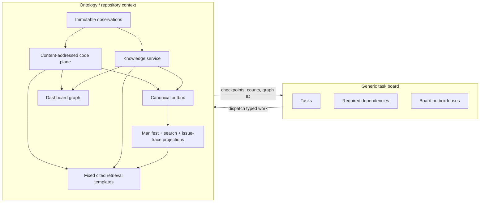

# Ontology — Repository Context Architecture

## Status

This document describes the implementation in this repository as of 2026-07-20. Ontology is one workflow on Jina's generic task board. The board controls work; Ontology owns repository facts and cited retrieval. The graph shown on `/ontology` is a disposable read model, not the canonical store.

The implementation follows Repository Context Architecture v5.1 with three board-visible chunks rather than a card per internal mechanism:

| Task type | Internal responsibilities | Durable completion |
| --- | --- | --- |
| `ontology_ingest` | Immutable GitHub/Git intake, new reachable commits, first-parent deltas, content-addressed parsing, PR/issue/CODEOWNERS normalization | Observations, code-plane rows, explicit source facts, and code checkpoint are durable |
| `ontology_assert` | Daytona checkout, Codex semantic analysis, citation validation, model observation, registry validation, including derived Issues and explicit-evidence Feature candidates | Model output is recorded and every supported inference is stored as `proposed` |
| `ontology_project` | Ref-scoped canonical outbox claim, redirect reconciliation, ref-manifest/search rebuild, incremental issue-trace materialization, graph rendering, retention | Projection checkpoint and immutable graph generation are durable |

`ontology_build` remains an aggregate parent. Internal stages are not board primitives and do not appear as extra cards.

The Task types page renders this declared topology as a workflow dependency tree, with prerequisite completion **unblocking** the waiting task, conditional links labeled inline, and redundant direct aggregate completion gates called out on the terminal node. Creation triggers are rendered separately on every task type: `POST /ontology/build` creates the aggregate and all three stage tasks, queues `ontology_ingest`, and leaves assertion/projection waiting on their declared prerequisites. `ontology_ingest` therefore has an intake trigger but no prerequisite **task**; making it depend on `ontology_build` would deadlock because that aggregate waits for ingestion, assertion, and projection to finish. The full registry shows creation triggers, prerequisite tasks, and downstream dependents separately. This catalog view is workflow metadata and does not read or infer dependencies from live board task instances.

## Separation of concerns



The board stores repository/ref inputs and checkpoint IDs. It does not store observations, symbols, assertions, redirects, search documents, or graph semantics. Ontology never treats task dependencies such as `blocks` or `publishes` as repository predicates.

## Runtime flow

### Intake and incrementality

The ontology worker resolves the requested ref, then walks the commit DAG backward. Before fetching a commit tree it asks the canonical store which SHAs already exist. A repeated build therefore reads only the head tree; a new head ingests only the previously unseen subgraph until it reaches known parents. `ONTOLOGY_HISTORY_LIMIT` is a safety fence (default 10,000 commits); exceeding it fails rather than storing a partial history.

Each commit stores parents, author external ID, commit time, message, and its tree manifest. State comes from the tree. `commit_changes` is independently computed against the first parent and records add, modify, delete, and exact-content rename. A force-push moves a ref; it does not rewrite commit facts.

Blobs are tenant-scoped and keyed by Git SHA. Parsing is keyed by `(tenant, blobSha, parserVersion)`, so unchanged content is parsed once across every commit and ref. TypeScript and JavaScript use tree-sitter through `@ast-grep/napi`; the versioned fallback supports deterministic definitions/imports for other recognized languages. Parse rows contain signature hashes and `calls | imports | references | extends` edges.

GitHub PRs and issues remain raw observations. Pure normalizers derive only explicit facts:

- `AUTHORED_BY` from the GitHub actor;
- `INCLUDES` from PR-to-commit membership;
- `MERGED_AS` from GitHub's merge commit, only after the PR is merged;
- `RESOLVES` from explicit close/fix/resolve syntax;
- `RESOLVED_BY` as the issue-centric inverse of an explicit `RESOLVES` fact;
- `REFERENCES` from explicit issue mentions;
- pattern-qualified `OWNED_BY` from CODEOWNERS.

Commit authorship is derived from commits plus accepted identities and is not duplicated as an assertion.
Ingest reports GitHub snapshots as `new`, `updated`, or `confirmed` independently from new commits and parsed/reused blobs. A PR or issue edit at an unchanged Git head therefore makes the ingest effect `changed` instead of being hidden as a ref confirmation. Ingest also emits a canonical evidence fingerprint over the code checkpoint and current GitHub/CODEOWNERS observations; the assertion cache identity includes that fingerprint plus generator and registry versions. A changed fingerprint creates a new immutable model-output generation and retracts active/proposed facts from the superseded generation before the new proposals can be reviewed.

### Semantic assertion generation

The assertion worker checks out the immutable commit in Daytona and normally asks Codex only about added, modified, or renamed current paths. It also rehydrates the exact immutable GitHub/CODEOWNERS observations named by ingestion and supplies them as untrusted evidence input. Its cache identity is repository commit + generator version + registry version + evidence fingerprint, so a registry or source-evidence change cannot reuse an incompatible generation. Every code citation is checked against the checkout before completion. Raw model JSON is stored as a `model_output` observation before normalization.

An Issue is a provider-neutral knowledge entity. A GitHub issue uses a `github:issue:<repository>#<number>` natural key, and its explicit `RESOLVES`/`RESOLVED_BY` relationships come only from deterministic intake. Model output that repeats one of those source facts is discarded during normalization instead of creating competing provenance. When a PR has no explicit resolving issue and the evidence clearly describes a bug, regression, or incorrect behavior, the model may emit one PR-anchored derived Issue candidate. The host normalizer, not the model, assigns its durable natural key, converts `PullRequest RESOLVES Issue` into a proposed assertion, and deterministically derives the proposed `Issue RESOLVED_BY PullRequest` inverse. Refactors, dependency updates, documentation, chores, and feature-only work do not qualify. A model cannot mint a GitHub number, create more than one candidate for a PR, change the candidate's PR anchor, or create one when intake found an explicit resolution. As with all model knowledge, nothing becomes active before assertion review. A later real issue can be joined through the existing entity-redirect mechanism without changing either entity's history.

A Feature is a repository-scoped, model-inferred identity for a named externally observable capability, never a synonym for a file, component, or task. Its host-validated natural key is `repo:<repository>:feature:<stable-slug>`. Explicit repository evidence may propose `File | Symbol IMPLEMENTS Feature`, `Feature DOCUMENTED_BY Document`, or `Commit | PullRequest | Issue LIKELY_AFFECTS Feature`. These predicates remain manual-review inferences. Acceptance makes them canonical knowledge; the existing project task renders them in the disposable dashboard graph without adding another board task.

Models never activate knowledge. All model relationships, including `INTRODUCED_BY`, enter as `proposed`. Causality requires a valid Issue identity, a full commit SHA, a nonempty reason, and checked repository evidence explicitly naming the mechanism; temporal proximity or membership in a resolving PR is insufficient. An authenticated `review_assertion` command accepts, rejects, or retracts model facts and appends an audit row. `GET /ontology/assertions` exposes repository-scoped summaries for review and production verification.

### Projection

The project task uses queue-claim semantics (`FOR UPDATE SKIP LOCKED`) for canonical outbox events. It then:

1. materializes `ref_manifest` directly from the current ref's commit tree;
2. rebuilds repo-scoped lexical and 64-dimensional vector search documents;
3. traverses only the assertion/observation subgraph touched by claimed events and upserts the affected issue-centric `issue_traces` rows on every ref before acknowledging a repository-wide event; a missing projection triggers a one-time full backfill;
4. folds append-only entity redirects and reconciles logical assertion collisions;
5. performs reachability/recent-window code-plane GC and bounded rejected-model payload retention;
6. acknowledges claimed outbox events;
7. creates or reuses the immutable, content-addressed dashboard graph generation for the commit, projection version, and resulting canonical content.

An issue trace is a read model, not new canonical knowledge. It is keyed by Issue entity ID and contains the Issue → resolving PR → merge/included commits → first-parent file changes path, plus reviewed `INTRODUCED_BY` commits, their associated introducing PRs, causal reason, evidence-generation commit, and checkout-validated evidence. Its issue number and URL are optional provider metadata. It supports repository-scoped lookup by Issue entity ID, quoted or unquoted title/body text, GitHub issue number, PR number, or commit SHA prefix and retains the citations needed to explain every hop. An exact title wins; multiple non-exact matches are returned as an ambiguity instead of silently selecting the first issue. Text first resolves to the canonical issue; causal traversal still follows accepted assertions rather than inferring from lexical similarity. The graph persists the same Issue → Commit edge, reason, and evidence. Rebuilding a trace never creates an assertion.

Every projected graph item carries evidence. Code and accepted model facts keep
their checkout-validated `path:line` citations. Deterministic GitHub facts that
come from PR, issue, or CODEOWNERS normalization carry their immutable
`observation:<id>` provenance into the graph; an active source assertion without
that provenance is excluded instead of relying on an empty-evidence shortcut.

Bulk history ingestion bypasses per-blob outbox fan-out; the final project rebuild is the bulk recovery path. Steady-state canonical changes emit aggregate events transactionally.

The ontology worker also drains canonical events while idle. Repository events lease only that repository and fan affected repository-wide issue facts across all of its refs before acknowledgment; tenant-global identity or redirect events fan out across current repositories. Tombstones with no remaining ref are acknowledged after their command transaction has purged the projections. A repository rebuild can never acknowledge another repository's pending event.

An unchanged ref is a no-op through the expensive path: the head is reported as confirmed rather than newly ingested, every blob analysis is reused, the generator checkpoint returns cached proposals without starting Daytona, and manifest/search rebuilding is skipped when no scoped canonical event is pending. Stage results carry `effect: changed | confirmed | noop`. Projection content is addressed independently of its worker task, so an unchanged result returns the existing graph ID and the graph store performs no duplicate write.

## Canonical storage

All tables are in PostgreSQL under `jina_ontology`, and every row is tenant-scoped.

| Plane | Tables |
| --- | --- |
| Intake | `observations`, `model_outputs` |
| Code | `commits`, `refs`, `commit_files`, `commit_changes`, `blobs`, `blob_analyses`, `blob_symbols`, `blob_imports`, `symbol_edges` |
| Knowledge | `entities`, `identities`, `entity_redirects`, `assertions`, `audit_log` |
| Infrastructure | `outbox`, `erasure_filters`, `repository_acl` |
| Rebuildable projections | `ref_manifest`, `search_documents`, `issue_traces`, `graphs`, `nodes`, `edges` |

`commit_files` is the persisted commit manifest in the current implementation. `ref_manifest` is the hot-ref projection. Graph rows are immutable and content-addressed by commit, projection version, and canonical graph content, so an unchanged rebuild reuses the existing generation.

### Assertions

The assertion schema and domain support object or typed literal values for registry growth; all currently registered predicates are relationships. Assertions also carry typed qualifiers, confidence for inference predicates, provenance (`sourceObservationId XOR assertedBy`), generator, registry version, validity, and five statuses:

```text
proposed | active | rejected | superseded | retracted
```

Only `status`, `validTo`, `supersededBy`, and `lastConfirmedAt` mutate after insert. Re-observation updates only `lastConfirmedAt`. Natural-key dedup includes a canonical qualifier hash. Cardinality-one supersession is scoped by `(subject, predicate, qualifiersHash)`.

### Registry

The typed registry is [registry.ts](../packages/ontology/src/registry.ts). It declares endpoint kinds, predicate class, cardinality, qualifiers, review policy, bitemporality, and authority. It is versioned in Git and stamped on assertions.

The implemented predicate set is:

```text
AUTHORED_BY  OWNED_BY  MEMBER_OF  INCLUDES  MERGED_AS
RESOLVES  RESOLVED_BY  REFERENCES  INTRODUCED_BY
LIKELY_AFFECTS  MOVED_FROM  IMPLEMENTS  DOCUMENTED_BY
```

Structural `CONTAINS`, `DECLARES`, `CALLS`, `IMPORTS`, `REFERENCES`, and `EXTENDS` edges remain in the code plane and are not assertion rows.

## Identity and repair

Repositories and commit SHAs receive accepted deterministic identities. GitHub users receive accepted GitHub identities. Git-email links remain proposed.

Entity merge/unmerge is append-only. Assertions keep the IDs originally asserted. Every read path folds the redirect ledger. A merge command checks cycles and emits `redirect_added`; projection reconciliation then:

- keeps the newest fact for cardinality-one collisions;
- keeps the earliest row for exact duplicates;
- supersedes losers with an audited `svc:reconciliation` action.

Unmerge cancels the matching redirect but does not silently restore facts superseded during reconciliation.

## Retrieval

Models cannot compose database queries. The API exposes six deterministic templates:

| Template | Answer path |
| --- | --- |
| `issue_trace` | issue title/body phrase, issue number, PR, or commit → materialized issue → resolving and introducing PRs/commits → causal reason/evidence and changes |
| `feature_trace` | extracted feature phrase → active reviewed Feature relationships → implementing files/symbols, documentation, and reviewed likely-impact sources |
| `structure` | validated name/moniker/path → definitions and typed edges inside the selected ref manifest |
| `change` | PR → included commits → first-parent changes → changed symbols → inbound affected surface |
| `intent` | file history → commits → PRs → resolved/referenced issues → raw observation text |
| `ownership` | active/source ownership by registry authority → recent commit authors via accepted identities |

Every item carries code, commit-change, assertion, entity, or observation citations plus score and explicit truncation. Expansion is limited to 200 items. Repository permission is checked before querying and again before results leave the API.

`POST /ontology/ask` composes only these six tools. Its conservative planner extracts issue numbers, quoted or unquoted causal issue descriptions, feature phrases, PRs, commits, repository paths, and identifier-shaped symbols, then passes typed parameters instead of the whole English question to retrieval. Feature implementation, documentation, and impact questions route to `feature_trace`; PR change questions route to `change`; only causal or resolution traversal routes to `issue_trace`. Multiple matching Feature identities are returned as an ambiguity instead of being merged by label. Query-time synthesis returns `answer`, `citedClaims`, `calls`, `unresolvedAmbiguities`, and `coverageGaps`. Unsupported or uncovered questions say so instead of treating arbitrary nonempty search rows as an answer. This first planner remains deterministic; bounded model-based candidate selection is still required for ambiguous natural-language entities that cannot be extracted conservatively.

The dashboard renders the direct answer and cited claims before the underlying retrieval calls. It also renders ambiguities and coverage gaps explicitly. Causation questions lead with the introducing PR and commit plus dedicated **Why** and **Evidence** fields; any later resolving PR is shown afterward as a later fix. An absent reviewed causal assertion is reported as unavailable rather than inferred from the later fix.

## Security

- Production data routes require the server-side internal bearer credential and derive `tenantId` from server configuration, never from request payloads.
- Cloud Run IAP authenticates the browser. The dashboard proxy removes caller authorization/tenant/principal headers, forwards the verified IAP email as a `user:` principal, and adds its service credential server-side.
- Graph details, retrieval, and context assembly are tenant- and repository-scoped.
- `JINA_TENANT_ADMIN_PRINCIPALS` supplies the independent Jina tenant-admin relationship. Other users receive only repositories granted through `repository_acl` reader/writer/admin relationships. Board/event reads use the same repository scope; command authorization is rechecked in the canonical writer. Service principals can enumerate the tenant repositories required by workers.
- Blob rows are never shared across tenants.
- Workers have no database connection and mutate canonical state only through leased, authenticated API operations.
- Model output is untrusted input and cannot write active assertions or arbitrary queries.

The current modular-monolith API is the sole database client for intake, code, knowledge, and projection writer modules. Table ownership is enforced at those module boundaries; splitting them into separate database principals does not change storage or APIs.

## Lifecycle

Four operations are distinct and audited:

- **Tombstone repository** retracts live assertions, retires scoped entities, purges code-plane rows, graphs, search, manifests, issue traces, and ACLs, and persists a durable repository filter.
- **Redact observation** destroys payload content, retains digest/reason/time, masks named commit messages, retracts dependent assertions, and purges search.
- **Erase person** marks identities erased, retires the Engineer, retracts facts about it and every assertion sourced from a destroyed personal observation, removes search documents, masks matching commit authors, and redacts observations containing erased external IDs.
- **Retention/GC** keeps commits reachable from refs, PR-linked commits, and a 90-day recent window; orphan blobs and parse rows are deleted. Rejected model payloads are removed after 30 days.

Ingest and rebuild consult `erasure_filters`, so replay cannot resurrect removed data.

## Operational signals

`GET /ontology/metrics` reports:

- outbox depth by event and oldest age;
- unparsed blob backlog;
- manifest and search staleness;
- proposed assertion count;
- accept/reject rates per generator and predicate.

The design targets from v5.1 remain: ref-to-manifest p95 ≤30s, observation-to-search p95 ≤60s, redirect-to-reconciliation p95 ≤5m, warm template p95 ≤400ms, and personal erasure ≤24h. The metrics expose the required timestamps/counters; production alert thresholds belong in Cloud Monitoring.

## APIs

```text
POST /ontology/build
GET  /ontology
GET  /ontology/graphs/:id
GET  /ontology/metrics
POST /ontology/retrieve
POST /ontology/ask
POST /ontology/commands
```

Internal worker routes are lease-fenced:

```text
POST /internal/ontology/ingest/known
POST /internal/ontology/ingest/plan
POST /internal/ontology/ingest/blobs
POST /internal/ontology/ingest/github
POST /internal/ontology/assertions/cached
POST /internal/ontology/outbox/drain
```

## Verification contract

The test suite proves:

- tree-sitter parsing, signature hashes, and typed edges;
- first-parent add/modify/delete/rename deltas;
- registry endpoint/qualifier validation;
- provenance XOR, review transitions, cardinality, redirects, reconciliation, and acceptance labels;
- GitHub work-item and CODEOWNERS normalization;
- explicit resolution/merge assertions and review-gated issue causality;
- fixed-template orchestration and citations, including reviewed Feature implementation lookup;
- real PostgreSQL intake → knowledge → incremental issue projection → Feature/issue retrieval → graph flow;
- repository ACL denial, redaction, and personal erasure;
- board/API/worker lease behavior and dashboard rendering.

Run the database contract with PostgreSQL 17:

```sh
TEST_DATABASE_URL=postgresql://... pnpm --filter @jina/db test
```

CI provides PostgreSQL and runs this integration suite on every pull request.
