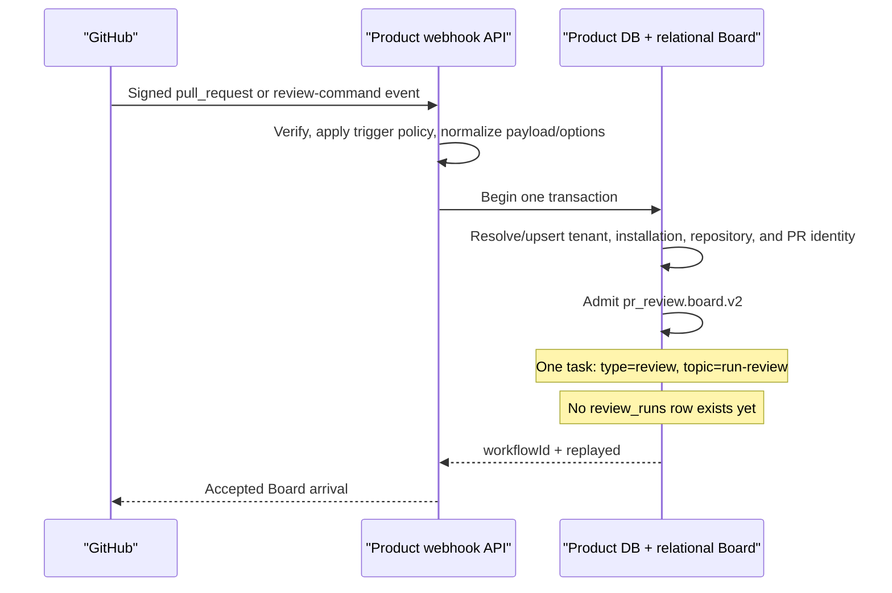

# Relational Board to original Trigger.dev review cutover

Status: core implementation complete. The relational one-task review path is deployed
in isolated staging; the production monorepo task-worker lane still uses legacy
`run-review` mode while the public product remains on the old source. The audited
production rollout, backup, routing, provider, and rollback plan is in
[STAGING_TO_PRODUCTION_CUTOVER.md](./STAGING_TO_PRODUCTION_CUTOVER.md).

This plan is grounded in:

- Jina staging commit `83398d2d102542fa97d9e4afc8688adb5cafec6b`;
- the original `omxyz/jina-simulation` review implementation at commit
  `322f42b5cb6d7cc3af3e4ae346b98c222aa7a822`; and
- the original repository's fetched `origin/main`, not the potentially dirty local
  checkout at `/Users/keon/dev/jina-code-review`.

The target is one high-level relational Task Board task for a pull-request review.
The API admits that Board work exactly as it admits other durable work. A task worker,
and only a task worker, starts and observes the original Trigger.dev review workflow.
Trigger.dev continues to own the original review's prompts, child tasks, retries,
Daytona sandbox, GitHub publication, and review-domain completion.

## Implementation status (2026-08-06)

The source implementation now covers the durable execution path described by this
document:

- runtime migration 0002 adds `waiting_external`, due-wait claiming, and a unique
  Trigger provider identity constraint without changing migration 0001;
- the Board worker repository implements fenced, replayable effect start, provider
  handoff, external reschedule, and failed/ambiguous effect retry transitions;
- v2 admission emits exactly one `review` / `run-review` task and stores the canonical
  Trigger payload, options, and digest on that task;
- admission performs a locked existing-workflow lookup first, so the first selected
  pipeline and its immutable request survive configuration changes and manual
  redelivery after a new push;
- `/internal/reviews/prepare` creates the product review row only after it proves the
  exact Board task, deterministic effect key, effect version, request digest, and
  Trigger run identity; v1 drain retries reuse their existing Board-owned row;
- `/prepare` and terminal reconciliation take the same request-key advisory lock. A
  terminal run observed before `/prepare` durably closes prepare on the exact receipt,
  while a committed prepare records the product row as receipt authority before
  reconciliation can continue;
- the task worker owns Trigger dispatch and polling, releases its Board lease while the
  run is external, and performs identity-bound terminal reconciliation before failing
  the Board task;
- the API arrival boundary is named `BoardWorkflowAdmitter` /
  `ProductBoardWorkflowAdmitter`; webhook code no longer claims to call a Trigger task;
- the original review-only Trigger project is pinned at
  `322f42b5cb6d7cc3af3e4ae346b98c222aa7a822`, protected by
  `trigger/source-manifest.json`, and deployed/tested independently; and
- worker dispatch uses the original repository's exact Trigger HTTP request shape.
  SDK 4.4.6 remains pinned for run retrieval, but is intentionally not used for
  dispatch because it rewrites the original object-form `queue` option.

The safety gates intentionally leave live behavior unchanged:

- product admission defaults to `pr_review.board.v1`;
- production's existing legacy `run-review` lane is now explicit through
  `JINA_REVIEW_RUN_TOPIC_MODE=legacy`;
- staging v2 configuration is present but `scripts/deploy-staging.sh` refuses it before
  cloud mutation until the task-worker release credential is activated; and
- `allowlist` is rejected by the single staging task-worker deployment because v1 and
  v2 `run-review` semantics require separate claim lanes during a canary.

Verification completed in this worktree includes 132 worker tests, 48 database tests
against PostgreSQL 16, the full API suite without database integration, the review
admission/prepare/reconciliation PostgreSQL integration, all 47 deployment contract
tests, and all 214 pinned Trigger project tests. The pinned Trigger lockfile
currently reports 56 npm audit findings (2 low, 34 moderate, 19 high, 1 critical);
automatic lockfile remediation is deliberately not applied because it would break the
exact-source pin. An independent implementation re-audit after the prepare/reconcile
race, receipt-provenance, and v1-drain fixes reported no P0-P2 findings. The documented
operational cutover gates and pinned dependency risk still require explicit release
review before enabling v2.

## Decision summary

The terms below have deliberately different names and owners.

| Concept                   | Stable identity                    | Created by                  | Executed by                               |
| ------------------------- | ---------------------------------- | --------------------------- | ----------------------------------------- |
| Relational Board workflow | `workflowType: "pr_review"`        | API admission               | Relational Board                          |
| Board pipeline version    | `pr_review.board.v2`               | API admission               | Relational Board                          |
| Single Board task         | `taskType: "review"`               | API admission               | Task worker                               |
| Board queue topic         | `run-review`                       | API admission/outbox        | Task worker                               |
| Trigger.dev root task     | `id: "review"`                     | Task worker                 | Trigger.dev                               |
| Trigger.dev child tasks   | `review-summary`, `review-runtime` | Trigger.dev root            | Trigger.dev                               |
| Product review run        | `review_runs.id`                   | Original Trigger `/prepare` | Product API and original Trigger workflow |

The API does **not** create a Trigger.dev run. The worker does **not** admit the
high-level Board workflow. The Board topic `run-review` must not be renamed to the
Trigger task ID, and the original Trigger task ID `review` must not be renamed to the
Board topic.

The API arrival transaction also does **not** pre-create a `review_runs` row. The
unchanged original Trigger root has valid paths that terminate before `/prepare`, most
notably manual-command supersession. Deferring the product row until the original
`/prepare` callback preserves those semantics and prevents an orphaned queued review.

The desired flow is:

```text
GitHub event or manual command
  -> API policy and payload normalization
  -> relational Board admission: pr_review.board.v2
  -> one queued Board task: review / run-review
  -> task worker claim
  -> worker starts Trigger.dev task: review
  -> Board task waits durably without holding a worker lease
  -> worker polls the exact Trigger run
  -> Board task succeeds or fails from the Trigger execution result
```

## Goals

1. Make review arrival use the same `RelationalBoardRepository.admitWorkflow()`
   boundary as installation backfill, billing retry, and other relational Board work.
2. Represent a review as exactly one high-level Board task.
3. Start Trigger.dev only after a task worker has successfully claimed that Board task.
4. Run the original review workflow byte-for-byte from the pinned source commit,
   including its prompts, task topology, retry policy, Daytona implementation, and
   publication behavior.
5. Preserve webhook and manual-command idempotency, concurrency, tags, TTL, and payload.
6. Keep Board leases short while a queued or running Trigger workflow may take minutes.
7. Make the external Trigger run ID durable and auditable before the worker releases its
   lease.
8. Cut over without misrouting persisted legacy `run-review` messages or abandoning the
   existing six-stage relational review workflows.
9. Preserve the original distinction between Board request identity and Trigger
   execution concurrency, especially for manual-command redelivery after a head change.

## Non-goals

- Do not rewrite, simplify, or merge the original Trigger root and child tasks.
- Do not port the original review logic into the Board worker.
- Do not use the current `@jina/review-agent` implementation as a substitute for the
  pinned original source when exact equivalence is required.
- Do not restore the original scheduled review scan, installation-backfill task, or
  billing-retry task into Trigger.dev. Those arrivals are already owned by the current
  API and relational Board.
- Do not make Trigger.dev the high-level system of record. The relational Board remains
  the orchestration record visible to the task board and deployment controls.
- Do not edit an already-applied runtime migration in place.

## Baseline audit at the starting staging commit

### API admission was hidden behind Trigger-era naming

At the starting commit, the product application constructed
`ReviewOrchestratorDispatcher` in
[`apps/api/src/product/app.ts`](../apps/api/src/product/app.ts) and passes it to the
GitHub webhook handler as a dependency called `trigger`. The webhook called
`triggerTask()` through the interface in
[`apps/api/src/product/board-admission-contract.ts`](../apps/api/src/product/board-admission-contract.ts).

Despite those names, that implementation in
[`apps/api/src/product/product-board-workflow-admitter.ts`](../apps/api/src/product/product-board-workflow-admitter.ts)
did not trigger Trigger.dev. It parsed the review payload, called `admitBoardReview()`,
and returns the Board workflow ID. It also multiplexes installation backfill through the
same review-named class. This compatibility shape made API-side Board admission look
like external workflow execution and was the source of the ownership confusion. The
implementation now uses the Board-admission names listed in the status section above.

The pull-request webhook builds the original review payload and dispatch options in
[`apps/api/src/product/github.ts`](../apps/api/src/product/github.ts). Its automatic
review options are:

```ts
{
  idempotencyKey,
  concurrencyKey: idempotencyKey,
  tags: [
    `installation:${installationId}`,
    `repo:${repositoryId}`,
    `pr:${prNumber}`,
    "bot:code_review",
  ],
  ttl: "30m",
}
```

Manual `@usejina` reviews are built in
[`apps/api/src/product/review-command.ts`](../apps/api/src/product/review-command.ts).
Their idempotency key is based on the GitHub comment identity, their concurrency key is
based on the PR head, and their tag set includes the manual scope and command tags.

`DispatchOptions` already has fields for `idempotencyKey`, `concurrencyKey`, `queue`,
`tags`, `ttl`, and `machine`. The current `reviewRunInputFromDispatch()` preserves only
the idempotency key when it converts the request into `CreateReviewRunInput`. The other
options must be carried durably in v2 admission so the worker can reproduce the original
Trigger call.

### Current relational review topology has six tasks

[`apps/api/src/product/review-board-admission.ts`](../apps/api/src/product/review-board-admission.ts)
currently emits `pr_review.board.v1` with:

1. `prepare-review`;
2. `summary-review`;
3. `runtime-review`;
4. `finalize-review`;
5. `publish-review`; and
6. `settle-review`.

The v1 admission transaction creates or reuses the product `review_runs` row, admits the
Board workflow, and binds them in one database transaction. That is safe for the current
six-stage Board pipeline because its first Board task owns prepare. It must not be
carried forward unchanged when the exact Trigger root owns prepare: that root can
terminate before making the call.

### `run-review` currently means legacy work

[`packages/shared-kernel/src/worker-topics.ts`](../packages/shared-kernel/src/worker-topics.ts)
currently defines `legacyReviewWorkerTopic = "run-review"` separately from the six
relational review topics. The task worker rejects that topic unless
`JINA_LEGACY_REVIEW_PIPELINE_ENABLED=true` in
[`apps/worker/src/worker-topics.ts`](../apps/worker/src/worker-topics.ts).

The current `run-review` handler in
[`apps/worker/src/server.ts`](../apps/worker/src/server.ts) is a small legacy implementation
that fetches a PR diff and makes one OpenAI Responses request. It is not the original
Trigger.dev/Daytona workflow. Reusing the topic therefore requires a persisted-work
drain and a semantic cutover; it is not a safe source-only rename.

### Board workers assume a handler completes, retries, or fails in one lease

The worker `WorkResult` union in
[`apps/worker/src/server.ts`](../apps/worker/src/server.ts) currently has only `done`,
`retry`, and `failed`. `executeTopic()` always wraps a handler result as `done`, while
`executeClaimedWork()` renews the Board lease until it sends `/internal/worker/complete`.

That model is wrong for the Trigger bridge. The original Trigger root declares global
queue concurrency `1` and may wait for two long-running child stages. If multiple Board
workers hold leases while their Trigger runs wait in that queue, all task-worker Cloud
Run instances can be occupied by polling or waiting and control topics can starve.

### The relational Board lacks an external-wait task state

`BoardTaskStatus` in
[`packages/db/src/board/repository.ts`](../packages/db/src/board/repository.ts) currently
contains `blocked`, `queued`, `leased`, `retry_wait`, and terminal states. The initial
schema in [`packages/db/src/board/schema.ts`](../packages/db/src/board/schema.ts):

- makes `available_at` non-null exactly for `queued` and `retry_wait`;
- makes `current_attempt_id` non-null exactly for `leased`;
- indexes ready work only for `queued` and `retry_wait`; and
- limits `result_artifact` to 16 KiB.

`RelationalBoardWorkerRepository.claimTask()` in
[`packages/db/src/board/worker-repository.ts`](../packages/db/src/board/worker-repository.ts)
creates a new claim row for ready or expired work. `releaseAttempt()` immediately
returns work to `queued`. `retryAttempt()` increments `attempt_count`. Neither operation
means “an accepted external execution is still running.”

The workflow reducer also counts only `blocked`, `queued`, `leased`, and `retry_wait` as
active. A new wait state must be included or the single-task workflow would complete
while its Trigger run is still executing.

### An external-effect receipt table already exists

The initial relational Board schema already contains
`jina_runtime.board_effect_receipts`, with:

- a stable `idempotency_key` primary key;
- workflow, task, and optional attempt ownership;
- `effect_type` and `effect_version`;
- `provider`, `provider_id`, and `authority_record_id`;
- request and result digests;
- `started`, `succeeded`, `failed`, and `ambiguous` states; and
- an index for receipts that need reconciliation.

There is currently no repository implementation using this table. The Trigger bridge
should activate this existing Board primitive rather than add a second external-run
ledger to `board_tasks`. The task state answers “is the Board task runnable?”; the effect
receipt answers “what external dispatch did this task perform?”

### Product `/prepare` is the correct review-row creation boundary

The original Trigger root calls `POST /internal/reviews/prepare` after it starts. The
handler in [`apps/api/src/product/internal.ts`](../apps/api/src/product/internal.ts)
calls `createReviewRun()` with the logical idempotency key. Normal execution, billing
classification, progress comments, child-stage payloads, usage, and completion all
begin from the ID returned by this call.

The pinned root also has legitimate terminal paths before `/prepare`:

- `parseRepository()` runs before the root `try`;
- a newer manual command returns `completed_superseded` before prepare; and
- Trigger may cancel, expire, time out, crash, or system-fail before prepare executes.

If Board admission pre-created a queued product row, each of those paths could leave it
queued permanently. V2 admission therefore resolves/upserts tenant, installation,
repository, and PR identity but does not insert `review_runs`.

Modify the existing prepare implementation, without changing its URL or request body,
so its transaction:

1. resolves tenant scope and takes the same transaction-scoped advisory lock used by
   v2 admission for `(tenantId, idempotencyKey)`;
2. looks up a preexisting `pr_review.board.v2` workflow by that tenant and dedupe key;
3. requires the one receipt at `trigger-review:<workflow_id>`, effect version `1`, and
   the task's exact `request_digest`, then proves its `provider_id` equals the request's
   `trigger_run_id`;
4. verifies the admitted payload/request identity matches the prepare payload;
5. creates or reuses the `review_runs` row through `createReviewRunWithClient()`;
6. binds it with `orchestrator='board'` and `board_workflow_id`;
7. sets the same receipt's `authority_record_id` to the product review ID; and
8. commits creation, binding, and receipt authority atomically before billing
   preparation continues.

The Trigger run can begin `/prepare` before the worker has persisted the run ID returned
by the dispatch request. In that case the exact receipt exists as `started` but has no
`provider_id`. Prepare locks that receipt and returns a retryable
`review_dispatch_not_bound` error. The unchanged root throws, uses its original Trigger
retry policy, and retries prepare after the worker has committed the provider ID. A
different non-null provider ID is a hard provenance conflict. Payload equality alone,
or another receipt for the same task with a different key, version, or digest, is never
accepted as proof that a legacy Trigger run belongs to the Board dispatch.

Terminal reconciliation resolves the same tenant/dedupe identity, acquires the same
advisory lock before taking Board row locks, and then locks that exact receipt. If no
product row exists, it sets `metadata.prepare_closed=true` on the receipt before
acknowledging `no_row`. A later `/prepare` sees the tombstone and refuses to create an
orphan row. If `/prepare` held the lock first, reconciliation waits and can acknowledge
only after the row, Board binding, and `authority_record_id` commit together.

V2 admission takes the same advisory lock after resolving tenant scope and before it
checks `review_runs` or inserts the Board workflow. This closes the race between the two
independent uniqueness constraints: a concurrent legacy `/prepare` either commits its
Trigger-owned review row first, causing v2 admission to reject, or v2 admission commits
the Board workflow first, causing prepare to require the matching dispatch receipt.

If no v2 Board workflow exists, prepare retains the legacy Trigger-owned behavior. If a
v1 row already exists during drain, prepare reuses its existing Board binding. No new
prepare endpoint and no change to the pinned Trigger source are required. Cutover must
nevertheless prove zero active legacy Trigger review runs and zero enabled legacy
review schedules before v2 admission is enabled, so an old run cannot arrive after the
semantic switch.

### Current review-agent source is not the pinned original

The staging repository no longer contains a top-level `trigger/` project. It contains
`packages/review-agent`, but the current review prompt, workflow, Daytona session, and
runtime reviewer are not byte-identical to the original commit. Exactness therefore
cannot be established by importing that package.

Representative pinned SHA-256 values are:

| Original file                             | SHA-256 at `322f42b5...`                                           |
| ----------------------------------------- | ------------------------------------------------------------------ |
| `trigger/src/trigger/review.ts`           | `36c2df7b913feb89fc794c6143ef2405cd6fba2bf45208ad2a885fbdf957d3c1` |
| `trigger/src/trigger/review-summary.ts`   | `d70f5b8c33d8e36478dc3ca71fe885b675e607d1be0b2c8e156b3691ea7f1247` |
| `trigger/src/trigger/review-runtime.ts`   | `5a91a10dd7b451b9c3595fd493ec5c6be126be06e04d6c899d8d9430e6e0a723` |
| `trigger/src/review/jina-instructions.ts` | `365a51f31415c89d86682802213fded61eae2f2fe01218a2eb18c930d7988129` |
| `trigger/src/review/codex-review.ts`      | `cc7964571a7cbeb8e26cf860c2d4571d2f55e9c45098ca61c09be039bf1c5068` |
| `trigger/src/daytona/review-session.ts`   | `70367412c3a0e4b28a9723faee2b3a69db9aa9f2f87d9e0c18f467486991320d` |
| `trigger/src/runtime-review/index.ts`     | `f0b4c76a704b151b414f260d5ec43466128b8420823f6378463bda02aea33f45` |
| `trigger/package-lock.json`               | `f6480ec5861af9ce61bd28bee550bb66ae5ed3fd9d53a63047cd787f996a22b7` |
| `trigger/trigger.config.ts`               | `f1ab73f907724c5b01662f774c89be6902e24d55e9bad632ed374306b33ffde0` |

The original lockfile resolves Trigger.dev packages to `4.4.6` and Daytona packages to
`0.187.0`.

## Target architecture

### Admission sequence



This is ordinary Board admission. No Trigger.dev SDK call, Trigger secret, or external
run exists in the API path.

### Worker and Trigger sequence

```mermaid
sequenceDiagram
    participant B as "Relational Task Board"
    participant W as "Task worker"
    participant T as "Trigger.dev"
    participant P as "Product review API"
    participant D as "Daytona"
    participant G as "GitHub"

    B->>W: Lease run-review
    W->>B: Start trigger.review.dispatch effect receipt
    W->>T: tasks.trigger("review", originalPayload, originalOptions)
    T-->>W: triggerRunId
    W->>B: Atomically save provider ID and set waiting_external
    Note over B,W: Lease is released; attempt count is unchanged

    alt Original pre-prepare supersession
        T->>T: Return completed_superseded
        Note over T,P: No product review row is created
    else Original workflow prepares
        T->>P: POST /internal/reviews/prepare
        P->>P: Create review row and bind it to Board workflow
        P-->>T: New or reused Board-owned reviewRunId
        T->>G: Upsert original progress comment
        par review-summary
            T->>T: Execute original summary child task
        and review-runtime
            T->>D: Execute original Daytona runtime child task
            D-->>T: Runtime review result
        end
        T->>P: Persist original completion and usage
        T->>G: Publish original review result
    end

    loop Until the exact Trigger run is terminal
        B->>W: Re-lease due waiting_external task
        W->>T: runs.retrieve(triggerRunId)
        alt Nonterminal or polling transport failure
            W->>B: Release to waiting_external with next check time
        else Trigger execution completed
            W->>B: Complete Board task with compact result
        else Trigger execution terminally failed
            W->>P: Reconcile exact Board workflow + Trigger run
            alt Reconciliation transport/5xx failure
                W->>B: Release to waiting_external with reconciliation backoff
                Note over B,W: Do not fail Board until product state is acknowledged
            else updated, already_terminal, or no_row
                W->>B: Fail Board task without launching a second review
            end
        end
    end
```

### Board admission contract

`buildReviewBoardAdmission()` should emit one task and no dependencies:

```ts
{
  workflowId,
  tenantId,
  workflowType: "pr_review",
  pipelineVersion: "pr_review.board.v2",
  subjectType: "github_pull_request_review_request",
  subjectId: requestIdentity,
  dedupeKey: idempotencyKey,
  concurrencyKey: idempotencyKey,
  triggerType,
  metadata: {
    schema_version: 2,
    delivery_id: deliveryId,
    source_event: sourceEvent,
    installation_id: installationId,
    repository_id: repositoryId,
    repository: repositoryFullName,
    pull_request_number: pullRequestNumber,
    head_sha: headSha,
    request_identity: requestIdentity,
    request_digest: requestDigest,
  },
  tasks: [{
    id: stableUuid(`${workflowId}:review`),
    taskType: "review",
    topic: "run-review",
    status: "queued",
    maxAttempts: 3,
    metadata: {
      schema_version: 2,
      request_digest: requestDigest,
      trigger_task_id: "review",
      trigger_payload: originalPayload,
      trigger_options: originalDispatchOptions,
    },
  }],
  dependencies: [],
}
```

The stable workflow/task IDs preserve replay identity. The Board task's three attempts
cover bridge failures before an external run ID is known. They do not replace or add to
the original Trigger task's three-attempt retry policy.

`trigger_payload` and `trigger_options` are immutable admission data. The worker must
validate both before dispatch. It must not rebuild tags, TTL, concurrency, or manual
scope from a newer database state.

`requestIdentity` is deliberately not always the PR head:

- automatic webhook review: `${repositoryId}:${pullRequestNumber}:${headSha}`; and
- manual review: `${repositoryId}:${pullRequestNumber}:${sourceEvent}:${commentId}`.

The manual idempotency key identifies the comment and intentionally survives a later
head change. Its Board subject and Board concurrency key must therefore also remain
stable. The original head-specific concurrency key is preserved only inside
`trigger_options.concurrencyKey`. If the same GitHub comment is redelivered after a
push, Board admission returns the original workflow and its immutable original payload
and options; it neither rejects the replay nor dispatches a review for the newer head.

### API admission interface

Delete Trigger-oriented naming from the API arrival path:

- replace `WorkflowDispatcher.triggerTask()` with an admission dependency such as
  `BoardWorkflowAdmitter.admit()` or narrowly typed `admitReview()` and
  `admitInstallationBackfill()` functions;
- remove `ReviewOrchestratorDispatcher`;
- move `reviewRunInputFromDispatch()` into the review admission module or rename it to
  `reviewBoardArrivalFromGithub()`;
- have `handleGithubWebhook()` and `handleReviewCommand()` receive Board admission
  functions, not a dependency named `trigger`; and
- call installation backfill admission directly rather than routing it through a
  review-named class.

Introduce a dedicated admission DTO rather than adding Trigger options to the
product-row type:

```ts
interface ReviewBoardArrival {
  readonly identity: ReviewIdentityInput;
  readonly requestIdentity: string;
  readonly idempotencyKey: string;
  readonly triggerPayload: Readonly<Record<string, unknown>>;
  readonly triggerOptions: DispatchOptions;
}
```

Factor the tenant/installation/repository/PR portion of
`createReviewRunWithClient()` into a reusable `resolveReviewScopeWithClient()`. V2
admission calls that scope helper and Board admission in one transaction, without
inserting `review_runs`. The prepare path calls the same scope helper as part of review
row creation and binding.

Domain-specific validation remains appropriate. “Same as other Board arrivals” means
the final durable boundary is `RelationalBoardRepository.admitWorkflow()` inside the
API transaction, not that every event must share one untyped payload parser.

The existing webhook response uses `run_id` for what is now a Board workflow ID. During
compatibility, return both `workflow_id` and the existing `run_id` alias with the same
value, document that no Trigger run exists yet, then remove the alias only with an
explicit API version change.

## Durable external wait design

### New task status

Add `waiting_external` to `BoardTaskStatus`. Its invariants are:

- `available_at` is non-null;
- `current_attempt_id` is null;
- `completed_at` is null;
- it counts as active in the workflow reducer;
- it is eligible for claim only when `available_at <= clock_timestamp()`;
- reclaiming it creates a new `claim_number` but keeps the same `attempt_number` and
  `attempt_count`; and
- it appears as `in_progress` in the dashboard.

The state transitions are:

```text
queued or retry_wait
  -> leased
  -> waiting_external
  -> leased
  -> waiting_external ...
  -> succeeded | failed
```

Only a dispatch failure before an accepted provider run uses the existing
`retryAttempt()` transition and increments `attempt_count`.

### Additive runtime migration

[`packages/db/src/runtime-migrations.ts`](../packages/db/src/runtime-migrations.ts)
checks the SHA-256 of every applied migration. Editing
`BOARD_RUNTIME_MIGRATION_0001_SQL` would make every existing database reject startup.

Add `BOARD_RUNTIME_MIGRATION_0002_SQL` and register version 2. It must:

1. expand the `board_tasks.status` check to include `waiting_external`;
2. expand the `available_at` invariant to include `waiting_external`;
3. rebuild `board_tasks_ready` so its predicate includes `waiting_external`;
4. add a partial unique index on `(provider, provider_id)` where `provider_id is not
null`, so one accepted Trigger run cannot back two dispatch receipts;
5. preserve the existing leased/current-attempt, terminal/completed-at, and attempt
   bounds; and
6. remain transactional and safe when no waiting tasks exist yet.

The migration test must apply v1 first and then v2. It must not merely test a fresh
schema assembled from the latest constants.

### Effect receipt contract

Use the existing `board_effect_receipts` row for the Trigger dispatch:

```text
idempotency_key:    trigger-review:<board-workflow-id>
effect_type:        trigger.review.dispatch
effect_version:     1
provider:           trigger.dev
request_digest:     sha256(canonical { taskId, payload, options })
provider_id:        <Trigger run ID after acceptance>
authority_record_id:<nullable until original /prepare creates review_run_id>
status:             started | succeeded | failed | ambiguous
```

`succeeded` means the dispatch effect was accepted and has a durable provider run ID;
it does not mean the remote review finished. The Board task remains
`waiting_external` until polling observes a terminal Trigger status.

Add repository operations with the same release gate and fence checks as other Board
mutations:

1. `beginEffectAttempt()` inserts a `started` receipt before the network call. A same-
   digest replay of `started` is accepted; when it comes from a later claim after crash
   or lease expiry, it rebinds `attempt_id` to the current attempt and appends a
   reconciliation event. A same-digest `failed` or `ambiguous` receipt can be reopened
   for the current Board attempt by setting `status='started'`, clearing `completed_at`,
   replacing `attempt_id`, and appending the same event. A different digest is always a
   conflict. A `succeeded` receipt is never reopened.
2. `waitExternalAttempt()` atomically marks the receipt `succeeded`, sets
   `completed_at`, records `provider_id`, releases the current attempt, changes the task
   to `waiting_external`, and sets the next `available_at`.
3. `rescheduleExternalWait()` releases a polling claim back to `waiting_external`
   without changing a succeeded dispatch receipt or incrementing `attempt_count`.
4. `failOrRetryDispatchAttempt()` atomically records a definite failure as `failed` or
   uncertain acceptance as `ambiguous` **and** performs the Board retry/fail transition.
   There is no interval in which the receipt is finished while the task remains leased
   solely because a second API call was lost.
5. Retry exhaustion atomically leaves both the receipt and Board task terminally failed.
6. Claims for the task include its matching effect receipt so the worker never depends
   on mutable process memory to find the Trigger run ID.

The existing receipt constraint requires `completed_at` to be null exactly for
`started`; every transition above must satisfy it. Prior failure/ambiguity details remain
in immutable Board events even when a later exact-request reconciliation reopens the
single receipt row.

Every state-changing request includes a deterministic `transition_id`. Store it as the
Board event `source_event_id`, whose schema already has a unique workflow-scoped index.
If the transaction committed but its HTTP response was lost, an identical request with
the old lease can find the committed event and return `{ accepted: true, replayed: true
}` even though that attempt is now released. A different request body under the same
transition ID is a conflict. This replay contract is required for effect start, initial
provider-ID handoff, effect retry/failure, later poll rescheduling, and terminal
completion/failure.

All mutations must lock the workflow, task, current attempt, and effect receipt in a
consistent order. Every accepting mutation appends a Board event carrying the effect
identity, provider, redacted provider ID, attempt number, claim number, and next check
time. Do not put the Trigger secret, full payload, or model output in an event.

### Worker HTTP protocol

Extend the relational worker adapter in
[`packages/db/src/board/worker-store.ts`](../packages/db/src/board/worker-store.ts) and
the API worker routes in [`apps/api/src/server.ts`](../apps/api/src/server.ts).

Add authenticated, release-gated routes:

- `POST /internal/worker/effects/start`;
- `POST /internal/worker/effects/retry`; and
- `POST /internal/worker/wait-external`.

Every request carries the existing delivery ID, lease ID, write-fence token, worker
release identity, and the effect-specific fields. A stale fence returns `409` exactly as
renew, release, and complete do.

Rename `isRelationalReviewDelivery()` in `apps/api/src/server.ts` to
`isRelationalBoardDelivery()`. Its outbox-ID test already covers review and control
Board work; the current name incorrectly implies that the generic relational mutation
path is review-only.

Extend the worker `WorkResult` union with an internal disposition such as:

```ts
{
  outcome: "waiting_external";
  effectIdempotencyKey: string;
  providerId: string;
  nextCheckAt: string;
  providerStatus?: string;
}
```

Also add a dispatch-error disposition carrying the effect identity, exact request
digest, bounded diagnostic, retryability, and `definite_failure` versus
`ambiguous_acceptance`. `executeClaimedWork()` sends it to
`/internal/worker/effects/retry`; that API decides retry versus terminal failure from
the fenced task attempt and updates receipt plus task in one transaction. The generic
exception-to-`retry` conversion must not handle an error after an effect receipt has
started.

`executeClaimedWork()` sends that result to `/internal/worker/wait-external` rather
than `/internal/worker/complete`. A successful wait handoff is a healthy worker
outcome, but it is not a completed Board task. Metrics and logs must distinguish
`waiting_external` from `done`, `retry`, `failed`, and `lease_lost`.

The effect-start, effect-retry, and wait-external senders must copy the current
completion sender's reliability contract: retry the identical request after transport
failure, timeout, or retryable 5xx, and rely on the repository's `transition_id` replay
after a committed-but-lost response. This includes a lost response from
`/internal/worker/effects/start`: the worker must recover the already-started receipt and
must not call Trigger until that replay is acknowledged. A `409` means true
fence/replay conflict, not merely that the first successful request already released or
otherwise advanced the lease.

The default Trigger polling interval should be 30 seconds, configurable within a
bounded range. A transient management-API failure after `provider_id` is known should
reschedule `waiting_external` with backoff; it must not consume a Board attempt or start
a new Trigger run.

## Worker Trigger bridge

### Topic and handler changes

In [`packages/shared-kernel/src/worker-topics.ts`](../packages/shared-kernel/src/worker-topics.ts):

- delete `legacyReviewWorkerTopic` after the drain gate;
- define the v2 relational review topic as `run-review`;
- reduce `reviewBoardWorkerTopics` to that one value after v1 drains; and
- temporarily retain a separately named six-topic v1 list while old workflows remain.

In [`apps/worker/src/worker-topics.ts`](../apps/worker/src/worker-topics.ts):

- remove the `JINA_LEGACY_REVIEW_PIPELINE_ENABLED` gate after legacy drain;
- make `run-review` an ordinary task-worker relational topic; and
- preserve the exhaustive handler registry check.

Replace the current simple `runReview()` implementation with a bridge. It has two
paths based on the effect receipt included with the claim.

#### First claim: dispatch

1. Require pipeline version `pr_review.board.v2`, task type `review`, topic
   `run-review`, and metadata schema version 2.
2. Validate `trigger_task_id === "review"`, `trigger_payload`, and all
   `trigger_options` fields. No `review_run_id` exists before the original `/prepare`.
3. Calculate the canonical request digest.
4. Start or replay the Board effect receipt under the active lease fence.
5. Call Trigger.dev `tasks.trigger("review", payload, options)`.
6. Atomically persist the returned run ID and release to `waiting_external`.

The task worker needs a Trigger project Secret API key. `TRIGGER_SECRET_KEY` is the
runtime SDK credential; it is distinct from `TRIGGER_ACCESS_TOKEN`, which the Trigger
CLI deployment workflow uses. Support `TRIGGER_API_URL` for the configured Trigger
environment.

Use the same Trigger.dev SDK version as the pinned workflow (`4.4.6`) for the bridge
unless a tested management-client incompatibility requires a separately documented
version. Add it to `apps/worker/package.json` and the monorepo lockfile; do not import
the standalone Trigger project's `node_modules`.

#### Later claims: observe

1. Require a succeeded effect receipt with a non-empty Trigger `provider_id`.
2. Retrieve that exact run ID through the Trigger management API.
3. Exhaustively classify the pinned SDK 4.4.6 statuses:
   - nonterminal: `PENDING_VERSION`, `QUEUED`, `DEQUEUED`, `EXECUTING`, `WAITING`, and
     `DELAYED`;
   - successful terminal: `COMPLETED`; and
   - failed terminal: `CANCELED`, `FAILED`, `CRASHED`, `SYSTEM_FAILURE`, `EXPIRED`, and
     `TIMED_OUT`.
4. For a nonterminal status, return to `waiting_external`.
5. For `COMPLETED`, read only the scalar fields needed for the compact Board projection
   and complete the Board task. The original output may legitimately be much larger
   than 16 KiB; its size does not make the review fail.
6. For a failed terminal status, invoke a narrow product reconciliation endpoint. Fail
   the Board task only after that endpoint durably acknowledges the matching product
   state; never call `tasks.trigger` again.

The product reconciliation endpoint accepts `board_workflow_id`, `trigger_run_id`,
provider terminal status, and a bounded diagnostic. It may update only a nonterminal
`review_runs` row already bound to both identities and named by the exact receipt's
`authority_record_id`. It is a backstop for a post-prepare failure whose original
final-attempt catch-path `/complete` also failed. When no row exists, it durably closes
prepare on the exact receipt before returning `no_row`; when the row is already terminal
it returns `already_terminal`.
Map `CANCELED` to product `canceled`; map `FAILED`, `CRASHED`, `SYSTEM_FAILURE`,
`EXPIRED`, and `TIMED_OUT` to product `failed`. Do not call the broad review completion
endpoint with a synthesized success/domain result, because the bridge is not the
primary review-domain owner.

The endpoint returns one of three acknowledged outcomes: `updated`,
`already_terminal`, or `no_row`. Those outcomes are all safe prerequisites for failing
the Board task. A timeout, connection loss, retryable 5xx, or any response that does not
prove one of those outcomes returns the claim to `waiting_external` with a bounded
reconciliation backoff and without incrementing `attempt_count`. The next claim
retrieves the same already-terminal Trigger run and retries the same identity-bound,
idempotent reconciliation request. It must not terminally fail the Board task while a
post-prepare product row might still be nonterminal. Response loss after a committed
product update is safe because the repeated request returns `already_terminal` for the
same Board workflow and Trigger run. Alert on prolonged reconciliation age, but keep the
durable task active until an acknowledged outcome is obtained.

Tests must fail when a newly introduced SDK status is not classified.

Trigger.dev documents run retrieval and its returned status/output at
<https://trigger.dev/docs/management/runs/retrieve>.

### Dispatch ambiguity

The dangerous interval is:

```text
Trigger accepted the run -> worker has not yet persisted provider_id
```

The stable original idempotency key makes an immediate replay return the existing active
or completed run. Trigger.dev documents that a failed run clears its idempotency key,
however, so a crash followed by a very fast terminal failure can make that run
undiscoverable from the key alone: <https://trigger.dev/docs/idempotency>.

Mitigations, in order:

1. create the `started` effect receipt before dispatch;
2. persist the returned provider ID immediately through one fenced transaction;
3. on a `started` or `ambiguous` receipt, retry only with the exact same payload,
   options, and idempotency key;
4. never add an unreviewed correlation tag because the original manual dispatch already
   uses a large tag set and exact dispatch options are an explicit requirement; and
5. alert on any receipt left `started` or `ambiguous` beyond a short reconciliation
   window.

The residual failed-run ambiguity must be exercised in a fault-injection test and
called out in the cutover record. If zero ambiguity is a hard requirement, implementation
must stop and choose a provider-supported lookup/callback mechanism before launch; it
must not silently create a second review.

## Original Trigger project restoration

Restore a standalone top-level `trigger/` project from the pinned source commit. Use
`git show` or `git archive` from the pinned object, not the dirty local working tree.

Copy unchanged:

- `trigger/package.json`;
- `trigger/package-lock.json`;
- `trigger/tsconfig.json`;
- `trigger/trigger.config.ts`;
- `trigger/src/trigger/review.ts`;
- `trigger/src/trigger/review-summary.ts`;
- `trigger/src/trigger/review-runtime.ts`;
- the review task's transitive runtime under `trigger/src/review/**`;
- `trigger/src/daytona/**`;
- `trigger/src/runtime-review/**`;
- `trigger/src/shared/**`; and
- the corresponding review/runtime tests.

Do not copy these task entrypoints into `trigger/src/trigger/`:

- `scheduled-review-scan.ts`;
- `billing-retry.ts`; or
- `installation-backfill.ts`.

Deploying them would register schedules or task entrypoints that can bypass or duplicate
the current Board-owned arrivals. Support modules are copied only when they are in the
review task's transitive import graph.

The original root remains unchanged:

- task ID `review`;
- global queue concurrency limit `1`;
- retry `maxAttempts: 3`, exponential factor `2`, randomized delay from 1 to 30 seconds;
- machine `small-1x`;
- duration limit 3,600 seconds; and
- parallel `batch.triggerAndWait()` calls to `review-summary` and `review-runtime`.

The child tasks retain their own three-attempt retry policies, `small-1x` machines, and
3,600-second limits. The original review code continues to call product internal APIs,
create installation GitHub tokens, update the progress comment, resolve model/provider
keys, run the Daytona review, publish GitHub findings, settle usage, and return its
domain result.

Add `trigger/source-manifest.json` containing:

- source repository URL;
- pinned commit;
- every copied file path;
- SHA-256 of its exact bytes; and
- a classification of `runtime`, `test`, or `configuration`.

Add a verification script and CI job that recomputes every hash. Any intentional change
to a pinned file requires a new provenance commit and explicit architecture decision;
it cannot be hidden in a formatting pass.

## Trigger outcome and Board outcome

The Board records whether external orchestration executed successfully. When the
original workflow reaches `/prepare`, the product review row records the review-domain
outcome. A valid pre-prepare terminal path has no product row.

| Trigger observation                                           | Board outcome      | Product review outcome                     |
| ------------------------------------------------------------- | ------------------ | ------------------------------------------ |
| Trigger run `COMPLETED`, output `completed`                   | `succeeded`        | `completed`                                |
| Trigger run `COMPLETED`, output `completed_superseded`        | `succeeded`        | `completed_superseded`                     |
| Trigger run `COMPLETED`, output `failed`                      | `succeeded`        | `failed`                                   |
| Trigger run `COMPLETED`, prepare handled insufficient credits | `succeeded`        | `blocked_insufficient_credits`             |
| Trigger run `COMPLETED`, superseded before prepare            | `succeeded`        | no product row, matching original behavior |
| Trigger failure before prepare                                | `failed`           | no product row                             |
| Trigger failure after prepare                                 | `failed` after ack | original catch result or narrow backstop   |
| Polling API temporarily unavailable                           | `waiting_external` | unchanged                                  |

An output status of `failed` from a successfully completed Trigger root is not a Trigger
execution failure. The original workflow intentionally handles child-stage failures,
persists the domain result, and returns a normal task output. Converting that into a
Board failure would change the original semantics.

The Board `result_artifact` must stay below its 16 KiB database limit. Store only a
compact result such as:

```json
{
  "schema_version": 1,
  "provider": "trigger.dev",
  "trigger_task_id": "review",
  "trigger_run_id": "run_...",
  "trigger_status": "COMPLETED",
  "review_status": "completed",
  "repository": "owner/repository",
  "pull_request_number": 42
}
```

Include `review_run_id` when the original output proves prepare ran. Omit it for a
pre-prepare supersession or failure; do not manufacture a product-row identity.

Full findings, stage results, usage, logs, and GitHub publication data remain in their
existing product tables, Trigger records, and review artifacts.

## Product review-run handoff

The v2 API admission transaction must:

1. resolve/upsert tenant, installation, repository, and pull-request identity;
2. acquire `lockReviewRequestKeyWithClient(tenantId, idempotencyKey)`, implemented with
   a transaction-scoped PostgreSQL advisory lock over one stable 64-bit hash of both
   values;
3. check both Board workflows and review rows with the same logical key under that lock;
4. reject a new v2 admission if that row is owned by legacy Trigger and has no matching
   Board workflow; do not infer ownership takeover from terminal status;
5. admit or replay the relational Board workflow; and
6. commit without inserting a new review row.

The unchanged Trigger `/prepare` request then enters a revised product transaction:

1. resolve tenant scope and acquire the same advisory lock;
2. locate the v2 Board workflow and its one `review` / `run-review` task by
   tenant/dedupe key;
3. lock the deterministic `trigger-review:<workflow_id>` receipt at effect version `1`
   and the task's exact request digest;
4. require `receipt.provider_id === trigger_run_id`, retrying when the started receipt is
   not bound yet and rejecting a different provider ID or a `prepare_closed` receipt;
5. verify the admitted payload and GitHub identity against the prepare payload;
6. create or lock the review row using the original idempotency key;
7. reject a different Board workflow or incompatible ownership;
8. set `orchestrator='board'`, `board_workflow_id`, and the first `trigger_run_id`;
9. set `receipt.authority_record_id` to that review ID; and
10. commit before returning the review ID and beginning the billing gate.

Integration coverage must prove:

1. v2 Board admission creates no `review_runs` row;
2. original `/prepare` creates exactly one row and returns its ID;
3. that row is atomically Board-owned and points to the admitted workflow;
4. its dispatch receipt atomically points back through `authority_record_id`;
5. prepare before provider handoff returns the retryable not-bound outcome, while a
   later exact-provider retry succeeds;
6. a legacy Trigger run with the same payload but no matching receipt cannot bind;
7. concurrent legacy prepare and v2 admission serialize to one owner;
8. repeated prepare returns the same row and never changes its first Trigger run ID;
9. manual supersession before prepare completes the Board task without a product row;
10. terminal failure before prepare fails the Board task without a product row;
11. post-prepare failure normally uses the original catch-path completion;
12. the narrow terminal reconciliation updates only a matching, nonterminal,
    post-prepare row and is idempotent;
13. reconciliation transport/5xx failure keeps the Board task in `waiting_external`,
    while `updated`, `already_terminal`, or `no_row` permits Board failure; and
14. pre-prepare terminal reconciliation closes the exact receipt and a later prepare
    cannot create an orphan product row;
15. a receipt with a different deterministic key, version, or digest cannot authorize
    prepare; and
16. v1 and legacy prepare behavior remains compatible during drain.

Legacy Trigger-owned rows must be drained before v2 admission takes over their logical
keys. A v2 admission never silently changes an existing Trigger-owned row.

## Dashboard and observability

[`apps/api/src/product/board-dashboard.ts`](../apps/api/src/product/board-dashboard.ts)
already humanizes `taskType: "review"` as “Review,” and the dashboard glyph registry
already recognizes review tasks. Change `dashboardTaskStatus()` so
`waiting_external` maps to `in_progress`.

Because v2 admission has no product row yet, the Board card initially has no review
detail link. Once `/prepare` binds a row, the dashboard query may left-join
`review_runs.board_workflow_id` to expose the review ID. Do not mutate immutable
admission payload/options merely to add that link.

Expose safe external progress in task metadata or event projection:

- provider name;
- redacted Trigger run ID;
- last observed Trigger status;
- dispatch timestamp;
- last check timestamp;
- next check timestamp; and
- poll error category without secrets or provider response bodies.

Add metrics:

- `review_trigger_dispatch_total{outcome}`;
- `review_trigger_dispatch_duration_ms`;
- `review_trigger_waiting` gauge;
- `review_trigger_poll_total{status,outcome}`;
- `review_trigger_external_duration_ms`;
- `review_trigger_effect_ambiguous_total`; and
- age of the oldest `waiting_external`, `started`, and `ambiguous` record.

Preserve the Board workflow trace ID across claims. Each poll claim receives a new
attempt span/claim number under the same workflow trace. Record the Trigger run ID as a
log field, not a trace ID. If Trigger.dev supports trace propagation without changing
the original payload/options, document and test it separately rather than assuming it.

Alerts should cover:

- an effect receipt `started` or `ambiguous` beyond the reconciliation threshold;
- `waiting_external` older than the original 3,600-second task duration plus retry
  allowance;
- a completed Trigger run whose Board task remains waiting;
- a Board task with a succeeded dispatch receipt but no provider ID;
- a Trigger provider ID shared by more than one effect receipt; and
- any new v2 admission while no worker release is allowed to claim `run-review`.

## Secrets and deployment ownership

After cutover, the Board task worker is only a Trigger control-plane client. The exact
review's execution credentials live in the Trigger runtime, as they did originally.

### Task worker

Required review-bridge settings:

- `TRIGGER_SECRET_KEY` from the correct Trigger project/environment;
- `TRIGGER_API_URL` when not using the hosted default;
- existing `JINA_API_URL`, Board worker internal token,
  `JINA_PRODUCT_INTERNAL_API_TOKEN` for the narrow terminal reconciliation backstop,
  worker release credential, and release identity; and
- bounded polling configuration.

Once all six-stage and legacy review handlers are removed, the task worker no longer
needs review-specific Daytona, GitHub App, clone, OpenAI/OpenRouter, model, or review
artifact-bucket secrets. Control tasks must be checked independently before removing a
secret from the service identity.

### Trigger runtime

Restore the original `trigger.config.ts` environment synchronization. In particular,
the Trigger runtime owns:

- `API_BASE_URL`;
- `INTERNAL_API_TOKEN` matching the product API's
  `JINA_PRODUCT_INTERNAL_API_TOKEN` authority;
- `DASHBOARD_URL`;
- Daytona configuration and `DAYTONA_API_KEY`;
- GitHub App and optional clone credentials;
- OpenRouter/OpenAI model credentials and model choices; and
- the original runtime timeout and sandbox settings.

Do not confuse the product internal token with the v2 worker token. Trigger calls
`/internal/reviews/**`; it must authenticate as the product review runtime, not as a
Board worker lease mutation.

### Trigger deployment

Restore and adapt the original `.github/workflows/deploy-trigger.yml` with environment
separation intact:

- staging deploys only from `staging` and only read `JINA_*` staging environment values;
- production deploys only from `main`;
- `npm ci` consumes the pinned standalone lockfile;
- typecheck and tests run before deploy;
- deployment uses `TRIGGER_ACCESS_TOKEN`, not the worker runtime secret; and
- the deployment records the pinned source manifest digest and Trigger deployment ID.

Add a pull-request CI job for `trigger/**` that runs source-manifest verification,
`npm ci`, `npm run typecheck`, and `npm test`. The current monorepo CI has no Trigger
project job because the directory does not exist on staging.

Update [`scripts/deploy-staging.sh`](../scripts/deploy-staging.sh) and
[`scripts/cloud-build-deploy.sh`](../scripts/cloud-build-deploy.sh):

- change task-worker topics from six review topics to `run-review` plus control topics
  after the dual-drain phase;
- remove `JINA_LEGACY_REVIEW_PIPELINE_ENABLED`;
- attach the Trigger runtime secret to the task worker;
- remove direct review execution secrets only after old handlers drain; and
- retain the production task-worker release gate so an unaccepted revision cannot claim
  v2 work.

Staging does not currently prove that last property:
`scripts/deploy-staging.sh` sets `JINA_REQUIRE_WORKER_RELEASE_GATE=false` and does not
attach a task-worker release credential. Add an explicit staging hardening step that
creates the credential/control record, attaches it to the worker, and enables the gate
before claiming release-gate acceptance. Until that step lands, staging acceptance must
state that the gate was not exercised and the v2 cutover is blocked; it cannot proceed
to the legacy semantic switch or enable relational `run-review`.

## Pipeline selection and canary safety

Add product configuration with four explicit modes:

- `paused`: reject direct internal review admission during the legacy topic drain;
- `v1`: admit the current six-task Board pipeline;
- `v2`: admit the single-task Trigger bridge; and
- `allowlist`: admit v2 only for normalized repository full names in
  `JINA_REVIEW_BOARD_V2_REPOSITORIES`, otherwise v1.

`paused` is not a safe GitHub-webhook response policy. Before an operator selects it,
the public webhook ingress must already be in durable-inbox `capture_only` mode: verify
the signature, transactionally store the encrypted delivery, and return `202` only
after that commit. The inbox processor, not GitHub retry behavior, controls when a
captured delivery reaches admission. `canary_only` similarly holds non-canary
deliveries in the inbox; it must not route them through v1 merely because they are not
on the v2 allowlist. The authoritative inbox schema, encryption, leasing, replay, and
rollback requirements are defined in
[`STAGING_TO_PRODUCTION_CUTOVER.md`](./STAGING_TO_PRODUCTION_CUTOVER.md#authoritative-encrypted-github-delivery-inbox).

The concrete names should be `JINA_REVIEW_BOARD_PIPELINE_MODE` and
`JINA_REVIEW_BOARD_V2_REPOSITORIES`. Reject unknown modes, invalid repository names,
and an empty allowlist when mode is `allowlist` during configuration startup.

Pipeline selection applies only to a **new** dedupe key. At the start of the admission
transaction, look up an existing Board workflow by tenant and dedupe key under lock. If
one exists, validate that it is a supported `pr_review` workflow and return its existing
pipeline, tasks, payload, and options regardless of current configuration. This
preserves manual redelivery after a head change and prevents a canary/rollback setting
from changing an existing request from v1 to v2 or vice versa.

Add a repository operation that returns this existing admission result without asking
the caller to reconstruct subject/concurrency fields from a newer delivery. If two API
revisions race after observing no row, the losing insert retries the locked existing-
admission lookup. A deployment must not treat the current strict
`replayedAdmission()` pipeline mismatch as a safe canary fallback.

Emit admission counters partitioned by mode, selected pipeline, repository/tenant
canary classification, new/replayed result, and conflict. Do not put high-cardinality
repository names directly in metrics labels; log them with the workflow ID instead.

## Code change map

### API/product

| File                                                      | Required change                                                                                                                |
| --------------------------------------------------------- | ------------------------------------------------------------------------------------------------------------------------------ |
| `apps/api/src/product/board-admission-contract.ts`        | Define the API-side Board admission contract and exact dispatch-option DTO.                                                    |
| `apps/api/src/product/product-board-workflow-admitter.ts` | Parse normalized arrivals and admit review/backfill work without external execution.                                           |
| `apps/api/src/product/app.ts`                             | Inject direct Board admissions into webhook/manual handlers.                                                                   |
| `apps/api/src/product/github.ts`                          | Call Board admission; preserve exact automatic payload/options; return Board workflow identity.                                |
| `apps/api/src/product/review-command.ts`                  | Call Board admission; preserve exact manual payload/options.                                                                   |
| `apps/api/src/product/review-board-admission.ts`          | Add v2 single-task builder, stable request identity, shared request-key lock, scope-only admission, and exact payload/options. |
| `apps/api/src/product/config.ts`                          | Add explicit v1/v2/allowlist pipeline mode and deterministic repository selection.                                             |
| `apps/api/src/product/store.ts`                           | Factor scope resolution and the shared advisory lock; create/bind the product row atomically during `/prepare`.                |
| `apps/api/src/product/internal.ts`                        | Prove receipt/run provenance, bind row and receipt authority during `/prepare`, and add acknowledged terminal reconciliation.  |
| `apps/api/src/server.ts`                                  | Add external-effect/wait routes, generic relational-delivery naming, result/status handling, and metrics route registration.   |
| `apps/api/src/product/board-dashboard.ts`                 | Map `waiting_external` to `in_progress` and project safe external state.                                                       |

### Relational Board/database

| File                                         | Required change                                                                                        |
| -------------------------------------------- | ------------------------------------------------------------------------------------------------------ |
| `packages/db/src/board/repository.ts`        | Add `waiting_external` and an existing-admission lookup that preserves the first selected pipeline.    |
| `packages/db/src/board/schema.ts`            | Add migration 0002 SQL; do not alter applied migration 0001 bytes.                                     |
| `packages/db/src/runtime-migrations.ts`      | Register version 2 with a stable name and checksum.                                                    |
| `packages/db/src/board/worker-repository.ts` | Claim due waits, implement receipts and replayable fenced transitions, and include waits in reduction. |
| `packages/db/src/board/worker-store.ts`      | Expose effect start/retry, external wait, and terminal operations under release-gated transactions.    |
| `packages/db/src/index.ts`                   | Export new public types required by API tests and adapters.                                            |
| `packages/db/src/context/runtime-role.ts`    | Verify current grants cover every used effect-receipt operation; add only missing privileges.          |

### Shared topics and worker

| File                                          | Required change                                                                                                                        |
| --------------------------------------------- | -------------------------------------------------------------------------------------------------------------------------------------- |
| `packages/shared-kernel/src/worker-topics.ts` | Reclassify `run-review` as relational v2 and retain explicit v1 drain topics temporarily.                                              |
| `apps/worker/src/worker-topics.ts`            | Remove legacy feature gate; configure the new topic.                                                                                   |
| `apps/worker/src/server.ts`                   | Replace legacy handler with Trigger bridge; add waiting disposition, effect calls, polling, parsing, metrics, and exhaustive statuses. |
| `apps/worker/package.json`                    | Add pinned Trigger SDK control-plane dependency.                                                                                       |
| `pnpm-lock.yaml`                              | Lock the bridge dependency independently of the standalone Trigger lockfile.                                                           |

### Original workflow and operations

| File/directory                                               | Required change                                                                              |
| ------------------------------------------------------------ | -------------------------------------------------------------------------------------------- |
| `trigger/**`                                                 | Restore pinned review-only Trigger project and tests.                                        |
| `trigger/source-manifest.json`                               | Prove copied source provenance and exact bytes.                                              |
| `.github/workflows/ci.yml` or a Trigger-specific CI workflow | Verify manifest, typecheck, and test Trigger project.                                        |
| `.github/workflows/deploy-trigger.yml`                       | Restore environment-safe Trigger deployment.                                                 |
| `scripts/deploy-staging.sh`                                  | Configure staging bridge worker and remove old review execution ownership after drain.       |
| `scripts/cloud-build-deploy.sh`                              | Replace production legacy `run-review` deployment with relational bridge deployment.         |
| `docs/ARCHITECTURE.md`                                       | State that review is one Board task delegating exact execution to Trigger.dev.               |
| `docs/SEQUENCE_DIAGRAM.md`                                   | Add final admission/external-wait sequence.                                                  |
| `docs/STAGING_PR_E2E.md`                                     | Replace six-stage review assertions with one Board task plus Trigger root/children evidence. |
| `docs/ARCHITECTURE_SIMPLIFICATION.md`                        | Replace obsolete review-queue cutover text after completion.                                 |

## Test plan

### Admission unit tests

Update `review-board-admission.test.ts` and
`product-board-workflow-admitter.test.ts` to
assert:

- exactly one task exists;
- task type is `review` and topic is `run-review`;
- task ID is stable for the workflow;
- dependencies are empty;
- pipeline version is v2;
- automatic and manual payload/options survive without reconstruction or loss;
- replay returns the original workflow/task IDs;
- a delayed manual redelivery after a head change returns the original workflow and its
  immutable original payload/options;
- the manual Board subject/concurrency stays request-stable while the Trigger
  concurrency option remains head-specific;
- a genuinely conflicting request identity or malformed existing workflow is rejected;
- changing canary configuration never changes the pipeline of an existing dedupe key;
- no Trigger client is imported or called by API admission; and
- installation backfill no longer routes through a review-specific adapter.

### Product/database integration tests

Extend `review-board-admission.integration.test.ts` to cover:

- atomic scope identity + Board workflow/task creation with no review row;
- transaction rollback at every injected failure point;
- concurrent duplicate admission;
- concurrent legacy `/prepare` and v2 admission serialize on the shared request-key
  advisory lock, with exactly one ownership model committed;
- rejection of a Trigger-owned existing review row;
- Board-first admission followed by original `/prepare` row creation and atomic binding;
- `/prepare` arriving before provider-ID handoff returns the retryable
  `review_dispatch_not_bound` error, then succeeds after the receipt is bound;
- `/prepare` rejects a different Trigger run ID even when all payload fields match;
- review-row binding and receipt `authority_record_id` commit in the same transaction;
- pre-prepare supersession/failure leaves no product row;
- pre-prepare terminal reconciliation writes a durable `prepare_closed` tombstone and
  a later `/prepare` remains rejected;
- concurrent `/prepare` and terminal reconciliation serialize to either a terminal
  authority row or a closed receipt with no row, never an orphaned nonterminal row;
- decoy receipts with the wrong deterministic key, effect version, or request digest
  cannot authorize `/prepare`;
- post-prepare terminal reconciliation is identity-bound, idempotent, and returns only
  `updated`, `already_terminal`, or `no_row` as acknowledgements;
- first-writer behavior for `trigger_run_id`; and
- dashboard projection while queued, waiting, succeeded, and domain-failed.

### Relational Board integration tests

Extend `packages/db/src/relational-board-worker.integration.test.ts` to prove:

- v1 migration followed by v2 migration succeeds and checksums remain valid;
- a claimed task can transition to `waiting_external` only with the current fence;
- a stale fence cannot write an effect receipt or wait state;
- `waiting_external` has no current attempt and a future `available_at`;
- it is not claimable before its due time;
- reclaim keeps `attempt_count`/attempt number and increments claim number;
- workflow reduction treats waiting as active;
- effect receipt replay accepts the same digest and rejects a different digest;
- failed and ambiguous receipts reopen only for the exact request and current fence;
- receipt failure/ambiguity and Board retry/failure commit atomically;
- provider ID persistence and wait transition commit atomically;
- response loss after committed effect start, provider handoff, effect retry/failure, or
  poll reschedule replays as accepted using the same transition ID;
- transient polls can reschedule without consuming attempts;
- completion/failure from a polling claim is fenced and terminal; and
- concurrent poll claims cannot exist for the same task.

### Worker tests

Use a fake Trigger client and fake Board worker API to cover:

- first claim dispatches task ID `review` exactly once;
- the automatic payload/options match webhook construction exactly;
- the manual payload/options match command construction exactly;
- accepted dispatch saves the returned run ID before releasing the lease;
- a known run ID is retrieved, never re-triggered;
- every nonterminal status returns `waiting_external`;
- poll transport errors reschedule without Board retry;
- `COMPLETED` creates a compact Board result;
- completed output `failed`, `completed_superseded`, and blocked outcomes still complete
  the Board task successfully;
- terminal Trigger execution failure never re-dispatches or consumes a Board attempt;
- reconciliation timeout/5xx returns to `waiting_external`, while `updated`,
  `already_terminal`, and `no_row` allow the Board task to fail;
- reconciliation response loss after a committed product update retries idempotently
  and receives `already_terminal` before Board failure;
- every pinned SDK status maps exhaustively;
- a large valid Trigger output is reduced to a compact Board projection and succeeds;
- malformed required scalar output or an oversized compact Board projection fails
  safely;
- crash before provider-ID persistence replays the same request/idempotency key;
- effect-start, effect-retry, and wait-external HTTP response loss each retry the
  identical request and receive a replay;
- stale lease during effect persistence cannot commit late state; and
- shutdown releases only a currently leased claim and does not corrupt a durable wait.

### Original Trigger tests

Run all copied original tests unchanged. Add, outside pinned runtime files, an integration
fixture that verifies:

- registered task IDs are exactly `review`, `review-summary`, and `review-runtime`;
- no scheduled review, billing, or installation task is registered;
- root queue/retry/machine/duration settings match the pinned source;
- child tasks are launched through the original batch wait;
- original prompt and Daytona source hashes match the manifest; and
- Trigger `/prepare` receives the Board admission idempotency key, creates the product
  row, and binds it to the existing Board workflow.

### Deployment and staging acceptance

A staging pull request must prove all of the following for the same delivery ID and head
SHA:

1. one `pr_review.board.v2` workflow exists;
2. it has exactly one `review` task and zero dependencies;
3. the task is observed in `waiting_external` without a held lease;
4. one succeeded `trigger.review.dispatch` receipt contains one Trigger run ID;
5. Trigger shows one root `review` run and its original summary/runtime children;
6. the Daytona sandbox executes the original runtime reviewer;
7. `/prepare` proves that its Trigger run matches the dispatch receipt, creates one
   `reviewRunId`, binds it to the admitted Board workflow, sets the receipt authority to
   that ID, and final completion uses the same ID;
8. the original progress comment, findings, review, and dashboard link are published;
9. the Board task reaches `succeeded` or a deliberate Trigger execution failure reaches
   `failed` with the documented mapping;
10. Context admission for the same webhook remains independent and correct;
11. no six-stage review workflow is admitted for the new delivery; and
12. no legacy JSON Board `run-review` message is created or claimed.

## Failure-mode matrix

| Failure                                                         | Durable state                              | Next action                                                  |
| --------------------------------------------------------------- | ------------------------------------------ | ------------------------------------------------------------ |
| API crashes before admission commit                             | Nothing committed                          | GitHub redelivery repeats admission.                         |
| API crashes after admission commit before response              | Board workflow committed, no review row    | Dedupe returns same workflow.                                |
| Worker crashes before effect receipt                            | Task lease expires                         | Reclaim same Board attempt and dispatch.                     |
| Effect-start response is lost after commit                      | Receipt `started` + transition event       | Replay start; dispatch only after acknowledgement.           |
| Worker crashes after `started`, before Trigger call             | Receipt `started`, no provider ID          | Reclaim and repeat exact idempotent call.                    |
| Trigger call times out ambiguously                              | Receipt `ambiguous`                        | Reconcile/repeat exact idempotent call; alert if unresolved. |
| Worker crashes after Trigger accepts, before provider ID commit | Receipt `started`/`ambiguous`              | Replay same idempotency key; never mutate request.           |
| Trigger `/prepare` races provider-ID commit                     | Board exists; receipt not yet bound        | Retry prepare until matching run provenance is durable.      |
| Trigger `/prepare` presents a different run ID                  | Existing Board/receipt unchanged           | Reject as a hard provenance conflict.                        |
| Worker crashes after provider ID + wait commit                  | Task `waiting_external`, receipt succeeded | Future claim retrieves exact run.                            |
| Poll API returns 429/5xx/timeout                                | Task returns to `waiting_external`         | Backoff without consuming attempt.                           |
| Wait response is lost after commit                              | Durable wait + transition event committed  | Identical request returns replayed success.                  |
| Poll claim truly loses fence                                    | Existing durable wait or newer claim wins  | Reject non-replay late mutation with 409.                    |
| Trigger root completes with domain `failed`                     | Board succeeds with compact domain result  | Dashboard reads full product review failure.                 |
| Trigger root supersedes before prepare                          | Board succeeds, no product row             | Preserve original early-return behavior.                     |
| Trigger fails before prepare                                    | Board fails, no product row                | `no_row` acknowledgement; do not synthesize a row.           |
| Trigger fails after prepare                                     | Board waits until row is terminal          | Fail Board only after identity-bound reconciliation ack.     |
| Product reconciliation returns 5xx/timeout                      | Board remains `waiting_external`           | Back off and retry the same terminal run; never re-dispatch. |
| Product `/prepare` returns billing 402                          | Original Trigger handles and completes     | Board succeeds; product run is visibly blocked.              |
| Worker release is revoked                                       | Claims/mutations rejected                  | Accepted release or rollback worker drains work.             |
| Trigger deployment unavailable                                  | Dispatch attempts retry within Board max   | Admission remains durable; alert on queue age.               |

## Cutover plan

### Phase 0: inventory and freeze the wire contract

1. Record counts and IDs of:
   - nonterminal JSON Board `run-review` messages;
   - nonterminal `pr_review.board.v1` workflows and their six tasks;
   - review rows with `orchestrator='trigger'`;
   - active Trigger review runs in the original project; and
   - enabled legacy review schedules in every Trigger environment; and
   - current task-worker release/revision/topic configuration.
2. Stop source changes to the legacy `run-review` payload shape during the cutover.
3. Capture rollback image/revision IDs and Trigger deployment IDs.

Exit criterion: every persisted work class has an identified draining executor.

### Phase 1: restore and verify Trigger without routing traffic

1. Restore the pinned review-only `trigger/` project.
2. Add source manifest verification and CI.
3. Deploy to the staging Trigger environment.
4. Verify only the three review task IDs are registered.
5. Exercise an isolated direct test payload only in an authorized fixture.

Exit criterion: the original review workflow works in staging, but no production API or
Board worker can dispatch to it yet.

### Phase 2: add Board external-wait support

1. Add runtime migration v2.
2. Add repository/store effect and wait operations.
3. Add API worker protocol routes.
4. Add dashboard projection and observability.
5. Deploy the additive API/database changes while review admission remains v1.

Exit criterion: migration and external-wait tests pass; no existing topic behavior has
changed.

### Phase 2a: make staging release-gate claims truthful

1. Provision a staging task-worker release credential and matching control row for the
   currently deployed legacy-capable worker revision.
2. Attach the credential to that staging worker; do not accept the bridge candidate yet.
3. Set `JINA_REQUIRE_WORKER_RELEASE_GATE=true` in the staging API/deployment.
4. Prove a mismatched revision cannot claim or mutate relational Board work.
5. Prove the accepted legacy revision can perform its supported claim/renew/complete
   operations. Use a controlled authenticated protocol fixture with the same accepted
   release identity to prove the additive wait and replay routes until the bridge is
   accepted in Phase 4.

Exit criterion: staging exercises the same single accepted task-worker revision
invariant used by production. This phase is mandatory before staging Phase 4 or Phase 5.
Deferring it postpones the staging v2 cutover; “not tested” is not an acceptance option.

### Phase 3: ship the bridge worker dark

1. Add the Trigger client and new `run-review` bridge implementation.
2. Build a transitional release that can execute v1 drain topics, control topics, and
   the v2 bridge.
3. Build and stage the candidate in both staging and production with claims disabled:
   no accepted release credential and no active `run-review` subscription.
4. Leave the currently accepted legacy-capable worker revision unchanged in each
   environment so it retains sole ownership of the old topic during drain.
5. Attach environment-scoped Trigger runtime secrets to the candidate deployment
   specification without starting claims.

Exit criterion: both bridge candidates are deployable but unaccepted and have claimed
no task; each environment still accepts only its old drain revision.

### Phase 4: drain the legacy topic collision in each environment

Run this phase independently in staging before Phase 5 and in production during Phase 6. Never use a staging zero assertion to authorize the production semantic switch.

1. Put every GitHub arrival through the durable inbox while its old semantic processor
   is still available. Production uses generation-fenced `legacy_forward` to the exact
   pinned old rollback clone; an isolated environment may use its equivalently pinned
   old-semantic processor.
2. At a quiet point, require zero active old Trigger runs and legacy messages, then
   atomically increment the processor generation and select `capture_only`. Stop new
   old-semantic claims and wait for every prior-generation processor lease.
3. Prove a signed test delivery receives `202`, creates exactly one pending inbox row,
   and creates no Board workflow or legacy message.
4. Set internal review admission to `paused`; do not return a deliberate failure to
   GitHub and do not depend on GitHub redelivery.
5. Leave that environment's old worker revision accepted while it drains every legacy
   JSON Board `run-review` outbox message.
6. Prove zero pending, leased, retrying, expired-reclaimable, or recoverable legacy
   messages, zero active legacy Trigger review runs, and zero enabled legacy review
   schedules in that environment.
7. If the zero assertions do not complete before the environment's pending-delivery
   objective is breached, restore the old-semantic processor, drain captured rows, and
   retry later. Do not lose a delivery or advance the semantic switch.
8. Stop/pause every worker in that environment configured with legacy `run-review`
   semantics, then prove none can reacquire its release credential.
9. Only after all three zero assertions, deploy the source that reclassifies
   `run-review` as a relational topic and atomically change the single accepted release
   identity to the transitional bridge revision.
10. Enable only the bridge revision's v1 drain/control topics while admission is still
    paused; add relational `run-review` only as part of the following environment-specific
    enablement phase.
11. Record the environment, inbox mode and oldest pending-delivery age, admission pause,
    old/new accepted revisions, legacy message count, active Trigger run count, schedule
    count, timestamps, and rollback images in the deployment log. The oldest captured
    delivery must remain below the release objective while the drain is in progress.

Exit criterion: in that environment the `run-review` string is safely reclassified and
only the bridge-capable revision is accepted. Staging must meet this criterion before
Phase 5 starts.

### Phase 5: enable v2 admission in staging

1. Deploy API naming cleanup and `pr_review.board.v2` single-task admission.
2. Add relational `run-review` to the accepted task worker's topics.
3. Keep all six v1 topics enabled so already-admitted v1 workflows drain.
4. Set the inbox processor to `canary_only` and pipeline mode to `allowlist`. Validate
   one authorized repository while non-canary deliveries remain durably pending rather
   than falling back to v1.
5. After acceptance, set pipeline mode to `v2` and the inbox processor to
   `capture_and_process`; drain the pending inbox rows within the recorded objective.
6. Run staging PR acceptance and fault-injection cases.
7. Verify no API code path possesses or calls the Trigger runtime secret.

Exit criterion: a new staging PR completes through one Board task and the exact original
Trigger workflow.

### Phase 6: production canary and rollout

1. Deploy the pinned Trigger workflow to the production Trigger environment without
   routing arrivals.
2. Apply additive database/API support while the old pipeline remains selected.
3. Execute every Phase 4 step against production, including its own zero assertions and
   accepted-release switch; staging evidence is not a substitute.
4. Verify the accepted bridge revision retains the six v1 drain/control topics, then add
   relational `run-review` while production admission remains paused and the inbox
   remains `capture_only`.
5. Set pipeline mode to `allowlist` and the inbox processor to `canary_only` for named
   authorized canary repositories. Existing dedupe keys remain on their first selected
   pipeline; non-canary deliveries remain durably pending and do not fall back to v1.
6. Resume internal review admission and enable relational `run-review` claims.
7. Compare Board, review row, Trigger, GitHub, usage, and dashboard results, including a
   manual-comment redelivery after a head change.
8. The first durable v2 workflow marks the irreversible rollback-epoch boundary: from
   that point, the old API is not a valid rollback target and the bridge, compatible
   monorepo API, and Trigger deployment must remain available for existing v2 work.
9. Expand the allowlist, then set pipeline mode to `v2` and the inbox processor to
   `capture_and_process`, only after ambiguity, age, failure, duplicate-run, and v1/v2
   partitioned metrics are clean. Drain pending inbox rows within the recorded
   objective with zero dead-letter rows.

Exit criterion: all enabled tenants use v2 and old work continues to drain.

### Phase 7: remove compatibility code

Only after zero nonterminal v1 workflow and zero legacy message are proven:

1. remove six-stage admission and handlers;
2. remove the legacy simple OpenAI `runReview()` contract and feature flag;
3. reduce review topics to relational `run-review` only;
4. remove direct review execution dependencies/secrets from the task worker;
5. remove or repurpose `packages/review-agent` only after confirming no evaluation or
   other caller still imports it;
6. update architecture, sequence, simplification, deployment, and staging acceptance
   docs; and
7. retain migration v1 bytes and the ability to read historical v1 rows.

## Rollback

The database migration is additive and is never rolled back destructively.

Before v2 admission is enabled, rollback is the prior API/worker revision and no data
conversion is needed. For production, that API target is the tested
numeric-secret-pinned rollback clone recorded in the release manifest, not an
unverified currently serving revision. Already-captured inbox deliveries are forwarded
only through the pre-v2 `legacy_forward` mode, with a newly computed HMAC for the pinned
old API.

After v2 workflows exist:

- the API may set pipeline mode to `v1` for new dedupe keys, while the existing-
  admission lookup keeps every prior v2 key on v2;
- set the webhook inbox to `capture_only` before changing a worker/topic semantic that
  cannot safely serve new arrivals, then use `paused` only for internal admission;
- the bridge-capable worker and Trigger deployment must remain available until every v2
  task is terminal;
- a worker that does not understand `waiting_external` must not be accepted by the
  release gate;
- do not rewrite v2 rows into six v1 tasks;
- do not clear effect receipts or Trigger run IDs; and
- roll back the Trigger deployment only to another deployment built from the same pinned
  source unless a separately approved workflow change is intended.

If the Trigger service is unavailable for an extended period, pause `run-review` claims
and set the webhook inbox to `capture_only` before optionally pausing internal v2
admission. Existing queued/waiting Board tasks and captured deliveries remain durable.
Do not fall back to the simple legacy OpenAI handler or the old API after any v2
workflow exists because they have different prompts, execution, findings, publication,
and callback semantics.

## Definition of done

The cutover is complete only when:

- signed GitHub deliveries are committed to the encrypted durable inbox before a `202`
  response, deduplicated by delivery ID and digest, lease-fenced, replayable, and
  protected from plaintext comment leakage;
- `capture_only`, `canary_only`, `capture_and_process`, and pre-v2-only
  `legacy_forward` behavior have passed acceptance and failure-injection tests;
- API review arrival is named and implemented as relational Board admission;
- new review workflows contain exactly one high-level `review` task;
- only an accepted task worker can start the Trigger task;
- the Trigger task IDs, runtime source, prompt source, Daytona code, lockfile, and config
  match the pinned manifest;
- a worker never holds a Board lease for the duration of a remote review;
- the Trigger run ID is durably tied to one Board effect receipt;
- automatic and manual dispatch options are preserved exactly;
- manual redelivery after a head change returns the original Board/Trigger request;
- product review rows are created only when the original `/prepare` runs and are
  atomically bound to the Board workflow and receipt authority after matching Trigger
  run provenance is proven;
- v2 admission and `/prepare` serialize on the same request-key lock;
- effect start, retry, ambiguity, wait handoff, and every lost-response replay are
  atomic and tested;
- a terminal Trigger failure cannot fail the Board task until product reconciliation
  returns an identity-bound durable acknowledgement;
- Board and product-domain outcome semantics are tested and documented;
- legacy JSON `run-review`, active legacy Trigger runs, enabled legacy review schedules,
  and relational v1 work are fully drained under per-environment evidence;
- direct review execution secrets are removed from the task worker;
- staging and production both enforce and pass the single accepted task-worker revision
  gate before relational `run-review` is enabled;
- staging and production acceptance records contain Board, review, Trigger, Daytona,
  GitHub, and trace evidence for the same PR/head;
- the production release manifest records numeric secret versions, the tested pre-v2
  rollback clone, the last-good post-v2-compatible revision, and the first-v2 rollback
  epoch boundary; and
- architecture and operations documentation describes the implemented system rather
  than the retired six-stage or legacy paths.
