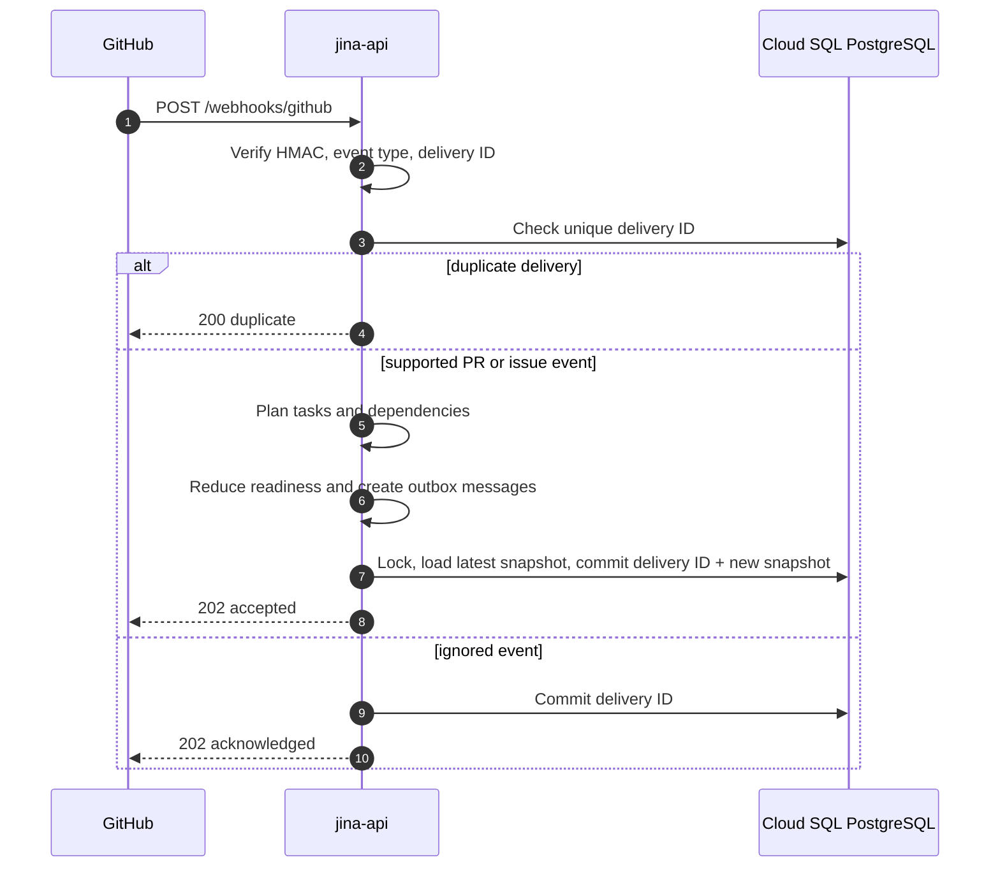
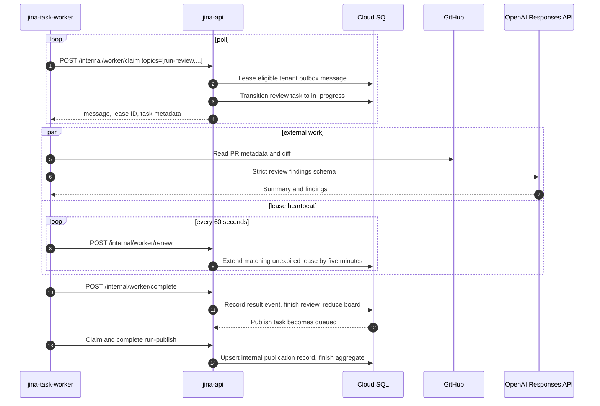
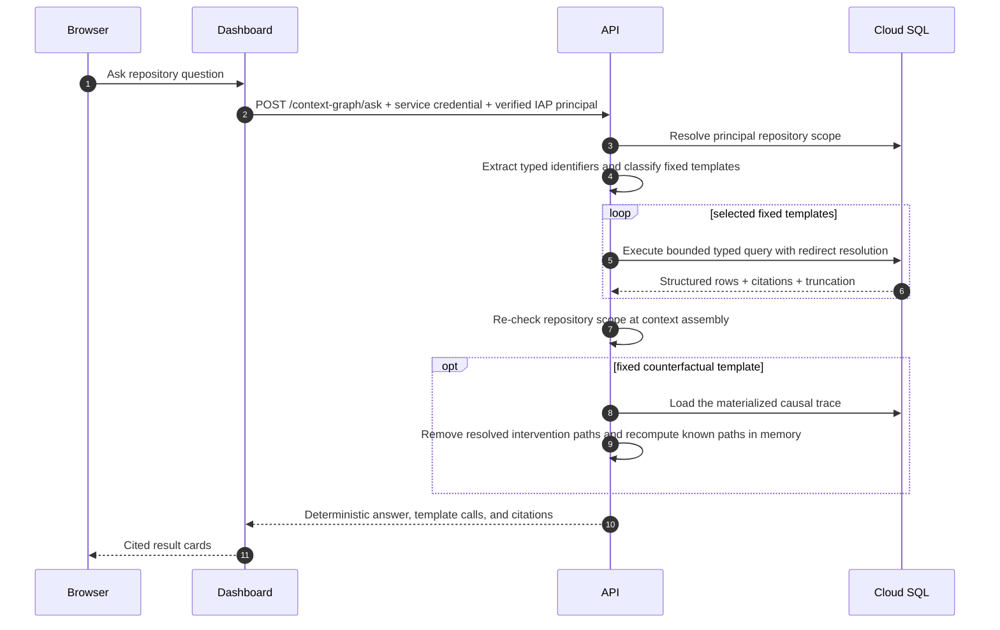
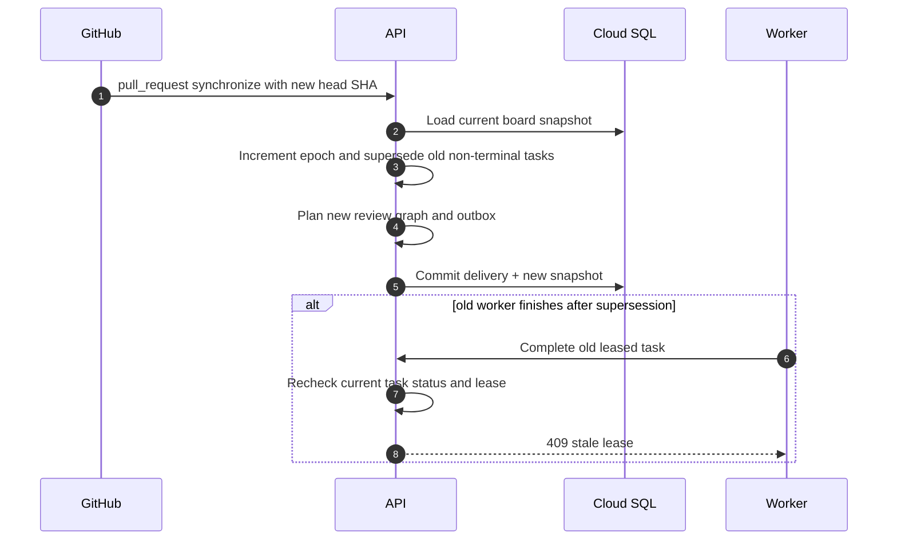
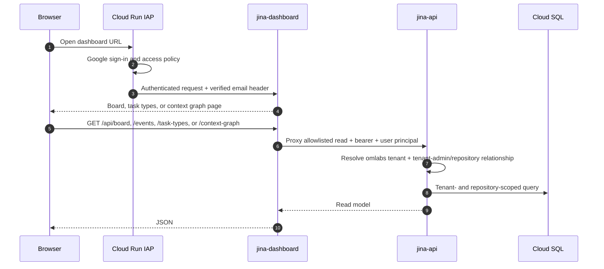

# Current Sequence Diagrams

These diagrams describe the implementation deployed by `.github/workflows/ci-deploy.yml` as of 2026-07-21.

The board reducer is the orchestrator. Workers never mutate board state directly: they claim a durable outbox lease through the API, perform external work outside the API mutation lock, renew the lease while active, and complete through the API.

## Signed GitHub intake



An opened pull request creates `pr_review`, `review_pass`, and `publish` tasks. A `synchronize` event supersedes non-terminal tasks from the old epoch and creates the next epoch. An opened issue creates one manual `issue_triage` card.

## Durable review and publication flow



`run-publish` currently records the idempotent publication in Jina. It does not post a GitHub comment or check yet. `run-research` records its requested source context without arbitrary network retrieval, and `run-cleanup` acknowledges the cleanup task.

If a worker crashes, the leased message becomes claimable after expiration. A completion with the wrong, expired, or replaced lease returns `409` and changes no state.

## Incremental context graph build

```mermaid
sequenceDiagram
    autonumber
    participant User
    participant API as jina-api
    participant Worker as jina-context-graph-worker
    participant GitHub
    participant Daytona
    participant Codex
    participant DB as Cloud SQL

    User->>API: POST /context-graph/build repository, ref
    API->>DB: Create aggregate + ingest, assert, project children
    Worker->>API: Claim run-context-graph-ingest lease
    Worker->>GitHub: Resolve ref and walk the commit DAG
    Worker->>API: Ask which commit SHAs are already canonical
    API-->>Worker: Known-parent boundary
    Worker->>GitHub: Read only unseen commit trees (or head on replay)
    Worker->>API: Record immutable observations and request blob cache misses
    API->>DB: Write commits, refs, tree state, first-parent changes, entities, identities, outbox
    DB-->>Worker: Previously unseen blob SHAs only
    par deterministic sources
        Worker->>GitHub: Read missing blobs plus PR/issue/CODEOWNERS sources
        Worker->>GitHub: Read deployments, deploy workflows, and incident-labeled issues when permitted
        Worker->>Worker: Parse manifests, named services, move candidates, and stable-ID postmortems/tombstones
    end
    Worker->>API: Store versioned symbols/typed edges and normalized explicit facts
    API->>DB: Queue assertion task with bounded cross-commit focus paths
    Worker->>API: Claim run-context-graph-assert and check generation cache
    alt assertion input already processed
        API-->>Worker: Reuse checkpoint
    else new content needs semantic analysis
        Worker->>Daytona: Clone and checkout immutable commit SHA
        Worker->>Codex: Analyze bounded current paths with typed causal schema
        Codex-->>Worker: Cited Feature, derived Issue, movement, impact, and causal proposals
        Worker->>Daytona: Validate citations and deterministic source identities
        alt output validation fails once
            Worker->>Codex: Repair citations or required derived Issue in the same task
            Codex-->>Worker: Complete corrected JSON
            Worker->>Daytona: Validate again or fail closed
        end
        Worker->>API: Complete with model-output observation
        API->>DB: Store registry-validated model assertions as proposed
    end
    Worker->>API: Claim run-context-graph-project
    API->>DB: Claim repository/ref canonical outbox rows with SKIP LOCKED
    alt unchanged head with no pending scoped events
        API-->>Worker: Reuse manifest/search checkpoint
    else projection work pending
        API->>DB: Rebuild ref manifest + lexical/vector search; reconcile redirects; apply retention
    end
    API->>DB: Join manifest, cached code facts, and active current-evidence assertions
    API->>DB: Store immutable rebuildable graph projection
    API->>DB: Complete projection and aggregate tasks
    API-->>Worker: accepted + graph ID
    loop idle steady-state drain
        Worker->>API: Drain canonical projection events
        API->>DB: Fan global events across repos; rebuild then ack
    end
```

Graph identity is content-addressed by tenant, repository, commit, projection version, and canonical graph content, so a later projection cannot rewrite a graph referenced by an older task and an unchanged projection reuses the same ID. Blob parsing is keyed by tenant, blob SHA, and parser version. Assertion generation uses only an exact evidence-fingerprint cache hit; a mismatch runs the generator. Re-emitted semantic facts preserve their original provenance and review status and update only confirmation time. Model facts stay proposed until an audited command accepts them. Projections carry forward accepted assertions only while every cited path still resolves to the same blob.

## Cited repository question



## PR epoch supersession



## Dashboard authentication and reads



Each page polls only the endpoints it needs. The context graph list request returns the latest full graph and lightweight summaries for older generations; historical node and edge collections are loaded only through graph detail.

## Local development difference

`pnpm dev` uses memory stores unless database variables are present. It enables the unsigned `/dev/webhooks/github` endpoint, can seed a demo PR, and may simulate non-context-graph task completion with an in-process timer. All three features are disabled in production; production work is handled only by the durable workers above.
