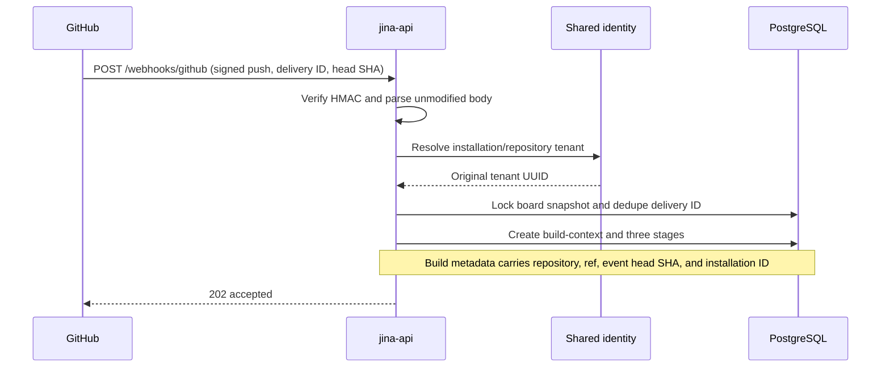
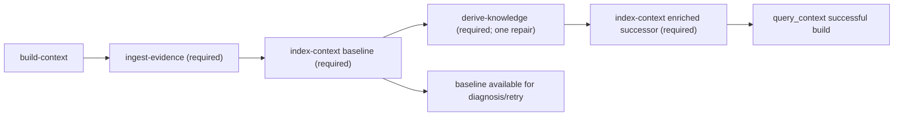
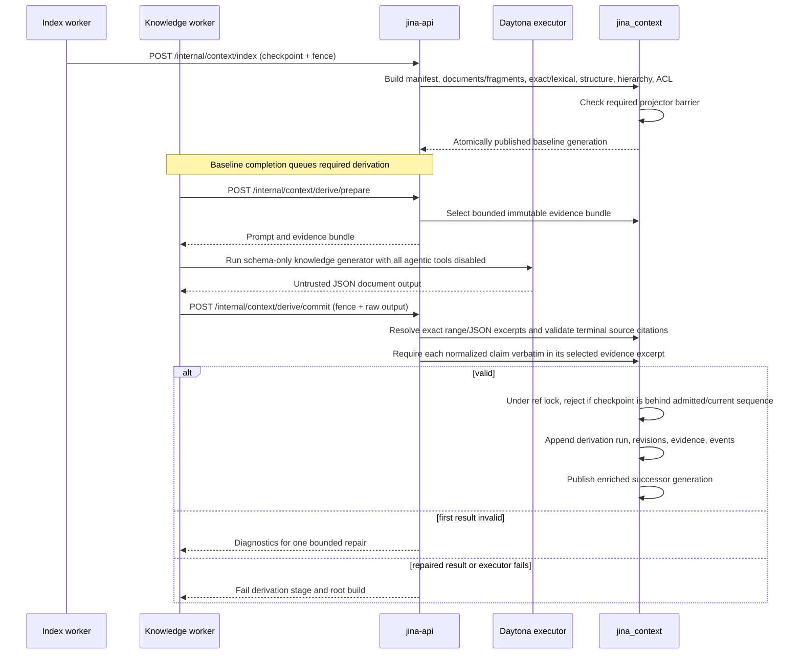
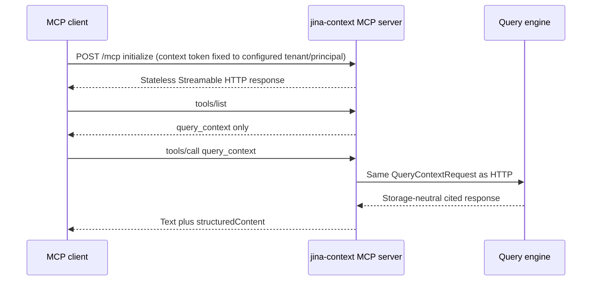
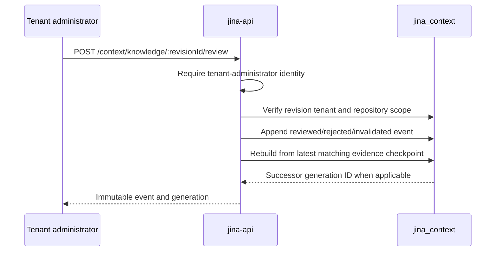
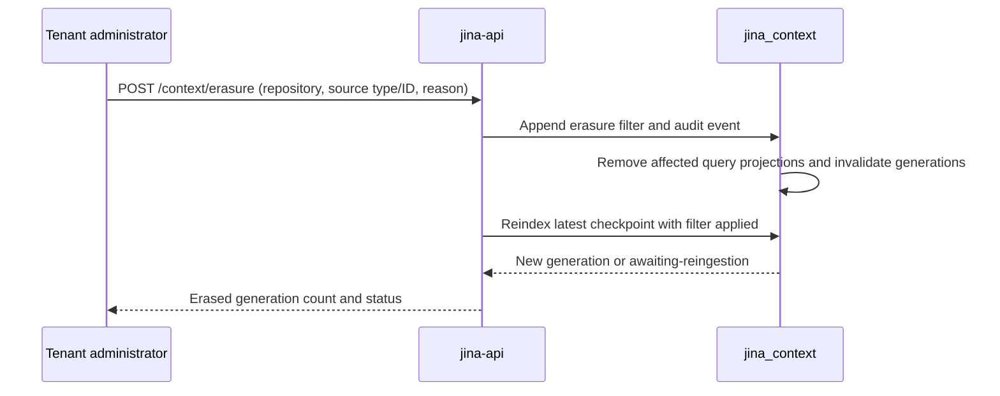

# Sequence diagrams

These are the implemented context-engine and board flows. All context identities include
tenant and repository scope even where the diagrams abbreviate them.

## Signed push to authoritative-head build



An unchanged head deduplicates. A moved ref supersedes active older work. The worker later
fetches the authoritative remote branch head and requires it to equal the event SHA; a
stale delivery fails rather than becoming the current ref generation.

## Strict context stage sequence



The coordinator queues only the next stage: ingestion first, baseline indexing second,
and required derivation only after the baseline succeeds. This prevents independent
workers from racing baseline projection inputs with a knowledge commit. The board can
serve the baseline for diagnosis and retry without model output, but derivation failure
fails the root build. Production acceptance waits for all three stages and requires the
enriched successor so it exercises the complete release path.

## Ingest immutable evidence

```mermaid
sequenceDiagram
    participant W as jina-context-worker
    participant API as jina-api
    participant Git as Git/GitHub
    participant CE as context-engine
    participant DB as jina_context

    W->>API: POST /internal/worker/claim (run-ingest-evidence)
    API-->>W: task, lease, attempt, write-fence token
    W->>Git: Mint installation token; full blob-filtered clone and paginated provider history
    W->>Git: Fetch refs/heads/ref to refs/remotes/origin/ref
    W->>Git: Require event SHA == fetched head; detached checkout
    W->>W: Persist bounded commit/parent history; enumerate full manifest
    W->>W: Record Git/GitHub frontiers and omitted bodies as complete or partial
    W->>API: POST /internal/context/ingest (lease + evidence input)
    API->>API: Validate topic, lease, attempt, and fence
    API->>CE: IngestEvidenceService.ingest
    CE->>CE: Hash evidence and run deterministic parser
    CE->>DB: Immutable evidence, Git objects, ACL observation, checkpoint, outbox
    DB-->>CE: Evidence checkpoint and fingerprint
    API-->>W: checkpoint ID, commit SHA, fingerprint
    W->>API: Complete board stage with checkpoint metadata
```

Partial trees, a moved remote ref, and unverified commit identity fail closed. A reached Git/GitHub bound,
unavailable optional provider source, or omitted body is committed truthfully as a
`partial` checkpoint with a machine-readable frontier; query coverage then reports that
partial state. Retries converge by immutable object and input fingerprints. The
checkpoint advances the projection frontier only if its `refSequence` is at least the
latest admitted sequence. A stale lease cannot commit.

## Baseline and enriched generations



The baseline contains raw evidence as indexable context documents. Derived knowledge is
also projected as indexable documents, but its answer citations expand through immutable
revision evidence to original blobs, observations, commits, pull requests, or issues.
Only revisions whose every stored citation source identity and `contentDigest` exists in
the exact evidence checkpoint can enter either generation; ref+commit equality alone is
insufficient. Equivalent same-commit checkpoints safely reuse unchanged cited facts, but
changed mutable provider evidence excludes stale PR/issue-derived facts.

Each projector claims its own durable outbox delivery and lease. Publication acknowledges
only deliveries for that consumer and exact tenant/repository/ref/commit checkpoint.
`POST /internal/context/outbox/drain` finds pending checkpoints and replays this idempotent
index path; it is not a metrics-only no-op.

## HTTP query

```mermaid
sequenceDiagram
    participant C as Trusted client
    participant API as jina-api
    participant DB as jina_context
    participant QE as Query engine

    C->>API: POST /context/query (fixed-bound context token, repository/ref/question)
    API->>API: Default omitted ref to main
    API->>DB: Resolve principal repository access and ACL fingerprints
    DB-->>API: Authorized repository and exact fingerprint set
    API->>DB: SQL-filter one published generation by those fingerprints
    API->>QE: Plan task-specific routes
    par deterministic routes
        QE->>DB: Exact/structured/structural retrieval
    and text routes
        QE->>DB: Lexical/knowledge/temporal retrieval
    and long-form routes
        QE->>DB: Hierarchy and bounded long-context retrieval
    end
    DB-->>QE: Only authorized rows; candidates with original evidence anchors
    QE->>QE: Deduplicate, fuse, detect conflicts, assess coverage
    QE->>QE: Assemble evidence pack, synthesize, verify citations
    QE->>DB: Persist bounded query telemetry
    API->>DB: Reauthorize principal and exact ACL-fingerprint set
    API-->>C: Answer, generation/ref/commit, citations, conflicts, coverage, trace ID
```

SQL filtering occurs while hydrating documents, fragments, exact entries, hierarchy,
manifest, and current knowledge, before candidate creation. Structural relations survive
only when every anchor belongs to the authorized document set. Dense retrieval joins only
when a generation advertises an evaluated/available embedding capability; it is disabled
in the current release. If the final authorization differs from the initial fingerprint
set, the API drops the response.

## Stateless MCP query



MCP callers cannot select SQL, retrievers, generation internals, or mutation tools.
Both public query transports reject bodies over 128 KiB. Each raw target category accepts
at most 100 entries before deduplication; values are trimmed, empty strings discarded,
accepted values deduplicated, and non-empty values limited to 1,000 characters.

## Knowledge review



The revision body and citations never change. Current selection is recomputed from the
append-only event history. A repository reader who is not a tenant administrator cannot
append review state.

## Erasure and rebuild



Reingestion checks the durable filter, so a rebuild cannot resurrect erased evidence,
knowledge citations, or query-visible documents.

## Deployment acceptance

```mermaid
sequenceDiagram
    participant CB as Cloud Build
    participant M as Migration owner job
    participant CR as Cloud Run
    participant A as Acceptance job

    CB->>M: Deploy/execute jina-context-migrate using audited image SHA
    M->>M: Install roles; make runtime login NOINHERIT and grant memberships
    M-->>CB: jina_context ready
    CB->>CR: Deploy API and verify /health
    CB->>CR: Deploy context worker and verify exact topics
    CB->>CR: Deploy task worker and verify exact topics
    CB->>CR: Deploy dashboard and admin from the same release build
    CB->>A: Execute production fixture build
    A->>CR: Internal-token ACL merge for non-admin query principal
    A->>CR: Admin-principal build, generation, document, and backlog checks
    A->>CR: Bound non-admin HTTP query and real MCP SDK query_context
    A->>CR: Verify citations, commit, backlog, and removed route
    A-->>CB: Pass/fail summary
```

The operator creates and records the restorable Cloud SQL backup before this sequence.
Every context database transaction in the runtime explicitly activates its declared
capability with `SET LOCAL ROLE`.
