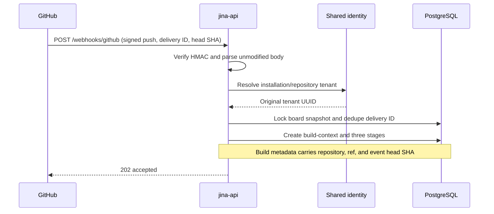
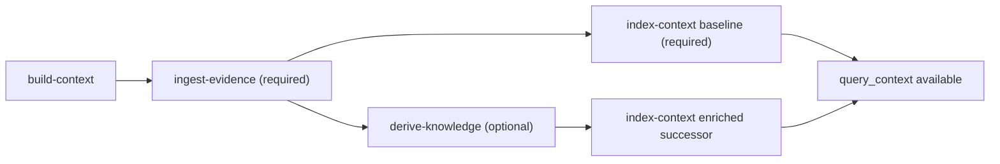
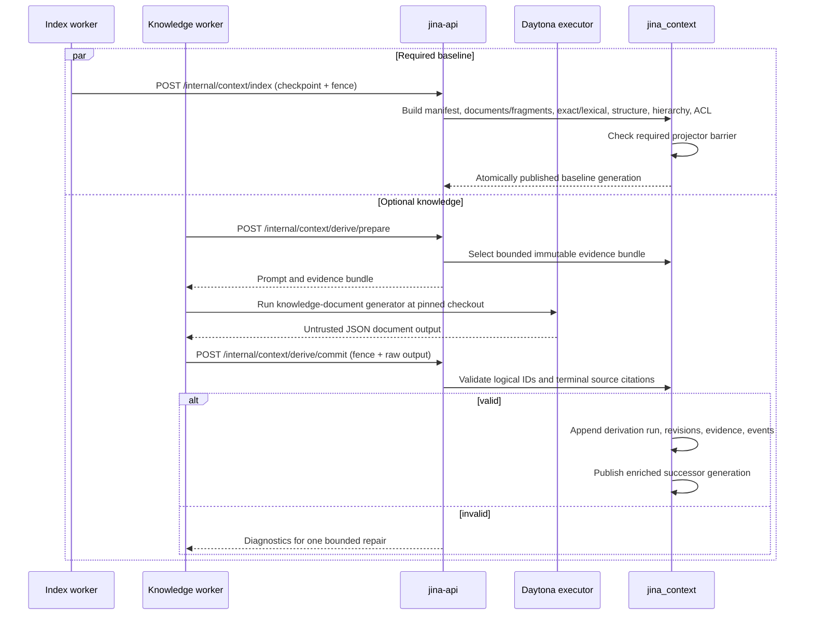
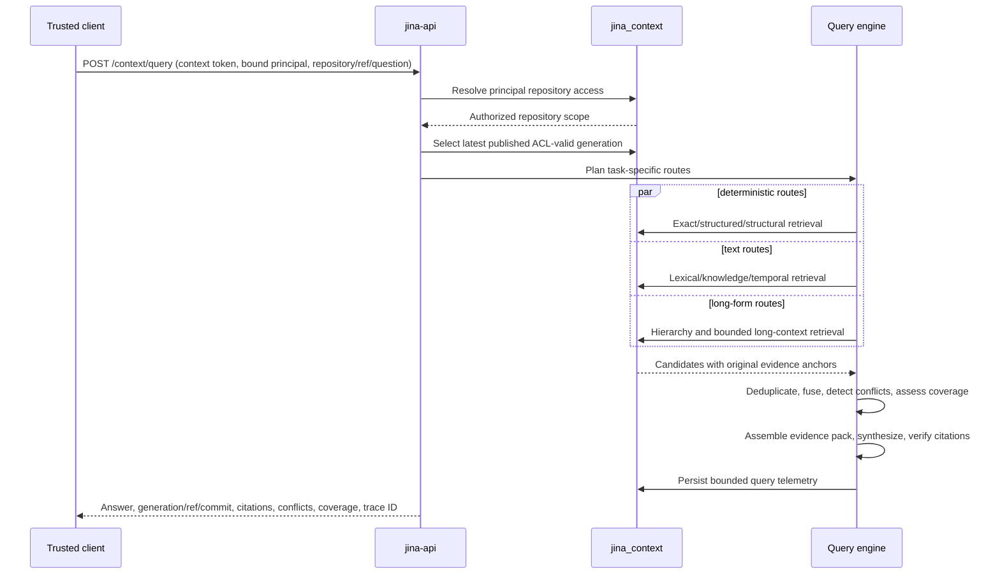
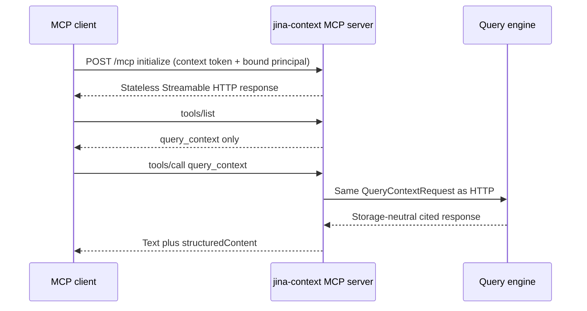
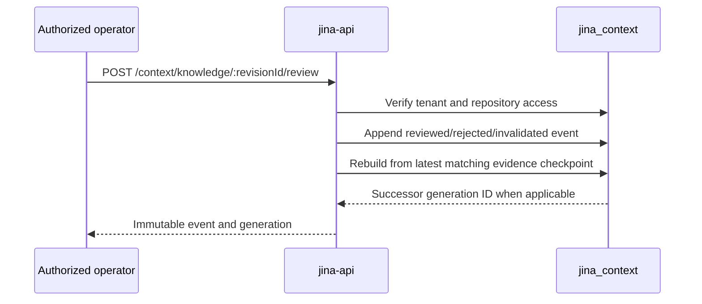
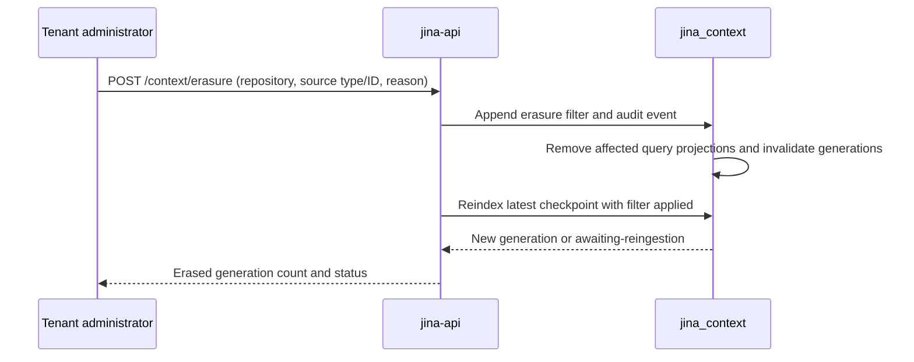
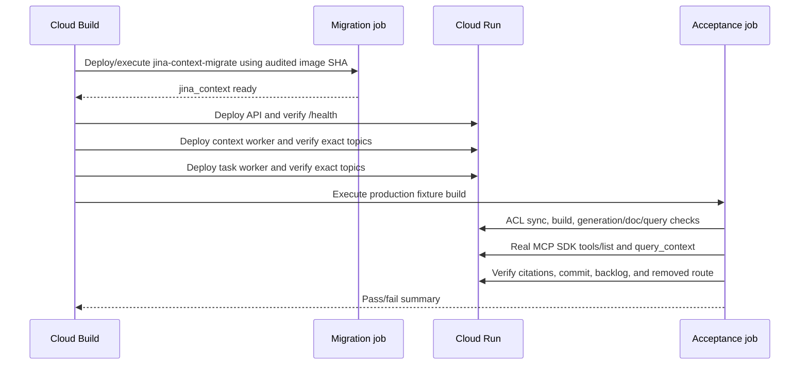

# Sequence diagrams

These are the implemented context-engine and board flows. All context identities include
tenant and repository scope even where the diagrams abbreviate them.

## Signed push to exact-commit build



An unchanged head deduplicates. A moved ref supersedes active older work. The worker later
verifies that the checked-out commit is exactly the requested full SHA.

## Context stage DAG



The board aggregate can serve a baseline generation without model output. Production
acceptance waits for all three stages and requires the enriched successor so it exercises
the complete release path.

## Ingest immutable evidence

```mermaid
sequenceDiagram
    participant W as jina-context-worker
    participant API as jina-api
    participant Git as Git/GitHub
    participant CE as context-engine
    participant DB as jina_context

    W->>API: POST /internal/worker/claim (run-ingest-evidence)
    API-->>W: task, lease, attempt, write-fence token
    W->>Git: Clone/fetch repository and bounded provider history
    W->>Git: Resolve and checkout exact commit SHA
    W->>W: Enumerate full manifest; omit unsafe bodies, not entries
    W->>API: POST /internal/context/ingest (lease + evidence input)
    API->>API: Validate topic, lease, attempt, and fence
    API->>CE: IngestEvidenceService.ingest
    CE->>CE: Hash evidence and run deterministic parser
    CE->>DB: Immutable evidence, Git objects, ACL observation, checkpoint, outbox
    DB-->>CE: Evidence checkpoint and fingerprint
    API-->>W: checkpoint ID, commit SHA, fingerprint
    W->>API: Complete board stage with checkpoint metadata
```

Partial trees, unverified commit identity, and exceeded completeness bounds fail closed.
Retries converge by immutable object and input fingerprints. A stale lease cannot commit.

## Baseline and enriched generations



The baseline contains raw evidence as indexable context documents. Derived knowledge is
also projected as indexable documents, but its answer citations expand through immutable
revision evidence to original blobs, observations, commits, pull requests, or issues.

## HTTP query



ACL filtering occurs before candidate creation. Dense retrieval joins only when a
generation advertises an evaluated/available embedding capability; it is disabled in the
current release.

## Stateless MCP query



MCP callers cannot select SQL, retrievers, generation internals, or mutation tools.

## Knowledge review



The revision body and citations never change. Current selection is recomputed from the
append-only event history.

## Erasure and rebuild



Reingestion checks the durable filter, so a rebuild cannot resurrect erased evidence,
knowledge citations, or query-visible documents.

## Deployment acceptance



The operator creates and records the restorable Cloud SQL backup before this sequence.
