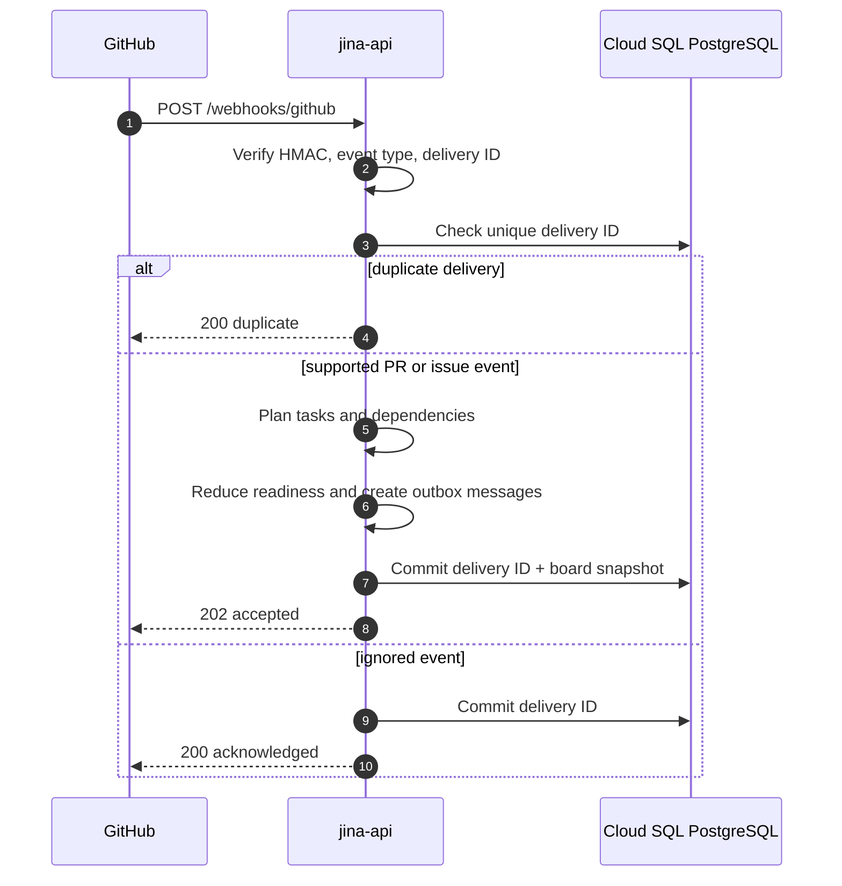
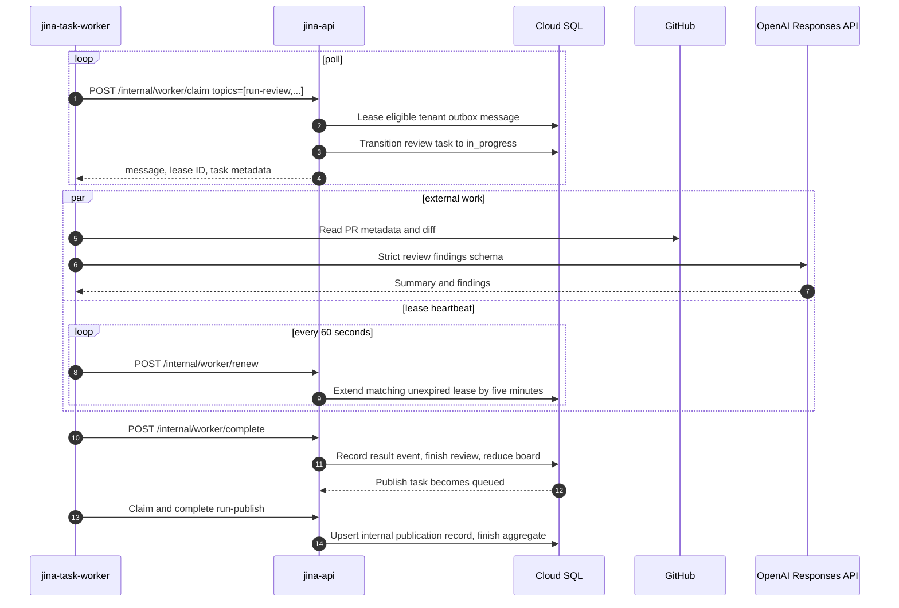
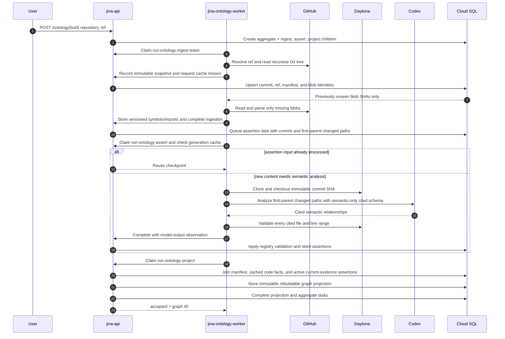
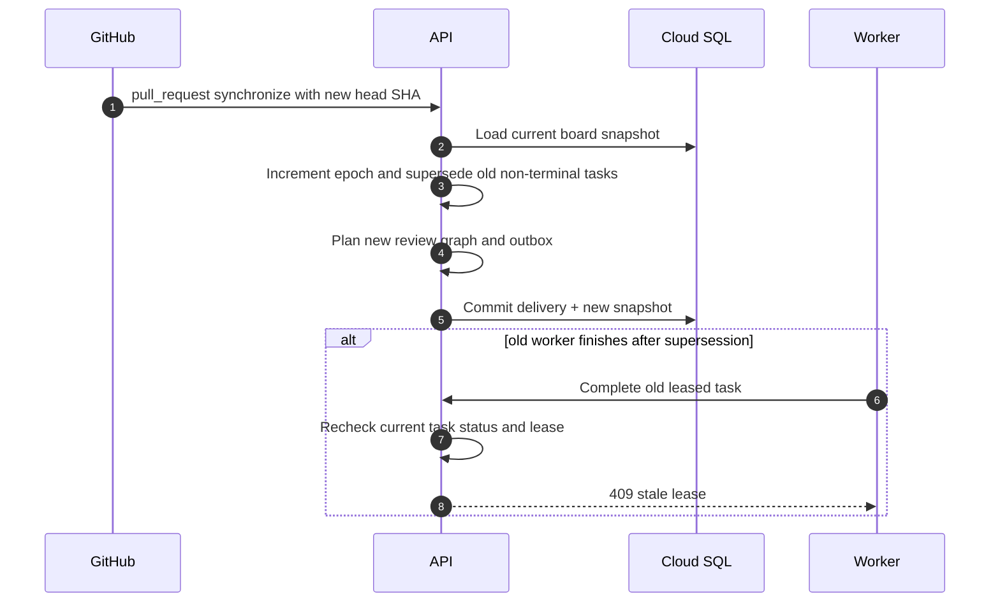
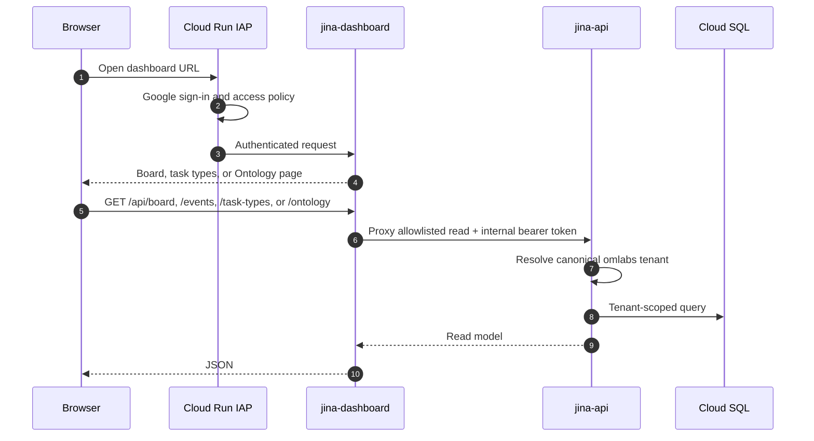

# Current Sequence Diagrams

These diagrams describe the implementation deployed by `.github/workflows/ci-deploy.yml` as of 2026-07-19. They intentionally exclude the Trigger.dev and normalized-storage target designs in [ARCHITECTURE.md](ARCHITECTURE.md).

The board reducer is the orchestrator. Workers never mutate board state directly: they claim a durable outbox lease through the API, perform external work outside the API mutation lock, renew the lease while active, and complete through the API.

## Signed GitHub intake

An opened pull request creates `pr_review`, `review_pass`, and `publish` tasks. A `synchronize` event supersedes non-terminal tasks from the old epoch and creates the next epoch. An opened issue creates one manual `issue_triage` card.

## Durable review and publication flow

`run-publish` currently records the idempotent publication in Jina. It does not post a GitHub comment or check yet. `run-research` records its requested source context without arbitrary network retrieval, and `run-cleanup` acknowledges the cleanup task.

If a worker crashes, the leased message becomes claimable after expiration. A completion with the wrong, expired, or replaced lease returns `409` and changes no state.

## Incremental Ontology build

Graph identity includes the task generation, so a later projection cannot rewrite a graph referenced by an older task. Blob parsing is keyed by tenant, blob SHA, and parser version. Assertion generation is cached by repository commit and generator version, and projections carry forward assertions only while every cited path still resolves to the same blob.

## PR epoch supersession

## Dashboard authentication and reads

Each page polls only the endpoints it needs. The Ontology list request returns the latest full graph and lightweight summaries for older generations; historical node and edge collections are loaded only through graph detail.

## Local development difference

`pnpm dev` uses memory stores unless database variables are present. It enables the unsigned `/dev/webhooks/github` endpoint, can seed a demo PR, and may simulate non-Ontology task completion with an in-process timer. All three features are disabled in production; production work is handled only by the durable workers above.
