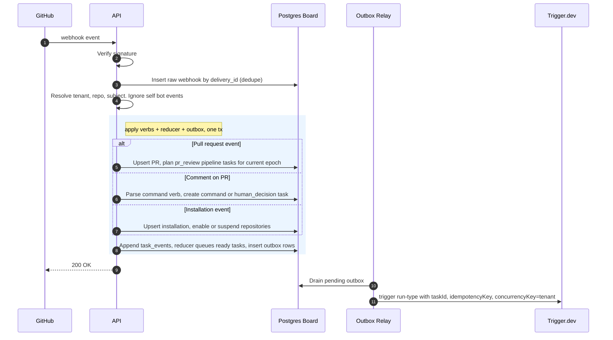
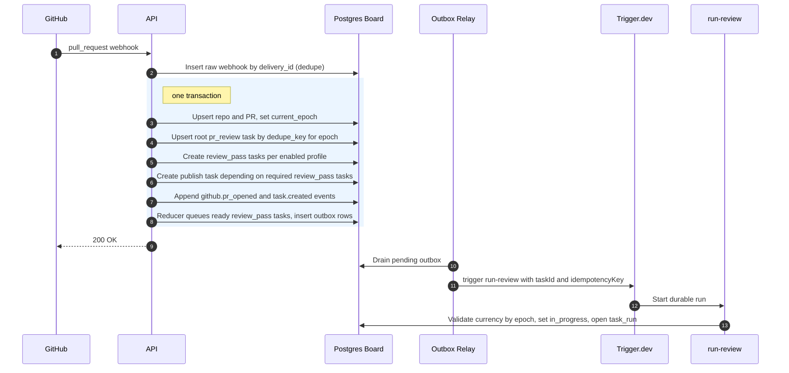
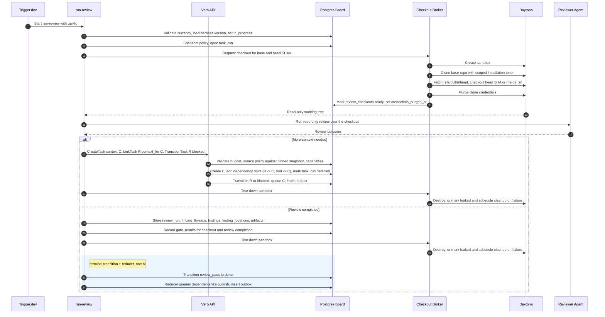
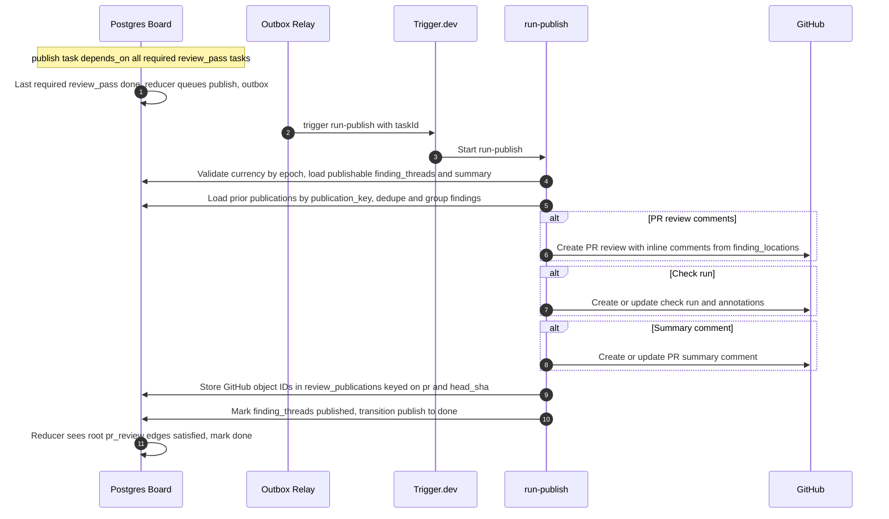
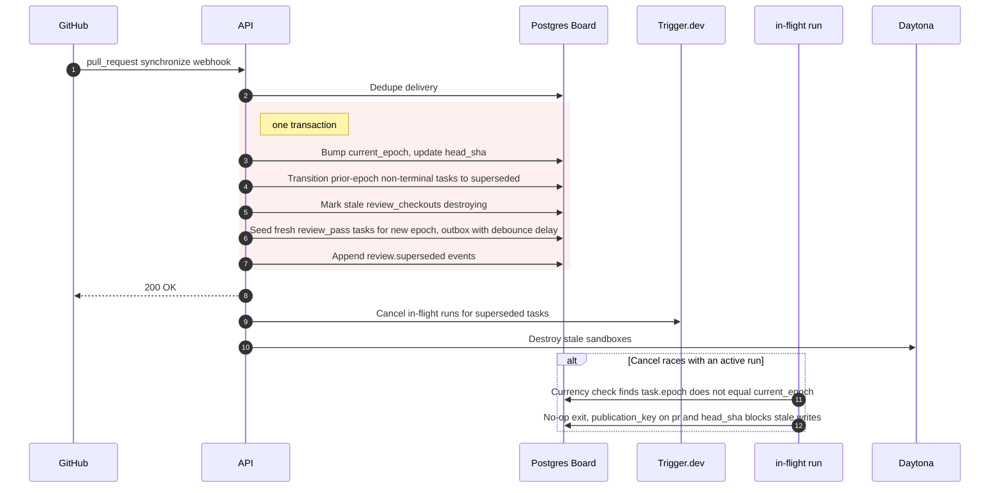
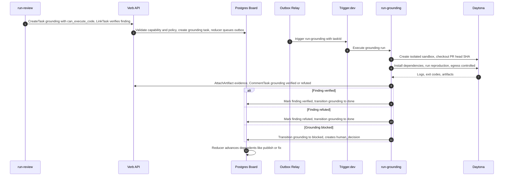
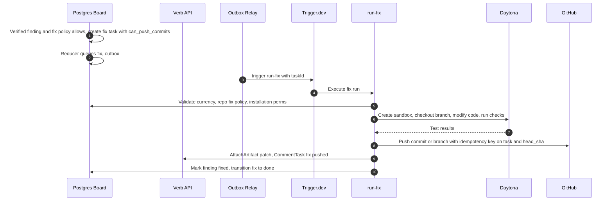
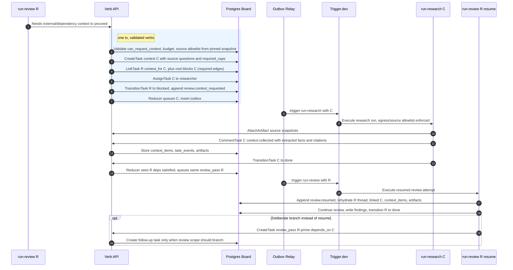
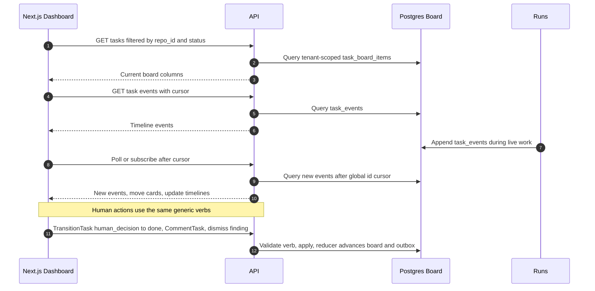

# Sequence Diagrams

These diagrams describe the main Jina flows in the board / Trigger.dev model. They use Mermaid syntax. MVP diagrams are review-only; context handoff is capability-gated and non-mutating; grounding, fixing, and broader pipelines are future extension points.

Orchestration is the board, not a coordinator workflow. A task becomes ready via the readiness reducer, is dispatched by a transactional outbox + relay, and is executed by a stateless Trigger.dev run that writes results back through generic verbs. Runs and HTTP handlers never mark tasks complete out-of-band; they transition tasks, which re-runs the reducer.

Participants:

- **API** — API server (verify webhooks, apply generic verbs, run the readiness reducer).
- **Board** — Postgres source of truth: tasks, dependencies, events, runs, gates, outbox.
- **Relay** — outbox relay that triggers runs.
- **Trigger** — Trigger.dev (scheduler + durable execution).
- **Run** — a stateless per-task run (run-review, run-publish, ...).
- **Daytona** — review sandbox checkout.

## GitHub Trigger Routing (MVP)

## PR Opened Or Updated (MVP)

## Review Pass With Brokered Daytona Checkout (MVP)

## Publishing Review Feedback (MVP)

## PR Synchronized While Work Is Running (supersession + fencing)

## Multi-Agent Review With Grounding (Future)

## Verified Finding To Fix Task (Future)

## Context Handoff, Same-Task Resume (capability-gated)

## Dashboard Live View (humans are board actors)

