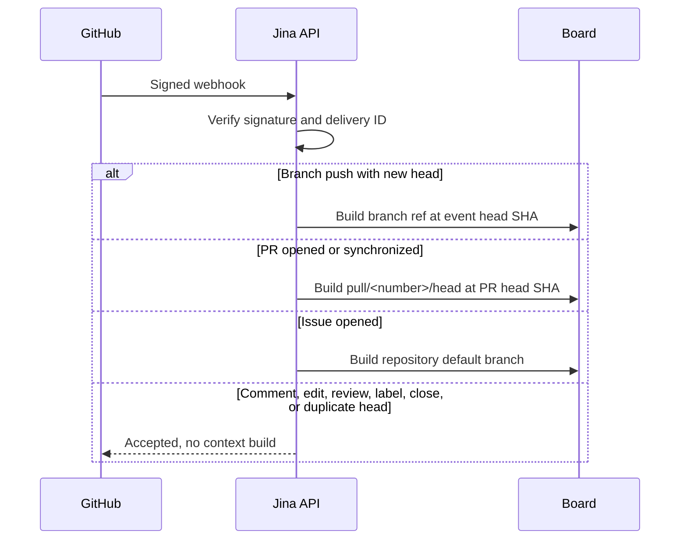
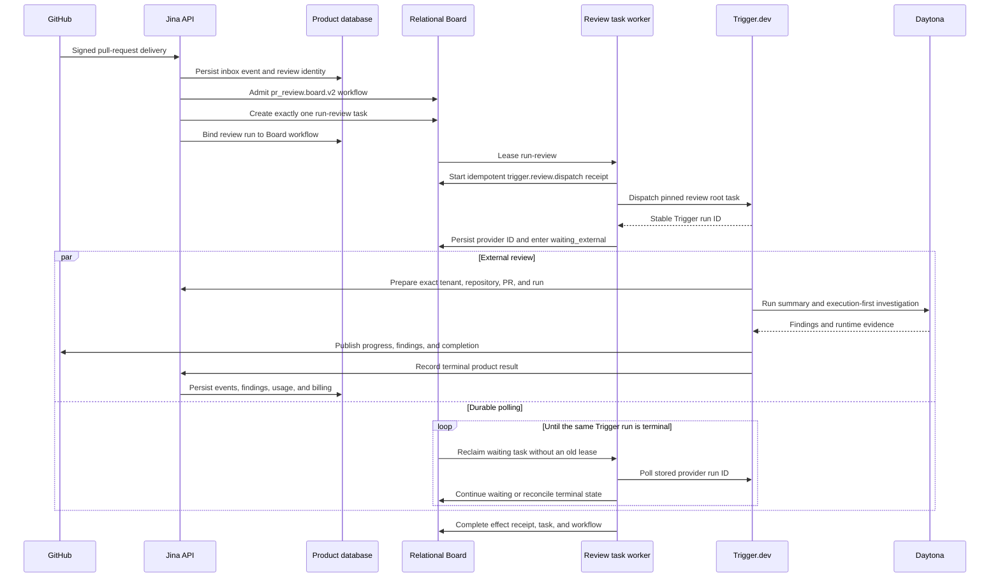
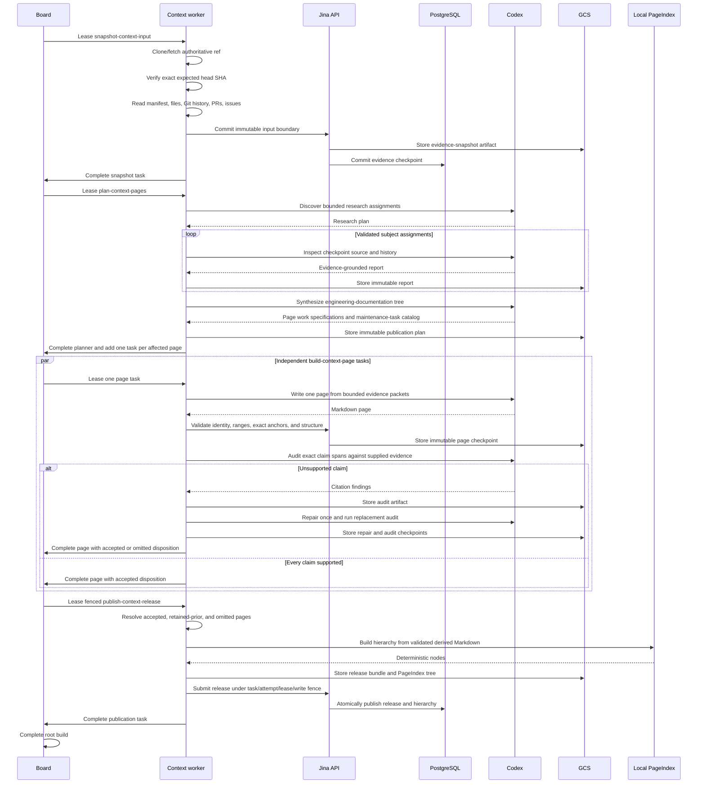
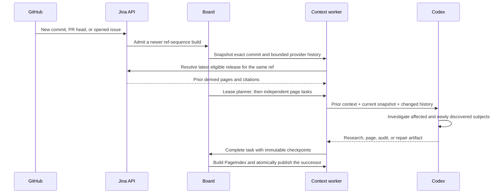
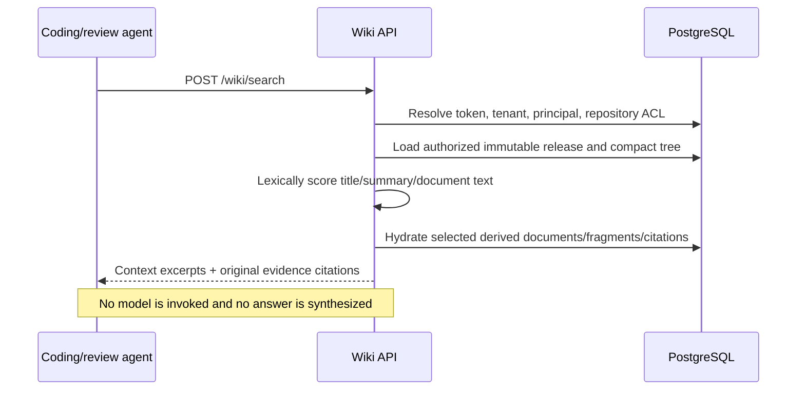
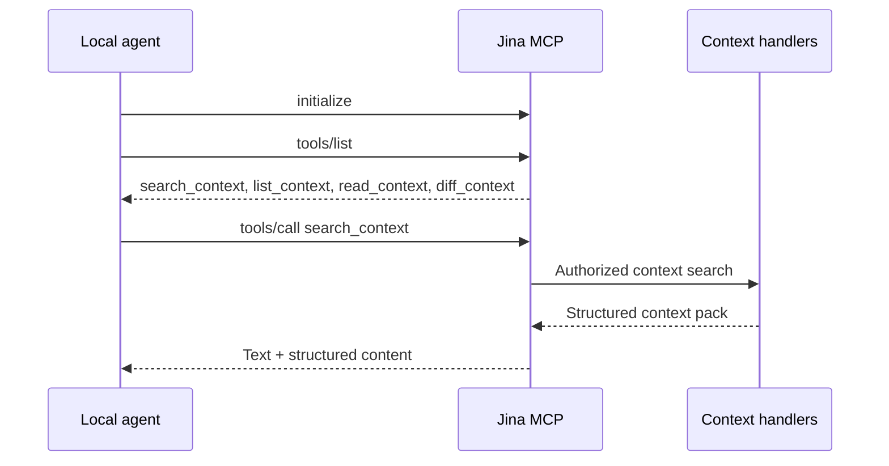
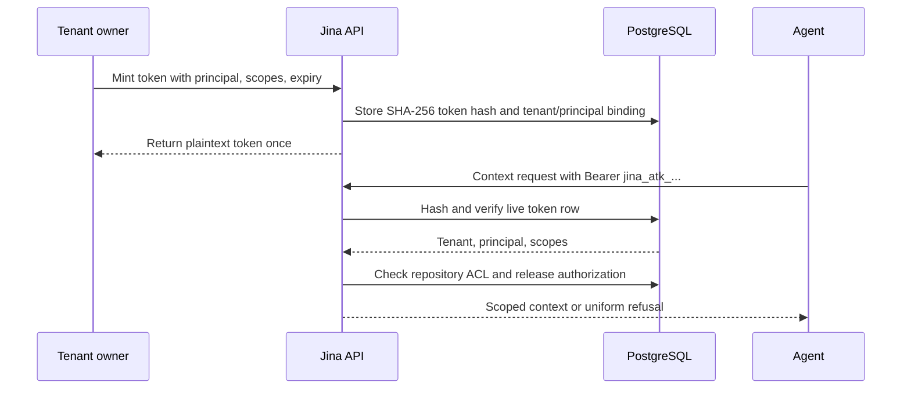
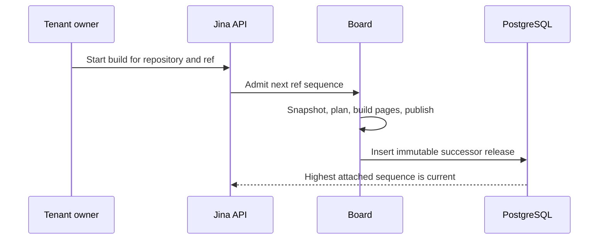
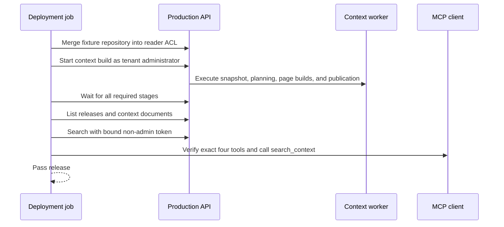

# Sequence diagrams

## GitHub trigger and branch policy

## Pull-request review

The worker releases its database lease while Trigger is running. The effect receipt's
idempotency key and unique provider identity prevent a retry from dispatching a duplicate
review. Trigger's summary and runtime children are external execution evidence, not
additional Board tasks.

## Context build and resumable publication

If a worker crashes, loses its lease, or reaches its time budget, its immutable
checkpoints and verified sibling page tasks remain. The expired task is reclaimed with a
new attempt and fence token. Before every expensive model call, the worker reads the
input-bound phase checkpoint; immediately after the call it records the immutable result
before parsing, deterministic validation, or a bounded correction. The new attempt
therefore resumes at the first unfinished model boundary. File-producing phases restore
the exact private Markdown snapshot from GCS. No unaudited partial release becomes
queryable.

If `main` moves after the build has invested work, admission records only the newest
follow-up on the same Board root and lets the current sequence finish. Completion
atomically publishes the old sequence, then the API promotes the queued head with that
release as its prior-context seed. Worker claim reconciliation repeats the promotion
idempotently after an API crash. PR synchronize events remain freshness-first and cancel
the stale preview immediately.

## Incremental commit, PR, and issue

## Deterministic search without answer generation

All four retrieval tools are model-free. The calling coding or review agent performs any
reasoning over the returned cited context.

## MCP

The Streamable HTTP server is stateless per request. All tools are annotated read-only,
idempotent, non-destructive, and closed-world.

## Tenant-scoped token

## Successor release

## Production acceptance

