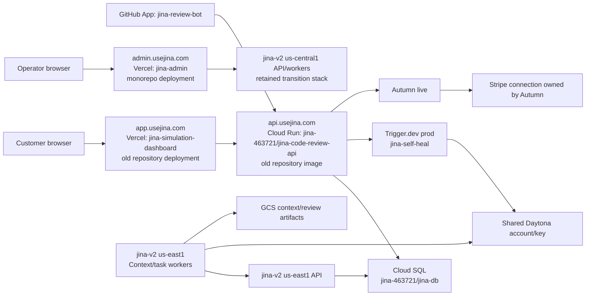

# Staging-to-production source consolidation and cutover runbook

Status: execution in progress. Recovery and isolated-staging acceptance are complete;
production serving traffic, schemas, aliases, review semantics, and provider routing
remain unchanged. The only production-side mutations so far are additive recovery
artifacts and enabling Cloud SQL deletion protection.

Last live audit: 2026-08-06 16:53 America/Chicago.

This is the operational plan for merging `omxyz/jina` branch `staging` into `main`,
moving the production source of truth from `omxyz/jina-simulation` to `omxyz/jina`,
and retaining a reversible path to the exact currently serving versions. It covers the
entire system boundary: GitHub, Cloud Run, Cloud SQL, GCS, Cloud Build, Secret Manager,
Vercel, Trigger.dev, Daytona, OpenAI/OpenRouter, Autumn/Stripe, and Clerk.

The review workflow's internal design and its `run-review` semantic transition remain
specified in [REVIEW_TRIGGER_BOARD_CUTOVER.md](./REVIEW_TRIGGER_BOARD_CUTOVER.md). This
runbook does not duplicate or weaken that design. It places it inside the larger
production source, data, identity, billing, and routing cutover.

## Executive decision

Production is not currently one deployment from one repository. It is a split system:

- `app.usejina.com` and `api.usejina.com` are still served from the old
  `omxyz/jina-simulation` production commit;
- the Context and task-worker services are deployed from `omxyz/jina` in `jina-v2`;
- `admin.usejina.com` is deployed from `omxyz/jina`, but calls the retained
  `us-central1` stack rather than the current `us-east1` stack;
- the live database is still the Cloud SQL instance in the old GCP project and is
  shared by the old product API and newer Context services;
- the production monorepo task-worker lane is still configured for legacy
  `run-review`, while public review arrival remains on the old product API and isolated
  staging uses the relational one-task Board-to-Trigger path; and
- billing, model execution, authentication, and deployment each straddle more than one
  provider environment.

Therefore the cutover must not be implemented as one large branch merge followed by a
DNS switch. The safe release is a sequence of compatibility-preserving changes with a
fresh backup, dark candidates, explicit acceptance gates, and independent rollback for
every routing layer.

The safest initial consolidation changes the source repository without simultaneously
moving the production database or all GCP resources. In particular, the monorepo API
can be deployed as a new revision of the existing public Cloud Run service, preserving
the existing custom domain and giving Cloud Run an immediate revision-level rollback.
Cross-project infrastructure consolidation, if still desired, should be a later change
after the source cutover has been stable.

## Outcomes

The cutover is complete only when all of the following are true:

1. `omxyz/jina` `main` is the only repository from which serving production artifacts
   are built.
2. The customer dashboard, product API, admin, workers, and Trigger review project all
   identify one audited `omxyz/jina` release commit.
3. New reviews are represented by one relational Board task, `review` on topic
   `run-review`, and only the task worker dispatches Trigger.dev task `review`.
4. The original review prompt, Trigger child topology, Daytona implementation, and
   dispatch options remain pinned by `trigger/source-manifest.json`.
5. The live Cloud SQL data, GCS artifacts, provider configuration, GitHub App state,
   subscriptions, credit balances, and identity links are preserved.
6. Existing sessions, GitHub deliveries, queued work, and reviews continue without an
   externally visible interruption.
7. Every serving route has a recorded rollback target and a rehearsed rollback command
   or provider operation.
8. No old repository, database, bucket, secret, image, deployment, or billing record is
   deleted as part of the cutover.

## Non-goals

- Do not delete the old GitHub repository or the dirty local checkout.
- Do not delete or overwrite any Cloud SQL instance, GCS object, Secret Manager
  version, Cloud Run revision, Artifact Registry image, Vercel deployment, Trigger
  deployment, Daytona sandbox/snapshot, Autumn customer, or Stripe customer.
- Do not move the primary database between projects during the source cutover.
- Do not rotate encryption, internal API, GitHub App, Daytona, model-provider, Autumn,
  Stripe, or Clerk credentials merely to make names look consistent.
- Do not combine the GitHub-auth-to-Clerk transition with the source/review cutover.
- Do not collapse the review workflow into worker code. The relational Board owns the
  high-level task; Trigger.dev owns the pinned original review workflow.
- Do not treat a staging review success as proof that production data, identities,
  credentials, or routing are compatible.
- Do not remove compatibility code until the corresponding persisted work is proven
  drained in production.

## Safety invariants

These are release blockers, not recommendations:

1. A fresh production backup must complete and be independently restorable before the
   first serving, data, schema, or provider-configuration mutation. Creation and
   restore-testing of recovery artifacts are the only permitted earlier production
   operations.
2. The exact serving revisions, deployment IDs, image digests, secret versions, Git
   commits, provider project IDs, and aliases must be recorded before mutation.
3. Database migrations must be additive. Schema rollback is not allowed; application
   rollback must remain compatible with the expanded schema.
4. Only one accepted task-worker release may claim relational Board work.
5. A persisted `run-review` payload may be claimed only by a worker that understands
   its recorded semantic version.
6. Authentication mode stays `github` for the initial production source cutover.
7. The existing production encryption key remains available to every candidate that
   must decrypt existing tenant integration credentials.
8. The old and new APIs must never concurrently publish duplicate GitHub reviews for
   the same delivery or idempotency key.
9. Vercel aliases, Cloud Run traffic, Trigger secrets, and worker release credentials
   are changed one control plane at a time.
10. An abort switches the durable webhook inbox to `capture_only` before it changes
    worker ownership. Signed GitHub deliveries continue to commit and return 2xx.
11. No cleanup phase performs deletion. Retirement initially means zero traffic,
    disabled claims, preserved artifacts, and a recorded owner.

## Terminology

| Term                        | Meaning in this runbook                                                                                                          |
| --------------------------- | -------------------------------------------------------------------------------------------------------------------------------- |
| Old production              | Resources currently serving from `omxyz/jina-simulation` commit `322f42b5cb6d7cc3af3e4ae346b98c222aa7a822`                       |
| Monorepo                    | `omxyz/jina`                                                                                                                     |
| Isolated staging            | GCP project `jina-staging-20260802` and its staging-only provider environments                                                   |
| Primary production database | `jina-463721:us-east1:jina-db`, database `jina`                                                                                  |
| Candidate                   | A deployed but unrouted or claim-disabled production release from the monorepo                                                   |
| Release record              | The immutable manifest of source SHA, images, revisions, provider deployments, secret versions, backups, and acceptance evidence |
| Drain                       | Complete already-admitted work with its compatible executor while blocking new work of that semantic type                        |
| Retire                      | Remove traffic and claims while retaining data and rollback artifacts                                                            |

## Audited source state

At the audit time:

| Source                           | Commit/state                                                                      |
| -------------------------------- | --------------------------------------------------------------------------------- |
| `omxyz/jina` `origin/main`       | `3f11e14f4e2393c13ce4ca47ab095664da5cc61a`                                        |
| `omxyz/jina` `origin/staging`    | `b226b1dddba74774cf93f3e4c1cdec70cff7b238`                                        |
| Branch divergence                | `main` has 1 unique commit; `staging` has 141 unique commits                      |
| Approximate branch diff          | 639 files, about 130,116 insertions and 16,908 deletions                          |
| Old production repository commit | `322f42b5cb6d7cc3af3e4ae346b98c222aa7a822`                                        |
| Current worktree during audit    | `f6ac4a41ef70ff74c6f0732c6084926c938a60a4` on `codex/fix-staging-app-auth-format` |

The local old-repository checkout at `/Users/keon/dev/jina-code-review` is not a clean
copy of production. It is on `codex/clean-vercel-sidebar`, is behind `origin/main`, and
contains modified and untracked work. It must be preserved separately from the clean
`origin/main` production commit. Deleting or moving that directory before creating a
bundle, patch, and untracked-file archive would lose user work.

The merge must be rehearsed from the remote refs, not from either dirty checkout. The
release SHA is the resulting reviewed merge commit, never a floating branch name.

## Live production topology



The diagram is intentionally asymmetric. It shows why a source merge alone cannot be
treated as a complete production migration.

## GCP inventory

### Projects and roles

| Project                 | Current role                                | Important live state                                                                                         |
| ----------------------- | ------------------------------------------- | ------------------------------------------------------------------------------------------------------------ |
| `jina-463721`           | Original product production and old staging | Public production API, primary production SQL, old public image repository, old staging API and SQL          |
| `jina-v2`               | Monorepo production/transition services     | Current `us-east1` Context/task services, duplicate retained `us-central1` stack, monorepo Artifact Registry |
| `jina-staging-20260802` | Intended isolated staging                   | Staging API/workers/SQL/GCS, staging Scheduler, staging Artifact Registry                                    |

Cloud Run, Cloud SQL, Secret Manager, Artifact Registry, Cloud Build, IAM,
Logging/Monitoring/Trace, and Storage APIs are enabled in all three projects. Cloud
Scheduler is enabled only in isolated staging. Pub/Sub is enabled, but no Pub/Sub topics
exist in any of the three projects.

### Artifact Registry

Observed image storage:

| Project/repository                               | Approximate stored size |
| ------------------------------------------------ | ----------------------: |
| `jina-463721/jina-code-review`                   |                  530 MB |
| `jina-v2/jina`                                   |               12,075 MB |
| `jina-staging-20260802/jina-code-review-staging` |                  215 MB |
| `jina-staging-20260802/jina-staging`             |                7,905 MB |

Images are part of rollback evidence. Do not apply retention cleanup until the release
manifest names the exact digests that may be removed in a later, separately approved
operation.

### Public production in `jina-463721`

`jina-code-review-api` in `us-east1` serves `api.usejina.com`:

| Field                   | Audited value                                          |
| ----------------------- | ------------------------------------------------------ |
| Revision                | `jina-code-review-api-00236-bim`                       |
| Traffic                 | 100%                                                   |
| Source/image commit tag | `322f42b5cb6d7cc3af3e4ae346b98c222aa7a822`             |
| Runtime service account | `jina-api-runtime@jina-463721.iam.gserviceaccount.com` |
| Dashboard               | `https://app.usejina.com`                              |
| API base                | `https://api.usejina.com`                              |
| Auth mode               | `github`                                               |
| GitHub App ID           | `4040260`                                              |
| Trigger API             | `https://api.trigger.dev`                              |
| Runtime planner model   | `gpt-5.6-sol`                                          |
| Other review models     | `gpt-5.6-luna`                                         |
| Billing enforcement     | on                                                     |
| Graph API               | Monorepo API in `jina-v2/us-east1`                     |

The project also contains `jina-code-review-api-staging`, which still uses an older
staging image and `jina-db-staging`. It is not the intended isolated staging system, but
it remains active and must not be confused with `api.staging.usejina.com`.

### Monorepo production services in `jina-v2`

Current `us-east1` services include:

- `jina-api`, revision `jina-api-hotfix-4b19f4a`, using the shared primary database;
- `jina-context-worker`, with claims enabled despite a revision name containing
  `pause-server-20260804`;
- `jina-task-worker`, claims enabled and topic `run-review`; the serving revision omits
  `JINA_REVIEW_RUN_TOPIC_MODE` and runs the legacy implementation, while the current
  production deploy script makes that legacy selection explicit for its next release;
- `jina-causal-graph-worker`, claims disabled;
- Cloud Run copies of dashboard and admin, although the public app/admin aliases use
  Vercel; and
- migration, release-activation, preflight, and acceptance jobs.

The current production deploy script explicitly sets the task worker to legacy mode:

```text
JINA_REVIEW_RUN_TOPIC_MODE=legacy
WORKER_TOPICS=run-review
REVIEW_MODEL=gpt-5.6-sol
```

That source contract is visible in
[`scripts/cloud-build-deploy.sh`](../scripts/cloud-build-deploy.sh). Production cannot
claim relational `run-review` merely because isolated staging can.

The retained `us-central1` stack still includes active API, dashboard, and admin
services. Its Context and task workers are paused. The `us-central1` API uses the same
primary production database as the `us-east1` services. This stack is also the backend
currently selected by the public Vercel admin.

### Isolated staging in `jina-staging-20260802`

The intended staging services are in `us-east1`:

| Component           | Audited state                                                              |
| ------------------- | -------------------------------------------------------------------------- |
| API revision        | `jina-api-staging-00065-2gf`                                               |
| Source commit       | `b226b1dddba74774cf93f3e4c1cdec70cff7b238`                                 |
| Auth                | Clerk                                                                      |
| Review Board mode   | `JINA_REVIEW_BOARD_PIPELINE_MODE=v2`                                       |
| `run-review` mode   | `JINA_REVIEW_RUN_TOPIC_MODE=relational`                                    |
| Billing enforcement | off                                                                        |
| Context worker      | claims enabled                                                             |
| Task worker         | claims enabled, including drain/control topics and relational `run-review` |
| Causal worker       | claims enabled                                                             |
| Worker release gate | `JINA_REQUIRE_WORKER_RELEASE_GATE=false`                                   |

Staging proves the relational path, but it does not yet prove the production fencing
contract because its worker release gate is disabled. That must be corrected and tested
before staging can authorize production.

### Domains

| Domain                    | Live target                                 |
| ------------------------- | ------------------------------------------- |
| `api.usejina.com`         | `jina-463721/us-east1/jina-code-review-api` |
| `api.staging.usejina.com` | isolated staging API                        |
| `mcp.staging.usejina.com` | isolated staging API/MCP surface            |

`jina-v2` has no public custom domain mapping. Moving the production API domain between
projects would add a separate DNS/domain-mapping risk. It is not required to remove the
old source repository from the serving path and should not be bundled with the initial
source cutover.

### Cloud Build and Scheduler

The live regional trigger inventory is:

| Project/region                      | Trigger                | Audited contract                                                                                            |
| ----------------------------------- | ---------------------- | ----------------------------------------------------------------------------------------------------------- |
| `jina-v2/us-central1`               | `jina-main-deploy`     | `^main$` push, `cloudbuild.yaml`, approval required, deployer service account                               |
| `jina-v2/us-central1`               | `jina-pr-ci`           | PRs targeting `main`, `cloudbuild.ci.yaml`, CI service account                                              |
| `jina-v2/us-central1`               | `jina-context-release` | sentinel branch `^__manual_context_release__$`, `cloudbuild.yaml`, described as manual source-bound release |
| `jina-staging-20260802/us-central1` | `jina-staging-deploy`  | `^staging$` push, `cloudbuild.staging.yaml`, staging build service account                                  |
| `jina-463721`                       | none observed          | old-source production has no configured trigger                                                             |

The staging trigger ID is `0b426458-bfd6-4f67-830b-7cbf2a25daff`; it was created on
2026-08-05 and uses
`jina-cloud-build-staging@jina-staging-20260802.iam.gserviceaccount.com`. Its repository
binding is the `jina` repository in the `jina-github` Developer Connect connection and
its configured Context tenant substitution is
`000f5dca-8b8b-45b3-8866-6853dbff4dd3`.

The production `jina-main-deploy` trigger ID is
`92954810-36e3-4b35-8613-83c662d1052d` and requires approval. Merging into `main` will
create a pending production build, so the release plan must explicitly leave that build
unapproved until backups and all pre-deploy gates are complete. Every release must
record the approver, source SHA, Cloud Build ID, substitutions, service account, and
output image digests.

Isolated staging has one 15-minute Cloud Scheduler billing-retry job targeting:

```text
https://api.staging.usejina.com/internal/schedules/billing-retry
```

Production does not have Cloud Scheduler enabled. Its billing retry remains a
Trigger.dev schedule. Do not remove or replace that Trigger schedule until production
Scheduler is separately enabled, authenticated, observed, and proven idempotent.

## Cloud SQL and relational data

### Primary production database

| Field                            | Audited value                                                   |
| -------------------------------- | --------------------------------------------------------------- |
| Instance                         | `jina-463721:us-east1:jina-db`                                  |
| Engine                           | PostgreSQL 16                                                   |
| Shape                            | `db-custom-1-3840`, zonal                                       |
| Storage                          | 15 GB allocated, about 1.45 GB used by audited application data |
| Connectivity                     | Public IPv4; encrypted and unencrypted connections accepted     |
| Automated backups                | enabled                                                         |
| PITR                             | enabled, 7-day WAL retention                                    |
| Latest observed automated backup | ID `1786003200000`, successful, 2026-08-06 08:51                |
| Latest observed on-demand backup | ID `1785767603646`, successful, 2026-08-03 14:33                |
| Deletion protection              | false                                                           |
| Application tables               | about 120                                                       |
| Product migrations               | through `0028`; `0029` and `0030` not applied                   |

Audited application counts are time-sensitive evidence, not invariants:

| Record class                                    | Observed count |
| ----------------------------------------------- | -------------: |
| Tenants                                         |             35 |
| Users/identities                                |             23 |
| Active GitHub App installations in the database |             21 |
| Enabled repositories                            |            444 |
| Review runs                                     |    about 2,875 |
| Review runs in the preceding 24 hours           |             36 |

The database is shared by the old product API and newer monorepo services. Production
does not yet contain the relational review Board product migrations
`0029`/`0030`. The one-task review cutover cannot be enabled until those migrations
have been backed up, rehearsed against a restored clone, applied with the audited
migration image, and verified.

Deletion protection being off and SSL not being required are production risks. Enable
deletion protection before the migration window. Treat SSL enforcement as its own
compatibility change because clients must first be proven to connect with the desired
mode.

### Other SQL instances

| Instance                      | State and role                                                                                                                                |
| ----------------------------- | --------------------------------------------------------------------------------------------------------------------------------------------- |
| `jina-v2/jina-postgres`       | PostgreSQL 17 in `us-central1`, deletion protection and PITR enabled; historical Context graph data, with observed activity ending 2026-07-24 |
| `jina-463721/jina-db-staging` | Old staging database, still used by the old staging API; backups enabled, PITR disabled, migrations through `0028`                            |
| Isolated staging SQL          | PostgreSQL 16, migrations through `0030`; automated backups and PITR disabled; only an observed on-demand backup from 2026-08-04              |

Isolated staging must have automated backup/PITR protection before it is used for
destructive rehearsal. Historical and old-staging instances remain part of recovery
evidence and must not be deleted during this cutover.

### Isolated staging data

Observed isolated-staging state:

- 14 review runs: 12 completed and 2 superseded;
- 7 v1 Board review workflows;
- 2 v2 review workflows: 1 succeeded and 1 failed;
- no open external-effect receipts;
- 209 successful billing-retry workflows;
- 11 tenants, 2 users/identities, 1 active GitHub installation, and 4 repositories;
- 7 Clerk-linked tenants and 4 unlinked tenants.

The failed v2 review must be classified before production canary. A failure is not
automatically a blocker if the expected error and durable reconciliation path are
proven, but it may not be ignored.

## GCS data and protection

Observed buckets and object data:

| Bucket role                                                    |             Observed size/count |
| -------------------------------------------------------------- | ------------------------------: |
| `gs://jina-v2-jina-context-artifacts-us-east1`                 | 245,487,533 bytes / 529 objects |
| `gs://jina-v2-jina-context-artifacts` (retained `us-central1`) | 702,397,021 bytes / 496 objects |
| `gs://jina-v2-jina-context-artifacts-staging-us-east1`         |                           empty |
| `gs://jina-staging-20260802-context-artifacts-us-east1`        |  15,480,589 bytes / 654 objects |
| `gs://jina-staging-20260802-review-artifacts-us-east1`         |       101,771 bytes / 6 objects |
| `gs://jina-v2-context-graph-reset-20260724-134902`             |        2,588 bytes / 11 objects |

Relevant Context/review buckets have uniform access and public access prevention, but
no object versioning and no retention policy. They rely on a seven-day soft-delete
window. Build logs are the only observed versioned objects.

Before source cutover, copy all current production and retained-region artifacts to a
dedicated versioned backup bucket. The copy must be additive (`rsync` without delete),
must preserve object generation/metadata in the manifest, and must include checksums
and object counts. Do not use an application artifact bucket as the sole backup target.

## Vercel inventory

### Projects, aliases, and source

| Public alias                | Vercel project/deployment                                                                       | Source                                           |
| --------------------------- | ----------------------------------------------------------------------------------------------- | ------------------------------------------------ |
| `app.usejina.com`           | `jina-simulation-dashboard`, deployment `jina-simulation-dashboard-k9ngibg5s-omlabs.vercel.app` | old repo, commit `322f42b5...`, root `dashboard` |
| `app.staging.usejina.com`   | `jina-staging-dashboard`, deployment ending `7oxapm0pv`, root `apps/dashboard`                  | monorepo `staging`, commit `b226b1d...`          |
| `admin.usejina.com`         | `jina-admin`, deployment `jina-admin-56vy2sx40...`, root `apps/admin`                           | monorepo                                         |
| `admin.staging.usejina.com` | `jina-staging-admin`, root `apps/admin`                                                         | monorepo                                         |
| `docs.staging.usejina.com`  | staging docs, root `apps/docs`                                                                  | monorepo                                         |

A stale unrelated Vercel project named `jina` is connected to `usejina/jina-web`. It is
not the target monorepo project and must not be selected by name during automation.

### Nonsecret live environment bindings

Production legacy dashboard:

```text
NEXT_PUBLIC_API_BASE_URL=https://api.usejina.com
```

Isolated staging dashboard:

```text
JINA_API_URL=https://api.staging.usejina.com
NEXT_PUBLIC_JINA_DOCS_URL=https://docs.staging.usejina.com
NEXT_PUBLIC_CLERK_SIGN_IN_URL=/signin
NEXT_PUBLIC_CLERK_SIGN_UP_URL=/signin
NEXT_PUBLIC_CLERK_AFTER_SIGN_OUT_URL=/signin
```

Production admin currently points to retained `us-central1` service URLs:

```text
JINA_API_URL=https://jina-api-m56inn6iva-uc.a.run.app
JINA_CONTEXT_GRAPH_WORKER_URL=https://jina-context-graph-worker-m56inn6iva-uc.a.run.app
JINA_TASK_WORKER_URL=https://jina-task-worker-m56inn6iva-uc.a.run.app
```

The worker URL values include trailing newlines in Vercel. Remove the whitespace when
the variables are intentionally updated. The production admin should use the canonical
public API URL and the explicitly selected current-region worker endpoints, not retained
transition endpoints.

Vercel sensitive variables are non-exportable/hidden. The audit proved their names,
targets, and presence but did not reveal or copy their plaintext. The release manifest
must record variable IDs, target environments, update timestamps, and a secret-presence
comparison without writing values to source control.

## Trigger.dev inventory

### Production

| Field           | Audited value                                                                                                          |
| --------------- | ---------------------------------------------------------------------------------------------------------------------- |
| Project         | `jina-self-heal`                                                                                                       |
| Project ref     | `proj_gmesnthgwwqledarlfip`                                                                                            |
| Slug            | `jina-self-heal-zV2M`                                                                                                  |
| Current version | `20260805.1`                                                                                                           |
| Tasks           | `billing-retry`, `github-installation-backfill`, `review`, `review-runtime`, `review-summary`, `scheduled-review-scan` |
| Schedules       | billing retry every 15 minutes; scheduled review scan every 30 minutes                                                 |

[Open production Trigger runs](https://cloud.trigger.dev/orgs/om-labs-77da/projects/jina-self-heal-zV2M/env/prod/runs?versions=20260805.1).

Production nonsecret configuration includes:

```text
API_BASE_URL=https://api.usejina.com
DASHBOARD_URL=https://app.usejina.com
GITHUB_APP_ID=4040260
DAYTONA_SANDBOX_IMAGE=node:22-bookworm
DAYTONA_SANDBOX_CPU=4
DAYTONA_SANDBOX_MEMORY=8
DAYTONA_SANDBOX_DISK=10
RUNTIME_PLANNER_MODEL=openai/gpt-5.6-sol
RUNTIME_AGENT_MODEL=openai/gpt-5.6-luna
RUNTIME_MENTAL_TRACE_MODEL=openai/gpt-5.6-luna
REVIEW_CODEX_MODEL=openai/gpt-5.6-luna
JINA_GRAPH_MCP_ENABLED=true
JUDGE_PROVIDER=codex
```

`CLAUDE_BIN` and `CODEX_BIN` are both configured as `@openai/codex`; this is legacy or
intentional compatibility state that must be explained before cleanup.

### Isolated staging

| Field           | Audited value                                |
| --------------- | -------------------------------------------- |
| Project         | `jina-staging-isolated`                      |
| Project ref     | `proj_rqckjugodcaghbpgggbz`                  |
| Current version | `20260806.1`                                 |
| Tasks           | `review`, `review-runtime`, `review-summary` |
| API             | `https://api.staging.usejina.com`            |
| Dashboard       | `https://app.staging.usejina.com`            |
| GitHub App ID   | `4461130`                                    |

[Open staging Trigger runs](https://cloud.trigger.dev/orgs/om-labs-77da/projects/jina-staging-isolated-FU66/env/stg/runs?versions=20260806.1).

The production and staging Trigger projects are separate. However, provider-secret
comparison showed that staging and production are not isolated at every downstream
provider. The cutover must preserve this distinction: a Trigger project boundary is not
proof of model-provider or sandbox-account isolation.

The review source deployed to production must pass
`trigger/source-manifest.json` verification. The existing production Trigger project
also owns scheduled billing/backfill work. Replacing its deployment with a review-only
manifest could remove those schedules. The safer plan is to deploy the review-only
monorepo source to a dedicated production Trigger project/environment, validate it, and
change only the accepted task worker's `TRIGGER_SECRET_KEY`. Leave `jina-self-heal`
serving its existing schedules until those schedules have separate, proven owners.

## Daytona inventory

Production and isolated staging use the same Daytona API credential and therefore the
same provider account/resource plane.

Observed credential metadata:

| Field             | Audited value                                                                       |
| ----------------- | ----------------------------------------------------------------------------------- |
| Key name          | `jina-self-heal`                                                                    |
| Created           | 2026-06-12                                                                          |
| Expiry            | none                                                                                |
| Last observed use | 2026-08-06                                                                          |
| Scope             | write/delete registries, snapshots, sandboxes, volumes, regions; read audit/runners |

Observed resources:

- 57 sandboxes: 52 archived, 5 stopped, none running at audit time;
- Jina sandboxes use 4 CPU, 8 GB memory, and 10 GB disk;
- `autoDeleteInterval=-1`, so automatic deletion is disabled;
- `autoArchive=10080` minutes;
- stopped sandbox inspection showed only `NODE_ENV` as an environment-key name;
- egress was not block-all and had no allowlist;
- no volumes were present;
- retained sandboxes were split between no named snapshot and
  `daytonaio/sandbox:0.8.0`; and
- active Jina-specific snapshots include
  `jina-context-board-codex-0-145-0-bwrap-v2`,
  `jina-context-board-codex-0-145-0-v1`, and
  `jina-context-graph-codex-0-145-0`.

Do not rotate the shared Daytona key during the source cutover. First decide whether
production/staging sharing is accepted policy. If isolation is required, create and test
a separate staging account/key in a separate change. Retained sandboxes and their
delete-disabled configuration are a cost and retention risk, but cleanup is outside
this no-deletion cutover.

## OpenAI and OpenRouter credential routing

Secret comparison, performed without exposing plaintext, established:

- the isolated-staging GCP `OPENAI_API_KEY` matches the production GCP worker key;
- the production Trigger `OPENAI_API_KEY` differs from the production GCP worker key;
- both production OpenAI keys successfully authenticated to `/v1/models` at audit
  time, but the response did not disclose organization/project identity;
- staging and production OpenRouter keys match; and
- the production Trigger OpenRouter key matches the production GCP OpenRouter key.

This means production has at least two active OpenAI infrastructure credentials, while
staging shares the worker credential and OpenRouter credential with production. A
screen showing that an OpenAI integration is “connected” does not by itself identify
which infrastructure key is used. Tenant-provided integration credentials are stored
in product data, encrypted, and surfaced only by presence/last-four metadata; Trigger
and worker model keys are separate infrastructure secrets.

The source cutover must not silently choose one credential merely because variable
names match. Record the exact secret resource/version used by each service and verify
the expected OpenAI project/account through provider-side metadata or billing before
consolidating keys.

## Autumn and Stripe inventory

The application integrates with Autumn, not directly with Stripe. Source calls Autumn
for balance checks/tracking, customer creation, and billing attachment. Stripe secrets
are not present in Jina's GCP, Vercel, or runtime source configuration. Autumn owns the
Stripe connection and checkout/invoice linkage.

Relevant source:

- [`apps/api/src/product/autumn.ts`](../apps/api/src/product/autumn.ts) implements the
  Autumn API client;
- [`apps/api/src/product/billing.ts`](../apps/api/src/product/billing.ts) owns billing
  retries, idempotency, and overage behavior; and
- [`autumn.config.ts`](../autumn.config.ts) declares the intended feature/product
  catalog.

### Production Autumn

| Field                                 | Audited value                 |
| ------------------------------------- | ----------------------------- |
| Organization                          | `Om Labs`, slug `om`          |
| Environment                           | live                          |
| Customers                             | 29                            |
| Customers with Stripe customer IDs    | 11                            |
| Customers with subscriptions          | 10                            |
| Customers without subscriptions       | 19                            |
| Customers with `jina_credits` balance | 12                            |
| Usage events, preceding 7 days        | 1,934 events / 14,482 credits |
| Usage events, preceding 24 hours      | 8 events / 800 credits        |

Observed subscriptions:

| Product                    | Count |
| -------------------------- | ----: |
| `early_access_customers_1` |     2 |
| `internal_comp`            |     5 |
| `solo`                     |     1 |
| `startup`                  |     2 |

Observed live features are `jina_credits` (metered/consumable) and
`managed_ai_access` (boolean). Observed live products are internal comp, solo,
startup, overage credits, early access, and growth.

The live `overage_credits` product reports `add_on=false`. The source catalog and
isolated staging declare it with `addOn=true`. This is production catalog drift and
must be reconciled intentionally. Do not redeploy the catalog blindly: changing a live
product may affect existing price/subscription behavior.

Production Autumn reports:

```text
stripe_connection=secret_key
stripe_secret_key_connected=true
stripe_oauth_connected=true
success_url=https://app.usejina.com/billing
currency=USD
```

Both live and test publishable keys are present in Autumn. The active connection mode
is `secret_key`; the simultaneous OAuth-connected flag should be clarified with Autumn
before any connection change.

### Isolated staging Autumn

Staging uses the same Autumn organization in its sandbox environment with a distinct
sandbox key. It has 7 customers, 1 Stripe customer ID, no subscriptions, no balances,
and no usage events. It has the intended three products: startup, growth, and overage
credits with `add_on=true`.

Staging reports `stripe_connection=default` with no organization Stripe secret/OAuth
connection, and the default success URL is `https://useautumn.com`. Therefore staging
does not exercise the same Stripe connection contract as production. A staging checkout
success cannot be used as sole proof of production billing readiness.

## Clerk and identity transition

Production still uses GitHub OAuth. Isolated staging uses a Clerk development instance.
Observed staging Clerk state:

- environment type `development`;
- 5 users;
- 2 GitHub-provider identities and 3 Google-provider identities;
- 10 organizations and 12 total organization memberships; and
- staging database state of 2 users/identities, 11 tenants, 7 Clerk-linked tenants,
  and 4 unlinked tenants.

The provider and database counts are not yet reconciled. Clerk development credentials
must never be promoted to production. The initial source cutover keeps
`DASHBOARD_AUTH_MODE=github`, existing GitHub OAuth secrets, cookies, and tenant
identity semantics. A production Clerk migration requires its own mapping table,
account-linking policy, session transition, organization reconciliation, and rollback
plan after the source cutover is stable.

## GitHub App inventory

### Production App

| Field         | Audited value                                                                 |
| ------------- | ----------------------------------------------------------------------------- |
| ID            | `4040260`                                                                     |
| Slug          | `jina-review-bot`                                                             |
| Owner         | `omxyz`                                                                       |
| Installations | 21 total: 19 active, 2 suspended                                              |
| Permissions   | Broad write permissions including contents, PRs, issues, checks, and statuses |

The live production API has this install URL:

```text
https://github.com/apps/jina-simulation/installations/new
```

That URL returns 404. The actual App install URL is:

```text
https://github.com/apps/jina-review-bot/installations/new
```

Fix this before the customer dashboard cutover, then verify installation, setup, and
return flows without changing the App ID, webhook secret, or private key.

### Staging App

The isolated staging App is ID `4461130`, slug
`jina-staging-gcloud-omxyz`, with one selected-repository installation. Its private key
differs from production. Staging acceptance must use a repository not installed on the
production App; see [STAGING_PR_E2E.md](./STAGING_PR_E2E.md).

## Secret and environment ownership

Secret plaintext must never be written to this document, logs, release manifests, or
pull requests. The following inventory records ownership and compatibility only.

### Secret counts

| GCP project             | Secret count observed |
| ----------------------- | --------------------: |
| `jina-463721`           |                    20 |
| `jina-v2`               |                    39 |
| `jina-staging-20260802` |                    23 |

### Cross-environment comparisons

| Secret relationship                                          | Result        | Cutover consequence                                                                                                         |
| ------------------------------------------------------------ | ------------- | --------------------------------------------------------------------------------------------------------------------------- |
| Production GitHub App private key, old project vs `jina-v2`  | match         | Preserve same App identity                                                                                                  |
| Production GitHub webhook secret, old project vs `jina-v2`   | match         | Webhook verification can remain compatible                                                                                  |
| Production graph token, old project vs `jina-v2`             | match         | Preserve existing graph calls                                                                                               |
| Production encryption key, old project vs `jina-v2`          | **different** | Hard blocker: candidate must decrypt existing tenant credentials with the canonical old key or an explicitly tested keyring |
| Old internal token vs `jina-v2` `jina-v1-internal-api-token` | match         | Compatibility token exists                                                                                                  |
| Old internal token vs `jina-v2` primary internal token       | different     | Do not assume internal callers are interchangeable                                                                          |
| Isolated-staging vs old-staging GitHub App private key       | different     | Separate App credentials despite related staging history                                                                    |
| Isolated-staging vs old-staging webhook secret               | match         | Shared webhook secret is transition debt                                                                                    |
| Isolated-staging vs old-staging Trigger keys                 | different     | They are separate Trigger projects                                                                                          |
| Isolated-staging vs production Daytona key                   | **match**     | Shared sandbox account/resource plane                                                                                       |
| Isolated-staging vs production GCP OpenAI key                | **match**     | Staging model use can affect production account/quota                                                                       |
| Isolated-staging vs production OpenRouter key                | **match**     | Staging model use can affect production account/quota                                                                       |
| Production Trigger vs production GCP OpenAI key              | different     | Two live production OpenAI credentials                                                                                      |
| Production Trigger vs production GCP OpenRouter key          | match         | Shared OpenRouter account                                                                                                   |
| Production vs staging Autumn key                             | different     | Correct live/sandbox separation                                                                                             |

The encryption-key mismatch is the most dangerous secret issue. Existing tenant
integration records are encrypted in the live database. Before routing any customer
traffic to a candidate, run a read-only credential-decryption probe over representative
existing integrations using the candidate configuration. The probe may report only
success/failure, integration ID, and last four characters already exposed by the
product; it must not log decrypted values.

### Runtime secret responsibilities

| Runtime                | Secret names/purposes                                                                                                                                                                    |
| ---------------------- | ---------------------------------------------------------------------------------------------------------------------------------------------------------------------------------------- |
| Product API            | DB credential/URL, GitHub App ID/private key/webhook/OAuth, internal product/graph tokens, credential-encryption key, Autumn key, optional Trigger-era keys                              |
| Task worker            | Internal product token, worker release credential, Trigger secret for relational review, GitHub clone/App credentials, Daytona key, model-provider keys where legacy/direct work remains |
| Context worker         | Internal product token, worker release credential, GitHub clone/App credentials, Daytona key; model key is injected into sandbox through named secret routing                            |
| Trigger review         | Internal product token, GitHub App/clone credentials, Daytona key, OpenAI/OpenRouter provider keys, review model/runtime configuration                                                   |
| Vercel dashboard/admin | Public Clerk/config values plus hidden Clerk, internal API, tenant/principal, and admin/basic-auth credentials as applicable                                                             |

Secrets must be pinned to recorded Secret Manager versions in a release candidate. A
floating `latest` reference may be restored only after the exact current version is
captured. Rollback means restoring both the prior service revision and the prior secret
version bindings.

### Sanitized live Cloud Run environment inventory

The following values were read from the serving Cloud Run revisions. Secret references
show the Secret Manager resource and selected version, never the secret value. Sidecar
collector configuration is omitted after confirming that the services export OTLP HTTP
traces to the local collector and the collector exports to Google Cloud.

#### Old public production API

Service: `jina-463721/us-east1/jina-code-review-api`.

```text
GOOGLE_CLOUD_PROJECT=jina-463721
DASHBOARD_AUTH_MODE=github
DASHBOARD_URL=https://app.usejina.com
API_BASE_URL=https://api.usejina.com
DASHBOARD_COOKIE_SAMESITE=None
DASHBOARD_COOKIE_SECURE=true
GITHUB_APP_ID=4040260
GITHUB_OAUTH_CLIENT_ID=Ov23lix0k1McZctAzJu0
GITHUB_OAUTH_SCOPES=read:user read:org repo
TRIGGER_API_URL=https://api.trigger.dev
DASHBOARD_ORIGIN=https://app.usejina.com,https://jina-simulation-dashboard.vercel.app,http://localhost:3000
GITHUB_APP_INSTALL_URL=https://github.com/apps/jina-simulation/installations/new
RUNTIME_PLANNER_MODEL=openai/gpt-5.6-sol
RUNTIME_AGENT_MODEL=openai/gpt-5.6-luna
RUNTIME_MENTAL_TRACE_MODEL=openai/gpt-5.6-luna
REVIEW_CODEX_MODEL=openai/gpt-5.6-luna
JINA_BILLING_ENFORCE=on
JINA_GRAPH_API_URL=https://jina-api-m56inn6iva-ue.a.run.app
```

```text
GITHUB_WEBHOOK_SECRET=secret:jina-github-webhook-secret:latest
GITHUB_APP_PRIVATE_KEY=secret:jina-github-app-private-key:latest
INTERNAL_API_TOKEN=secret:jina-internal-api-token:latest
TRIGGER_SECRET_KEY=secret:jina-trigger-secret-key:latest
GITHUB_OAUTH_CLIENT_SECRET=secret:jina-github-oauth-client-secret:latest
DATABASE_URL=secret:jina-database-url:latest
SECRETS_ENCRYPTION_KEY=secret:jina-secrets-encryption-key:latest
AUTUMN_SECRET_KEY=secret:jina-autumn-secret-key:latest
JINA_GRAPH_API_TOKEN=secret:jina-graph-api-token:latest
JINA_GRAPH_INTERNAL_TOKEN=secret:jina-graph-internal-token:latest
```

This proves that the currently public old API itself holds the production Trigger
credential and can dispatch the original Trigger workflow. The source cutover removes
that authority from API review arrival and gives it only to the accepted relational
task worker.

#### Monorepo production API

Service: `jina-v2/us-east1/jina-api`.

```text
GOOGLE_CLOUD_PROJECT=jina-v2
JINA_ENABLE_DEV_ENDPOINTS=false
JINA_SIMULATE_RUNS=false
JINA_SEED_DEMO=false
JINA_REQUIRE_WORKER_RELEASE_GATE=true
JINA_TENANCY_MODE=shared-db
INSTANCE_UNIX_SOCKET=/cloudsql/jina-463721:us-east1:jina-db
DB_NAME=jina
DB_USER=jina_v2_app
JINA_DB_POOL_MAX=3
JINA_DB_MANAGE_SCHEMA=false
CONTEXT_WORKER_LEASE_MS=300000
CONTEXT_GCS_BUCKET=jina-v2-jina-context-artifacts-us-east1
JINA_CONTEXT_TENANT_ID=eff0efc9-b103-494a-b7a3-1ae7f95c2d26
JINA_CONTEXT_PRINCIPAL_ID=user:context-query@jina.internal
```

```text
DB_PASS=secret:jina-shared-db-password:latest
GITHUB_WEBHOOK_SECRET=secret:jina-github-webhook-secret:latest
INTERNAL_API_TOKEN=secret:jina-internal-api-token:latest
CONTEXT_API_TOKEN=secret:jina-context-api-token:latest
CONTEXT_PRIVATE_CHECKPOINT_KEY=secret:jina-context-private-checkpoint-key:latest
```

The serving monorepo API does not currently have the full public product/API secret set
needed to replace the old API. In particular, the live revision does not expose the
production GitHub App private key, OAuth secret, Autumn key, or tenant credential
encryption key. The candidate must bind these deliberately; copying the current
`jina-api` env unchanged is not a public-API cutover.

#### Monorepo production Context worker

Service: `jina-v2/us-east1/jina-context-worker`.

```text
GOOGLE_CLOUD_PROJECT=jina-v2
JINA_API_URL=https://c-bea5ca184b6344bd---jina-api-m56inn6iva-ue.a.run.app
JINA_V1_API_URL=https://api.usejina.com
JINA_WORKER_CLAIM_MODE=enabled
WORKER_TOPICS=run-context-input-snapshot|run-context-research-plan|run-context-research|run-context-publication-plan|run-context-page-write|run-context-page-audit|run-context-page-repair|run-context-source-challenge|run-context-task-evaluation|run-context-gap-repair|run-context-certification|run-context-publication|run-context-pageindex
WORKER_PREFERRED_REPOSITORY=omxyz/jina-context-graph-e2e
WORKER_HEARTBEAT_INTERVAL_MS=60000
JINA_REQUIRE_GITHUB_INSTALLATION=false
CONTEXT_API_TIMEOUT_MS=7800000
CONTEXT_COMPLETION_TIMEOUT_MS=600000
CONTEXT_GIT_COMMAND_TIMEOUT_MS=300000
CONTEXT_GITHUB_HISTORY_LIMIT=500
CONTEXT_GIT_HISTORY_LIMIT=5000
CONTEXT_MAX_FILE_BYTES=5242880
CONTEXT_MAX_SNAPSHOT_BYTES=8388608
CONTEXT_BOARD_EXECUTOR=daytona
CONTEXT_DAYTONA_MODEL_DOMAINS=api.openai.com
CONTEXT_CODEX_MODEL=gpt-5.6-terra
CONTEXT_CODEX_EFFORT=low
CONTEXT_CODEX_VERBOSITY=high
CONTEXT_PAGEINDEX_PYTHON=/opt/pageindex-venv/bin/python
CONTEXT_PAGEINDEX_WORKER=/opt/pageindex-worker/worker.py
PAGEINDEX_SOURCE_ROOT=/opt/PageIndex
JINA_WORKER_RELEASE_ID=bea5ca18-4b63-44bd-a1ef-e810bf02ea78
CONTEXT_DAYTONA_SNAPSHOT=jina-context-board-codex-0-145-0-bwrap-v2
CONTEXT_CHECKPOINT_PUBLICATION_OVERRIDE_BUILD_IDS=task_1a6e48d80001d3b0e02cfa19b5804258
```

```text
INTERNAL_API_TOKEN=secret:jina-internal-api-token:latest
JINA_V1_INTERNAL_API_TOKEN=secret:jina-v1-internal-api-token:latest
JINA_WORKER_RELEASE_CREDENTIAL=secret:jina-worker-release-credential:120
DAYTONA_API_KEY=secret:jina-daytona-api-key:latest
GITHUB_APP_ID=secret:jina-github-app-id:latest
GITHUB_APP_PRIVATE_KEY=secret:jina-github-app-private-key:latest
GITHUB_CLONE_TOKEN=secret:jina-github-clone-token:latest
```

The serving revision also names its Daytona model secret and secret environment
variable and sets Context token budgets; those noncredential routing fields must be
captured verbatim in the release manifest even though their values are intentionally
not repeated here.

#### Monorepo production task worker

Service: `jina-v2/us-east1/jina-task-worker`.

```text
GOOGLE_CLOUD_PROJECT=jina-v2
JINA_API_URL=https://c-bea5ca184b6344bd---jina-api-m56inn6iva-ue.a.run.app
JINA_WORKER_CLAIM_MODE=enabled
WORKER_TOPICS=run-review
REVIEW_MODEL=gpt-5.6-sol
JINA_WORKER_RELEASE_ID=bea5ca18-4b63-44bd-a1ef-e810bf02ea78
```

```text
INTERNAL_API_TOKEN=secret:jina-internal-api-token:latest
JINA_WORKER_RELEASE_CREDENTIAL=secret:jina-worker-release-credential:120
OPENAI_API_KEY=secret:jina-openai-api-key:latest
GITHUB_CLONE_TOKEN=secret:jina-github-clone-token:latest
```

`JINA_REVIEW_RUN_TOPIC_MODE` is absent from the serving revision. Its image implements
the legacy `run-review` lane. The current monorepo production deployment script sets
`JINA_REVIEW_RUN_TOPIC_MODE=legacy` explicitly; the relational candidate must set
`relational` explicitly and must include the Trigger/product/GitHub/Daytona secret set
required by the bridge.

#### Isolated-staging API

Service: `jina-staging-20260802/us-east1/jina-api-staging`.

```text
GOOGLE_CLOUD_PROJECT=jina-staging-20260802
JINA_ENVIRONMENT=staging
OTEL_EXPORTER_OTLP_TRACES_ENDPOINT=http://localhost:4318/v1/traces
JINA_ENABLE_DEV_ENDPOINTS=false
JINA_SIMULATE_RUNS=false
JINA_SEED_DEMO=false
JINA_REQUIRE_WORKER_RELEASE_GATE=false
JINA_REVIEW_BOARD_PIPELINE_MODE=v2
JINA_TENANCY_MODE=shared-db
JINA_PRODUCT_API_ENABLED=true
JINA_PRODUCT_DATABASE_MODE=shared
INSTANCE_UNIX_SOCKET=/cloudsql/jina-staging-20260802:us-east1:jina-db-staging
DB_NAME=jina_staging
DB_USER=jina_v2_staging_app
JINA_DB_POOL_MAX=3
JINA_DB_MANAGE_SCHEMA=false
CONTEXT_WORKER_LEASE_MS=9000000
CONTEXT_GCS_BUCKET=jina-staging-20260802-context-artifacts-us-east1
JINA_CONTEXT_TENANT_ID=000f5dca-8b8b-45b3-8866-6853dbff4dd3
JINA_CONTEXT_PRINCIPAL_ID=user:context-query@staging.internal
DASHBOARD_AUTH_MODE=clerk
DASHBOARD_URL=https://app.staging.usejina.com
DASHBOARD_ORIGIN=https://app.staging.usejina.com
API_BASE_URL=https://api.staging.usejina.com
DASHBOARD_COOKIE_SAMESITE=None
DASHBOARD_COOKIE_SECURE=true
GITHUB_APP_INSTALL_URL=https://github.com/apps/jina-staging-gcloud-omxyz/installations/new
GITHUB_APP_SLUG=jina-staging-gcloud-omxyz
JINA_BILLING_ENFORCE=off
JINA_GRAPH_API_URL=https://api.staging.usejina.com
JINA_GRAPH_REQUEST_TIMEOUT_MS=20000
JINA_REVIEW_RUN_TOPIC_MODE=relational
```

```text
DB_PASS=secret:jina-staging-db-password:latest
GITHUB_WEBHOOK_SECRET=secret:jina-staging-github-webhook-secret:latest
INTERNAL_API_TOKEN=secret:jina-v2-staging-internal-api-token:latest
CONTEXT_API_TOKEN=secret:jina-staging-context-api-token:latest
CONTEXT_PRIVATE_CHECKPOINT_KEY=secret:jina-staging-context-private-checkpoint-key:latest
GITHUB_APP_ID=secret:jina-staging-github-app-id:latest
GITHUB_APP_PRIVATE_KEY=secret:jina-staging-github-app-private-key:latest
JINA_PRODUCT_INTERNAL_API_TOKEN=secret:jina-staging-internal-api-token:latest
SECRETS_ENCRYPTION_KEY=secret:jina-staging-secrets-encryption-key:latest
CLERK_SECRET_KEY=secret:jina-staging-clerk-secret-key:latest
JINA_GRAPH_API_TOKEN=secret:jina-staging-graph-api-token:latest
JINA_GRAPH_INTERNAL_TOKEN=secret:jina-staging-graph-internal-token:latest
AUTUMN_SECRET_KEY=secret:jina-staging-autumn-secret-key:latest
```

The Clerk publishable key is present as a public literal and was validated during the
audit; it is omitted here because the value is not needed to execute the plan.

#### Isolated-staging task worker

Service: `jina-staging-20260802/us-east1/jina-task-worker-staging`.

```text
GOOGLE_CLOUD_PROJECT=jina-staging-20260802
JINA_ENVIRONMENT=staging
OTEL_EXPORTER_OTLP_TRACES_ENDPOINT=http://localhost:4318/v1/traces
JINA_API_URL=https://jina-api-staging-hmwvagstia-ue.a.run.app
DASHBOARD_URL=https://app.staging.usejina.com
JINA_WORKER_CLAIM_MODE=enabled
WORKER_TOPICS=prepare-review|summary-review|runtime-review|finalize-review|publish-review|settle-review|run-review|github-installation-backfill|billing-retry
JINA_REVIEW_GCS_BUCKET=jina-staging-20260802-review-artifacts-us-east1
JINA_GRAPH_MCP_ENABLED=true
DAYTONA_RUN_TIMEOUT_SECONDS=3600
DAYTONA_SETUP_TIMEOUT_SECONDS=300
DAYTONA_RESULT_DOWNLOAD_TIMEOUT_SECONDS=120
DAYTONA_SANDBOX_IMAGE=node:22-bookworm
DAYTONA_SANDBOX_CPU=4
DAYTONA_SANDBOX_MEMORY=8
DAYTONA_SANDBOX_DISK=10
REVIEW_CODEX_MODEL=openai/gpt-5.6-luna
REVIEW_CODEX_EFFORT=medium
RUNTIME_PLANNER_MODEL=openai/gpt-5.6-sol
RUNTIME_AGENT_MODEL=openai/gpt-5.6-luna
RUNTIME_MENTAL_TRACE_MODEL=openai/gpt-5.6-luna
JINA_REVIEW_RUN_TOPIC_MODE=relational
```

```text
INTERNAL_API_TOKEN=secret:jina-v2-staging-internal-api-token:latest
JINA_PRODUCT_INTERNAL_API_TOKEN=secret:jina-staging-internal-api-token:latest
DAYTONA_API_KEY=secret:jina-staging-daytona-api-key:latest
GITHUB_APP_ID=secret:jina-staging-github-app-id:latest
GITHUB_APP_PRIVATE_KEY=secret:jina-staging-github-app-private-key:latest
OPENAI_API_KEY=secret:jina-staging-openai-api-key:latest
GITHUB_CLONE_TOKEN=secret:jina-staging-github-clone-token:latest
TRIGGER_SECRET_KEY=secret:jina-staging-trigger-secret-key:latest
```

#### Isolated-staging Context and causal workers

The staging Context worker claims:

```text
WORKER_TOPICS=run-context-input-snapshot|run-context-page-plan|run-context-page-build|run-context-publication
JINA_WORKER_CLAIM_MODE=enabled
CONTEXT_BOARD_EXECUTOR=daytona
CONTEXT_DAYTONA_SNAPSHOT=jina-context-board-codex-0-145-0-bwrap-v2
```

It binds the staging internal/product, Daytona, GitHub App/private key, and clone-token
Secret Manager resources listed above.

The staging causal worker is
`jina-staging-20260802/us-east1/jina-causal-graph-worker` and claims:

```text
WORKER_TOPICS=run-causal-graph-history|run-causal-graph-derive|run-causal-graph-publication
JINA_WORKER_CLAIM_MODE=enabled
JINA_WORKER_RELEASE_ID=staging-b226b1dddba74774cf93f3e4c1cdec70cff7b238
CONTEXT_BOARD_EXECUTOR=daytona
CONTEXT_DAYTONA_SNAPSHOT=jina-context-board-codex-0-145-0-bwrap-v2
CAUSAL_GRAPH_CODEX_MODEL=gpt-5.6-terra
CAUSAL_GRAPH_DERIVE_SECONDS=900
```

Its release credential is pinned to secret version `13`; its model, Daytona, GitHub,
and internal credentials are staging Secret Manager references.

## Source-level configuration anchors

The plan is grounded in these implementation points:

- [`apps/api/src/product/config.ts`](../apps/api/src/product/config.ts) validates Board
  pipeline mode, builds Autumn config, and selects the GitHub App install URL;
- [`apps/api/src/product/github-webhook-inbox.ts`](../apps/api/src/product/github-webhook-inbox.ts)
  verifies, encrypts, captures, decrypts, forwards, and retries authoritative GitHub
  deliveries;
- [`apps/api/src/product/github-webhook-inbox-store.ts`](../apps/api/src/product/github-webhook-inbox-store.ts)
  owns deduplication, ordering, leases, generation-fenced modes, and the irreversible
  first-v2 epoch;
- [`apps/worker/src/server.ts`](../apps/worker/src/server.ts) selects review topic mode,
  claims Board work, dispatches Trigger, and retains the legacy handler;
- [`scripts/deploy-staging.sh`](../scripts/deploy-staging.sh) binds staging API/workers,
  secrets, relational review mode, models, Daytona sizing, and release-gate behavior;
- [`scripts/cloud-build-deploy.sh`](../scripts/cloud-build-deploy.sh) still configures
  production task work as legacy `run-review`, but now invokes the unified migration
  entry point;
- [`cloudbuild.release-build.yaml`](../cloudbuild.release-build.yaml) is the build-only
  immutable image lane;
- [`scripts/deploy-public-api-candidate.mjs`](../scripts/deploy-public-api-candidate.mjs)
  validates, deploys, promotes, and rolls back the fixed public API target;
- [`scripts/deploy-production-worker-candidates.mjs`](../scripts/deploy-production-worker-candidates.mjs)
  can create only paused, no-traffic Context and relational review worker candidates;
- [`apps/api/product-migrations/0030_review_board_orchestrator.sql`](../apps/api/product-migrations/0030_review_board_orchestrator.sql)
  defines the product-side review Board handoff not yet present in production;
- [`trigger/trigger.config.ts`](../trigger/trigger.config.ts) declares Trigger runtime
  environment requirements;
- [`trigger/source-manifest.json`](../trigger/source-manifest.json) pins the restored
  original review source;
- [`trigger/src/trigger/review.ts`](../trigger/src/trigger/review.ts) is the root review
  workflow dispatched by the task worker; and
- [`trigger/src/daytona/review-session.ts`](../trigger/src/daytona/review-session.ts)
  owns the pinned Daytona review session.

## Required implementation before the production window

The audited source does not yet contain every operational primitive required by this
runbook. The changes in this section must be implemented, reviewed, tested, deployed to
isolated staging, and included in the accepted merge commit before production work
begins.

### Authoritative encrypted GitHub delivery inbox

The existing `github_events` table is an audit projection, not a durable ingress queue.
`handleGithubWebhook()` currently catches and logs `recordGithubEvent()` failures and
continues, and it deliberately excludes issue and review comments because those bodies
can contain private review instructions. It cannot guarantee zero-loss cutover.

Add product migration `0031_github_webhook_inbox.sql` with a table owned by the product
API migration role and a least-privilege claim role. The minimum contract is:

```text
github_delivery_id       text primary key
github_event             text not null
action                   text
installation_id          bigint
repository_id            bigint
pull_request_number      bigint
received_at              timestamptz not null
payload_sha256           char(64) not null
payload_ciphertext       bytea not null
encryption_key_version   text not null
status                    pending | leased | completed | retry_wait | dead_letter
available_at             timestamptz
lease_id                 uuid
lease_expires_at         timestamptz
lease_generation         bigint
attempt_count            integer not null
processed_workflow_id    text
last_error_code          text
last_error_at            timestamptz
completed_at             timestamptz
```

The migration also creates a singleton `github_webhook_inbox_control` row containing
the processor mode, monotonically increasing generation, update audit fields, and
nullable `first_v2_workflow_id`/`first_v2_at` epoch marker. A mode change locks that row
and increments its generation. The first v2 Board workflow insert and epoch marker must
commit in the same database transaction; after the marker is non-null, the database
transition function rejects `legacy_forward` permanently.

Required constraints and indexes:

- a delivery ID can bind to only one payload digest;
- `pending`/`retry_wait` rows require `available_at`;
- `leased` rows require a lease ID, expiry, and the generation under which they were
  claimed;
- terminal rows require `completed_at` and cannot be claimed;
- ready work is indexed by status, availability, receipt order, and delivery ID;
- repository/PR receipt order is indexed so related events can be processed in order;
  and
- the stored workflow ID, once non-null, is immutable.

Use a dedicated `GITHUB_WEBHOOK_INBOX_ENCRYPTION_KEY` with a numeric Secret Manager
version. Do not reuse the tenant-integration encryption key. Store the exact raw body
encrypted with authenticated encryption, plus its SHA-256 digest; do not store the
signature or plaintext. The ciphertext is required because comment events can contain
private instructions and must be replayed byte-for-byte after signature verification.

Treat that numeric version as part of the durable row format, not merely a deployment
setting. The authenticated inbox snapshot reports `activeKeyVersions`, grouped across
every non-completed row (`pending`, `retry_wait`, `leased`, and `dead_letter`). Before
the production promotion command can enable a candidate, it independently fetches that
snapshot from the accepted tagged revision and rejects the release if any positive row
count is pinned to a version other than the manifest's enabled numeric version. This
check occurs before enabling/provisioning the scheduler and before changing traffic.
Promotion also inspects the exact currently serving revision: if it is an inbox writer,
its secret resource identity, mounted `secretKeyRef.key`, and separate numeric-version
label must all equal the candidate's. The manifest fixes the production key resource
name as well as its version. These checks close the race in which the old
revision could encrypt a delivery after the snapshot but before traffic moves.
Consequently direct single-key rotation is fail-closed even when the observed old-key
count is zero. A zero-interruption rotation requires an accepted multi-key decryptor;
changing the secret binding alone is not a supported rotation procedure.

Change GitHub ingress to this sequence:

1. enforce the body-size limit and required delivery/event/signature headers;
2. verify the GitHub HMAC against the raw body;
3. parse only enough metadata to populate the inbox partition columns;
4. begin a database transaction and insert the encrypted delivery;
5. on delivery-ID conflict, require the same payload digest and return the existing
   receipt; a different digest is a security error;
6. commit the inbox row; and
7. return HTTP 202 only after the durable commit.

If the inbox write fails, return 503 because durability was not achieved and page the
operator. Do not use planned 503 responses as a cutover mechanism: GitHub does not
automatically redeliver failed webhooks. The normal cutover and abort paths always keep
the inbox writable and return 2xx.

Move event processing behind a lease-fenced inbox processor. Its modes are:

| Mode                  | Ingress behavior       | Processor behavior                                                                                                                             |
| --------------------- | ---------------------- | ---------------------------------------------------------------------------------------------------------------------------------------------- |
| `capture_only`        | persist and return 202 | claim nothing; used for the bounded semantic-switch interval and aborts                                                                        |
| `canary_only`         | persist and return 202 | process only named canary repositories; retain all others as pending                                                                           |
| `capture_and_process` | persist and return 202 | process every due delivery with the configured Board pipeline                                                                                  |
| `legacy_forward`      | persist and return 202 | pre-v2 compatibility/rollback only: forward pending raw deliveries to the numeric-secret-pinned old API revision with a recomputed GitHub HMAC |

The processor must:

- decrypt and verify the stored payload digest before use;
- preserve the original delivery ID, event, action, raw body semantics, and immutable
  review dispatch options;
- serialize related installation/repository/PR events by receipt order while allowing
  unrelated partitions to progress;
- call the existing installation/review-command/PR routing logic exactly once under the
  delivery lease;
- save the admitted Board workflow ID before acknowledging the inbox row;
- treat a replayed Board dedupe result as successful processing;
- retry transport/storage failures with bounded backoff without changing payload;
- dead-letter only a deterministic invalid event after recording a safe error code and
  explicit operator acknowledgement; and
- project a redacted copy into `github_events` only after authoritative capture.

`legacy_forward` is permitted only while the release manifest proves zero v2 Board
admissions. It must target the exact tagged pre-v2 rollback revision, recompute the
GitHub signature in memory from the pinned webhook secret, and never persist the
signature. Startup must reject the canonical public API origin, an untagged service
origin, redirects, and any host/revision not recorded as the rollback clone; otherwise a
forward could loop back into the inbox. The rollback clone keeps
`API_BASE_URL=https://api.usejina.com` so the old Trigger payload calls the monorepo
compatibility API after the public route moves. It preserves uninterrupted old-workflow
processing after the monorepo API owns ingress and lets a pre-v2 abort drain deliveries
that already received 202 while future traffic returns to the old API. The mode is
permanently disabled after the first v2 admission.

The processor mode is a generation-fenced control record. Changing from
`legacy_forward` to `capture_only` increments the generation, prevents new forward
leases, and exposes the count of leases from the prior generation. An operator cannot
declare the old path drained until that count, the old Trigger-run count, and legacy
message count are all zero. This closes the race between a zero-count query and a
forward already crossing the network.

Add an internal authenticated dashboard/query for pending age, lease expiry, attempt
count, dead letters, and processed workflow ID. Never render decrypted comment bodies.

The production processor is driven by the fixed Cloud Scheduler job
`jina-github-webhook-inbox-production` in `jina-463721/us-east1`, once per minute. Its
HTTP target is the accepted candidate's tagged
`/internal/github-webhook-inbox/process` URL and its OIDC token uses
`jina-api-runtime@jina-463721.iam.gserviceaccount.com` with audience
`https://api.usejina.com`. Promotion creates a missing job on an intentionally dormant
annual schedule, pauses it, binds and validates the exact accepted tag/cadence/OIDC
configuration while paused, moves 100% API traffic, resumes it, triggers an immediate
run, and requires a post-activation `AttemptFinished` log for that exact tagged URL with
a 2xx response. Before modifying an existing owned job, promotion snapshots its exact
endpoint and enabled/paused state. Every activation failure first changes the database
processor to generation-fenced `capture_only`, waits for both active and
prior-generation leases to reach zero, then pauses and verifies the Scheduler job
before restoring prior API traffic and Scheduler state. If any fence fails, traffic
deliberately remains on the capture-first candidate for manual repair. The prior inbox
mode is restored last, only when the prior serving revision was itself an inbox writer,
and only by compare-and-set against the exact generation created by this fence; a newer
safety transition aborts compensation. Explicit rollback uses the same application fence before pausing Scheduler or
moving traffic. Pause is idempotent, a recoverable Scheduler `UPDATE_FAILED` state is
rebound and revalidated during compensation, and a job that has never existed is the
only tolerated missing-resource case. Jobs with drifted ownership/configuration are
rejected without mutation.

For defense in depth, add a scheduled GitHub App delivery reconciler that checks failed
GitHub deliveries and requests redelivery by delivery ID. This is recovery for an
unexpected ingress outage, not the primary cutover mechanism. Acceptance must prove
that an already-captured redelivery is idempotent.

### Compatibility API release before review semantics change

The old public API directly dispatches Trigger and does not understand relational Board
pipeline selection, external-effect receipts, or terminal reconciliation. Conversely,
the monorepo API must not enable v2 while legacy Trigger executions are still being
created.

The production candidate must therefore support this bounded compatibility state:

- all normal product/dashboard/GitHub OAuth/internal routes are served by the monorepo
  API;
- GitHub ingress commits to the inbox in `capture_only` mode and returns 202;
- the Board review pipeline is internally `paused`, but that error is never returned to
  GitHub because the processor is not calling admission;
- callbacks from already-running old Trigger executions continue to use the monorepo
  API's legacy `/prepare`, progress, completion, and publication-compatible paths; and
- no new legacy Trigger execution or relational Board review is admitted until the old
  active-run and legacy-message counts reach zero.

Add an integration fixture that starts an old-source Trigger payload against the
compatibility candidate, switches the public API endpoint, and proves that prepare,
progress, completion, billing, and GitHub publication finish without a v2 Board
workflow. This is required before routing `api.usejina.com`.

### Unified production migration job

At the audited baseline, production deployed `jina-context-migrate` with the worker
image and ran only `node_modules/@jina/db/dist/migrate.js --install-roles`. That path
could not apply product migrations `0029`, `0030`, or the inbox migration. The
implementation checkpoint below replaces this source-level command, but it is not a
production migration until the exact candidate is rehearsed and executed.

Change the production job to:

- use the exact release API image digest;
- execute `dist/product/migrate-all.js --install-roles`;
- use the migration-owner database identity and a numeric password-secret version;
- run runtime migrations first and product migrations second, as implemented by
  `migrate-all.ts`;
- record both migration ledgers and checksums in the release manifest; and
- fail before traffic/worker mutation if either migration family differs from the
  rehearsed clone.

Update `scripts/cloud-build-deploy.sh`, its deployment contract tests, and
`docs/DEPLOYMENT.md`. A production test must reject any job command that invokes only
`@jina/db/dist/migrate.js`.

### Build-only release and public API candidate lanes

The approval-gated `jina-main-deploy` trigger is a full deployment, not a build-only
operation. `cloudbuild.yaml` always calls `scripts/cloud-build-deploy.sh`, which acquires
the release lease, creates credential versions, backs up SQL, drains workers, migrates,
deploys services, and promotes `jina-v2` traffic.

Add `cloudbuild.release-build.yaml` with only validation, image build, image push, digest
resolution, SBOM/provenance generation, and release-manifest output. It must not invoke
any deploy script, access a production runtime secret, acquire a database lease, run a
migration, or update a service. Add a contract test that rejects those commands.

Submit the build-only config source-bound to the exact `main` merge SHA. Leave the
automatically created `jina-main-deploy` build unapproved and cancel it after the
build-only artifacts are accepted. Do not approve it merely to obtain images.

Add `scripts/deploy-public-api-candidate.sh` with fixed, fail-closed targets:

```text
mode monorepo-candidate:
  source image: us-east1-docker.pkg.dev/jina-v2/jina/api@sha256:<release-digest>
mode old-rollback-clone:
  source image: <recorded current jina-463721 old-image repository>@sha256:<serving-digest>
fixed target project: jina-463721
fixed target region:  us-east1
fixed target service: jina-code-review-api
fixed runtime SA:     jina-api-runtime@jina-463721.iam.gserviceaccount.com
```

The script must:

1. require the release ID, source SHA, image digest, current serving revision, candidate
   mode, suffix/tag, numeric secret-version manifest, and expected Cloud SQL instance;
   reject an image repository that is not the exact allowlisted source for that mode;
2. verify the target Cloud Run service, custom domain, runtime service account, database,
   Artifact Registry digest, and cross-project Artifact Registry reader grant;
3. compare the current live environment to an explicit candidate environment manifest
   and fail on unknown omission or addition;
4. deploy the digest with `--no-traffic` and a release-specific tag;
5. preserve ingress, unauthenticated webhook access, scaling, concurrency, timeout,
   Cloud SQL attachment, VPC/network settings, and observability sidecars;
6. bind every secret by numeric version;
7. run tagged-URL health, GitHub OAuth, read-only product, encrypted-integration,
   internal callback, Autumn, graph, and inbox tests;
8. promote only the named candidate revision with an explicit traffic command; and
9. accept a rollback revision argument and verify the resulting 100% traffic target.

No image rebuild or tag-only reference is allowed in this script. Add a fake-`gcloud`
contract suite proving that validation and tagged acceptance happen before traffic and
that failure before promotion leaves the serving revision untouched.

Also add a candidate-only production worker lane, either
`scripts/deploy-production-worker-candidates.sh` or a fail-closed
`JINA_DEPLOY_PHASE=candidate-only` branch in `scripts/cloud-build-deploy.sh`. It may
create only no-traffic, claim-disabled Context/task revisions and must stop before
worker drain, release acceptance, migrations, or traffic changes. Its contract test
must fail if the candidate receives an accepted release credential or
`JINA_WORKER_CLAIM_MODE=enabled`.

### Numeric secret-version manifest and rollback clone

Before building candidates, resolve every `latest` reference to its enabled numeric
Secret Manager version without accessing plaintext. Store project, secret name, numeric
version, state, and creation timestamp in the protected release manifest.

Patch production and public-API deployment scripts to accept only that manifest for
long-lived service secrets. A release must fail if a service secret resolves to
`latest`, an alias, a disabled version, or a different project. Ephemeral release-gate
credentials may use newly created numeric versions, but cleanup must disable and retain
them through the seven-day observation period instead of destroying them.

The currently serving old API revision points at `latest`, so it is not an exact
rollback artifact. Before any traffic change, deploy a zero-traffic rollback clone from
the exact old image digest and environment, replacing every secret reference with the
captured numeric version. Run the old API smoke suite against its tagged URL. Record
that clone—not `jina-code-review-api-00236-bim`—as the pre-v2 traffic rollback target.

After the first v2 admission, the old API is no longer a valid rollback target because
it lacks Board receipt authority and terminal reconciliation. Create and retain a
numeric-secret-pinned, last-good monorepo compatibility revision before enabling v2.

### Required implementation acceptance

The implementation is ready for production rehearsal only when tests prove:

- a valid webhook is durably encrypted before the 202 response;
- a database failure produces no 2xx acknowledgement;
- a duplicate delivery with the same digest is idempotent and a different digest is
  rejected;
- comments are recoverable by the processor but never exposed in logs/projections;
- `capture_only` accumulates work and `capture_and_process` drains it in partition order;
- pre-v2 `legacy_forward` drains already-acknowledged inbox rows through the exact old
  rollback revision, generation-fences a switch to `capture_only`, and is rejected
  after any v2 admission; target validation proves it cannot loop into the public inbox;
- a worker crash after Board admission but before inbox acknowledgement creates no
  duplicate workflow;
- the old Trigger callback fixture completes against the compatibility API;
- the built API image contains `dist/product/migrate-all.js` and the immutable product
  migration files, and the unified production job applies runtime plus product
  migrations from that image;
- the build-only pipeline makes no production mutation;
- public API candidate deployment makes no traffic change before acceptance;
- candidate-only worker deployment cannot drain, migrate, claim, or change traffic;
- every long-lived secret reference is numeric; and
- pre-v2 and post-v2 rollback revisions pass their respective compatibility suites.

### Implementation checkpoint: 2026-08-06

The prerequisite branch `codex/prod-cutover-prerequisites` now contains the following
source-level controls. This checkpoint records implementation, not deployment or
cutover approval:

| Control                  | Implemented evidence                                                                                                                                                                                                                                                                             | State at this checkpoint                                                                                                             |
| ------------------------ | ------------------------------------------------------------------------------------------------------------------------------------------------------------------------------------------------------------------------------------------------------------------------------------------------ | ------------------------------------------------------------------------------------------------------------------------------------ |
| Authoritative inbox      | Migration [`0031_github_webhook_inbox.sql`](../apps/api/product-migrations/0031_github_webhook_inbox.sql), AES-256-GCM binding, capture-before-202, same-delivery event/digest conflict checks, ordered leases, canary/all/forward modes, first-v2 epoch, and durable redelivery cooldown ledger | Unit, API, reconciler, and disposable PostgreSQL integration tests passed; not deployed to production                                |
| Scheduled backlog drain  | OIDC-or-internal authenticated `/internal/github-webhook-inbox/process`; it drains local work, lists only failed GitHub App deliveries, skips captured GUIDs, and requests bounded provider redelivery without fetching payload bodies; staging deploy creates a one-minute job when enabled     | Staging job is declared but not created until the branch deploys                                                                     |
| Production drain binding | Candidate promotion owns the fixed one-minute production Cloud Scheduler job; it creates the job dormant, pauses and binds it to the accepted tagged revision, promotes traffic, then resumes/verifies it; scheduler failure restores prior traffic                                              | Fake-cloud create/update/pause/resume, activation-failure rollback, and missing-job rollback tests passed; no production job created |
| Inbox key-version fence  | Every non-completed inbox row is counted by numeric encryption-key version; the key resource name is fixed; promotion checks the accepted tag's snapshot and the concurrently serving inbox writer before scheduler or traffic mutation                                                          | Unit and PostgreSQL integration coverage plus active-row and writer-race negative tests passed; no production key binding changed    |
| Unified migrations       | Production job uses the exact API image and `dist/product/migrate-all.js --install-roles`; Docker build asserts the entry point and migration are present                                                                                                                                        | Contract-tested; not run against staging recovery or production                                                                      |
| Build-only release       | [`cloudbuild.release-build.yaml`](../cloudbuild.release-build.yaml) validates once and builds API, worker, dashboard, and admin images with Cloud Build provenance and no deploy/runtime-secret/migration commands                                                                               | Contract-tested; no release build submitted yet                                                                                      |
| Public API candidate     | Fixed `jina-463721/us-east1/jina-code-review-api`, digest-only images, numeric secrets, explicit environment-delta allowlist, domain/TLS/IAM/Cloud SQL checks, no-traffic deploy, tagged health, fresh full-suite acceptance receipt, exact promote/rollback                                     | Fake-cloud promote/rollback and failure-before-mutation tests passed; no production candidate created                                |
| Worker candidates        | Fixed `jina-v2` Context/task services, digest-only worker image, numeric secrets, `paused` claims, relational `run-review`, no release credential, and no traffic-changing command                                                                                                               | Fake-cloud tests passed; no production candidate created                                                                             |
| Staging key              | Dedicated `jina-staging-github-webhook-inbox-encryption-key` in `jina-staging-20260802`, user-managed in `us-east1`; enabled version `1`; secret-level accessor only for `jina-api-staging@jina-staging-20260802.iam.gserviceaccount.com`                                                        | Additive staging resource created; no value was logged; Cloud Build is pinned to version `1`; staging traffic unchanged              |
| Full repository gate     | `scripts/cloud-build-ci.sh`, API typecheck/lint, real PostgreSQL inbox and Board transaction tests, and all candidate contract suites                                                                                                                                                            | Passed for the initial prerequisite commit; must be rerun after the key/scheduler review fixes                                       |

### Execution record: release `20260806T173452Z-a4051c9`

Execution began additively on 2026-08-06. No public traffic, production schema,
production Trigger deployment, Vercel alias, GitHub App configuration, customer
billing state, or Daytona object has been changed. The following recovery work is
complete and retained:

- production Cloud SQL on-demand backup `1786037698757` is `SUCCESSFUL`;
- logical export operation `fad74545-c7f9-4afe-a3a1-2ff900000026` completed to the
  protected recovery bucket as generation `1786038362819469`, 325,655,770 bytes, with
  CRC32C `1iiVcg==`;
- physical restore operation `a468347d-a691-4add-a1e5-4c3700000026` completed into
  retained instance `jina-db-physical-20260806`;
- logical restore operation `8a91d664-225c-4976-a44b-310500000026` completed into the
  application-owned `jina_app_restore` database on retained instance
  `jina-db-logical-20260806`;
- source, physical restore, and application-owned logical restore contain the same 94
  product tables, exact migration ledgers, and semantically identical schemas; the
  live database advanced after the backup as expected and no backup table had a
  negative row-count delta;
- an existing encrypted integration decrypted successfully on both retained restores
  without recording plaintext;
- production Cloud SQL deletion protection was enabled in place, settings version 85
  to 86, without a restart or traffic change;
- all three production GCS data sets were copied additively with normalized CRC32C/MD5
  parity: east Context 529 objects/245,487,533 bytes, central Context 496
  objects/702,397,021 bytes, and graph reset 11 objects/2,588 bytes;
- verified all-ref Git bundles and exact checkouts preserve the old production commit,
  old local head and dirty state, monorepo `main`, monorepo `staging`, and this
  prerequisite commit; and
- redacted provider exports cover GCP, Vercel, production/staging Trigger, Daytona,
  Autumn plus its Stripe linkage metadata, Clerk, and both GitHub Apps. GitHub delivery
  exports contain metadata only, never webhook bodies. The first local Trigger export
  incorrectly trusted provider `isSecret` flags and retained environment values; the
  exact-value scan caught it, the exporter was changed to redact sensitive names as
  well, and the files were regenerated before any commit or upload.

Recovery objects are in project `jina-recovery-20260806`, bucket
`gs://jina-recovery-20260806-a4051c9-us-east1`, protected by the release CMEK,
uniform bucket access, public-access prevention, versioning, 30-day soft delete, and an
unlocked 90-day retention policy. The exact-value scan covered all 150 enabled Secret
Manager versions across production, monorepo, staging, and recovery, scanned 547 local
files, skipped zero versions, and found zero matches. The evidence was uploaded
additively and fully downloaded to a fresh directory; all 548 payload hashes passed the
top-level `ROOT_SHA256SUMS` check and the root manifest SHA-256 is
`dd8cb4c54ca60617b0e7ff9d3501aa6bc0348879ff03bd81e96eeb28612e6b3f` on both sides.
An independent second-pass audit verified all 548 local hashes, exact parity for all
549 retained bucket objects, CMEK/versioning/public-access/soft-delete/retention
settings, both RUNNABLE deletion-protected restore instances, all 94 product-table
counts, migration ledgers, schemas, Git bundles, and provider exports. The physical
and logical restore inventory hashes are respectively
`49a9454028ed5011e4bf4c503f3e3cb4ab40066a1d3a1919c540b56bd28df524` and
`72d27245df459667bf0c8949967cbbc1314626022831344b23d85fe2ac8f3bd4`.
The recoverability countersign gate passed. Retention remains deliberately unlocked:
locking is irreversible and is not required for this source cutover.

### Execution update: accepted isolated staging release

The source at `f74b614fd800b263e51d7e9fd20fad5425d16aa1` passed the isolated
staging release and review gates on 2026-08-06:

- Cloud Build `1e89bebc-9cf9-4b14-824a-b41c916dc52c` completed successfully;
- the API serves revision `jina-api-staging-00074-hw8` at 100% traffic;
- the Context and task workers serve `jina-context-worker-staging-00072-j7c` and
  `jina-task-worker-staging-00065-fbx` with release ID
  `staging-f74b614fd800b263e51d7e9fd20fad5425d16aa1`;
- the durable release-control row names those exact revisions and has
  `worker_accepts_claims=true`;
- missing worker identity is rejected with 400, a mismatched release is rejected with
  409, and only the accepted release can claim;
- API and both worker health checks are green with zero consecutive API failures;
- isolated staging Cloud SQL has backup `1786044041800`, automated backups, PITR,
  seven retained backups, seven transaction-log days, and deletion protection;
- Scheduler jobs use Google OIDC for the exact staging audience and service account;
  no static bearer value remains in either job;
- the active product token is numeric Secret Manager version 4 on the API and both
  workers; exact version 3 revisions are retained as the rollback set; and
- Trigger.dev staging deployment `5wvfqvsj`, version `20260806.7`, detected exactly
  tasks `review`, `review-runtime`, and `review-summary` from the pinned source.

The isolated PR acceptance used draft PR
`omxyz/jina-staging-e2e-20260802#3`, head
`1ee7ba703df09baf1912b380accfbab5d7ed6cd5`. A real draft GitHub delivery was
captured and correctly ignored. The inbox was changed by generation compare-and-set
from `capture_only` generation 1 to `capture_and_process` generation 2 for the test.
A staging-secret-signed `ready_for_review` delivery was sent only to the staging API,
so the production GitHub App never admitted the fixture.

The first attempt exposed a real configuration defect: workflow
`bba31f64-8943-54ee-befa-eb105278bee5` dispatched Trigger run
`run_06fti2a9f6aarm4a9vpsg71001`, but Trigger still held the retired product token and
`/internal/reviews/prepare` returned 401. No duplicate or ambiguous effect occurred.
The staging Trigger environment was synced to exact product-token version 4 and
redeployed as `20260806.7` before a fresh PR head was admitted.

The accepted attempt produced this one-to-one chain:

| Layer              | Accepted identity/result                                                                     |
| ------------------ | -------------------------------------------------------------------------------------------- |
| GitHub fixture     | PR `#3`, head `1ee7ba703df09baf1912b380accfbab5d7ed6cd5`                                     |
| Board workflow     | `d09a989f-021e-59dc-8bcd-9edf2ab3860c`, `pr_review.board.v2`, `succeeded`                    |
| Board task         | `7162f289-1e1d-5b1a-afcd-d278b7c39378`, topic `run-review`, `succeeded`, one effect dispatch |
| Effect receipt     | `trigger.review.dispatch` v1, provider `trigger.dev`, `succeeded`                            |
| Trigger root       | `run_06fti2regi7ibd1eni2vlvti01`, version `20260806.7`, `COMPLETED`                          |
| Trigger children   | one `review-summary` and one `review-runtime`, both version `20260806.7`, both `COMPLETED`   |
| Product review     | `fb967ab4-0632-4117-b2ce-bf8974009383`, Board-owned, `completed`                             |
| GitHub publication | summary comment `5209337488` and review `4878388779` on the exact head                       |
| Accepted worker    | task revision `jina-task-worker-staging-00065-fbx`, exact f74 release ID                     |

The draft PR was closed after publication. Its close delivery completed as an ignored
event. The inbox was returned by compare-and-set to `capture_only` generation 3 with
zero pending, leased, retry-wait, dead-letter, prior-generation, or active-key-version
rows. The fixture branch and all evidence remain retained; no data was deleted.

### Execution update: release-review remediation and production-safe deployment defaults

The release PR runtime review identified six conditions that had to be resolved before
`staging` could be merged into `main`. The remediation branch implements the following
contracts. These are source and test results only until the branch is merged and the
exact merge SHA is deployed; they do not authorize production traffic, migration,
secret, Trigger, Vercel-alias, or scheduler changes.

| Review condition                                                                             | Code-level disposition                                                                                                                                                                                                                                                                                                                                                                                                                                                                                                                                                                                                                                                                                                                                                                                                                                                  | Verification and operational meaning                                                                                                                                                                                                                                                                                                                                                                                                                                                                                                      |
| -------------------------------------------------------------------------------------------- | ----------------------------------------------------------------------------------------------------------------------------------------------------------------------------------------------------------------------------------------------------------------------------------------------------------------------------------------------------------------------------------------------------------------------------------------------------------------------------------------------------------------------------------------------------------------------------------------------------------------------------------------------------------------------------------------------------------------------------------------------------------------------------------------------------------------------------------------------------------------------- | ----------------------------------------------------------------------------------------------------------------------------------------------------------------------------------------------------------------------------------------------------------------------------------------------------------------------------------------------------------------------------------------------------------------------------------------------------------------------------------------------------------------------------------------- |
| A normal `main` build could begin production mechanics before acceptance                     | [`cloudbuild.yaml`](../cloudbuild.yaml), [`scripts/cloud-build-deploy.sh`](../scripts/cloud-build-deploy.sh), and [`scripts/cloud-build-deploy.test.mjs`](../scripts/cloud-build-deploy.test.mjs) make `deferred` the default production acceptance mode. Deferred mode stops after read-only prerequisite checks and immutable image verification, before the mutation-capable rollback trap, Daytona jobs, secret-version resolution, backup creation, drains, migrations, candidate revisions, worker changes, schedulers, or traffic. `mechanical` and `full` remain explicit operator-only modes.                                                                                                                                                                                                                                                                  | The deployment harness passes and asserts cleanup is not armed during deferred preflight. Merging `main` therefore cannot silently perform the cutover, including when a deferred prerequisite fails; the coordinated window needs an explicit acceptance mode and exact manifest.                                                                                                                                                                                                                                                        |
| A permanently invalid inbox item could retry forever and block its per-PR ordering key       | [`github-webhook-inbox.ts`](../apps/api/src/product/github-webhook-inbox.ts) terminalizes deterministic 400/413/422 handler failures and payload-digest mismatch immediately, and bounds unknown failures to 25 attempts. AES-GCM authentication failures remain retryable until that bound because they can also mean a candidate loaded the wrong key material, allowing rollback before any delivery is skipped. [`github-webhook-inbox-store.ts`](../apps/api/src/product/github-webhook-inbox-store.ts) applies a lease-generation-fenced `leased` to `dead_letter` transition, clears the lease, records bounded diagnostic metadata, and retains the encrypted row and completion time.                                                                                                                                                                          | Unit coverage and the disposable-PostgreSQL integration fixture prove a dead-lettered head delivery no longer blocks the next delivery for the same ordering key. No webhook row or payload is deleted. Key-version-unavailable, AES-GCM authentication, and transient failures continue through bounded retry policy.                                                                                                                                                                                                                    |
| The worker claim response was alleged to omit the v2 review envelope                         | [`relational-board-worker-api.test.ts`](../apps/api/src/relational-board-worker-api.test.ts) now asserts the real `run-review` v2 response: tenant/workflow/type, pipeline/schema versions, Trigger task, payload, options, canonical digest, workflow metadata, and effects.                                                                                                                                                                                                                                                                                                                                                                                                                                                                                                                                                                                           | The focused API contract suite passes, and the accepted staging E2E independently proves the worker could dispatch the exact Trigger request. No extra review dispatcher or webhook-side Trigger call is introduced.                                                                                                                                                                                                                                                                                                                      |
| A malformed claimed task could lose its worker lease and remain nonterminal                  | [`apps/worker/src/server.ts`](../apps/worker/src/server.ts) parses claim responses as untrusted input. If the task metadata contract is invalid but its minimal task/lease/generation fence is trustworthy, the worker calls the fenced completion endpoint with terminal `failed`, `worker_execution`, a bounded schema diagnostic, and its runtime/release identity. A 409 is treated as a lost lease; an invalid fence fails visibly and is never used for mutation.                                                                                                                                                                                                                                                                                                                                                                                                 | The completion suite proves one malformed relational `run-review` claim produces exactly one terminal completion and no polling failure. This prevents a claimed poison task from silently occupying a lease.                                                                                                                                                                                                                                                                                                                             |
| The monorepo dashboard assumed Clerk while production still uses the existing GitHub session | [`app-auth.tsx`](../apps/dashboard/src/components/auth/app-auth.tsx) provides a build-time Clerk/GitHub adapter boundary; [`api.ts`](../apps/dashboard/src/dashboard/lib/api.ts) targets the canonical API directly in production with credentialed requests; [`proxy.ts`](../apps/dashboard/src/proxy.ts) bypasses Clerk middleware in GitHub mode; and [`shell.tsx`](../apps/dashboard/src/dashboard/shell.tsx) never invokes Clerk hooks in GitHub mode and hides/redirects Clerk-only profile/member routes while keeping API-backed billing and usage available. [`apps/dashboard/Dockerfile`](../apps/dashboard/Dockerfile) accepts the public API/auth-mode arguments. Production image arguments in [`cloudbuild.yaml`](../cloudbuild.yaml) pin `https://api.usejina.com` and `github`; the isolated staging Vercel project remains Clerk-backed and unchanged. | Dashboard typecheck, lint, all unit/component tests, an optimized GitHub-mode production build, and a no-Clerk-key HTTP smoke test pass. The old production Vercel deployment remains the rollback target until an unrouted monorepo preview passes authenticated API, tenant, review, billing, logout, and direct-route smoke tests.                                                                                                                                                                                                     |
| Trigger deployment could use the wrong product token/project or depend on GitHub Actions     | [`cloudbuild.trigger.yaml`](../cloudbuild.trigger.yaml) verifies the pinned Trigger project identity and source manifest, typechecks/tests it, and deploys using Secret Manager-backed runtime values. [`deploy-trigger-gcloud.sh`](../scripts/deploy-trigger-gcloud.sh) fixes isolated staging to `proj_rqckjugodcaghbpgggbz`/`staging` and production to the dedicated `proj_yrxsqjznkghpwsolfmjp`/`prod`. It resolves every enabled secret to a numeric version before submission and records those version numbers in Cloud Build substitutions. The in-build identity probe requires the exact project ref, project name, and `om-labs-77da` organization before deployment.                                                                                                                                                                                       | The Trigger Cloud Build contract suite and shell syntax pass. Empty additive project `jina-review-production` was created on 2026-08-06 solely for this review workflow; it has never owned the legacy mixed-project schedules. `jina-trigger-access-token` version 1 exists separately in `jina-staging-20260802` and `jina-v2`; staging also owns `jina-staging-openrouter-api-key` version 1. Cloud Build service accounts have secret-level accessor grants only for declared inputs. Values were never printed or added to evidence. |

The current-head runtime review then exercised these controls and found two additional
release-path gaps. Both are closed before merge:

- [`deploy-trigger-gcloud.sh`](../scripts/deploy-trigger-gcloud.sh) now normalizes both
  the numeric basename returned by current `gcloud` and a fully-qualified Secret
  Manager version resource before numeric sorting and validation. Its wrapper test uses
  realistic fully-qualified resource names, and the same wrapper was also probed
  read-only against live Secret Manager output.
- [`cloudbuild.yaml`](../cloudbuild.yaml) labels every default production image with the
  exact `COMMIT_SHA` and canonical source repository. A later explicit `mechanical` or
  `full` invocation may set `_JINA_EXISTING_IMAGE_TAG` and
  `_JINA_REUSE_EXISTING_IMAGE_TAG=true`; all build/push steps then become no-ops, while
  `validate-image-selection` pulls API, worker, dashboard, and admin images and requires
  both source labels to match the exact source-triggered commit. The deploy script
  separately rejects every non-current `IMAGE_TAG` unless the explicit reuse flag is
  present. This keeps the later deployment ID/revision names distinct while deploying
  the already-tested immutable image digests instead of silently rebuilding them.

For production, rerun the source-bound `jina-main-deploy` trigger at the exact accepted
main SHA and pass the successful deferred build ID as `_JINA_EXISTING_IMAGE_TAG`; never
submit a different local source tree with a manually asserted SHA. The expected
operator substitutions are:

```text
_JINA_DEPLOYMENT_ACCEPTANCE_MODE=mechanical|full
_JINA_EXISTING_IMAGE_TAG=<successful deferred build ID>
_JINA_REUSE_EXISTING_IMAGE_TAG=true
```

The focused deployment, release-build, and Trigger wrapper suite passes 57/57 after
these changes. The default source-triggered path remains `deferred`, retains empty/false
reuse substitutions, and still exits before the mutation-capable rollback trap.

A later current-head review found one observability gap and raised one topology
concern. The observability gap is fixed: the authenticated inbox snapshot now reports
up to 50 dead-letter error-code counts plus the newest 25 retained delivery summaries
(delivery/event/action/repository, bounded error code, attempt count, and terminal
timestamp). It never returns ciphertext or decrypted payload. The disposable
PostgreSQL proof verifies the summary for a fenced poison delivery and confirms the next
same-PR delivery remains claimable.

The topology concern treated private `jina-v2/jina-api` as though it served
`api.usejina.com`. It does not. [`cloud-build-deploy.sh`](../scripts/cloud-build-deploy.sh)
now makes the boundary machine-verifiable by explicitly setting
`DASHBOARD_AUTH_MODE=disabled` on that private coordinated Board/Context API and by
continuing to omit public OAuth/App/encryption secrets. The production dashboard image
is compiled to call `https://api.usejina.com`; that hostname remains the old public API
until [`deploy-public-api-candidate.mjs`](../scripts/deploy-public-api-candidate.mjs)
creates the no-traffic monorepo revision on fixed service
`jina-463721/us-east1/jina-code-review-api`. The public candidate manifest—not the
private API—requires GitHub auth mode, canonical dashboard/API URLs, secure cross-site
cookie settings, the OAuth client ID, and numeric OAuth/App/session-encryption secrets.
The cross-file topology test asserts all of these boundaries, and the focused private
deployment plus public-candidate suite passes 74/74.

The next exact-head runtime review found that the inbox snapshot still classified
retained terminal `dead_letter` rows as active encryption-key users. That made the
public-API promotion fence unable to distinguish a decrypt-required pending/retry row
from retained evidence, so one poison delivery encrypted by an older key could block
every future key rotation. The store now defines `activeKeyVersions` narrowly as
`pending`, `leased`, and `retry_wait` rows and exposes terminal evidence separately as
`deadLetterKeyVersions`. Promotion continues to fail closed for any processable row on
an unavailable version, while retained dead letters remain visible without blocking
traffic promotion. Dead-letter replay is not an implicit operation: adding it later
requires an explicit replay/key-retention policy and a new acceptance gate. The public
candidate suite proves both the active-row rejection and terminal-row allowance, and a
disposable PostgreSQL integration instance proved the exact split after a poison row
released its same-PR successor. The stopped test container is retained; no test data
was deleted.

The exact production allowlist `proj_yrxsqjznkghpwsolfmjp` is a safety control, not a
temporary convenience. Legacy project `proj_gmesnthgwwqledarlfip` still owns
`billing-retry`, `github-installation-backfill`, and `scheduled-review-scan` in addition
to review tasks. Replacing it from the review-only monorepo would remove live task
definitions. Production must instead use a dedicated review project/environment, bind
the relational task worker to that exact project key, dark-test `review`,
`review-runtime`, and `review-summary`, and leave the old project's non-review schedules
intact until each has an explicit successor.

The production dashboard and API candidate paths are intentionally not the same as the
private `jina-v2/jina-api` Board/Context candidate. The dashboard image is compiled to
send credentialed product requests only to `https://api.usejina.com`. During the dark
dashboard test and until the public API transition, that hostname remains the old
GitHub-auth service. The monorepo public API is later deployed, with zero traffic, as a
revision of the fixed existing service
`jina-463721/us-east1/jina-code-review-api` through
[`deploy-public-api-candidate.mjs`](../scripts/deploy-public-api-candidate.mjs). That
manifest requires GitHub auth mode, canonical dashboard URL and explicit origin,
secure/SameSite cookie settings, the existing OAuth client ID, and numeric OAuth,
session-encryption, product, GitHub App, billing, graph, inbox, and database secret
versions. No browser request is routed to the private `jina-v2/jina-api` candidate, so
copying customer OAuth credentials into that service would expand credential exposure
without serving the production auth path.

The newer isolated-staging acceptance at source
`e35b95b98f88913ed1cbc80668913a35bb9e190d` used Cloud Build
`3916f14b-bafc-4ec4-9432-5bb25047ea57` and serves API revision
`jina-api-staging-00080-xjr`, Context revision
`jina-context-worker-staging-00079-r5h`, and task revision
`jina-task-worker-staging-00072-bbf` at 100% traffic. The original review source was
deployed as Trigger version `20260806.10`, deployment `oosmmqfk`, with exactly
`review`, `review-runtime`, and `review-summary`. Fixture PR
`omxyz/jina-staging-e2e-20260802#4` produced Board workflow
`fbf20353-b95b-5ff5-98f6-f65577b004fb`, Board task
`2a093c9d-e490-534c-9c60-d5abf4b5afbf`, Trigger root
`run_06ftii7j124dekvtctjb9i8601`, and product review
`ef922aed-d110-4f3c-84d7-9ab7685a2fa6`, followed by GitHub comment/review
publication. Final acceptance of the remediation branch still requires repeating this
chain from its exact merge SHA and recording the new identities.

Before the production window can open, the remediation branch must pass CI, merge to
`staging`, deploy there, deploy Trigger through the GCP wrapper, and repeat the full PR
canary. Only then may the release PR update and merge to `main`. The default `main`
Cloud Build is expected to exit in deferred mode with production unchanged. A separate
operator invocation will create dark candidates and later apply the generation-fenced
cutover steps in this runbook.

The following implementation/operational work remains blocking:

1. merge the reviewed deterministic release branch through `staging` and `main`, then
   record the exact resulting `main` SHA without approving the automatic full deploy;
2. submit and accept the source-bound build-only release and resolve its immutable
   image digests/provenance;
3. resolve the complete protected numeric secret manifest and remove `latest` from
   every coordinated long-lived production path;
4. build and smoke-test the numeric-secret-pinned old rollback clone and the compatible
   post-v2 rollback revision;
5. rehearse the unified migrations on both retained restore instances and accept dark
   API, worker, Trigger, dashboard, and admin candidates;
6. rotate the exposed production database credential only after both rollback epochs
   have accepted candidates;
7. resolve the GitHub App installation URL and Autumn/Stripe catalog drift without
   deleting or blindly rewriting provider state; and
8. execute the generation-fenced public API, review-semantic, and Vercel transitions,
   followed by the required observation periods.

## Confirmed blockers and risk register

| Severity | Finding                                                                                                                       | Required disposition before cutover                                                                                                                                                                      |
| -------- | ----------------------------------------------------------------------------------------------------------------------------- | -------------------------------------------------------------------------------------------------------------------------------------------------------------------------------------------------------- |
| Resolved | Fresh database/GCS/Git/provider backups and evidence upload/readback required an independent countersign                      | Independent audit passed exact hash/object/restore/table/schema/provider checks; irreversible bucket retention lock remains intentionally unapproved                                                     |
| Blocker  | A production database credential appeared in a local diagnostic tool transcript while backup verification was being debugged  | Treat the credential as exposed; preserve current service continuity, prepare/test a new credential binding, then perform a coordinated rotation with an accepted rollback revision before final cutover |
| Resolved | A staging scheduler bearer credential appeared in a local diagnostic tool transcript while validating provider response shape | Replaced with Google OIDC, product token rotated to numeric version 4 across API/workers/Trigger, exact version 3 rollback revisions retained, and Scheduler contains no static bearer                   |
| Blocker  | The authoritative encrypted webhook inbox is isolated-staging accepted but not production accepted                            | Staging capture/process/generation fencing passed; production still requires additive migration, numeric-key candidate acceptance, legacy-forward drain, and canary release                              |
| Blocker  | Production lacks product migrations `0029`/`0030` and the inbox migration                                                     | Rehearse the implemented unified `migrate-all` job and apply it additively only after backup gates                                                                                                       |
| Blocker  | Production encryption keys differ between old and monorepo projects                                                           | Select canonical key/keyring and prove decrypt compatibility without exposing values                                                                                                                     |
| Blocker  | Production monorepo `run-review` lane is legacy while target is relational                                                    | Execute the drain and semantic transition in the review cutover doc                                                                                                                                      |
| Resolved | Staging release gate was disabled                                                                                             | Enabled; missing/mismatched identities fail, exact f74 release claims, and the live release-control row pins both worker revisions                                                                       |
| Blocker  | Branch merge is a large staging history plus one main-only squash/graft commit                                                | Record `main` ancestry without replaying stale graft code, port its non-superseded review fixes explicitly, run the full gate, and merge the deterministic release PR                                    |
| Blocker  | Build-only and candidate lanes are implemented but have no provider-side rehearsal evidence                                   | Rehearse them in staging/recovery and retain immutable build, tagged acceptance, and rollback evidence                                                                                                   |
| Blocker  | Serving and deploy scripts bind long-lived secrets to `latest`                                                                | Resolve numeric versions, patch scripts, and create pinned pre-v2/post-v2 rollback revisions                                                                                                             |
| High     | Public GitHub App install URL is broken                                                                                       | Correct and verify install/setup flow                                                                                                                                                                    |
| High     | Public admin points to retained `us-central1` endpoints                                                                       | Rebind to canonical/current endpoints and test auth/operations                                                                                                                                           |
| Resolved | Isolated staging automated SQL backup/PITR was disabled                                                                       | Backup `1786044041800`, automated backups, PITR, seven retained backups/log days, and deletion protection are enabled                                                                                    |
| Resolved | Primary production SQL deletion protection was off                                                                            | Enabled in place and captured in release evidence before any migration                                                                                                                                   |
| Resolved | Source GCS Context/review buckets lacked release-specific protection                                                          | Additive, hash-matched copies are retained in the versioned recovery bucket; never delete-sync them                                                                                                      |
| High     | Isolated staging shares Daytona/OpenAI/OpenRouter credentials with production                                                 | Explicitly accept temporarily or separate and retest before production                                                                                                                                   |
| High     | Production Autumn catalog differs from source                                                                                 | Reconcile overage add-on semantics without changing subscriptions blindly                                                                                                                                |
| High     | Production Trigger project owns non-review schedules                                                                          | Do not replace it with review-only source; use dedicated review project or preserve task set                                                                                                             |
| High     | Merging `staging` into `main` creates a full-deploy production build                                                          | Leave it unapproved, use the build-only config, then cancel the full-deploy build                                                                                                                        |
| Medium   | Production Cloud SQL accepts unencrypted connections                                                                          | Inventory clients, then enforce SSL in a separate change                                                                                                                                                 |
| Medium   | Duplicate GCP stacks remain active                                                                                            | Select canonical routing; retire only after observation                                                                                                                                                  |
| Medium   | Context worker revision name says paused while claims are enabled                                                             | Trust/configure actual env and release record, not names                                                                                                                                                 |
| Medium   | Daytona retains 57 non-auto-deleting sandboxes                                                                                | Record cost/retention owner; cleanup later with explicit approval                                                                                                                                        |
| Medium   | Clerk provider and staging DB identities are not reconciled                                                                   | Keep production GitHub auth; run separate identity project later                                                                                                                                         |
| Medium   | Old local repository is dirty                                                                                                 | Preserve bundle, patch, and untracked files before archival                                                                                                                                              |

## Pre-change backup: executed state and remaining gate

The release-specific physical backup, logical export, two retained restore rehearsals,
GCS copies, Git bundles, provider exports, and production deletion protection recorded
in the execution checkpoint above are complete. The zero-finding secret scan,
top-level SHA-256 manifest, additive upload, and complete independent-directory
readback are also complete. The remaining backup gate is the second-operator
countersign.
No production serving, schema, data, or provider-configuration mutation is permitted
until that gate is complete. The procedure below remains the normative specification
and audit trail for the artifacts already created and the unfinished evidence steps.

### Backup destination

Create a dedicated backup location with:

- a globally unique name including the release timestamp;
- uniform access and public access prevention;
- object versioning enabled;
- a minimum 90-day retention policy, with retention extended until explicit cleanup
  approval if the cutover or observation period remains open;
- no lifecycle deletion rule during cutover;
- separate prefixes for database, GCS, providers, Git, GCP configuration, and release
  evidence; and
- narrowly scoped writer/reader identities.

Record the bucket name and retention-policy lock status. Do not lock the retention
policy until a restore rehearsal proves the objects are readable and complete.

### Cloud SQL physical backup

1. Record the instance settings, database flags, users, authorized networks, service
   account bindings, maintenance settings, backup configuration, and current recovery
   window.
2. Start a new on-demand backup with a description containing the release ID and source
   commits. Backup creation is the first allowed production operation.
3. Poll until the backup is `SUCCESSFUL`; recording a started backup is insufficient.
4. Record backup ID, start/end time, instance generation, and the latest PITR timestamp.
5. Create a new PostgreSQL 16 recovery-test Cloud SQL instance in the isolated recovery
   project/region recorded in the manifest. It must not share application traffic,
   service accounts, or DNS with production.
6. Restore the new physical backup into that recovery instance using Cloud SQL's
   cross-instance restore. Never select `jina-db` as the restore target.
7. Verify database/schema/user inventory, migration ledgers, table counts, constraints,
   representative application reads, and encrypted-integration compatibility against
   the restored physical instance.
8. Record restore operation ID, target instance, start/end time, checksums/counts, and
   measured recovery time. Retain the recovery instance through the seven-day
   observation period; do not delete it during this cutover.
9. Only after the physical restore passes, enable deletion protection on `jina-db` and
   record the before/after instance generation.
10. Do not delete prior backups.

### Logical database export

1. Run a consistent logical export from a dedicated read-only/backup identity.
2. Include roles/grants separately from application schemas.
3. Export the product, shared identity, Context, Board/runtime, migration, billing,
   integration, and outbox tables.
4. Generate table row counts, schema hashes, migration ledgers, and a checksum for each
   dump artifact.
5. Encrypt the artifacts at rest with a key whose recovery owner is recorded.
6. Restore into a second isolated Cloud SQL recovery instance distinct from the physical
   restore target.
7. Run read-only integrity checks: foreign keys, migration hashes, tenant/repository
   counts, review counts, active installation counts, outbox state, billing receipt
   counts, and representative encrypted-integration presence/decryption.
8. Retain the logical restore instance through the observation period and retain the
   restore evidence; do not count an untested dump as a backup.

### GCS copy

Copy, without deletion:

- current `us-east1` production Context artifacts;
- retained `us-central1` Context artifacts;
- production review artifacts if present;
- graph-reset backup artifacts;
- release manifests and Cloud Build logs needed to identify serving images; and
- any object referenced by a nonterminal workflow or current release row.

Record source bucket, destination prefix, object count, total bytes, CRC32C/MD5 where
available, and generation IDs. Compare the manifest after copy.

### Git and source preservation

1. Fetch all remote refs and tags from both repositories.
2. Create a Git bundle containing the exact old production commit and all remote refs
   needed to reconstruct it.
3. In `/Users/keon/dev/jina-code-review`, create a separate patch of tracked changes and
   an archive/manifest of untracked files; do not add secret-bearing local files.
4. Create a monorepo bundle containing `origin/main`, `origin/staging`, the proposed
   merge commit, and release tag.
5. Record submodule/LFS state if any.
6. Verify each bundle in an empty directory and check out the recorded commits.

### GCP configuration export

Export read-only descriptions/YAML/JSON for:

- Cloud Run services, revisions, traffic splits, jobs, executions, service accounts,
  and domain mappings in all regions;
- Cloud SQL instances, databases, users (names only), flags, backups, and IAM;
- buckets, IAM, CORS, retention, versioning, lifecycle, and object manifests;
- Artifact Registry repositories and the exact image digests in use;
- Secret Manager secret metadata, labels, replication, IAM, enabled version numbers,
  and service bindings, but not plaintext;
- project IAM policies and custom roles;
- Cloud Scheduler jobs and OIDC identities;
- Cloud Build history, logs, substitutions, service accounts, and image outputs;
- enabled APIs; and
- logging/monitoring alert policies relevant to the release.

### Vercel configuration export

Record:

- team, project IDs/names, framework/root-directory settings, Git repository binding,
  production branch, build/install commands, and Node version;
- every domain/alias and its exact deployment target;
- current production and staging deployment IDs/URLs/source commits;
- environment-variable IDs, names, targets, sensitivity, timestamps, and nonsecret
  values;
- hidden secret presence without plaintext; and
- the exact operation needed to move each alias back to its old deployment.

### Trigger.dev export

For every relevant project/environment, record:

- project ref/slug, environment, current deployment/version, task IDs, schedules,
  schedule enablement, concurrency, machine configuration, and queue settings;
- environment variable names, nonsecret values, hidden secret presence, and update
  timestamps;
- active/nonterminal run IDs and their idempotency/concurrency keys;
- recent terminal runs used as baseline evidence; and
- dashboard rollback links and provider API credentials' secret resource versions.

Do not change the current production deployment or schedules while making this export.

### Daytona export

Record key metadata, account/org resource ID, sandboxes, archives, snapshots, volumes,
registries, resource sizes, egress settings, auto-archive/delete settings, creation/last
use timestamps, and which current workflows reference each resource. Do not delete or
restart sandboxes as part of inventory.

### Autumn and Stripe export

Export from both live and sandbox environments:

- organization/environment metadata and Stripe connection mode;
- feature and product catalog definitions, versions, prices, allowances, add-on flags,
  success URLs, and currency;
- customer IDs and Jina tenant metadata;
- Stripe customer linkage IDs;
- subscriptions, statuses, periods, quantities, product IDs, and balances;
- usage events, idempotency keys, timestamps, feature IDs, and quantities;
- checkout/billing attachment metadata; and
- a provider-generated checksum or locally generated canonical JSON checksum.

Never store Stripe or Autumn secret keys in the export. Existing subscriptions and
balances must be compared before and after cutover.

### Clerk and GitHub App export

Record Clerk instance/environment metadata, providers, users, organizations,
memberships, redirect URLs, allowed origins, and the database mapping counts. Record the
GitHub Apps' IDs, slugs, callback/setup/webhook URLs, permissions, subscribed events,
installation IDs/status, repository selections, and key fingerprints/version IDs.
Never export private-key plaintext into the backup manifest.

### Backup completion gate

The release may proceed only when a second operator can start from the manifest and:

1. locate the physical SQL backup and reproduce the recorded physical-restore counts
   from the retained recovery instance;
2. restore the logical dump into its separate recovery instance and reproduce the
   recorded counts;
3. retrieve representative GCS objects and verify checksums;
4. check out both source repositories at the recorded commits;
5. identify the exact Cloud Run/Vercel/Trigger rollback targets;
6. confirm all required numeric secret versions still exist and are enabled; and
7. confirm the provider exports cover every active tenant/subscription/workflow.

## Cutover release manifest

Create one immutable release record with at least:

```yaml
release_id: <timestamp-and-short-sha>
approved_by: []
window_start: null
window_end: null
source:
  old_repository_commit: 322f42b5cb6d7cc3af3e4ae346b98c222aa7a822
  monorepo_main_before: 3f11e14f4e2393c13ce4ca47ab095664da5cc61a
  monorepo_staging: b226b1dddba74774cf93f3e4c1cdec70cff7b238
  merge_commit: null
backups:
  cloud_sql_backup_id: null # prior baseline only: 1786003200000
  pitr_timestamp: null
  physical_restore_instance: null
  physical_restore_operation: null
  physical_restore_seconds: null
  logical_dump_uri: null
  logical_restore_instance: null
  gcs_manifest_uri: null
serving_before:
  api_revision: jina-code-review-api-00236-bim
  dashboard_deployment: jina-simulation-dashboard-k9ngibg5s-omlabs.vercel.app
  trigger_version: 20260805.1
serving_candidate:
  build_only_build_id: null
  image_digests: {}
  cloud_run_revisions: {}
  vercel_deployments: {}
  trigger_projects: {}
webhook_inbox:
  migration: 0031_github_webhook_inbox
  mode_before: null
  mode_at_api_cutover: legacy_forward
  mode_at_semantic_fence: capture_only
  processor_generation: null
  first_v2_workflow_id: null
  first_v2_at: null
  pending_before: null
  pending_after: null
  oldest_pending_seconds: null
secret_versions: {} # numeric versions only; never plaintext or latest
database_migrations_before: []
database_migrations_after: []
acceptance_evidence: {}
rollback_targets:
  pre_v2_public_api_revision: null
  post_v2_compatible_api_revision: null
  task_worker_revision: null
  trigger_deployment: null
thresholds: {}
```

Store the manifest in the protected backup location and commit a redacted copy without
secret values to the release record. Every mutation appends its timestamp, operator,
provider request/build ID, before state, after state, and validation result.

## Phased execution plan

### Phase 0: freeze and ownership

1. Announce a production change window and identify one release operator and one
   rollback operator.
2. Freeze unrelated changes to both repositories, GCP projects, Vercel projects,
   Trigger projects, GitHub Apps, Clerk, Autumn, Stripe, and provider secrets.
3. Record live traffic, error, queue-age, review-throughput, Context, and billing
   baselines.
4. Record all nonterminal review, Context, causal, billing, backfill, and outbox work.
5. Classify every `run-review` item as legacy JSON or relational Board work.
6. Record every active Trigger review run and enabled review/billing schedule.
7. Verify the old production revision and Vercel deployment still pass smoke checks;
   rollback is not credible if the target is already unhealthy.

Exit gate: ownership is explicit, the system is frozen, and every persisted work class
has a compatible draining executor.

### Phase 1: create and verify backups

Execute the complete backup section above. Enable primary SQL deletion protection only
after the new physical backup has been restored and verified. Enable isolated-staging
automated backups/PITR. Do not proceed based only on the pre-existing automated backup.

Exit gate: physical backup and both physical/logical restores verified, GCS copy
checksummed, provider/Git/config exports complete, and rollback targets readable by the
rollback operator.

### Phase 2: prepare the deterministic staging release candidate

1. Fetch `origin/main` and `origin/staging` in a clean monorepo worktree.
2. Create a release branch from the exact audited `origin/staging` commit.
3. Merge the exact audited `origin/main` commit into the release branch so the one
   `main`-only commit is present before staging acceptance. Preserve the merge commit
   for provenance.
4. Resolve conflicts explicitly; do not accept whole-file conflict sides for deploy,
   auth, database, worker-topic, billing, or provider configuration files without
   review.
5. Re-run the source-manifest verification against the original review commit.
6. Review the one `main`-only commit and ensure the candidate does not unintentionally
   drop or override it.
7. Produce a dependency/license/vulnerability report. The pinned original Trigger
   lockfile has known findings; do not auto-upgrade it because that would break exact
   workflow equivalence. Record the accepted exception separately.
8. Merge the reviewed release branch into `staging` and record the exact resulting
   commit and automatically created `jina-staging-deploy` build ID.
9. Let the staging trigger build and deploy that exact candidate. Do not merge into
   `main` in this phase.
10. Tag or otherwise immutably identify the accepted staging candidate with the release
    ID.

Required test suites include API, product/database integration, Board/runtime
migrations, worker, Trigger manifest and workflow tests, deployment contract tests,
dashboard/admin builds, and any repository-wide required checks.

Exit gate: one reviewed staging candidate contains both branch histories, and its exact
staging deployment and image digests pass all source/test gates.

### Phase 3: close staging parity gaps

Before staging can authorize production:

1. Enable the isolated-staging worker release gate and create/activate one accepted
   task-worker release credential.
2. Prove a mismatched worker cannot claim, renew, wait, complete, or fail Board work.
3. Prove the accepted worker can perform those operations.
4. Decide whether shared Daytona/OpenAI/OpenRouter credentials are temporarily accepted
   or separate staging credentials. If separated, rerun full staging acceptance.
5. Classify the observed failed v2 review and prove its expected reconciliation state.
6. Enable isolated-staging automated backups/PITR.
7. Reconcile staging Clerk provider/database identity mappings enough that authentication
   and tenant selection are deterministic.
8. Exercise the corrected GitHub App install URL in a staging-equivalent flow.
9. Run [STAGING_PR_E2E.md](./STAGING_PR_E2E.md) against a staging-only fixture and
   capture Board workflow/task/effect IDs, Trigger root/child run IDs, Daytona sandbox,
   review row, GitHub delivery/comment/review, Context release, artifacts, usage, and
   trace IDs for the same head SHA.
10. Re-record production data counts, nonterminal work, serving revisions, secret
    versions, provider deployments, and the current PITR timestamp. The restore-tested
    release backup must be no more than four hours old and PITR must be current to
    within five minutes when the first production serving/schema mutation begins. If
    either bound fails, create and restore-verify a new backup before proceeding.
11. Merge the exact accepted `staging` commit into `main` through a reviewed PR. Record
    the actual resulting `main` merge SHA; do not substitute the prior staging SHA in
    the production release manifest.
12. The `main` push creates an approval-gated `jina-main-deploy` build. Leave it
    unapproved. Verify that its source SHA, config file, substitutions, and service
    account exactly match the release manifest before Phase 4.

Exit gate: staging reproduces the production fencing contract and one end-to-end review
from the accepted candidate is fully evidenced; the corresponding `main` commit exists,
and its production build is pending but unapproved.

### Phase 4: prepare production compatibility without routing changes

1. Verify that the automatically created `jina-main-deploy` build is still unapproved,
   record it, and cancel it. It is a full deployment and must not be used to obtain
   candidate images.
2. Submit `cloudbuild.release-build.yaml` source-bound to the exact recorded `main` SHA.
   Record its build ID, provenance, SBOMs, and image digests. Promote only those digests;
   never rebuild separately per service.
3. Resolve and validate the numeric release secret-version manifest. Fail if any
   long-lived service binding remains `latest` or an alias.
4. Use `scripts/deploy-public-api-candidate.sh` to create and tagged-URL test the
   zero-traffic pre-v2 rollback clone from the old image digest with numeric secret
   versions.
5. Generate the complete monorepo public-API environment manifest and run the candidate
   deployment script's read-only validation against the live service. Do not deploy the
   monorepo API against production yet: the authoritative inbox table does not exist
   until Phase 5.
6. The environment manifest must preserve production auth mode `github`, scaling,
   ingress, custom domain, Cloud SQL attachment, runtime service account, canonical old
   tenant-credential encryption key/keyring, and exact numeric versions for GitHub App,
   OAuth, webhook, inbox encryption, internal compatibility, Autumn, graph, and database
   secrets.
7. Use the candidate-only worker lane to deploy Context/task revisions with claims
   disabled and no accepted release credential.
8. Deploy the pinned review-only Trigger source to a dedicated production Trigger
   project/environment, but do not give a claiming worker its key or start a review.
9. Verify that existing `jina-self-heal` billing/backfill schedules remain enabled and
   unchanged.
10. Create a new monorepo production Vercel deployment from `apps/dashboard` using
    production GitHub-auth and API configuration. Test its deployment URL; do not move
    `app.usejina.com`.
11. Create/test a production admin deployment bound to the canonical API and selected
    `us-east1` worker endpoints, with whitespace-free env values. Do not move
    `admin.usejina.com`.

Exit gate: build artifacts, the pre-v2 rollback clone, claim-disabled workers, dark
Trigger deployment, and unrouted Vercel candidates are accepted; the monorepo public-API
manifest and deployment script pass fail-closed validation; nothing owns new public
traffic or Board claims.

### Phase 5: rehearse and apply additive database changes

1. Use the retained physical/logical recovery instances created in Phase 1 as the
   migration rehearsal targets; never rehearse against `jina-db`.
2. Deploy the exact unified migration job definition and API image digest intended for
   production.
3. Confirm migration checksums and apply product migrations `0029`, `0030`, and
   `0031`, plus the additive runtime migration supporting `waiting_external` and effect
   receipts.
4. Run old-production compatibility tests against the expanded rehearsal schema.
5. Run the release API image and candidate worker integration tests against each
   expanded recovery instance, including encrypted inbox, existing-integration
   decryption, GitHub OAuth, internal callbacks, Autumn reads, and graph access.
6. Verify row counts, constraints, indexes, Board reducer state, migration ledgers,
   review histories, billing records, and encrypted integration reads.
7. Measure lock time and choose a production statement/lock timeout that fails safely.
8. In production, use short database lock/statement timeouts from the successful
   rehearsal. The migrations are additive; keep the old API and unrelated workflows
   serving and abort on timeout rather than waiting indefinitely.
9. Execute `dist/product/migrate-all.js --install-roles` once through the unified job,
   by immutable API image digest and release ID.
10. Verify the production schema and old application compatibility.
11. Use `scripts/deploy-public-api-candidate.sh` to deploy the monorepo API as a
    no-traffic revision of `jina-463721/us-east1/jina-code-review-api`, using the exact
    environment manifest and numeric secret versions accepted in Phase 4. Configure the
    inbox as `capture_only` and internal Board review admission as `paused`. The
    manifest must also contain the fixed production scheduler identity/cadence/OIDC
    binding and the inbox encryption-key version that is persisted on new rows.
12. Through only the tagged URL, run health, GitHub OAuth, tenant, repository,
    review-history, integration-decryption, Context, billing-balance, encrypted-inbox,
    and internal callback probes. A signed test delivery must return 202 after exactly
    one encrypted inbox row and create no workflow.
13. Run the old-Trigger compatibility fixture through prepare, progress, completion,
    billing, and publication against the tagged candidate.
14. Record this accepted numeric-secret-pinned monorepo candidate as the last-good
    post-v2-compatible rollback revision before any v2 admission.

Database rollback is application rollback, not `DROP` or down-migration. If the old app
cannot operate safely on the expanded schema, the production migration must not start.

Exit gate: production schema is expanded, old production remains healthy, the no-traffic
monorepo API passes production-data and old-Trigger compatibility checks, both rollback
epochs have tested targets, and no public route or review-pipeline mode has changed.

### Phase 6: public API and durable-ingress compatibility cutover

This phase moves source ownership before review semantics. It accepts every GitHub
delivery durably and initially forwards it to the pinned old workflow, so source routing
changes without pausing customer reviews. The final old-semantic fence is a bounded
`capture_only` interval.

1. Reconfirm release digests, numeric secret versions, database migrations, candidate
   tests, pre-v2 rollback clone, and the four-hour backup/five-minute PITR bounds.
2. Record legacy JSON `run-review`, six-stage v1 Board workflows, active old Trigger
   review runs, scheduled review scans, and current worker release ownership.
3. Disable only the old scheduled review scan that can create a new old Trigger review;
   preserve billing/backfill schedules.
4. Confirm the monorepo candidate's Board review processor is paused. Set its inbox to
   pre-v2 `legacy_forward` and prove a tagged test delivery returns 202 after one
   encrypted row, is forwarded exactly once to the pinned rollback clone, and completes
   through the old workflow. Reconfirm the separate tagged-candidate callback fixture;
   before step 5, the canonical callback URL still resolves to the old public API.
5. Run the manifest-pinned promotion command. It must first prove that a currently
   serving inbox writer uses the candidate's exact key resource, mounted numeric
   secret version, and numeric-version label, then query the
   tagged candidate for all non-completed inbox-row encryption-key versions and abort
   if any positive count differs from that version. It then provisions the
   fixed production inbox scheduler if absent on a dormant schedule, pauses it, binds
   and validates the accepted tagged endpoint, atomically routes 100% of
   `api.usejina.com` to the candidate, then resumes, immediately runs, and requires a
   post-activation 2xx completion log for the exact tagged URL. Do not use a percentage traffic split: one webhook protocol cannot
   safely alternate between direct-Trigger and capture-first semantics. Any scheduler
   activation/verification failure must first transition the database processor to
   generation-fenced `capture_only`, wait for active and prior-generation leases to
   reach zero, then pause and verify the job before restoring prior traffic and
   Scheduler state. Restore the prior inbox mode last. If any fence itself fails, leave
   capture-first candidate traffic in place and require manual intervention; never
   create dual processors.
6. Verify public health, GitHub OAuth/session callbacks, dashboard reads, internal old
   Trigger callbacks, Context/graph calls, Autumn checks, encrypted inbox capture, and
   continued old-workflow review completion. Require zero duplicate forwarding and
   publication. Send one controlled public delivery and prove its old Trigger callbacks
   now resolve through the monorepo compatibility API.
7. Leave the old Trigger deployment/API callback compatibility and current legacy
   worker available while legacy-forwarded and already-running work finishes.
8. At a quiet point, require zero active old Trigger review runs and zero legacy
   messages, then atomically change the generation-fenced inbox processor from
   `legacy_forward` to `capture_only`.
9. Wait for all prior-generation forward leases, old Trigger review runs, and legacy
   messages to reach zero. If they do not all reach zero before the oldest pending row
   is five minutes old, restore `legacy_forward`, drain the pending rows, and retry the
   fence later; do not advance to v2 and do not drop deliveries.
10. Reconfirm zero enabled schedule or public path capable of creating another old
    review.

Exit gate: the monorepo API owns 100% public API traffic, GitHub deliveries are safely
buffered for less than five minutes, all old review execution and prior-generation
forward leases are drained, no v2 workflow exists yet, and the old rollback clone
remains valid.

### Phase 7: review-worker semantic cutover and inbox release

Execute the worker/effect-receipt requirements in
[REVIEW_TRIGGER_BOARD_CUTOVER.md](./REVIEW_TRIGGER_BOARD_CUTOVER.md), using the inbox
rather than HTTP failure as the pause boundary:

1. Stop/pause every legacy-semantic `run-review` worker and revoke its release authority
   only after the Phase 6 zero assertions.
2. Accept the transitional monorepo task-worker revision with v1 drain/control topics,
   but keep relational `run-review` claims disabled.
3. Bind that worker to the dedicated production review Trigger key and numeric provider
   secret versions.
4. Enable relational `run-review` claims and configure Board review admission for v2.
5. Put the inbox processor in `canary_only` for one authorized repository; all other
   deliveries remain durably pending rather than falling back to the six-stage v1
   workflow.
6. Release one canary delivery and prove one Board task, one effect receipt, one Trigger
   root, the expected two Trigger children, one product review row, one Daytona
   execution, one GitHub publication, and one billing settlement.
7. Prove no duplicate/ambiguous effect, no unexpected v1 workflow, matching tenant/PR/
   head/delivery identity, and a successful terminal reconciliation.
8. Record that the first v2 admission has occurred. Permanently disable
   `legacy_forward`; the old API is no longer a valid rollback target.
9. Switch the inbox processor to `capture_and_process` and drain all pending deliveries
   in partition order. Require oldest pending age below five minutes and zero dead
   letters before declaring the switch complete.
10. Keep all v1 executors required by already-admitted six-stage workflows until their
    nonterminal count is zero.

If the bridge fails after a provider run is accepted, reconcile the exact effect
receipt/run ID. Never fall back to the legacy simple OpenAI handler. After step 8, abort
by returning the inbox to `capture_only`, keeping the bridge/Trigger available for
existing v2 work, and routing only to the recorded last-good compatible monorepo API.

Exit gate: all newly released review deliveries use one relational Board task and the
exact pinned Trigger workflow; the inbox is current, and old-source API traffic remains
zero.

### Phase 8: Vercel dashboard and admin cutover

Customer dashboard:

1. Recheck the monorepo production deployment URL against the newly serving API.
2. Verify GitHub sign-in, session persistence, tenant selection, installations,
   repositories, review list/detail, findings, usage, billing, checkout return, and
   logout.
3. Atomically move `app.usejina.com` to the accepted monorepo deployment.
4. Verify the corrected GitHub App install URL and Autumn checkout return URL.
5. Retain the exact old deployment alias target for immediate rollback.

Admin:

1. Recheck the admin deployment with `JINA_API_URL=https://api.usejina.com` or the
   explicitly chosen canonical production endpoint.
2. Point direct worker URLs only to the selected current-region services and remove
   trailing whitespace.
3. Verify admin authentication, authorization, health, queue/worker views, and any
   mutating control behind a safe fixture.
4. Move `admin.usejina.com` to the accepted deployment and retain the prior deployment.

Do not promote the staging Clerk configuration to production. The production dashboard
continues to use GitHub auth in this phase.

Exit gate: both public Vercel aliases serve the monorepo release, and provider rollback
can restore their prior deployments in one operation.

### Phase 9: post-cutover validation and observation

For at least the immediate release window, 24 hours, and 7 days, compare:

- API request rate, latency, 4xx/5xx, webhook validation, OAuth/session failures, and
  internal-auth failures;
- Board admission/claim age, waiting-external age, effect ambiguity, lease fencing,
  workflow terminal counts, and outbox backlog;
- Trigger queue age, run failures/retries, root/child relationships, concurrency, and
  schedule executions;
- Daytona sandbox start/setup/run/download time, failures, retained resources, and
  provider quota;
- OpenAI/OpenRouter usage, errors, rate limits, project/account attribution, and cost;
- GitHub deliveries, progress comments, submitted reviews, duplicate publications,
  installation changes, and API rate limits;
- Context build/release age, page/document counts, graph state, GCS writes, and exact
  head-SHA alignment;
- Autumn balance checks/tracks, idempotency, retry receipts, subscription/balance
  deltas, and Stripe checkout/webhook outcomes;
- dashboard/admin authentication and API failures; and
- SQL connections, locks, CPU/storage, backup/PITR health, and query errors.

At each checkpoint, compare tenant, installation, repository, review, subscription,
balance, usage-event, workflow, effect-receipt, and current-release counts to the release
manifest. Explain expected deltas; do not require static counts on an active system.

### Phase 10: retire old serving paths without deletion

Only after the observation period and explicit approval:

1. Mark `omxyz/jina-simulation` read-only/archive at the GitHub level only after its
   remote refs and dirty local work are backed up. Do not delete the repository.
2. Set old Cloud Run revisions/services to zero traffic and claims disabled. Retain
   revisions/images/secrets for rollback.
3. Retire the duplicate `us-central1` API/dashboard/admin routing after confirming no
   Vercel or internal caller uses it. Keep its data/artifacts.
4. Retire old staging APIs only after verifying no webhook, domain, Vercel environment,
   job, or operator script references them.
5. Leave old databases and buckets intact, labeled with owner, state, source release,
   retention decision date, and restore instructions.
6. Preserve the old Trigger deployment and scheduled tasks until every run and schedule
   has a replacement owner. Disable schedules before considering later deletion.
7. Preserve Daytona sandboxes/snapshots and provider exports. Cleanup requires a
   separate inventory and explicit deletion approval.
8. Remove legacy source compatibility code only after database/queue evidence proves
   zero remaining readers.

“Get rid of the old repo” in this release means it no longer builds or serves
production. It does not mean destructive deletion.

## Acceptance matrix

| Layer         | Required evidence                                                                                                                           |
| ------------- | ------------------------------------------------------------------------------------------------------------------------------------------- |
| Source        | Exact merge SHA/tag, clean build, image digests, manifest verification, test results                                                        |
| API           | Public and candidate health, GitHub webhook verification, auth/session, tenant/repository/review reads, internal auth                       |
| Database      | Fresh physical backup, verified physical and logical restores, migration ledger/hashes, old/new app compatibility, row-count reconciliation |
| Board         | Exactly one new v2 `review`/`run-review` task, effect receipt/provider ID, fenced worker, terminal reconciliation                           |
| Trigger       | Exact root/child task IDs, expected version/environment, matching run ID, terminal result, schedules unchanged                              |
| Daytona       | Matching sandbox execution, snapshot/image/resources, setup/run result, no leaked secret values                                             |
| GitHub        | Delivery ID/head SHA, progress comment, submitted review/findings, installation link, no duplicate publication                              |
| Context/GCS   | Same head SHA, current release, page/document artifacts, checksums/object manifest, no missing historical object                            |
| Billing       | Autumn customer/tenant link, balance before/after, one idempotent usage event, retry receipt, no duplicate debit                            |
| Stripe        | Checkout/billing return only if exercised; existing customer/subscription linkage unchanged                                                 |
| Dashboard     | GitHub sign-in, session, tenant/install/repo/review/usage/billing pages, canonical URLs                                                     |
| Admin         | Correct canonical/current-region targets, authorization, health/queue controls                                                              |
| Observability | Logs/traces link API, Board, worker, Trigger, review, Context, and provider evidence without secrets                                        |

## Release objectives and automatic abort thresholds

These are the default maximums for this cutover. Record them in the release manifest
before the window. If the measured 30-minute pre-window baseline is stricter, the
stricter value wins. Changing a threshold during the window requires both release and
rollback operator approval and a manifest entry.

| Signal               | Required objective / abort threshold                                                                                                                 |
| -------------------- | ---------------------------------------------------------------------------------------------------------------------------------------------------- |
| Recovery point       | Restore-tested physical backup age no more than 4 hours at first serving/schema mutation; healthy PITR no more than 5 minutes behind current time    |
| Recovery time        | Physical and logical recovery rehearsals each complete within 120 minutes; otherwise the window does not open                                        |
| Backup/GCS integrity | 100% manifest count and checksum agreement; any missing/mismatched object or table aborts                                                            |
| Webhook durability   | 100% of valid controlled deliveries have exactly one inbox row before 202; any acknowledged delivery without a row aborts                            |
| Inbox cutover delay  | `capture_only` interval and oldest pending delivery each remain below 5 minutes; zero dead letters                                                   |
| API availability     | Overall 5xx no more than 1% for 5 minutes and no more than 1 percentage point above baseline; either breach aborts                                   |
| API latency          | p95 no more than both 2 seconds and 2x baseline for 10 consecutive minutes                                                                           |
| Auth                 | Zero failures in controlled GitHub login/callback/session checks; auth-route 5xx no more than 0.5% for 5 minutes                                     |
| Database             | CPU below 80% for every 10-minute window, connections below 80% of limit, free storage above 25%, and no lock wait above 5 seconds                   |
| Migration            | Statement/lock timeout no greater than the rehearsed value; total duration no more than 120% of rehearsal or 60 seconds, whichever is larger         |
| Board                | Zero semantic misclaims, duplicate provider identities, ambiguous unreconciled effects, or lease-fence violations; oldest ready task below 5 minutes |
| External review wait | `waiting_external` age below 75 minutes unless the exact Trigger run is known active and an operator records an exception                            |
| Trigger/Daytona      | Canary success required; any credential/auth, repository/tenant identity, wrong-project, or sandbox-provenance error aborts                          |
| Review rollout       | During the first 10 production v2 reviews, more than 1 terminal infrastructure failure pauses rollout; any duplicate/wrong-head publication aborts   |
| Billing              | Zero duplicate debits, wrong-customer links, or balance discrepancies; any canary settlement mismatch aborts                                         |
| Provider quota       | Remaining Daytona/model-provider quota must cover at least 2x the measured next-hour demand; falling below pauses inbox processing                   |
| Rollback             | Failure of any rehearsed Cloud Run, worker, Trigger, or Vercel rollback operation prevents the window from opening                                   |

The recovery objectives for this release are RPO at most 5 minutes and RTO at most 120
minutes. They are validation targets, not permission to discard newer data: a real
database restore still requires an outage-specific reconciliation plan.

## Abort criteria

Pause or roll back immediately if any of these occurs:

- backup or restore verification is incomplete;
- migration checksums differ from source or migration locks exceed the rehearsed bound;
- candidate cannot decrypt an existing integration credential;
- old and new APIs both act on the same GitHub delivery;
- a legacy `run-review` payload is claimed by a relational worker or vice versa;
- more than one Trigger root is created for one Board effect key;
- a Trigger terminal failure cannot be reconciled to the exact Board/product identity;
- a review is published for the wrong repository, PR, tenant, or head SHA;
- billing emits a duplicate usage/debit or cannot preserve an existing balance;
- GitHub OAuth sessions or installation callbacks fail materially;
- Vercel or Cloud Run cannot be reverted to the recorded target;
- any objective or abort threshold above is breached; or
- the release manifest no longer matches actual secret versions/images/deployments.

When aborting review execution, set the inbox processor to `capture_only` first while
leaving signed ingress writable. Leave accepted external runs recorded and preserve
their effect receipts. Do not delete or rewrite work to make dashboards look clean.

## Rollback epochs

Rollback authority changes as durable v2 state appears:

| Epoch | Boundary                                       | Valid API rollback                                                 | Inbox/worker action                                                                          |
| ----- | ---------------------------------------------- | ------------------------------------------------------------------ | -------------------------------------------------------------------------------------------- |
| A     | Before public API traffic moves                | Numeric-secret-pinned old API clone                                | No inbox backlog expected; old direct Trigger remains authoritative                          |
| B     | Monorepo API public, before first v2 admission | Numeric-secret-pinned old API clone remains valid                  | Route old clone, then use `legacy_forward` to drain already-202 inbox rows; keep v2 disabled |
| C     | First v2 workflow admitted                     | Only the recorded compatible monorepo API revision                 | Set inbox `capture_only` for new arrivals; bridge/API/Trigger continue every existing v2 run |
| D     | Vercel aliases moved                           | Epoch C API rules plus separately compatible Vercel alias rollback | Revert an alias only after proving that deployment works with the serving compatible API     |

The release manifest records the timestamp and workflow ID that move the system from
Epoch B to Epoch C. That transition is irreversible without completing or reconciling
all v2 work; it never authorizes routing to the old API.

## Rollback matrix

| Layer            | Rollback action                                                                                                                                                                                                                                                                | Data rule                                                              |
| ---------------- | ------------------------------------------------------------------------------------------------------------------------------------------------------------------------------------------------------------------------------------------------------------------------------ | ---------------------------------------------------------------------- |
| Git/source       | Rebuild only if an exact old digest is unavailable; prefer recorded immutable artifact                                                                                                                                                                                         | Never rewrite branch history or delete merge commit/tag                |
| Cloud Run API    | Epoch A/B: numeric-secret-pinned old clone; Epoch C/D: recorded last-good compatible monorepo revision                                                                                                                                                                         | Expanded DB schema/inbox remain; never route v2 callbacks to old API   |
| Webhook inbox    | Keep ingress writable; select `legacy_forward` only in Epoch B, otherwise `capture_only` during repair                                                                                                                                                                         | Never delete, rewrite, or acknowledge unprocessed deliveries           |
| Inbox scheduler  | Set the database processor to generation-fenced `capture_only`, wait for active/prior-generation leases to reach zero, then pause and verify the fixed production drain job before routing API traffic to the recorded rollback target; tolerate only a job that never existed | Do not delete the job or repoint it to an unaccepted/untagged revision |
| Workers          | Stop new claims, then select an epoch-compatible accepted release; bridge remains for existing v2 work                                                                                                                                                                         | Existing v2 work remains v2; never reinterpret or convert rows         |
| Trigger          | Restore prior worker Trigger key/revision or promote prior Trigger deployment                                                                                                                                                                                                  | Preserve run IDs, idempotency keys, schedules, and effect receipts     |
| Vercel dashboard | Move `app.usejina.com` alias to `jina-simulation-dashboard-k9ngibg5s-omlabs.vercel.app`                                                                                                                                                                                        | Do not delete new deployment                                           |
| Vercel admin     | Move alias to recorded prior deployment and restore prior env binding                                                                                                                                                                                                          | Do not erase current env-variable history                              |
| Database         | Restore only for catastrophic corruption under a separate outage decision                                                                                                                                                                                                      | Normal rollback is app rollback on additive schema                     |
| GCS              | Read/restore missing objects from versioned backup copy                                                                                                                                                                                                                        | Never run sync with delete                                             |
| Secret Manager   | Rebind service to recorded previous numeric enabled version                                                                                                                                                                                                                    | Do not use `latest`; retain old/new and disabled release versions      |
| GitHub App       | Restore prior URLs/config if needed; keep same App ID/key/webhook                                                                                                                                                                                                              | Do not uninstall customer installations                                |
| Autumn           | Restore catalog/config only from audited export and provider-supported operation                                                                                                                                                                                               | Never delete customers, balances, usage, or subscriptions              |
| Stripe           | No direct Jina rollback; restore Autumn connection/config with Autumn support if changed                                                                                                                                                                                       | Never recreate/delete Stripe customers to force linkage                |
| Clerk            | Initial cutover remains GitHub auth; restore prior GitHub-auth Vercel/API revisions                                                                                                                                                                                            | Do not merge/delete identities                                         |
| Daytona          | Restore prior service key bindings/snapshot selection                                                                                                                                                                                                                          | Do not delete sandboxes/snapshots                                      |

Database restore is a last-resort recovery, not the normal response to an application
defect. Because the database is active and shared, restoring it rewinds unrelated data
and requires a separately approved outage/reconciliation plan.

## Operator checklist

### Before window

- [ ] Change freeze and operators confirmed.
- [ ] Release manifest created and stored.
- [x] Old and monorepo Git bundles verified.
- [x] Dirty old local checkout patch/untracked archive verified.
- [x] Fresh SQL physical backup successful.
- [x] Physical backup restored to retained recovery instance and verified within RTO.
- [x] Logical SQL restore verified under the application database role.
- [x] Production and retained-region GCS copied/checksummed without delete semantics.
- [x] GCP/Vercel/Trigger/Daytona/Autumn/Stripe-linkage/Clerk/GitHub exports complete.
- [x] Evidence scan checked all 150 enabled Secret Manager versions with zero skipped
      values and zero findings across 547 files.
- [x] Evidence is uploaded without delete semantics and fully read back against the
      top-level SHA-256 manifest.
- [x] A second operator countersigned backup recoverability and rollback evidence.
- [x] Primary SQL deletion protection enabled.
- [x] Isolated staging backup/PITR enabled.
- [ ] Merge commit reviewed; images built once by digest.
- [ ] Build-only pipeline and candidate-only worker lane contract tests passed.
- [ ] Public API candidate deployment/promote/rollback script rehearsed.
- [ ] Candidate snapshot proves every active inbox row and the currently serving writer
      use the manifest's exact key resource and numeric version.
- [ ] Production inbox scheduler manifest is exact; compensated rebind,
      application generation/lease-zero fence before Scheduler pause and traffic
      rollback, immediate 2xx execution proof, and fence-failure handling are
      provider-rehearsed.
- [ ] Unified production `migrate-all` job rehearsed on both recovery instances.
- [ ] Numeric secret-version manifest complete; no long-lived `latest` references.
- [ ] Pre-v2 old rollback clone and post-v2 compatible rollback revision accepted.
- [ ] Encrypted webhook inbox capture/process/legacy-forward acceptance passed.
- [x] Staging release gate enabled and tested.
- [x] Staging E2E evidence accepted.
- [x] Encryption compatibility probe passed on both retained restores without
      recording plaintext.
- [ ] GitHub App install URL fixed and verified.
- [ ] Autumn catalog drift disposition approved.
- [ ] Production candidate API/workers/Vercel/Trigger dark-tested.
- [ ] Exact rollback operations rehearsed by second operator.
- [ ] Numeric release objectives/abort thresholds approved and recorded.

### During window

- [ ] Baselines/nonterminal work recounted.
- [ ] Additive migrations applied and verified.
- [ ] Public API moved to monorepo with pre-v2 `legacy_forward`; every delivery returns 202 after durable commit and completes exactly once through the old workflow.
- [ ] At a quiet point, generation-fenced `capture_only` stopped old-semantic dispatch; prior-generation leases, old Trigger runs, old review schedule, and legacy `run-review` reached zero.
- [ ] The final `capture_only` semantic fence and oldest pending delivery remained below five minutes; otherwise `legacy_forward` was restored and the attempt postponed.
- [ ] Production review zero assertions recorded.
- [ ] Transitional worker release accepted and fenced.
- [ ] Relational review canary completed end-to-end.
- [ ] Epoch B-to-C transition recorded at the first v2 workflow.
- [ ] Inbox switched to `capture_and_process`, pending age below five minutes, zero dead letters.
- [ ] Dashboard alias moved and validated.
- [ ] Admin endpoints corrected, alias moved, and validated.
- [ ] All before/after deployment IDs and timestamps appended to manifest.

### After window

- [ ] Immediate, 24-hour, and 7-day observation reviews scheduled/completed.
- [ ] Counts and expected deltas reconciled.
- [ ] No duplicate GitHub publication or Autumn debit observed.
- [ ] Backups and old revisions remain available.
- [ ] Old repository no longer builds or serves production.
- [ ] Duplicate stacks labeled and unrouted, not deleted.
- [ ] Remaining compatibility code/resources have owners and later decision dates.

## Definition of done

The source consolidation is done only when the release manifest proves all of the
following:

- both restore-tested database recovery instances, protected object copies, source
  bundles, and provider exports remain available through the observation period;
- all public production surfaces and execution workers run immutable artifacts from
  one `omxyz/jina` `main` merge commit;
- the production migration job ran the exact API image's
  `dist/product/migrate-all.js --install-roles` and recorded both runtime and product
  migration ledgers;
- GitHub ingress durably encrypts every accepted delivery before returning `202`, the
  inbox is in `capture_and_process`, pending age is below five minutes, and dead-letter
  count is zero;
- the relational one-task review workflow is accepted and observable through Board,
  Trigger.dev, Daytona, GitHub publication, and billing evidence;
- every long-lived service binds the numeric secret versions in the manifest, with no
  `latest` or alias reference;
- the tested pre-v2 rollback clone, last-good post-v2-compatible revision, and the first
  v2 rollback-epoch boundary are recorded;
- all production data and provider state is preserved; and
- every old-source serving path has zero traffic, scheduled dispatch, or worker claims.

The infrastructure is not considered deleted or disposable at that point. Destructive
cleanup requires a separate plan, a fresh inventory, explicit user approval, and new
backups.
