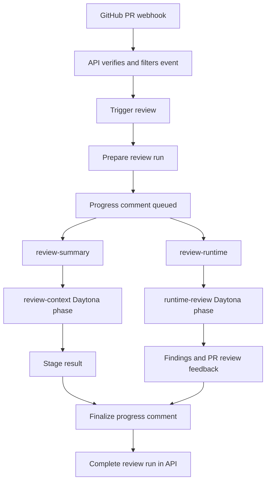
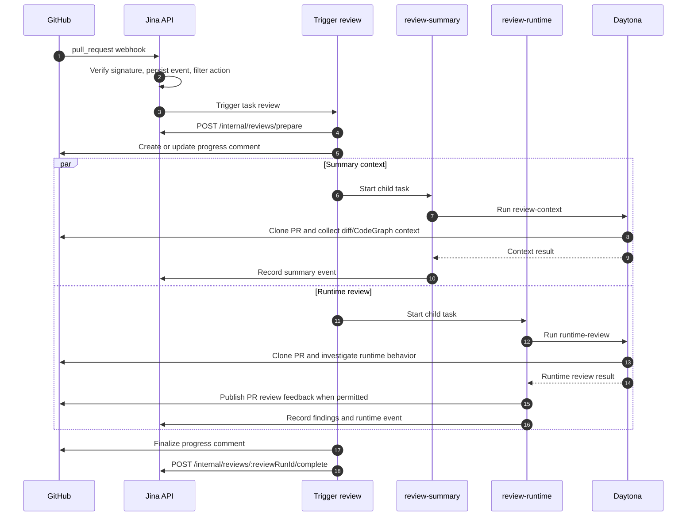
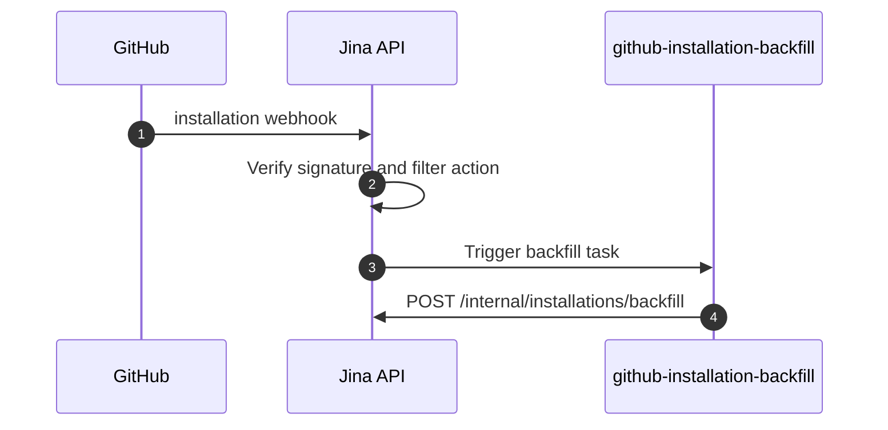

# Architecture

Jina is a multi-tenant GitHub App code review service. It accepts GitHub pull request webhooks, runs Trigger.dev review workers, executes repository analysis inside Daytona sandboxes, publishes GitHub PR feedback, and stores review state for the dashboard.

## Components

| Component | Path | Responsibility |
| --- | --- | --- |
| API | `api/` | Receives GitHub webhooks, verifies signatures, triggers workers, owns dashboard auth, and stores review state. |
| Trigger workers | `trigger/` | Orchestrate review stages, GitHub API calls, Daytona sandboxes, and API callbacks. |
| Dashboard | `dashboard/` | Shows review runs, findings, historical scenario data, and integration settings. |
| Database | `migrations/` | Postgres schema for installs, repositories, PRs, review runs, events, findings, sessions, and historical scenario tables. |
| Evaluations | `evals/` | Offline tooling; not part of the production review path. |

External services:

- GitHub App webhooks and installation tokens.
- Trigger.dev for durable worker execution.
- Daytona for sandboxed repository checkouts and review workers.
- OpenAI/Codex for model-backed review steps.
- Cloud Run, Cloud SQL, Artifact Registry, and Vercel for production hosting.

## API

Public routes:

- `GET /healthz` and `GET /v1/healthz`
- `POST /webhooks/github`
- `/auth/github/*`
- `/v1/dashboard/*`

Internal routes:

- `POST /internal/reviews/prepare`
- `POST /internal/reviews/:reviewRunId/events`
- `POST /internal/reviews/:reviewRunId/complete`
- `POST /internal/installations/backfill`
- `POST /internal/scheduled-review-scan`
- `POST /internal/integrations/resolve`

Internal routes require `Authorization: Bearer $INTERNAL_API_TOKEN`.

## Webhooks

Supported PR events:

- `pull_request.opened`
- `pull_request.synchronize`
- `pull_request.reopened`
- `pull_request.ready_for_review`

Draft PRs are ignored until `ready_for_review`. Unsupported GitHub events return `accepted: false`.

Supported installation events:

- `installation.created`
- `installation.unsuspended`
- `installation_repositories.added`

Issue-comment and PR-review-comment scenario commands are not active in the current flow.

## Review Workflow

PR review dispatch is intentionally disabled by default in `api/src/review-task-routing.ts`. While staged rollout is active, accepted PR events trigger the code-defined task ID `review` only when either `reviewTaskTriggerControl.enabled` is set to `true` or the repository is in `reviewTaskTriggerControl.allowedRepositories`.

The flow does not create a GitHub check run. Merge blocking is not implemented through a check in the current workflow; findings are surfaced through PR review feedback and dashboard records.

Active Trigger tasks:

- `review`
- `review-summary`
- `review-runtime`
- `github-installation-backfill`
- `scheduled-review-scan`

Removed legacy paths:

- `review-pr`
- `review-static`
- old standalone `runtime-review`
- scenario rerun and scenario question tasks

Static review, scenario generation, scenario simulation, check-run gating, dashboard scenario reruns, and PR comment scenario commands are not part of the current workflow.

## Review Sequence

Installation backfill is separate:

## Daytona Boundary

`trigger/src/daytona/review-session.ts` creates a short-lived Daytona sandbox for each stage session. The worker supports only `review-context` and `runtime-review`.

Inside `runtime-review`, the pipeline is execution-first: prep (PR checkout, diff,
PR thread context, CodeGraph), a planner that infers PR intent and
seeds high-impact investigation areas, then a round-based investigation loop
(`INVESTIGATION_ROUNDS`, up to `MAX_PARALLEL_INVESTIGATIONS` concurrent agents).
Each investigation agent is a single Codex exec that runs code in the sandbox to
uncover production issues, falling back to source tracing only when execution is
impractical; high finding confidence is reserved for execution-grounded evidence.
Between rounds an add-only replanner queues new areas and "deepen" follow-ups from
the artifacts so far. The collated investigation output is the complete input, and
the raw findings remain in the dashboard artifact. A final summarizer validates and
deduplicates those findings, assigns P0-P3 severity to real issues, records only
findings proven false or not issues with affirmative evidence as dismissed
candidates, and publishes every remaining validated issue. It also adds a summary
of what was investigated and found (including which issues must be addressed before
merge) and a merge score of 1-5 without mutating the raw investigation evidence.

During `runtime-review`, the worker reads `.jina/instruction.md` and the supported
`.jina/<step>/instruction.md` files from the PR base branch. It appends the global
and matching step instruction to each model prompt, followed by a fixed protocol
footer. PR-head instruction changes are redacted from model-facing diffs, and any
instruction text found in the head checkout or artifacts is explicitly treated as
untrusted review data. Explicit base-branch policy flags carry intentional empty
scope and a revised readiness rubric through deterministic post-processing. See
[Jina Repository Instructions](./JINA_INSTRUCTIONS.md) for the supported paths and
precedence rules.

CodeGraph is a local structural index created from the checked-out commit. It is
independent of V2 Context: cited derived engineering documentation exposed through
LLM-less retrieval tools.

The sandbox receives:

- The GitHub App installation token for cloning and PR reads.
- `OPENROUTER_API_KEY` for model calls through the OpenRouter gateway (per-tenant own-harness keys when connected).
- Model settings for active review stages.
- When Context MCP is enabled and V2 confirms a published release for the exact
  installed repository, a short-lived repository- and review-scoped bearer token.
  The worker writes an isolated Codex MCP configuration for `search_context`,
  `list_context`, `read_context`, and `diff_context`; the token is referenced by
  environment variable and never written into that configuration. A repository
  without a published release receives neither token nor MCP configuration.
- Worker source files needed for the current phases.

The sandbox installs dependencies unless `DAYTONA_SKIP_INSTALL` is set for an image or snapshot that already contains them. The sandbox is deleted when the session finishes.

Context access is supplemental and fail-open for reviews. Agents use it for code
history, ownership, subjects, dependencies, and workflow selection, but validate
conclusions against the checked-out PR. V1 asks V2 for an exact-repository token;
the sandbox then connects directly to V2 `/mcp`. There is no V1 MCP proxy. The
runtime consumes `codex exec --json` events to count calls to the four Context tools
and records missing calls as worker warnings; arguments and responses are not
persisted in telemetry.

The dashboard's `/context` page uses a separate browser-to-API flow. The
dashboard API checks the normal session and tenant membership, then exposes the
V2 release catalog through document listing and detail routes. `GET
/v1/dashboard/tenants/:tenantId/context/documents` returns the documents visible
to the tenant and its repositories; `GET
/v1/dashboard/tenants/:tenantId/context/documents/:documentId?repository=<repository>&releaseId=<release-id>`
returns a document's body and citations from its immutable release. The page groups documents by
repository and the subject path from each `kind:repository:subject` logical
identifier. `topic` documents use that path directly as repository-owned
folders, without a `Topic` category; other kinds add a category level before
the subject path. It then displays the document summary, body, publication status,
and cited evidence. It no longer renders a node-and-edge graph or natural-language
query surface. `POST /v1/dashboard/tenants/:tenantId/context/build` starts a
context build for an organization admin using the selected repository and returns
the build id. `GET
/v1/dashboard/tenants/:tenantId/context/builds` lists tenant-authorized builds.
On load, the page selects the most recently updated active build; when multiple
builds are active, it lets the user switch the progress panel among them. `GET
/v1/dashboard/tenants/:tenantId/context/builds/:buildId/progress` returns the
build status, stage statuses, repository/ref, and pages written so far for a
tenant-authorized repository. The page polls the selected build while it is live,
lists new pages newest first, and reloads the document catalog only when the
build completes. The existing `/v1/dashboard/tenants/:tenantId/graphs`,
`/graphs/index`, `/graphs/:graphId`, and `/graph/query` API routes remain
available; this page no longer calls them.

When `JINA_GRAPH_INTERNAL_TOKEN` is configured, the API uses V2's
internal mint endpoint to obtain a short-lived delegated token for the selected
tenant, caches one token per tenant, renews it before expiry, and revokes the
replaced token after the replacement is available. If delegated minting is
unavailable or the internal credential is not configured, the static
`JINA_GRAPH_API_TOKEN` remains the fallback for dashboard Context reads. This
keeps dashboard reads deployable in either delegated/static mode; webhook relay
and review MCP access still depend on the configured V2 endpoint, and review
access requires the internal credential. A rejected delegated token is dropped
and retried once with a newly minted token, and each attempt carries its own
deadline so a slow mint or a late rejection cannot strand the retry on an expired
one.

The delegated dashboard token carries `context:read`, `context:query`, and
`context:build`. Review tokens are separate: V2 mints them for a deterministic
run-and-repository principal, grants exactly one repository, and permits only
`context:read` and `context:query`.

The API derives `tenant:<uuid>` from the
selected, membership-checked tenant. V2 independently enforces that repository
ACL for release listing, document reads, retrieval, and diffs; the API also filters responses
as a defense in depth. A graph or document ID belonging to another tenant is
returned as not found. No V2 credential or upstream service URL is sent to the
browser.

V2 Context owns Context derivation, publication, release retrieval, and its
generic Board tasks. V1 does not own that persistence: the API uses its own
Cloud SQL for review and dashboard state and calls V2 through
`JINA_GRAPH_API_URL`. V2 deployment and storage topology are outside this
repository.

The GitHub App installation is the repository source of truth for this mapping.
Installation backfill records full repository names per tenant, including added
repositories, and `installation_repositories.removed` deletes the removed rows.
The Jina tenant—not a GitHub organization—is the workspace boundary. A tenant
may own multiple GitHub App installations, and each repository stores its
exact installation. Reviews use the installation that owns the repository for
direct V2 MCP access, while dashboard Context builds use the selected tenant's
authorized repository context. Billing, settings, artifacts, and membership
remain keyed only by the Jina tenant UUID.
If an installed repository has no context documents, an organization admin can
select it on `/context` and submit a context build for that repository.
The API starts the build against the repository's default branch and returns a
build id. The page selects the most recently updated active build by default and
allows switching the progress panel among concurrent active builds. It polls the
selected build's progress route while it is live, showing stage statuses and pages
as they land, newest first. Polling stops at a terminal status; the terminal
result remains visible, and if the build fails, finished pages are retained and
the page reports how many were kept. V2 Context is an external dependency; its
derivation worker and persistence are outside this repository.

Default sandbox profile:

- Image: `node:22-bookworm`
- CPU: `4`
- Memory: `8`
- Disk: `10`

## Data Model

Current review writes primarily to:

- `review_runs`
- `review_run_events`
- `review_findings`
- installation, repository, and pull request tables

`review_runs.result_json` and `review_run_events.payload_json` are the rich
source-of-truth records used by review detail pages and audit history. Dashboard
list reads use bounded projections stored beside them:

- `review_runs.dashboard_result_json`
- `review_run_events.dashboard_payload_json`

The API writes each projection with its source record. Historical rows are
backfilled by migration, and database triggers enforce the same projection
invariant for old or alternate writers during rolling deployments. This keeps
the existing aggregate/event model while ensuring that a dashboard list request
never loads runtime investigations, findings, comments, markdown, or other
multi-megabyte artifacts. List timelines are also capped at the latest 100
events per run before rows are combined; the existing per-review detail route
remains the unbounded, full-fidelity audit-history boundary.

Dashboard authentication follows the same hot-path boundary: ordinary reads use
the persisted GitHub access snapshot. GitHub membership/repository refresh runs
through the explicit session-refresh route after the first dashboard response is
visible, with per-instance single-flight deduplication and request timeouts. An
anonymous refresh or authenticated-read 401 immediately invalidates the matching
browser viewer, while an identity fence rejects stale responses after an account
switch.

Dashboard review reads have two authorization surfaces. Tenant-scoped routes
under `/v1/dashboard/tenants/:tenantId/review-runs` use the selected Jina tenant
as their boundary. The legacy `/v1/dashboard/review-runs` list, detail, and
`scenario-lineage` routes remain for rolling deploys and local fixtures;
authenticated requests resolve the viewer's personal Jina tenant instead of the
viewer's aggregate GitHub repository access. If no personal tenant can be
resolved, list and lineage requests return empty results and detail requests
return `404`. When dashboard auth is disabled, local fixtures retain viewer-wide
behavior.

Historical scenario and simulation tables remain in the schema so older runs can still be displayed, but the current Trigger workflow no longer writes new scenario-generation or simulation records.

Provider keys and dashboard session tokens are encrypted at rest when `SECRETS_ENCRYPTION_KEY` is configured. Without that key, local development keeps the legacy plaintext behavior.

## Dashboard

The dashboard browser app uses `NEXT_PUBLIC_API_BASE_URL` to call the API. `DASHBOARD_URL` is the canonical API-side dashboard URL for redirects, links, and default credentialed CORS. `DASHBOARD_ORIGIN` is optional and only needed for extra allowed origins.

Authenticated dashboard review list, detail, and scenario-lineage reads use the
selected, membership-checked Jina tenant through
`/v1/dashboard/tenants/:tenantId/review-runs...`, so runs and findings stay
within that tenant. Switching tenants clears dashboard data and rejects stale
in-flight responses. The legacy viewer-wide review routes remain only for
auth-disabled development or the explicit local fixture.
